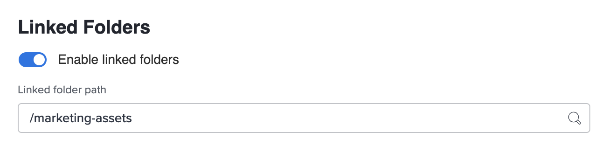

# Snippets

<!-- Add snippets within the section that the snippet is used. Snippets that are used throughout the Workfront documentation set should be added to the "General" section. -->

<!-- General -->

<!-- Admin and Setup -->

## Important note for Admin Console onboarding {#important-admin-console-onboard}

>[!IMPORTANT]
>
>The procedure described on this page applies only to organizations that are not yet onboarded to the Adobe Admin Console.
>
>If your organization has been onboarded to the Adobe Admin Console, see [Platform-based administration differences (Adobe Workfront/Adobe Business Platform)](/help/quicksilver/administration-and-setup/get-started-wf-administration/actions-in-admin-console.md).

<!-- Agile -->

## Highlighted Preview {#highlighted-preview}

The highlighted information on this page refers to functionality not yet generally available. It is available only in the Preview Sandbox environment.

<!-- Calendars -->

<!-- Documents -->

## setup linked folders {#setup-linked-folder}

You can allow users to create folders linked to Experience Manager while in a Workfront project. When a folder is linked, any asset added  to the folder automatically shows up in both Workfront and Experience Manger. When an asset is added to the linked folder in Workfront for the first time, the asset's metadata is pushed to Experience Manager Assets.

In the steps below, you indicate where you want the linked folders created. Each integration can have only one location for all linked folders.

To set up linked folders:

1. Toggle **Enabled linked folder** on.
1. Choose a folder path to indicate where you want all linked folders associated with this integration to live.

    >[!NOTE]
    >
    >Users need write access in Adobe Experience Manager Assets to the folder specified to create a linked folder.

1. Click **Save**.

<!-- Home -->

<!-- Integrations -->

<!-- Log Time -->

<!-- Manage Work -->

<!-- Mobile -->

<!-- Notifications -->

<!-- People, Teams, and Groups -->

<!-- Proofing -->

<!-- Release -->

<!-- Reports -->

<!-- Resource Management -->

<!-- Review and approve work -->

<!-- Scenario Planner -->

<!-- Teams -->

<!-- Timesheets -->

<!-- Workfront Goals -->

<!-- Workfront Fusion -->

<!-- Wokfront Library -->

<!-- Workfront Basics -->

<!-- Workfront Proof -->

<!-- TEST -->

## Snippet number test {#snippet-number-test}

1. This is a snippet step, the first of two.
1. This is a snippet step, the second of two.

<!--

For each snippets, create a head 2 section and add an anchor, such as

## Classic note {#classic-note}

In any .md file, add {{classic-note}} where you want that shared snippet content to appear.

-->