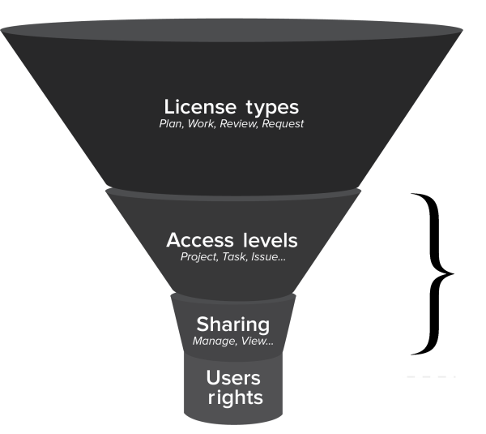

# The access model {#the-access-model}

The `Workfront` access model refers to the settings that affect the way a user can access data in `Workfront`. In this model, 2 main factors determine what a user can do with objects in `Workfront`:

* The user's access level
* Whether permission to an object has been shared with the user

## Access levels {#access-levels}

The first layer of access is on the system level. As a `Workfront administrator`, you assign each a user an access level to define what they can do throughout `Workfront`.

You do this by specifying license type each user has. The default license types are:

* External User
* Planner
* Requestor
* Reviewer

* System Administrator
* Worker

>[!NOTE]
>
>Every user must have an access level in order to log in to `Workfront`.

When you define the access level for a license types, you can specify how much access users can have to each type of `Workfront` object listed below. Depending on the license type and the object type, you can allow no access, view access, or edit access:

* Projects
* Tasks
* Issues
* Portfolios
* Reports, Dashboards, and Calendars
* Documents
* Users&nbsp;
* Templates
* Financial Data
* Resource Management

For information about customizing the default license types to fit the needs of your organization, see [Create or modify access levels](create-modify-access-levels.md).

For more information about how access levels and license types determine how users can access various objects, see [Access levels by license type](access-levels-by-license-type.md).

## Permissions {#permissions}

The second layer of access is on the object level. A user who shares an object grants permissions to the recipient to specify what that person can do with the object. Users can share objects with other `Workfront` users and with external users who don't have a `Workfront` license.

Permissions on individual objects are shared in the following ways:

* A user manually shares an object with other users.
*  A user shares an object and the grants the recipient with permissions for the object. If there are any "children" objects below the shared object, the recipient users inherit the same permissions for those objects. 

  For information about the hierarchy of objects, see the [Understanding the Interdependency and Hierarchy of Objects](understand-objects.md#understanding-interdependency-and-hierarchy-of-objects) section in [Understand objects](understand-objects.md).

The following are the levels of permissions that a user can grant for a specific object:

*  **View**: This level of permission includes the following:

    
    
    * Sharing system-wide so that all users in the system can see the object (not available for all objects)
    * Sharing an object with external users without a `Workfront` license (not available for all objects)
    * Sharing with an email address (available only for documents)
    
    

* **Contribute** (not available for all objects)
* **Manage** 

If your access level allows you to create an object, you have permissions to manage the object. Depending on the settings in your access level, you also have permissions to share the object with other users and grant them permissions on the object.&nbsp;&nbsp;

>[!IMPORTANT] {type="important"}
>
>A user's access level works together with the permissions granted for a specific object to determine the user's rights on the object. 
>
>
>For example, if a user's access level doesn't allow project editing, the user can't edit or delete a project even after receiving permissions to manage it. 
>
>
>Or, if a user's access level allows project editing, but the project creator grants view-only permissions to a project, the user cannot edit or delete the project.

The following table lists the objects that users can share and how they can share them:

For more information about sharing permissions in the access model, see [Permissions in the access model](permissions-in-the-access model.md).

## Access vs. permissions {#access-vs-permissions}

The following table compares a user's access level for objects generally to permissions the user receives for a specific object:

