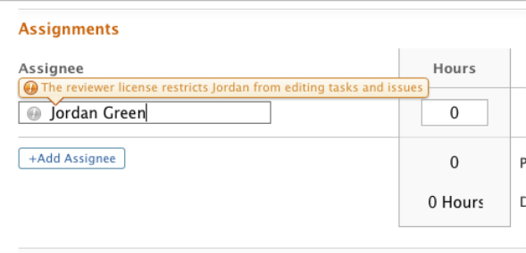

# License types {#license-types}

You can use license types to distinguish between what a person can or cannot do or see in `Workfront`. Depending on their access level associated with a license type, users might be able to create and manage work or they might be limited to only viewing information.

## License types and access levels {#license-types-and-access-levels}

License types are associated with access levels. Each access level has a corresponding license type.&nbsp;

You cannot associate a license type directly with a user. A license type is associated with an access level by default, and you can associate an access level with a user.

Active users in `Workfront` must be associated with an access level to be able to log in and work in the system.  
You can create users in the system that have no license assigned. These users are not able to log in to `Workfront` or complete any work, but you can still assign a task to a non-licensed user. Such a user serves as a place-holder for an assignment and is strictly for the project manager to be able to track those assignments.&nbsp;

When you assign an access level to a user, `Workfront` uses the license associated with that access level. Your license count will be reduced by one license with each user assigned to an access level.

For more information about access levels, see [Access levels by license type](access-levels-by-license-type.md).&nbsp;  

## `Workfront` license types {#workfront-license-types}

There are two types of license types in `Workfront`:

* User license type  
  The following are User license types: 
    
    
    * [Planner](#plan)
    * [Worker](#work)
    
    

* Collaborator license type  
  The following are Collaborator license types: 
    
    
    * [Reviewer](#review)
    * [Requester](#request)
    * [External](#external)
    
    

### Planner {#planner}

A user with this license can create and plan projects, manage portfolios, make assignments to work items, and manage tasks through the project plan.&nbsp;

You can grant the highest level of access in `Workfront` by assigning a user the access level associated with the Planner license.&nbsp;

When the Planner license type is associated with the Planner access level you can modify the access level associated with this license type.&nbsp;

When the Planner license type is associated with the `Workfront administrator` access level you cannot modify the access level associated with this license type.

### Worker {#worker}

A user with this license can be assigned to work items and can complete them, log time to them, contribute to them, run reports and communicate with other users in the system.

They do not plan the work, they complete it.

### Reviewer {#reviewer}

The Reviewer license is part of the Collaboration Package. You can assign the Reviewer access level to users who are not project owners or team members but who need to access `Workfront` to see all of the items they need to be aware of.

For example, a stakeholder participates in an ongoing review of marketing materials as part of the work process. Assigning a Reviewer access level to these users allows them to log in to `Workfront` to see updates on work and review documents, approvals, as well as reports and calendars. They cannot approve timesheets, nor be assigned to work.&nbsp;

If you assign a user with a Reviewer license to work, a warning displays to remind you that the user is not able to edit or complete the task or issue.

Reviewer license users see the My Updates page instead of the My Work page.   
For more information, see My Updates area.&nbsp;

### Requester {#requester}

The Requester license is part of the Collaboration Package. You can assign this license to users who make and receive simple requests. Users with access levels associated with the Requester license can log in to `Workfront` to submit requests using a request queue, and review the status of issues they have submitted.   
For example, a user can log issues to the Internal IT Support request queue.  
For more information about request queues, see [Create a Request Queue](create-request-queue.md).

### External {#external}

The External license is part of the Collaboration Package. It is designed for individuals who do not log in to `Workfront` but need to occasionally review, download, or view documents. This is the most restrictive license type. The access level associated with this license type cannot be modified.

For example, you might need to get feedback from an external consultant who does not need to log in to `Workfront`. In this case, you can assign this consultant the External access level.&nbsp;
