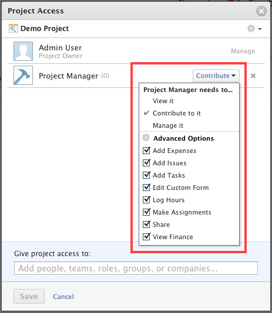

# Permissions in the access model {#permissions-in-the-access-model}

As the `Workfront administrator`, you can grant users access to certain areas and objects in `Workfront`, by modifying their access level.

For information about creating and modifying access levels, see [Create or modify access levels](create-modify-access-levels.md). For information about `Workfront` access levels and license types, see [Access levels by license type](access-levels-by-license-type.md).

Along with the access level that you grant users, they can also receive permissions that allow them to View, Manage, or Contribute tospecific items in `Workfront`. 

Permissions are specific to one item in `Workfront` and define what actions one can take on that item.

You do not have to be a `Workfront administrator` to grant permissions to items in `Workfront`. Anyone who can View items in `Workfront` can grant other users permissions to the items.&nbsp;

Permissions do not extend beyond the access level outlined by a `Workfront administrator` for a user. For example, if you&nbsp;do&nbsp;not grant access to create tasks to a user, they cannot create tasks on a project regardless of the permissions shared by the Project Owner, although those permissions might include "Add Tasks."

## Permission levels {#permission-levels}

When you have permissions to at least View an object, you can share that object with someone else.

>[!NOTE]
>
>A `Workfront administrator` can add or remove permissions to any items in the system, for all users, without being the owner of those items.

Sharing an object is identical for all objects, as explained in [Share Permissions on objects](sharing-permissions-on-objects.md). You can share the following objects in `Workfront`:

* **Projects**: For more information, see [Share a project](share-a-project.md).

* **Templates**: For more information, see [Share a template](share-a-template.md).

* **Portfolios**: For more information, see [Portfolio permissions](portfolio-permissions.md).

* **Tasks**: For information, see [Share a task](share-a-task.md).

* **Issues**: For information, see [Share an issue](share-an-issue.md).

* **Documents**: For information, see [Document permissions](document-permissions.md).

* **Reports, dashboards, and calendars**: For information, see [Permissions on reports, dashboards, and calendars](permissions-reports-dashboards-calendars.md).

* **Programs** 

You can select from the following levels of permissions when you share an object:

<table style="width: 100%;margin-left: 0;margin-right: auto;mc-table-style: url('../../../Resources/TableStyles/TableStyle-List-options-in-steps.css');" class="TableStyle-TableStyle-List-options-in-steps" cellspacing="0"> 
 <col style="width: 229px;" class="TableStyle-TableStyle-List-options-in-steps-Column-Column1"> 
 <col class="TableStyle-TableStyle-List-options-in-steps-Column-Column2"> 
 <tbody> 
  <tr class="TableStyle-TableStyle-List-options-in-steps-Body-LightGray"> 
   <td class="TableStyle-TableStyle-List-options-in-steps-BodyE-Column1-LightGray">View</td> 
   <td class="TableStyle-TableStyle-List-options-in-steps-BodyD-Column2-LightGray"> 
You can perform the following actions on the item, in addition to viewing it:
 
    <ul> 
     <li value="1">Add documents</li> 
     <li value="2">View Finance</li> 
     <li value="3"> 
Share the item 
 
You can grant other users the same permission level you have only on the item, not higher.
 </li> 
    </ul> </td> 
  </tr> 
  <tr class="TableStyle-TableStyle-List-options-in-steps-Body-MediumGray"> 
   <td class="TableStyle-TableStyle-List-options-in-steps-BodyE-Column1-MediumGray">Contribute</td> 
   <td class="TableStyle-TableStyle-List-options-in-steps-BodyD-Column2-MediumGray"> 
You can perform the following actions on the item, in addition to viewing it:
 
    <ul> 
     <li value="1">All the actions included with the View permission.</li> 
     <li value="2">Add Expenses</li> 
     <li value="3">Add Issues (of the item is a task or a project)</li> 
     <li value="4">Add Tasks (if the item is a project)</li> 
     <li value="5">Edit Custom Form</li> 
     <li value="6">Log Hours</li> 
     <li value="7">Make Assignments</li> 
    </ul> </td> 
  </tr> 
  <tr class="TableStyle-TableStyle-List-options-in-steps-Body-LightGray"> 
   <td class="TableStyle-TableStyle-List-options-in-steps-BodyE-Column1-LightGray">Manage</td> 
   <td class="TableStyle-TableStyle-List-options-in-steps-BodyD-Column2-LightGray"> 
You can perform the following actions on the item, in addition to viewing it:
 
    <ul> 
     <li value="1">All the actions included with the View and Contribute permissions</li> 
     <li value="2">Delete</li> 
     <li value="3">Manage Finance</li> 
    </ul> </td> 
  </tr> 
  <tr class="TableStyle-TableStyle-List-options-in-steps-Body-MediumGray"> 
   <td class="TableStyle-TableStyle-List-options-in-steps-BodyE-Column1-MediumGray">Make this public to external users</td> 
   <td class="TableStyle-TableStyle-List-options-in-steps-BodyD-Column2-MediumGray"> 
Anyone without a Workfront account can view the object by accessing it from a link to the object.
 </td> 
  </tr> 
  <tr class="TableStyle-TableStyle-List-options-in-steps-Body-LightGray"> 
   <td class="TableStyle-TableStyle-List-options-in-steps-BodyB-Column1-LightGray">Make this visible system-wide</td> 
   <td class="TableStyle-TableStyle-List-options-in-steps-BodyA-Column2-LightGray"> 
The object can be found in searches and viewed by anyone with a Workfront account.
 </td> 
  </tr> 
 </tbody> 
</table>

## About requesting permissions {#about-requesting-permissions}

You can request permissions to an object that you have no access to, or you can request higher permissions than you already have. You do not have to be a `Workfront administrator` to grant permissions to items. Anyone with permissions to Share the item can grant permissions to other users requesting them.

For more information about requesting permissions, see [Request Access to objects](request-access.md).

## About sharing objects {#about-sharing-objects}

The following table shows what objects can be shared in `Workfront` and the entities with which they can be shared:&nbsp; 

<table border="1" cellpadding="1" style="margin-left: 0;margin-right: auto;width: 100%;mc-table-style: url('../../../Resources/TableStyles/TableStyle-HeaderRow.css');" class="TableStyle-TableStyle-HeaderRow" cellspacing="0"> 
 <col style="width: 150px;" class="TableStyle-TableStyle-HeaderRow-Column-Column1"> 
 <col style="width: 150px;" class="TableStyle-TableStyle-HeaderRow-Column-Column1"> 
 <col style="width: 150px;" class="TableStyle-TableStyle-HeaderRow-Column-Column1"> 
 <col style="width: 150px;" class="TableStyle-TableStyle-HeaderRow-Column-Column1"> 
 <col style="width: 150px;" class="TableStyle-TableStyle-HeaderRow-Column-Column1"> 
 <col style="width: 150px;" class="TableStyle-TableStyle-HeaderRow-Column-Column1"> 
 <col style="width: 150px;" class="TableStyle-TableStyle-HeaderRow-Column-Column1"> 
 <col style="width: 150px;" class="TableStyle-TableStyle-HeaderRow-Column-Column1"> 
 <thead> 
  <tr class="TableStyle-TableStyle-HeaderRow-Head-Header1"> 
   <th class="TableStyle-TableStyle-HeaderRow-HeadE-Column1-Header1">&nbsp;</th> 
   <th class="TableStyle-TableStyle-HeaderRow-HeadE-Column1-Header1">People</th> 
   <th class="TableStyle-TableStyle-HeaderRow-HeadE-Column1-Header1">Teams</th> 
   <th class="TableStyle-TableStyle-HeaderRow-HeadE-Column1-Header1">Job Roles</th> 
   <th class="TableStyle-TableStyle-HeaderRow-HeadE-Column1-Header1">Groups</th> 
   <th class="TableStyle-TableStyle-HeaderRow-HeadE-Column1-Header1">Companies</th> 
   <th class="TableStyle-TableStyle-HeaderRow-HeadE-Column1-Header1">Public</th> 
   <th class="TableStyle-TableStyle-HeaderRow-HeadD-Column1-Header1">System-Wide</th> 
  </tr> 
 </thead> 
 <tbody> 
  <tr class="TableStyle-TableStyle-HeaderRow-Body-LightGray"> 
   <th scope="row" style="text-align: left;font-weight: normal;" class="TableStyle-TableStyle-HeaderRow-BodyE-Column1-LightGray"> 
Calendars
 </th> 
   <td style="text-align: left;font-weight: normal;" class="TableStyle-TableStyle-HeaderRow-BodyE-Column1-LightGray">✓</td> 
   <td style="text-align: left;font-weight: normal;" class="TableStyle-TableStyle-HeaderRow-BodyE-Column1-LightGray"> 
✓
 </td> 
   <td style="text-align: left;font-weight: normal;" class="TableStyle-TableStyle-HeaderRow-BodyE-Column1-LightGray"> 
✓
 </td> 
   <td style="text-align: left;font-weight: normal;" class="TableStyle-TableStyle-HeaderRow-BodyE-Column1-LightGray"> 
✓
 </td> 
   <td style="text-align: left;font-weight: normal;" class="TableStyle-TableStyle-HeaderRow-BodyE-Column1-LightGray"> 
✓
 </td> 
   <td style="text-align: left;font-weight: normal;" class="TableStyle-TableStyle-HeaderRow-BodyE-Column1-LightGray"> 
✓
 </td> 
   <td style="text-align: left;font-weight: normal;" class="TableStyle-TableStyle-HeaderRow-BodyD-Column1-LightGray"> 
✓
 </td> 
  </tr> 
  <tr class="TableStyle-TableStyle-HeaderRow-Body-MediumGray"> 
   <th scope="row" style="text-align: left;font-weight: normal;" class="TableStyle-TableStyle-HeaderRow-BodyE-Column1-MediumGray"> 
Custom Forms
 </th> 
   <td style="text-align: left;font-weight: normal;" class="TableStyle-TableStyle-HeaderRow-BodyE-Column1-MediumGray"> 
✓
 </td> 
   <td style="text-align: left;font-weight: normal;" class="TableStyle-TableStyle-HeaderRow-BodyE-Column1-MediumGray"> 
✓&nbsp;
 </td> 
   <td style="text-align: left;font-weight: normal;" class="TableStyle-TableStyle-HeaderRow-BodyE-Column1-MediumGray"> 
✓&nbsp;
 </td> 
   <td style="text-align: left;font-weight: normal;" class="TableStyle-TableStyle-HeaderRow-BodyE-Column1-MediumGray"> 
✓
 </td> 
   <td style="text-align: left;font-weight: normal;" class="TableStyle-TableStyle-HeaderRow-BodyE-Column1-MediumGray"> 
✓&nbsp;
 </td> 
   <td style="text-align: left;font-weight: normal;" class="TableStyle-TableStyle-HeaderRow-BodyE-Column1-MediumGray"> 
&nbsp;
 </td> 
   <td style="text-align: left;font-weight: normal;" class="TableStyle-TableStyle-HeaderRow-BodyD-Column1-MediumGray"> 
&nbsp;✓
 </td> 
  </tr> 
  <tr class="TableStyle-TableStyle-HeaderRow-Body-LightGray"> 
   <th scope="row" style="text-align: left;font-weight: normal;" class="TableStyle-TableStyle-HeaderRow-BodyE-Column1-LightGray"> 
Documents
 </th> 
   <td style="text-align: left;font-weight: normal;" class="TableStyle-TableStyle-HeaderRow-BodyE-Column1-LightGray"> 
✓
 </td> 
   <td style="text-align: left;font-weight: normal;" class="TableStyle-TableStyle-HeaderRow-BodyE-Column1-LightGray"> 
✓
 </td> 
   <td style="text-align: left;font-weight: normal;" class="TableStyle-TableStyle-HeaderRow-BodyE-Column1-LightGray"> 
✓
 </td> 
   <td style="text-align: left;font-weight: normal;" class="TableStyle-TableStyle-HeaderRow-BodyE-Column1-LightGray"> 
✓
 </td> 
   <td style="text-align: left;font-weight: normal;" class="TableStyle-TableStyle-HeaderRow-BodyE-Column1-LightGray"> 
✓
 </td> 
   <td style="text-align: left;font-weight: normal;" class="TableStyle-TableStyle-HeaderRow-BodyE-Column1-LightGray"> 
✓
 </td> 
   <td style="text-align: left;font-weight: normal;" class="TableStyle-TableStyle-HeaderRow-BodyD-Column1-LightGray"> 
✓
 </td> 
  </tr> 
  <tr class="TableStyle-TableStyle-HeaderRow-Body-MediumGray"> 
   <th scope="row" style="text-align: left;font-weight: normal;" class="TableStyle-TableStyle-HeaderRow-BodyE-Column1-MediumGray"> 
Dashboards
 </th> 
   <td style="text-align: left;font-weight: normal;" class="TableStyle-TableStyle-HeaderRow-BodyE-Column1-MediumGray"> 
✓
 </td> 
   <td style="text-align: left;font-weight: normal;" class="TableStyle-TableStyle-HeaderRow-BodyE-Column1-MediumGray"> 
✓
 </td> 
   <td style="text-align: left;font-weight: normal;" class="TableStyle-TableStyle-HeaderRow-BodyE-Column1-MediumGray"> 
✓
 </td> 
   <td style="text-align: left;font-weight: normal;" class="TableStyle-TableStyle-HeaderRow-BodyE-Column1-MediumGray"> 
✓
 </td> 
   <td style="text-align: left;font-weight: normal;" class="TableStyle-TableStyle-HeaderRow-BodyE-Column1-MediumGray"> 
✓
 </td> 
   <td style="text-align: left;font-weight: normal;" class="TableStyle-TableStyle-HeaderRow-BodyE-Column1-MediumGray">&nbsp;</td> 
   <td style="text-align: left;font-weight: normal;" class="TableStyle-TableStyle-HeaderRow-BodyD-Column1-MediumGray"> 
✓
 </td> 
  </tr> 
  <tr class="TableStyle-TableStyle-HeaderRow-Body-LightGray"> 
   <th scope="row" style="text-align: left;font-weight: normal;" class="TableStyle-TableStyle-HeaderRow-BodyE-Column1-LightGray"> 
Issues
 </th> 
   <td style="text-align: left;font-weight: normal;" class="TableStyle-TableStyle-HeaderRow-BodyE-Column1-LightGray"> 
✓
 </td> 
   <td style="text-align: left;font-weight: normal;" class="TableStyle-TableStyle-HeaderRow-BodyE-Column1-LightGray"> 
✓
 </td> 
   <td style="text-align: left;font-weight: normal;" class="TableStyle-TableStyle-HeaderRow-BodyE-Column1-LightGray"> 
✓
 </td> 
   <td style="text-align: left;font-weight: normal;" class="TableStyle-TableStyle-HeaderRow-BodyE-Column1-LightGray"> 
✓
 </td> 
   <td style="text-align: left;font-weight: normal;" class="TableStyle-TableStyle-HeaderRow-BodyE-Column1-LightGray"> 
✓
 </td> 
   <td style="text-align: left;font-weight: normal;" class="TableStyle-TableStyle-HeaderRow-BodyE-Column1-LightGray"> 
&nbsp;
 </td> 
   <td style="text-align: left;font-weight: normal;" class="TableStyle-TableStyle-HeaderRow-BodyD-Column1-LightGray"> 
✓
 </td> 
  </tr> 
  <tr class="TableStyle-TableStyle-HeaderRow-Body-MediumGray"> 
   <th scope="row" style="text-align: left;font-weight: normal;" class="TableStyle-TableStyle-HeaderRow-BodyE-Column1-MediumGray"> 
Portfolios
 </th> 
   <td style="text-align: left;font-weight: normal;" class="TableStyle-TableStyle-HeaderRow-BodyE-Column1-MediumGray"> 
✓
 </td> 
   <td style="text-align: left;font-weight: normal;" class="TableStyle-TableStyle-HeaderRow-BodyE-Column1-MediumGray"> 
✓
 </td> 
   <td style="text-align: left;font-weight: normal;" class="TableStyle-TableStyle-HeaderRow-BodyE-Column1-MediumGray"> 
✓
 </td> 
   <td style="text-align: left;font-weight: normal;" class="TableStyle-TableStyle-HeaderRow-BodyE-Column1-MediumGray"> 
✓
 </td> 
   <td style="text-align: left;font-weight: normal;" class="TableStyle-TableStyle-HeaderRow-BodyE-Column1-MediumGray"> 
✓
 </td> 
   <td style="text-align: left;font-weight: normal;" class="TableStyle-TableStyle-HeaderRow-BodyE-Column1-MediumGray"> 
&nbsp;
 </td> 
   <td style="text-align: left;font-weight: normal;" class="TableStyle-TableStyle-HeaderRow-BodyD-Column1-MediumGray"> 
✓
 </td> 
  </tr> 
  <tr class="TableStyle-TableStyle-HeaderRow-Body-LightGray"> 
   <th scope="row" style="text-align: left;font-weight: normal;" class="TableStyle-TableStyle-HeaderRow-BodyE-Column1-LightGray"> 
Projects
 </th> 
   <td style="text-align: left;font-weight: normal;" class="TableStyle-TableStyle-HeaderRow-BodyE-Column1-LightGray"> 
✓
 </td> 
   <td style="text-align: left;font-weight: normal;" class="TableStyle-TableStyle-HeaderRow-BodyE-Column1-LightGray"> 
✓
 </td> 
   <td style="text-align: left;font-weight: normal;" class="TableStyle-TableStyle-HeaderRow-BodyE-Column1-LightGray"> 
✓
 </td> 
   <td style="text-align: left;font-weight: normal;" class="TableStyle-TableStyle-HeaderRow-BodyE-Column1-LightGray"> 
✓
 </td> 
   <td style="text-align: left;font-weight: normal;" class="TableStyle-TableStyle-HeaderRow-BodyE-Column1-LightGray"> 
✓
 </td> 
   <td style="text-align: left;font-weight: normal;" class="TableStyle-TableStyle-HeaderRow-BodyE-Column1-LightGray"> 
&nbsp;
 </td> 
   <td style="text-align: left;font-weight: normal;" class="TableStyle-TableStyle-HeaderRow-BodyD-Column1-LightGray"> 
✓
 </td> 
  </tr> 
  <tr class="TableStyle-TableStyle-HeaderRow-Body-MediumGray"> 
   <th scope="row" style="text-align: left;font-weight: normal;" class="TableStyle-TableStyle-HeaderRow-BodyE-Column1-MediumGray"> 
Reports
 </th> 
   <td style="text-align: left;font-weight: normal;" class="TableStyle-TableStyle-HeaderRow-BodyE-Column1-MediumGray"> 
✓
 </td> 
   <td style="text-align: left;font-weight: normal;" class="TableStyle-TableStyle-HeaderRow-BodyE-Column1-MediumGray"> 
✓
 </td> 
   <td style="text-align: left;font-weight: normal;" class="TableStyle-TableStyle-HeaderRow-BodyE-Column1-MediumGray"> 
✓
 </td> 
   <td style="text-align: left;font-weight: normal;" class="TableStyle-TableStyle-HeaderRow-BodyE-Column1-MediumGray"> 
✓
 </td> 
   <td style="text-align: left;font-weight: normal;" class="TableStyle-TableStyle-HeaderRow-BodyE-Column1-MediumGray"> 
✓
 </td> 
   <td style="text-align: left;font-weight: normal;" class="TableStyle-TableStyle-HeaderRow-BodyE-Column1-MediumGray"> 
✓
 </td> 
   <td style="text-align: left;font-weight: normal;" class="TableStyle-TableStyle-HeaderRow-BodyD-Column1-MediumGray"> 
✓
 </td> 
  </tr> 
  <tr class="TableStyle-TableStyle-HeaderRow-Body-LightGray"> 
   <th scope="row" style="text-align: left;font-weight: normal;" class="TableStyle-TableStyle-HeaderRow-BodyE-Column1-LightGray"> 
Tasks
 </th> 
   <td style="text-align: left;font-weight: normal;" class="TableStyle-TableStyle-HeaderRow-BodyE-Column1-LightGray"> 
✓
 </td> 
   <td style="text-align: left;font-weight: normal;" class="TableStyle-TableStyle-HeaderRow-BodyE-Column1-LightGray"> 
✓
 </td> 
   <td style="text-align: left;font-weight: normal;" class="TableStyle-TableStyle-HeaderRow-BodyE-Column1-LightGray"> 
✓
 </td> 
   <td style="text-align: left;font-weight: normal;" class="TableStyle-TableStyle-HeaderRow-BodyE-Column1-LightGray"> 
✓
 </td> 
   <td style="text-align: left;font-weight: normal;" class="TableStyle-TableStyle-HeaderRow-BodyE-Column1-LightGray"> 
✓
 </td> 
   <td style="text-align: left;font-weight: normal;" class="TableStyle-TableStyle-HeaderRow-BodyE-Column1-LightGray"> 
&nbsp;
 </td> 
   <td style="text-align: left;font-weight: normal;" class="TableStyle-TableStyle-HeaderRow-BodyD-Column1-LightGray"> 
✓
 </td> 
  </tr> 
  <tr class="TableStyle-TableStyle-HeaderRow-Body-MediumGray"> 
   <th scope="row" style="text-align: left;font-weight: normal;" class="TableStyle-TableStyle-HeaderRow-BodyB-Column1-MediumGray"> 
Templates
 </th> 
   <td style="text-align: left;font-weight: normal;" class="TableStyle-TableStyle-HeaderRow-BodyB-Column1-MediumGray"> 
✓
 </td> 
   <td style="text-align: left;font-weight: normal;" class="TableStyle-TableStyle-HeaderRow-BodyB-Column1-MediumGray"> 
✓
 </td> 
   <td style="text-align: left;font-weight: normal;" class="TableStyle-TableStyle-HeaderRow-BodyB-Column1-MediumGray"> 
✓
 </td> 
   <td style="text-align: left;font-weight: normal;" class="TableStyle-TableStyle-HeaderRow-BodyB-Column1-MediumGray"> 
✓
 </td> 
   <td style="text-align: left;font-weight: normal;" class="TableStyle-TableStyle-HeaderRow-BodyB-Column1-MediumGray"> 
✓
 </td> 
   <td style="text-align: left;font-weight: normal;" class="TableStyle-TableStyle-HeaderRow-BodyB-Column1-MediumGray"> 
&nbsp;
 </td> 
   <td style="text-align: left;font-weight: normal;" class="TableStyle-TableStyle-HeaderRow-BodyA-Column1-MediumGray"> 
✓
 </td> 
  </tr> 
 </tbody> 
</table>

## Inherited permissions {#inherited-permissions}

Permissions in `Workfront` are inherited hierarchically. For more information about inherited permissions, see the [Understand inherited Permissions](sharing-permissions-on-objects.md#understanding-inherited-permissions) section in [Share Permissions on objects](sharing-permissions-on-objects.md).  