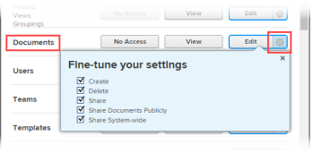

# Grant access to documents

As an Adobe Workfront administrator, you can use an access level to define a user’s access to documents, as explained in [Access levels overview](../../../administration-and-setup/add-users/access-levels-and-object-permissions/access-levels-overview.md).&nbsp;

This access also applies to document folders.

For information about using custom access levels to manage users' access to other object types in Workfront, see [Create or modify custom access levels](../../../administration-and-setup/add-users/configure-and-grant-access/create-modify-access-levels.md).

## Access requirements

You must have the following to perform the steps in this article:

<table cellspacing="0"> 
 <col> 
 <col> 
 <tbody> 
  <tr> 
   <td role="rowheader">Adobe Workfront plan</td> 
   <td> 
Any
 </td> 
  </tr> 
  <tr> 
   <td role="rowheader">Adobe Workfront license</td> 
   <td> 
Plan 
 </td> 
  </tr> 
  <tr> 
   <td role="rowheader">Access level configurations</td> 
   <td> 
You must be a Workfront administrator. For more information, see <a href="../../../administration-and-setup/add-users/configure-and-grant-access/grant-a-user-full-administrative-access.md" class="MCXref xref" data-mc-variable-override="">Grant a user full administrative access</a>.
 
Note: If you still don't have access, ask your Workfront administrator if they set additional restrictions in your access level. For information on how a Workfront administrator can modify your access level, see <a href="../../../administration-and-setup/add-users/configure-and-grant-access/create-modify-access-levels.md" class="MCXref xref" data-mc-variable-override="">Create or modify custom access levels</a>.
 </td> 
  </tr> 
 </tbody> 
</table>

## Configure user access to documents using a custom access level

<ol> 
 <li value="1">Begin creating or editing the access level, as explained in <a href="../../../administration-and-setup/add-users/configure-and-grant-access/create-modify-access-levels.md" class="MCXref xref" data-mc-variable-override="">Create or modify custom access levels</a>.</li> 
 <li value="2"> 
Click the gear icon  on the View or Edit button to the right of Documents, then select the abilities you want to grant under <b>Fine-tune your settings</b>.
 
  
 
You can allow users to do the following on projects, tasks, and issues that they have access to:
 
  <table cellspacing="0"> 
   <col> 
   <col> 
   <tbody> 
    <tr> 
     <td role="rowheader">Create</td> 
     <td>Upload documents.</td> 
    </tr> 
    <tr> 
     <td role="rowheader">Delete</td> 
     <td> 
Remove uploaded documents.
 
The <b>Create</b> option is automatically enabled when this option is enabled.
 </td> 
    </tr> 
    <tr> 
     <td role="rowheader">Share</td> 
     <td>Share documents with specific users, job roles, teams.</td> 
    </tr> 
    <tr> 
     <td role="rowheader">Share Documents Publicly</td> 
     <td>Share documents with external users (don't have a Workfront license).</td> 
    </tr> 
    <tr> 
     <td role="rowheader">Share System-wide</td> 
     <td> 
Make documents available to everyone in your Workfront instance.
 
Anyone in the system can see a document shared this way if:
 
      <ul> 
       <li> 
You send them a link to the Documents page where it's uploaded.
 </li> 
       <li> 
They search for it in Workfront
 </li> 
      </ul> 
The <b>Share</b> option is automatically enabled when this option is enabled.
 </td> 
    </tr> 
   </tbody> 
  </table> <note type="note"> 
   
When you configure an access level setting for a certain type of object, that configuration doesn't affect the users' access to objects with a lower rank. For example, you can restrict users from deleting projects in their access level, but this does not restrict them from deleting documents, which are lower-ranking than projects.For more information about the hierarchy of objects, see the section <a href="../../../workfront-basics/navigate-workfront/workfront-navigation/understand-objects.md#understanding-interdependency-and-hierarchy-of-objects" class="MCXref xref" data-mc-variable-override="">Interdependency and hierarchy of objects</a> in&nbsp;the article <a href="../../../workfront-basics/navigate-workfront/workfront-navigation/understand-objects.md" class="MCXref xref" data-mc-variable-override="">Understand objects in Adobe Workfront</a>.
 
  </note> </li> 
 <li value="3"> 
(Optional) To restrict inherited permissions for documents from higher ranking objects, click Set additional restrictions, then select Never inherit document access from projects, tasks, issues, etc.
 </li> 
 <li value="4"> 
(Optional) To configure access settings for other objects and areas in the access level you are working on, continue with one of the articles listed in <a href="../../../administration-and-setup/add-users/configure-and-grant-access/configure-access.md" class="MCXref xref" data-mc-variable-override="">Configure access to Adobe Workfront</a>, such as <a href="../../../administration-and-setup/add-users/configure-and-grant-access/grant-access-tasks.md" class="MCXref xref" data-mc-variable-override="">Grant access to tasks</a> and <a href="../../../administration-and-setup/add-users/configure-and-grant-access/grant-access-financial.md" class="MCXref xref" data-mc-variable-override="">Grant access to financial data</a>.
 </li> 
 <li value="5"> 
When you are finished, click Save.
 
After the access level is created, you can assign it to a user. For more information, see <a href="../../../administration-and-setup/add-users/create-and-manage-users/edit-a-users-profile.md" class="MCXref xref" data-mc-variable-override="">Edit a user's profile</a>.
 </li> 
</ol>

## Access to documents by license type

For more information about what users in each access level can do with documents, see the section [Documents](../../../administration-and-setup/add-users/access-levels-and-object-permissions/functionality-available-for-each-object-type.md#document) in the article [Functionality available for each object type](../../../administration-and-setup/add-users/access-levels-and-object-permissions/functionality-available-for-each-object-type.md).

## Access to shared documents

After you upload a document to Workfront, you can share it with other users by granting them permissions to it, as explained in [Share a document in Adobe Workfront](../../../workfront-basics/grant-and-request-access-to-objects/document-permissions.md).

When you share any object with another user, the recipient’s rights on it are determined by a combination of two things:

* The permissions that you grant to your recipient for the object
* The recipient’s access level settings for the object's type

