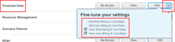

# Grant access to financial data {#grant-access-to-financial-data}

As an *`Adobe Workfront administrator`*, you can define a user’s access to the following through the user's access level, as explained in [Access levels overview](access-levels-overview.md):

* Financial information on projects in *`Workfront`*
* Resource budgeting information in the Resource Planning tools

>[!NOTE]
>
>When someone shares a *`financial data`* with another user, the recipient’s rights on it are determined by a combination of two things:
>
>
>
>* The recipient’s access level setting for *`financial data`*
>* Any permissions that the sharer granted for the *`financial data`* 
>
>
>For information about permissions to financial data when sharing objects, see [Share financial permissions on an object in Adobe Workfront](share-financial-permissions-object.md).

## Access requirements {#access-requirements}

You must have the following to perform the steps in this article:

<table style="width: 100%;margin-left: 0;margin-right: auto;mc-table-style: url('../../../Resources/TableStyles/TableStyle-List-options-in-steps.css');" class="TableStyle-TableStyle-List-options-in-steps" cellspacing="0"> 
 <col class="TableStyle-TableStyle-List-options-in-steps-Column-Column1"> 
 <col class="TableStyle-TableStyle-List-options-in-steps-Column-Column2"> 
 <tbody> 
  <tr class="TableStyle-TableStyle-List-options-in-steps-Body-LightGray"> 
   <td class="TableStyle-TableStyle-List-options-in-steps-BodyE-Column1-LightGray" role="rowheader">Adobe Workfront plan</td> 
   <td class="TableStyle-TableStyle-List-options-in-steps-BodyD-Column2-LightGray"> 
Any
 </td> 
  </tr> 
  <tr class="TableStyle-TableStyle-List-options-in-steps-Body-MediumGray"> 
   <td class="TableStyle-TableStyle-List-options-in-steps-BodyE-Column1-MediumGray" role="rowheader">Adobe Workfront license</td> 
   <td class="TableStyle-TableStyle-List-options-in-steps-BodyD-Column2-MediumGray"> 
Plan 
 </td> 
  </tr> 
  <tr class="TableStyle-TableStyle-List-options-in-steps-Body-LightGray"> 
   <td class="TableStyle-TableStyle-List-options-in-steps-BodyB-Column1-LightGray" role="rowheader">Access level configurations</td> 
   <td class="TableStyle-TableStyle-List-options-in-steps-BodyA-Column2-LightGray"> 
You must be a Workfront administrator. For more information, see <a href="grant-a-user-full-administrative-access.md" class="MCXref xref" data-mc-variable-override="">Grant a user full administrative access</a>.
 
Note: If you still don't have access, ask your Workfront administrator if they set additional restrictions in your access level. For information on how a Workfront administrator can modify your access level, see <a href="create-modify-access-levels.md" class="MCXref xref" data-mc-variable-override="">Create or modify custom access levels</a>.
 </td> 
  </tr> 
 </tbody> 
</table>

## Considerations for granting access to financial data {#considerations-for-granting-access-to-financial-data}

Consider the following when granting users access to financial data in *`Workfront`*: 

* A user whose access level doesn't allow access to financial data cannot create a risk for a project. For more information, see [Create and edit risks on projects](create-edit-risks-on-projects.md).
* You can also use an access level to determine which Resource Management activities a user can employ to budget or view resource allocation. For information, see [Grant access to Resource Management](grant-access-resource-management.md).

## Configure user access to financial data using a custom access level {#configure-user-access-to-financial-data-using-a-custom-access-level}

1.  Begin creating or editing the access level, as explained in [Create or modify custom access levels](create-modify-access-levels.md).
1.  Click the gear icon  on the `View` or `Edit` button to the right of *`Financial Data`*, then select the abilities you want to grant under **Fine-tune your settings**.

   

1.  (Optional) In the `Allow administrative access for` area, select the following options:<![CDATA[]]>

<table style="width: 100%;margin-left: 0;margin-right: auto;mc-table-style: url('../../../Resources/TableStyles/TableStyle-List-options-in-steps.css');" class="TableStyle-TableStyle-List-options-in-steps" cellspacing="0"> 
 <col class="TableStyle-TableStyle-List-options-in-steps-Column-Column1"> 
 <col class="TableStyle-TableStyle-List-options-in-steps-Column-Column2"> 
 <tbody> 
  <tr class="TableStyle-TableStyle-List-options-in-steps-Body-LightGray"> 
   <td class="TableStyle-TableStyle-List-options-in-steps-BodyE-Column1-LightGray" role="rowheader">Exchange rates</td> 
   <td class="TableStyle-TableStyle-List-options-in-steps-BodyD-Column2-LightGray"> 
Add new currency in Workfront.
 
Without this access, the user can only add an existing currency to a project they create.
 </td> 
  </tr> 
  <tr class="TableStyle-TableStyle-List-options-in-steps-Body-MediumGray"> 
   <td class="TableStyle-TableStyle-List-options-in-steps-BodyB-Column1-MediumGray" role="rowheader">Expenses</td> 
   <td class="TableStyle-TableStyle-List-options-in-steps-BodyA-Column2-MediumGray"> 
View all expenses on objects in Workfront. 
 
This does not allow the user to create new Expense Types. 
 
Without this access, the user can only view the following:
 
    <ul> 
     <li>Expenses on projects, tasks or issues they manage</li> 
     <li>Their own expenses</li> 
     <li>The expenses of their subordinates</li> 
    </ul> </td> 
  </tr> 
 </tbody> 
</table>

1.  (Optional) To configure access settings for other objects and areas in the access level you are working on, continue with one of the articles listed in [Configure access to Adobe Workfront](_configure-access.md), such as [Grant access to tasks](grant-access-tasks.md) and [Grant access to financial data](#).
1.  When you are finished, click **Save**.

   After the access level is created, you can assign it to a user. For more information, see [Edit a user's profile](edit-a-users-profile.md).  

## Financial access by license type {#financial-access-by-license-type}

This table lists what a *`Workfront administrator`* can allow users with each license type to do with *`financial data`*. For information about the *`Workfront`* license types, see [Adobe Workfront licenses overview](wf-licenses.md).

Only users with a *`Plan`* license can have full access to *`financial data`*. 

The Request and External User license types are not included here because they don't have access to *`financial data`*.

<table style="width: 100%;margin-left: 0;margin-right: auto;mc-table-style: url('../../../Resources/TableStyles/TableStyle-HeaderRow.css');" class="TableStyle-TableStyle-HeaderRow" cellspacing="15"> 
 <col class="TableStyle-TableStyle-HeaderRow-Column-Column1"> 
 <col class="TableStyle-TableStyle-HeaderRow-Column-Column1"> 
 <col class="TableStyle-TableStyle-HeaderRow-Column-Column1"> 
 <col class="TableStyle-TableStyle-HeaderRow-Column-Column1"> 
 <thead> 
  <tr class="TableStyle-TableStyle-HeaderRow-Head-Header1"> 
   <th class="TableStyle-TableStyle-HeaderRow-HeadE-Column1-Header1">&nbsp;</th> 
   <th class="TableStyle-TableStyle-HeaderRow-HeadE-Column1-Header1">Plan</th> 
   <th class="TableStyle-TableStyle-HeaderRow-HeadE-Column1-Header1">Work</th> 
   <th class="TableStyle-TableStyle-HeaderRow-HeadD-Column1-Header1">Review</th> 
  </tr> 
 </thead> 
 <tbody> 
  <tr class="TableStyle-TableStyle-HeaderRow-Body-LightGray"> 
   <td class="TableStyle-TableStyle-HeaderRow-BodyE-Column1-LightGray">Manage Billing Records</td> 
   <td class="TableStyle-TableStyle-HeaderRow-BodyE-Column1-LightGray">✓</td> 
   <td class="TableStyle-TableStyle-HeaderRow-BodyE-Column1-LightGray">&nbsp;</td> 
   <td class="TableStyle-TableStyle-HeaderRow-BodyD-Column1-LightGray">&nbsp;</td> 
  </tr> 
  <tr class="TableStyle-TableStyle-HeaderRow-Body-MediumGray"> 
   <td class="TableStyle-TableStyle-HeaderRow-BodyE-Column1-MediumGray">Manage/ View Role Billing and Cost Rates</td> 
   <td class="TableStyle-TableStyle-HeaderRow-BodyE-Column1-MediumGray">✓</td> 
   <td class="TableStyle-TableStyle-HeaderRow-BodyE-Column1-MediumGray">&nbsp;</td> 
   <td class="TableStyle-TableStyle-HeaderRow-BodyD-Column1-MediumGray">&nbsp;</td> 
  </tr> 
  <tr class="TableStyle-TableStyle-HeaderRow-Body-LightGray"> 
   <td class="TableStyle-TableStyle-HeaderRow-BodyE-Column1-LightGray">Manage/ View User Billing and Cost Rates</td> 
   <td class="TableStyle-TableStyle-HeaderRow-BodyE-Column1-LightGray">✓</td> 
   <td class="TableStyle-TableStyle-HeaderRow-BodyE-Column1-LightGray">&nbsp;</td> 
   <td class="TableStyle-TableStyle-HeaderRow-BodyD-Column1-LightGray">&nbsp;</td> 
  </tr> 
  <tr class="TableStyle-TableStyle-HeaderRow-Body-MediumGray"> 
   <td class="TableStyle-TableStyle-HeaderRow-BodyE-Column1-MediumGray">Manage Expenses</td> 
   <td class="TableStyle-TableStyle-HeaderRow-BodyE-Column1-MediumGray">✓</td> 
   <td class="TableStyle-TableStyle-HeaderRow-BodyE-Column1-MediumGray">✓</td> 
   <td class="TableStyle-TableStyle-HeaderRow-BodyD-Column1-MediumGray">&nbsp;</td> 
  </tr> 
  <tr class="TableStyle-TableStyle-HeaderRow-Body-LightGray"> 
   <td class="TableStyle-TableStyle-HeaderRow-BodyE-Column1-LightGray">View Finance</td> 
   <td class="TableStyle-TableStyle-HeaderRow-BodyE-Column1-LightGray">✓</td> 
   <td class="TableStyle-TableStyle-HeaderRow-BodyE-Column1-LightGray">✓</td> 
   <td class="TableStyle-TableStyle-HeaderRow-BodyD-Column1-LightGray">✓</td> 
  </tr> 
  <tr class="TableStyle-TableStyle-HeaderRow-Body-MediumGray"> 
   <td class="TableStyle-TableStyle-HeaderRow-BodyE-Column1-MediumGray"> 
View information by&nbsp;Cost in the Resource Planning tools
 </td> 
   <td class="TableStyle-TableStyle-HeaderRow-BodyE-Column1-MediumGray">✓</td> 
   <td class="TableStyle-TableStyle-HeaderRow-BodyE-Column1-MediumGray">&nbsp;</td> 
   <td class="TableStyle-TableStyle-HeaderRow-BodyD-Column1-MediumGray">&nbsp;</td> 
  </tr> 
  <tr class="TableStyle-TableStyle-HeaderRow-Body-LightGray"> 
   <td class="TableStyle-TableStyle-HeaderRow-BodyE-Column1-LightGray">Budget Resources in the Resource Planning tools*</td> 
   <td class="TableStyle-TableStyle-HeaderRow-BodyE-Column1-LightGray">✓</td> 
   <td class="TableStyle-TableStyle-HeaderRow-BodyE-Column1-LightGray">&nbsp;</td> 
   <td class="TableStyle-TableStyle-HeaderRow-BodyD-Column1-LightGray">&nbsp;</td> 
  </tr> 
  <tr class="TableStyle-TableStyle-HeaderRow-Body-MediumGray"> 
   <td class="TableStyle-TableStyle-HeaderRow-BodyE-Column1-MediumGray">View resource allocation in the Resource Planning tools*</td> 
   <td class="TableStyle-TableStyle-HeaderRow-BodyE-Column1-MediumGray">✓</td> 
   <td class="TableStyle-TableStyle-HeaderRow-BodyE-Column1-MediumGray">✓</td> 
   <td class="TableStyle-TableStyle-HeaderRow-BodyD-Column1-MediumGray">✓</td> 
  </tr> 
  <tr class="TableStyle-TableStyle-HeaderRow-Body-LightGray" data-mc-conditions=""> 
   <td class="TableStyle-TableStyle-HeaderRow-BodyE-Column1-LightGray">View revenue and cost information in the Utilization report</td> 
   <td class="TableStyle-TableStyle-HeaderRow-BodyE-Column1-LightGray">✓</td> 
   <td class="TableStyle-TableStyle-HeaderRow-BodyE-Column1-LightGray">&nbsp;</td> 
   <td class="TableStyle-TableStyle-HeaderRow-BodyD-Column1-LightGray">&nbsp;</td> 
  </tr> 
  <tr class="TableStyle-TableStyle-HeaderRow-Body-MediumGray"> 
   <td class="TableStyle-TableStyle-HeaderRow-BodyE-Column1-MediumGray">Create risks on projects</td> 
   <td class="TableStyle-TableStyle-HeaderRow-BodyE-Column1-MediumGray">✓</td> 
   <td class="TableStyle-TableStyle-HeaderRow-BodyE-Column1-MediumGray">&nbsp;</td> 
   <td class="TableStyle-TableStyle-HeaderRow-BodyD-Column1-MediumGray">&nbsp;</td> 
  </tr> 
  <tr class="TableStyle-TableStyle-HeaderRow-Body-LightGray"> 
   <td class="TableStyle-TableStyle-HeaderRow-BodyB-Column1-LightGray">View risks on projects</td> 
   <td class="TableStyle-TableStyle-HeaderRow-BodyB-Column1-LightGray">✓</td> 
   <td class="TableStyle-TableStyle-HeaderRow-BodyB-Column1-LightGray">✓</td> 
   <td class="TableStyle-TableStyle-HeaderRow-BodyA-Column1-LightGray">✓</td> 
  </tr> 
 </tbody> 
</table>

&#42;Requires additional access to Resource Management.

## Financial access by setting {#financial-access-by-setting}

The following information can help you understand how to use the Access level settings to control users' access to financial data.

### No access {#no-access}

A user with no access to financial data does not have access to the following:

* Finance section under Project and Task objects
* Business case
* Billing rates and Billing records
*  Cost per hour and billing per hour on User preferences 

  You can configure this using the gear icon  on the View button in step 4 above.

*  Cost per hour and billing per hour on Job Roles

  You can configure this using the gear icon  on the View button in step 4 above.

### View access {#view-access}

A user with View access to financial data can view (not edit) the following:

* Finance section under Project and Task objects
* Business case
* Billing rates and Billing records
*  Cost per hour and billing per hour on User preferences 

  You can configure this using the gear icon  on the View button in step 4 above.

*  Cost per hour and billing per hour on Job Roles

  You can configure this using the gear icon  on the View button in step 4 above.

### Edit access {#edit-access}

A user with Edit access to financial data can view and edit the following:

* Finance section under Project and Task objects
* Business case
* Billing rates and Billing records
*  Cost per hour and billing per hour on User preferences

  You can configure this using the gear icon  on the Edit button in step 4 above.

*  Cost per hour and billing per hour on Job Roles

  You can configure this using the gear icon  on the Edit button in step 4 above.

