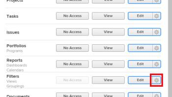

# Grant access to filters, views, and groupings

As an *Adobe Workfront administrator*, you can use an access level to define a user's access to the filter, view, and grouping controls for lists and reports, as explained in [Access levels overview](../../../administration-and-setup/add-users/access-levels-and-object-permissions/access-levels-overview.md).

For information about the filter, view, and grouping controls, see [Reporting elements: filters, views, and groupings](../../../reports-and-dashboards/reports/reporting-elements/reporting-elements-filters-views-groupings.md).

## Access requirements

You must have the following to perform the steps in this article:

<table cellspacing="0"> 
 <col> 
 <col> 
 <tbody> 
  <tr> 
   <td role="rowheader"><em>Adobe Workfront</em> plan</td> 
   <td> 
Any
 </td> 
  </tr> 
  <tr> 
   <td role="rowheader"><em>Adobe Workfront</em> license</td> 
   <td> 
<em>Plan</em> 
 </td> 
  </tr> 
  <tr> 
   <td role="rowheader">Access level configurations</td> 
   <td> 
You must be a <em>Workfront administrator</em>. For more information, see <a href="../../../administration-and-setup/add-users/configure-and-grant-access/grant-a-user-full-administrative-access.md" class="MCXref xref" data-mc-variable-override="">Grant a user full administrative access</a>.
 
Note: If you still don't have access, ask your <em>Workfront administrator</em> if they set additional restrictions in your access level. For information on how a <em>Workfront administrator</em> can modify your access level, see <a href="../../../administration-and-setup/add-users/configure-and-grant-access/create-modify-access-levels.md" class="MCXref xref" data-mc-variable-override="">Create or modify custom access levels</a>.
 </td> 
  </tr> 
 </tbody> 
</table>

## Configure user access to filters, views, and groupings using a custom access level

<ol> 
 <li value="1">Begin creating or editing the access level, as explained in <a href="../../../administration-and-setup/add-users/configure-and-grant-access/create-modify-access-levels.md" class="MCXref xref" data-mc-variable-override="">Create or modify custom access levels</a>.</li> 
 <li value="2"> 
Click the gear icon  on the View or Edit button to the right of <em>Filters</em>, then select the abilities you want to grant under <b>Fine-tune your settings</b>.
 
  
 
By default, users with a Plan, Work, Reviewer, or Request license have full View and Edit abilities. Users with an External User license do not access to filters, views, and groupings.<draft-comment>
    <MadCap:conditionalText style="color: #ff1493;" data-mc-conditions="QuicksilverOrClassic.Draft mode">
      If this changes, undraft section with table below
    </MadCap:conditionalText>
   </draft-comment><MadCap:conditionalText style="color: #ff1493;" data-mc-conditions="QuicksilverOrClassic.Draft mode">
     If this changes, undraft section with table below
   </MadCap:conditionalText>
 </li> 
 <li value="3"> 
(Optional) To configure access settings for other objects and areas in the access level you are working on, continue with one of the articles listed in <a href="../../../administration-and-setup/add-users/configure-and-grant-access/configure-access.md" class="MCXref xref" data-mc-variable-override="">Configure access to Adobe Workfront</a>, such as <a href="../../../administration-and-setup/add-users/configure-and-grant-access/grant-access-tasks.md" class="MCXref xref" data-mc-variable-override="">Grant access to tasks</a> and <a href="../../../administration-and-setup/add-users/configure-and-grant-access/grant-access-financial.md" class="MCXref xref" data-mc-variable-override="">Grant access to financial data</a>.
 </li> 
 <li value="4"> 
When you are finished, click <draft-comment>
    <b data-mc-conditions="QuicksilverOrClassic.Quicksilver">Save</b>
   </draft-comment><b data-mc-conditions="QuicksilverOrClassic.Quicksilver">Save</b>.
 
After the access level is created, you can assign it to a user. For more information, see <a href="../../../administration-and-setup/add-users/create-and-manage-users/edit-a-users-profile.md" class="MCXref xref" data-mc-variable-override="">Edit a user's profile</a>.
 </li> 
</ol>

<!--

<h2>Access to filters, views, and groupings by license type</h2>

<draft-comment>
Drafting out this section for now because the table is redundant since all four license types can do everything.
</draft-comment>Drafting out this section for now because the table is redundant since all four license types can do everything. 

This table lists what a <em>Workfront administrator</em> can allow users with each license type to do with <em>filter, views, and groupings</em>. For information about the <em>Workfront</em> license types, see <a href="../../../administration-and-setup/add-users/access-levels-and-object-permissions/wf-licenses.md" class="MCXref xref" data-mc-variable-override="">Adobe Workfront licenses overview</a>.

<table border="2" cellspacing="15" cellpadding="1">
<col>
<col>
<col>
<col>
<col>
<thead>
<tr>
<th> Action </th>
<th> Planner </th>
<th> Worker </th>
<th> Reviewer </th>
<th> Requester </th>
</tr>
</thead>
<tbody>
<tr>
<td>Edit filters, views, and groupings</td>
<td>✓</td>
<td>✓</td>
<td>✓</td>
<td>✓</td>
</tr>
<tr>
<td>Create filters, views, and groupings</td>
<td>✓</td>
<td>✓</td>
<td>✓</td>
<td>✓</td>
</tr>
<tr>
<td>View filters, views, and groupings</td>
<td>✓</td>
<td>✓</td>
<td>✓</td>
<td>✓</td>
</tr>
<tr>
<td>Delete filters, views, and groupings</td>
<td>✓</td>
<td>✓</td>
<td>✓</td>
<td>✓</td>
</tr>
<tr>
<td>Share filters, views, and groupings</td>
<td>✓</td>
<td>✓</td>
<td>✓</td>
<td>✓</td>
</tr>
<tr>
<td>Share filters, views, and groupings system-wide</td>
<td>✓</td>
<td>✓</td>
<td>✓</td>
<td>✓</td>
</tr>
</tbody>
</table>

-->

## Access to filters, views, and groupings by license type

`Drafting out this section for now because the table is redundant since all four license types can do everything.`

This table lists what a *Workfront administrator* can allow users with each license type to do with *filter, views, and groupings*. For information about the *Workfront* license types, see [Adobe Workfront licenses overview](../../../administration-and-setup/add-users/access-levels-and-object-permissions/wf-licenses.md).

|  Action  | Planner  | Worker  | Reviewer  | Requester  |
|---|---|---|---|---|
| Edit filters, views, and groupings |✓ |✓ |✓ |✓ |
| Create filters, views, and groupings |✓ |✓ |✓ |✓ |
| View filters, views, and groupings |✓ |✓ |✓ |✓ |
| Delete filters, views, and groupings |✓ |✓ |✓ |✓ |
| Share filters, views, and groupings |✓ |✓ |✓ |✓ |
| Share filters, views, and groupings system-wide |✓ |✓ |✓ |✓ |

