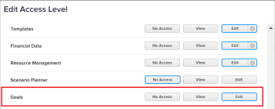

# Grant access to Adobe Workfront Goals

As an Adobe Workfront administrator, you can use an access level to define a user’s access to Adobe Workfront Goals, as explained in [Access levels overview](../../../administration-and-setup/add-users/access-levels-and-object-permissions/access-levels-overview.md).

## Access requirements

You must have the following to grant users access to Workfront Goals:

<table cellspacing="0"> 
 <col> 
 <col> 
 <tbody> 
  <tr> 
   <td role="rowheader">Workfront plan</td> 
   <td> 
Pro or higher
 </td> 
  </tr> 
  <tr> 
   <td role="rowheader">Adobe Workfront license*</td> 
   <td> 
Plan 
 </td> 
  </tr> 
  <tr> 
   <td role="rowheader">Product</td> 
   <td>Workfront Goals 
Contact your Workfront account manager to learn about a Workfront Goals license. 
 
Workfront Goals is available only in the new Adobe Workfront experience. For information about enrolling users in the new Adobe Workfront experience, see <a href="../../../administration-and-setup/add-users/create-and-manage-users/enroll-users-new-workfront-experience.md" class="MCXref xref" data-mc-variable-override="">Enroll users in the new Adobe Workfront experience</a>.
 </td> 
  </tr> 
  <tr> 
   <td role="rowheader">Access level configuration*</td> 
   <td> 
You must have the System Administrator access level. For information about this access level, see <a href="../../../administration-and-setup/add-users/configure-and-grant-access/grant-a-user-full-administrative-access.md" class="MCXref xref" data-mc-variable-override="">Grant a user full administrative access</a>.
 
Note: If you still don't have access, ask your Workfront administrator if they set additional restrictions in your access level. For information on how a Workfront administrator can modify your access level, see <a href="../../../administration-and-setup/add-users/configure-and-grant-access/create-modify-access-levels.md" class="MCXref xref" data-mc-variable-override="">Create or modify custom access levels</a>.
 </td> 
  </tr> 
 </tbody> 
</table>

&#42;To find out what plan, license type, or access level you have, contact your Workfront administrator.

For additional information about access to Workfront Goals, see Requirements to use Adobe Workfront Goals.

## Grant user access to Workfront Goals using a custom access level

<ol> 
 <li value="1">Begin creating or editing the access level, as explained in <a href="../../../administration-and-setup/add-users/configure-and-grant-access/create-modify-access-levels.md" class="MCXref xref" data-mc-variable-override="">Create or modify custom access levels</a>.</li> 
 <li value="2"> 
Click the option to the right of Goals that you want to use for this access level.
 
  
 <note type="note">
   The External license type does not allow View or Edit access to Workfront Goals.
  </note> </li> 
 <li value="3"> 
(Optional) To configure access settings for other objects and areas in the access level you are working on, continue with one of the articles listed in <a href="../../../administration-and-setup/add-users/configure-and-grant-access/configure-access.md" class="MCXref xref" data-mc-variable-override="">Configure access to Adobe Workfront</a>, such as <a href="../../../administration-and-setup/add-users/configure-and-grant-access/grant-access-tasks.md" class="MCXref xref" data-mc-variable-override="">Grant access to tasks</a> and <a href="../../../administration-and-setup/add-users/configure-and-grant-access/grant-access-financial.md" class="MCXref xref" data-mc-variable-override="">Grant access to financial data</a>.
 </li> 
 <li value="4"> 
When you are finished, click Save.
 </li> 
</ol>

## Access to Workfront Goals by license type

A Workfront administrator can allow to users with a Plan, Work, Request, or Review license fill Edit access to Workfront Goals in an access level.

| Actions |Edit |View |No Access |
|---|---|---|---|
| View Goals in the Main menu |✓ |&nbsp; |&nbsp; |
| View the Goals area from a shared link |✓ |&nbsp; |&nbsp; |
| View all goals in the system |✓  |&nbsp; |&nbsp; |
| Create goals |✓ |&nbsp; |&nbsp; |
| Edit and delete all goals |✓ |&nbsp; |&nbsp; |
| Activate/ deactivate/ close all goals |✓ |&nbsp; |&nbsp; |
| Create, edit, and delete activities |✓ |&nbsp; |&nbsp; |
| Create, edit, and delete results |✓ |&nbsp; |&nbsp; |
| Add an aligned goal |✓ |&nbsp; |&nbsp; |
| Update progress on a result or activity |✓ |&nbsp; |&nbsp; |
| Own a goal, result, or activity |✓ |&nbsp; |&nbsp; |
| Comment on a goal |✓ |&nbsp; |&nbsp; |
| Copy goals |✓ |&nbsp; |&nbsp; |
| View the Goal List section in the left panel |✓ |&nbsp; |&nbsp; |
| View the Graphs section in the left panel |✓ |&nbsp; |&nbsp; |
| View the Goal Alignment section in the left panel |✓ |&nbsp; |&nbsp; |
| View the Pulse section in the left panel |✓ |&nbsp; |&nbsp; |
| View the Check-in area in the left panel |✓ |&nbsp; |&nbsp; |
| View the Settings area in the left panel |✓  |&nbsp; |&nbsp; |
| Print a list of goals |✓  |&nbsp; |&nbsp; |

