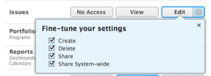
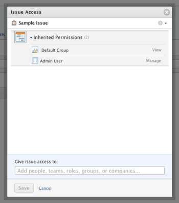

# Grant access to issues {#grant-access-to-issues}

As an *`Adobe Workfront administrator`*, you can use an access level to define a user’s access to *`issues`*`<MadCap:conditionalText data-mc-conditions="SnippetConditions.HIDE">  in  Workfront</MadCap:conditionalText>`, as explained in [Access levels overview](access-levels-overview.md).&nbsp;

>[!NOTE]
>
>When someone shares an issue with another user, the recipient’s rights on the issue are determined by a combination of two things:
>
>
>
>* The recipient’s access level setting for issues
>* Any permissions that the sharer granted for the issue
>
>
>For information about permissions users can grant on an issue when sharing it, [Share an issue in Adobe Workfront](share-an-issue.md).

For information about using custom access levels to manage users' access to objects in *`Workfront`*, including *`issues`*, see&nbsp; [Create or modify custom access levels](create-modify-access-levels.md).

## Access requirements {#access-requirements}

You must have the following to perform the steps in this article:

<table style="width: 100%;margin-left: 0;margin-right: auto;mc-table-style: url('../../../Resources/TableStyles/TableStyle-List-options-in-steps.css');" class="TableStyle-TableStyle-List-options-in-steps" cellspacing="0"> 
 <col class="TableStyle-TableStyle-List-options-in-steps-Column-Column1"> 
 <col class="TableStyle-TableStyle-List-options-in-steps-Column-Column2"> 
 <tbody> 
  <tr class="TableStyle-TableStyle-List-options-in-steps-Body-LightGray"> 
   <td class="TableStyle-TableStyle-List-options-in-steps-BodyE-Column1-LightGray" role="rowheader">Adobe Workfront plan</td> 
   <td class="TableStyle-TableStyle-List-options-in-steps-BodyD-Column2-LightGray"> 
Any
 </td> 
  </tr> 
  <tr class="TableStyle-TableStyle-List-options-in-steps-Body-MediumGray"> 
   <td class="TableStyle-TableStyle-List-options-in-steps-BodyE-Column1-MediumGray" role="rowheader">Adobe Workfront license</td> 
   <td class="TableStyle-TableStyle-List-options-in-steps-BodyD-Column2-MediumGray"> 
Plan 
 </td> 
  </tr> 
  <tr class="TableStyle-TableStyle-List-options-in-steps-Body-LightGray"> 
   <td class="TableStyle-TableStyle-List-options-in-steps-BodyB-Column1-LightGray" role="rowheader">Access level configurations</td> 
   <td class="TableStyle-TableStyle-List-options-in-steps-BodyA-Column2-LightGray"> 
You must be a Workfront administrator. For more information, see <a href="grant-a-user-full-administrative-access.md" class="MCXref xref" data-mc-variable-override="">Grant a user full administrative access</a>.
 
Note: If you still don't have access, ask your Workfront administrator if they set additional restrictions in your access level. For information on how a Workfront administrator can modify your access level, see <a href="create-modify-access-levels.md" class="MCXref xref" data-mc-variable-override="">Create or modify custom access levels</a>.
 </td> 
  </tr> 
 </tbody> 
</table>

## Grant user access to issues using a custom access level {#grant-user-access-to-issues-using-a-custom-access-level}

1. Begin creating or editing the access level, as explained in [Create or modify custom access levels](create-modify-access-levels.md).
1.  Click the gear icon  on the `View` or `Edit` button to the right of *`Issues`*, then select the abilities you want to grant under **Fine-tune your settings**.

      

1. (Optional) To restrict inherited permissions for issues from higher ranking objects, click `Set additional restrictions`, then select `Never inherit document access from projects, tasks, issues, etc`.

1.  (Optional) To configure access settings for other objects and areas in the access level you are working on, continue with one of the articles listed in [Configure access to Adobe Workfront](_configure-access.md), such as [Grant access to tasks](grant-access-tasks.md) and [Grant access to financial data](grant-access-financial.md).
1.  When you are finished, click **Save**.

   After the access level is created, you can assign it to a user. For more information, see [Edit a user's profile](edit-a-users-profile.md).

## Access to issues by license type {#access-to-issues-by-license-type}

The `owner` and the creator of an issue has default Manage permissions, within the limits of their access level. As the owner or the creator of an issue, you can share access with other users through permissions.

Issue access is also controlled through object hierarchy. If the user already has permission on the parent object, like a project or a task, those permissions transfer to the issue. Users who have permissions to an issue coming from the parent objects of the issue are listed under `Inherited Permissions`.

This table lists what a *`Workfront administrator`* can allow users with each license type to do with *`issues`*. For information about the *`Workfront`* license types, see [Adobe Workfront licenses overview](wf-licenses.md).

The External User license type is not included here because it does not allow access to issues.

&#42;Controlled by access and permissions of the project or task
