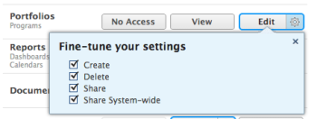

# Grant access to portfolios

As an Adobe Workfront administrator, you can use an access level to define a user’s access to portfolios, as explained in [Access levels overview](../../../administration-and-setup/add-users/access-levels-and-object-permissions/access-levels-overview.md).&nbsp;

## Access requirements

You must have the following to perform the steps in this article:

<table cellspacing="0"> 
 <col> 
 <col> 
 <tbody> 
  <tr> 
   <td role="rowheader">Adobe Workfront plan</td> 
   <td> 
Any
 </td> 
  </tr> 
  <tr> 
   <td role="rowheader">Adobe Workfront license</td> 
   <td> 
Plan 
 </td> 
  </tr> 
  <tr> 
   <td role="rowheader">Access level configurations</td> 
   <td> 
You must be a Workfront administrator. For more information, see <a href="../../../administration-and-setup/add-users/configure-and-grant-access/grant-a-user-full-administrative-access.md" class="MCXref xref" data-mc-variable-override="">Grant a user full administrative access</a>.
 
Note: If you still don't have access, ask your Workfront administrator if they set additional restrictions in your access level. For information on how a Workfront administrator can modify your access level, see <a href="../../../administration-and-setup/add-users/configure-and-grant-access/create-modify-access-levels.md" class="MCXref xref" data-mc-variable-override="">Create or modify custom access levels</a>.
 </td> 
  </tr> 
 </tbody> 
</table>

## Configure user access to portfolios using a custom access level

<ol> 
 <li value="1">Begin creating or editing the access level, as explained in <a href="../../../administration-and-setup/add-users/configure-and-grant-access/create-modify-access-levels.md" class="MCXref xref" data-mc-variable-override="">Create or modify custom access levels</a>.</li> 
 <li value="2"> 
Click the gear icon  on the View or Edit button to the right of Portfolios, then select the abilities you want to grant under <b>Fine-tune your settings</b>. 
 
  
 <note type="note">
   When you configure an access level setting for a certain type of object, that configuration doesn't affect the users' access to objects with a lower rank. For example, you can restrict users from deleting portfolios in their access level, but this does not restrict them from deleting projects, which are lower-ranking than portfolios.For more information about the hierarchy of objects, see the section 
   <a href="../../../workfront-basics/navigate-workfront/workfront-navigation/understand-objects.md#understanding-interdependency-and-hierarchy-of-objects" class="MCXref xref" data-mc-variable-override="">Interdependency and hierarchy of objects</a> in&nbsp;the article 
   <a href="../../../workfront-basics/navigate-workfront/workfront-navigation/understand-objects.md" class="MCXref xref" data-mc-variable-override="">Understand objects in Adobe Workfront</a>.
  </note> </li> 
 <li value="3"> 
(Optional) To configure access settings for other objects and areas in the access level you are working on, continue with one of the articles listed in <a href="../../../administration-and-setup/add-users/configure-and-grant-access/configure-access.md" class="MCXref xref" data-mc-variable-override="">Configure access to Adobe Workfront</a>, such as <a href="../../../administration-and-setup/add-users/configure-and-grant-access/grant-access-tasks.md" class="MCXref xref" data-mc-variable-override="">Grant access to tasks</a> and <a href="../../../administration-and-setup/add-users/configure-and-grant-access/grant-access-financial.md" class="MCXref xref" data-mc-variable-override="">Grant access to financial data</a>.
 </li> 
 <li value="4"> 
When you are finished, click Save.
 
After the access level is created, you can assign it to a user. For more information, see <a href="../../../administration-and-setup/add-users/create-and-manage-users/edit-a-users-profile.md" class="MCXref xref" data-mc-variable-override="">Edit a user's profile</a>.
 </li> 
</ol>

## Access to portfolios by license type

For information about what users in each access level can do with portfolios, see the section [Portfolios](../../../administration-and-setup/add-users/access-levels-and-object-permissions/functionality-available-for-each-object-type.md#portfoli) in the article [Functionality available for each object type](../../../administration-and-setup/add-users/access-levels-and-object-permissions/functionality-available-for-each-object-type.md).

## Access to shared portfolios

As the owner or creator of an portfolio, you can share with other users by granting them permissions to it, as explained in [Share a portfolio in Adobe Workfront](../../../workfront-basics/grant-and-request-access-to-objects/share-a-portfolio..md).

When you share any object with another user, the recipient’s rights on it are determined by a combination of two things:

* The permissions that you grant to your recipient for the object
* The recipient’s access level settings for the object's type

For information about permissions users can grant on a portfolio when sharing it, see [Share a portfolio in Adobe Workfront](../../../workfront-basics/grant-and-request-access-to-objects/share-a-portfolio..md).
