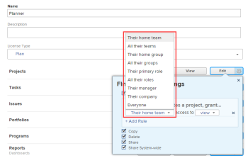
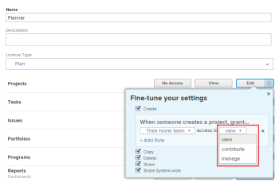

# Grant access to projects

As an `Adobe Workfront administrator`, you can use an access level to define a user’s access to `projects`, as explained in [Access levels overview](../../../administration-and-setup/add-users/access-levels-and-object-permissions/access-levels-overview.md).&nbsp;

For information about using custom access levels to manage users' access to other object types in `Workfront`, see [Create or modify custom access levels](../../../administration-and-setup/add-users/configure-and-grant-access/create-modify-access-levels.md).

## Access requirements

You must have the following to perform the steps in this article:

<table cellspacing="0"> 
 <col> 
 <col> 
 <tbody> 
  <tr> 
   <td role="rowheader">Adobe Workfront plan</td> 
   <td> 
Any
 </td> 
  </tr> 
  <tr> 
   <td role="rowheader">Adobe Workfront license</td> 
   <td> 
Plan 
 </td> 
  </tr> 
  <tr> 
   <td role="rowheader">Access level configurations</td> 
   <td> 
You must be a Workfront administrator. For more information, see <a href="../../../administration-and-setup/add-users/configure-and-grant-access/grant-a-user-full-administrative-access.md" class="MCXref xref" data-mc-variable-override="">Grant a user full administrative access</a>.
 
Note: If you still don't have access, ask your Workfront administrator if they set additional restrictions in your access level. For information on how a Workfront administrator can modify your access level, see <a href="../../../administration-and-setup/add-users/configure-and-grant-access/create-modify-access-levels.md" class="MCXref xref" data-mc-variable-override="">Create or modify custom access levels</a>.
 </td> 
  </tr> 
 </tbody> 
</table>

## Configure user access to projects using a custom access level

<ol> 
 <li value="1">Begin creating or editing the access level, as explained in <a href="../../../administration-and-setup/add-users/configure-and-grant-access/create-modify-access-levels.md" class="MCXref xref" data-mc-variable-override="">Create or modify custom access levels</a>.</li> 
 <li value="2"> 
Click the gear icon  on the View or Edit button to the right of Projects, then select the abilities you want to grant under <b>Fine-tune your settings</b>.
 
  
 <note type="note"> 
   <ul> 
    <li>Users with a Work license have limited project rights. They can contribute to a project, but not manage one.</li> 
    <li>Users with a Review license have View rights on projects from converted issues, but their View rights are limited.</li> 
    <li> 
For information about permissions users can grant when sharing projects with others, see <a href="../../../workfront-basics/grant-and-request-access-to-objects/share-a-project.md" class="MCXref xref">Share a project in Adobe Workfront</a>.
 </li> 
    <li> 
When you configure an access level setting for a certain type of object, that configuration doesn't affect the users' access to objects with a lower rank. For example, you can restrict users from deleting projects in their access level, but this does not restrict them from deleting tasks, which are lower-ranking than projects.For more information about the hierarchy of objects, see the section <a href="../../../workfront-basics/navigate-workfront/workfront-navigation/understand-objects.md#understanding-interdependency-and-hierarchy-of-objects" class="MCXref xref" data-mc-variable-override="">Interdependency and hierarchy of objects</a> in&nbsp;the article <a href="../../../workfront-basics/navigate-workfront/workfront-navigation/understand-objects.md" class="MCXref xref" data-mc-variable-override="">Understand objects in Adobe Workfront</a>.
 </li> 
   </ul> 
  </note> </li> 
 <li value="3"> 
(Optional) Click set sharing defaults to the right of the Create option, then Add Rule to add a sharing rule for new projects.
 
When the user with this access level creates a project, the project is shared automatically with the users you select in the menu on the left. 
 
  
 
In the menu on the right, you specify how you want the project shared with those users:
 
  
 <note type="note">
    If a user with this access level is using a project access template, the template overrides the sharing settings in the access level. For information about project access templates, see 
   <a href="../../../workfront-basics/grant-and-request-access-to-objects/share-a-project.md" class="MCXref xref">Share a project in Adobe Workfront</a>.
  </note> 
You can repeat this step to add as many project sharing rules as you need for the access level.
 </li> 
 <li value="4">Click the X to close the Fine-tune your settings box.</li> 
 <li value="5"> 
(Optional) To configure access settings for other objects and areas in the access level you are working on, continue with one of the articles listed in <a href="../../../administration-and-setup/add-users/configure-and-grant-access/configure-access.md" class="MCXref xref" data-mc-variable-override="">Configure access to Adobe Workfront</a>, such as <a href="../../../administration-and-setup/add-users/configure-and-grant-access/grant-access-tasks.md" class="MCXref xref" data-mc-variable-override="">Grant access to tasks</a> and <a href="../../../administration-and-setup/add-users/configure-and-grant-access/grant-access-financial.md" class="MCXref xref" data-mc-variable-override="">Grant access to financial data</a>.
 </li> 
 <li value="6"> 
When you are finished, click Save.
 
After the access level is created, you can assign it to a user. For more information, see <a href="../../../administration-and-setup/add-users/create-and-manage-users/edit-a-users-profile.md" class="MCXref xref" data-mc-variable-override="">Edit a user's profile</a>.
 </li> 
</ol>

## Access to reports, dashboards, and calendars by license type

For information about what users in each access level can do with issues, see the section [Projects](../../../administration-and-setup/add-users/access-levels-and-object-permissions/functionality-available-for-each-object-type.md#projects) in the article [Functionality available for each object type](../../../administration-and-setup/add-users/access-levels-and-object-permissions/functionality-available-for-each-object-type.md).

## Access to shared projects

As the owner or creator of an issue, you can share with other users by granting them permissions to it, as explained in [Share a project in Adobe Workfront](../../../workfront-basics/grant-and-request-access-to-objects/share-a-project.md).

When you share any object with another user, the recipient’s rights on it are determined by a combination of two things:

* The permissions that you grant to your recipient for the object
* The recipient’s access level settings for the object's type

##  

