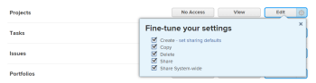

# Grant access to projects {#grant-access-to-projects}

As an *`Adobe Workfront administrator`*, you can use an access level to define a user’s access to *`projects`*`<MadCap:conditionalText data-mc-conditions="SnippetConditions.HIDE">  in  Workfront</MadCap:conditionalText>`, as explained in [Access levels overview](access-levels-overview.md).&nbsp;

>[!NOTE]
>
>When someone shares a *`project`* with another user, the recipient’s rights on it are determined by a combination of two things:
>
>
>
>* The recipient’s access level setting for *`projects`*
>* Any permissions that the sharer granted for the *`project`* 
>
>
>For information about permissions when sharing projects, see [Share a project in Adobe Workfront](share-a-project.md).

For information about using custom access levels to manage users' access to objects in *`Workfront`*, including *`templates`*, see&nbsp; [Create or modify custom access levels](create-modify-access-levels.md).

## Access requirements {#access-requirements}

You must have the following to perform the steps in this article:

<table style="width: 100%;margin-left: 0;margin-right: auto;mc-table-style: url('../../../Resources/TableStyles/TableStyle-List-options-in-steps.css');" class="TableStyle-TableStyle-List-options-in-steps" cellspacing="0"> 
 <col class="TableStyle-TableStyle-List-options-in-steps-Column-Column1"> 
 <col class="TableStyle-TableStyle-List-options-in-steps-Column-Column2"> 
 <tbody> 
  <tr class="TableStyle-TableStyle-List-options-in-steps-Body-LightGray"> 
   <td class="TableStyle-TableStyle-List-options-in-steps-BodyE-Column1-LightGray" role="rowheader">Adobe Workfront plan</td> 
   <td class="TableStyle-TableStyle-List-options-in-steps-BodyD-Column2-LightGray"> 
Any
 </td> 
  </tr> 
  <tr class="TableStyle-TableStyle-List-options-in-steps-Body-MediumGray"> 
   <td class="TableStyle-TableStyle-List-options-in-steps-BodyE-Column1-MediumGray" role="rowheader">Adobe Workfront license</td> 
   <td class="TableStyle-TableStyle-List-options-in-steps-BodyD-Column2-MediumGray"> 
Plan 
 </td> 
  </tr> 
  <tr class="TableStyle-TableStyle-List-options-in-steps-Body-LightGray"> 
   <td class="TableStyle-TableStyle-List-options-in-steps-BodyB-Column1-LightGray" role="rowheader">Access level configurations</td> 
   <td class="TableStyle-TableStyle-List-options-in-steps-BodyA-Column2-LightGray"> 
You must be a Workfront administrator. For more information, see <a href="grant-a-user-full-administrative-access.md" class="MCXref xref" data-mc-variable-override="">Grant a user full administrative access</a>.
 
Note: If you still don't have access, ask your Workfront administrator if they set additional restrictions in your access level. For information on how a Workfront administrator can modify your access level, see <a href="create-modify-access-levels.md" class="MCXref xref" data-mc-variable-override="">Create or modify custom access levels</a>.
 </td> 
  </tr> 
 </tbody> 
</table>

## Configure user access to projects using a custom access level {#configure-user-access-to-projects-using-a-custom-access-level}

1. Begin creating or editing the access level, as explained in [Create or modify custom access levels](create-modify-access-levels.md).
1.  Click the gear icon  on the `View` or `Edit` button to the right of *`Projects`*, then select the abilities you want to grant under **Fine-tune your settings**.

   

   >[!NOTE]
   >
   >Users don’t inherit access to objects from higher-ranking objects. For example, you can restrict a user from deleting *`projects`* in their access level, but this does not restrict them from deleting *`tasks`*, which are lower-ranking than *`projects`*. For more information about the hierarchy of objects, see the section [Interdependency and hierarchy of objects](understand-objects.md#understanding-interdependency-and-hierarchy-of-objects) in&nbsp;the article [Understand objects in Adobe Workfront](understand-objects.md).  

1.  (Optional) Click `set sharing defaults` to the right of the Create option, then `Add Rule` to add a sharing rule for new projects.

   When the user with this access level creates a project, the project is shared automatically with the users you select in the menu on the left. 

   

   In the menu on the right, you specify how you want the project shared with those users:

   

   >[!NOTE]
   >
   >If a user with this access level is using a project access template, the template overrides the sharing settings in the access level. For information about project access templates, see [Share a project in Adobe Workfront](share-a-project.md).

   You can repeat this step to add as many project sharing rules as you need for the access level.

1. Click the X to close the `Fine-tune your settings` box.
1.  (Optional) To configure access settings for other objects and areas in the access level you are working on, continue with one of the articles listed in [Configure access to Adobe Workfront](_configure-access.md), such as [Grant access to tasks](grant-access-tasks.md) and [Grant access to financial data](grant-access-financial.md).
1.  When you are finished, click **Save**.

   After the access level is created, you can assign it to a user. For more information, see [Edit a user's profile](edit-a-users-profile.md).

## Access to projects by license type {#access-to-projects-by-license-type}

This table lists what a *`Workfront administrator`* can allow users with each license type to do with *`projects`*. For information about the *`Workfront`* license types, see [Adobe Workfront licenses overview](wf-licenses.md).

Only users with a *`Plan`* license can be granted full access to projects. 

The External User license type is not included because it doesn’t allow any access to projects.

&#42;Users without access to financial data cannot manage risks and finances for projects, even if they have Edit access to projects. For information about access to financial data, see [Grant access to financial data](grant-access-financial.md).

>[!NOTE]
>
>
>
>
>* Users with a Work license have limited project rights. They can contribute to a project, but not manage one.
>* Users with a Review license have View rights on projects from converted issues, but their View rights are limited.
>*  For information about permissions users can grant when sharing projects with others, see [Share a project in Adobe Workfront](share-a-project.md).
>
>

