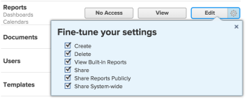

# Grant access to reports, dashboards, and calendars {#grant-access-to-reports-dashboards-and-calendars}

As an *`Adobe Workfront administrator`*, you can use an access level to define a user’s access to *`reports, dashboards, and calendars`*`<MadCap:conditionalText data-mc-conditions="SnippetConditions.HIDE">  in  Workfront</MadCap:conditionalText>`, as explained in [Access levels overview](access-levels-overview.md).&nbsp;

This access also includes access to External Pages. For information about External Pages, see [Grant access to financial data](grant-access-financial.md).

>[!IMPORTANT] {type="important"}
>
>`If you want grant users access to reports, dashboards, and calendars, you must also give those users access to filters, views, and groupings. For instructions, see` [Grant access to filters, views, and groupings](grant-access-fvg.md).

>[!NOTE]
>
>When someone shares a report, dashboard, or calendar with another user, the recipient’s rights on it are determined by a combination of two things:
>
>
>
>* The recipient’s access level setting for reports, dashboards, and calendars
>* Any permissions that the sharer granted for the report, dashboard, or calendar
>
>
>For information about permissions users can grant on a report, dashboard, or calendar when sharing it, see [Share reports, dashboards, and calendars in Adobe Workfront](permissions-reports-dashboards-calendars.md).

## Access requirements {#access-requirements}

You must have the following to perform the steps in this article:

<table style="width: 100%;margin-left: 0;margin-right: auto;mc-table-style: url('../../../Resources/TableStyles/TableStyle-List-options-in-steps.css');" class="TableStyle-TableStyle-List-options-in-steps" cellspacing="0"> 
 <col class="TableStyle-TableStyle-List-options-in-steps-Column-Column1"> 
 <col class="TableStyle-TableStyle-List-options-in-steps-Column-Column2"> 
 <tbody> 
  <tr class="TableStyle-TableStyle-List-options-in-steps-Body-LightGray"> 
   <td class="TableStyle-TableStyle-List-options-in-steps-BodyE-Column1-LightGray" role="rowheader">Adobe Workfront plan</td> 
   <td class="TableStyle-TableStyle-List-options-in-steps-BodyD-Column2-LightGray"> 
Any
 </td> 
  </tr> 
  <tr class="TableStyle-TableStyle-List-options-in-steps-Body-MediumGray"> 
   <td class="TableStyle-TableStyle-List-options-in-steps-BodyE-Column1-MediumGray" role="rowheader">Adobe Workfront license</td> 
   <td class="TableStyle-TableStyle-List-options-in-steps-BodyD-Column2-MediumGray"> 
Plan 
 </td> 
  </tr> 
  <tr class="TableStyle-TableStyle-List-options-in-steps-Body-LightGray"> 
   <td class="TableStyle-TableStyle-List-options-in-steps-BodyB-Column1-LightGray" role="rowheader">Access level configurations</td> 
   <td class="TableStyle-TableStyle-List-options-in-steps-BodyA-Column2-LightGray"> 
You must be a Workfront administrator. For more information, see <a href="grant-a-user-full-administrative-access.md" class="MCXref xref" data-mc-variable-override="">Grant a user full administrative access</a>.
 
Note: If you still don't have access, ask your Workfront administrator if they set additional restrictions in your access level. For information on how a Workfront administrator can modify your access level, see <a href="create-modify-access-levels.md" class="MCXref xref" data-mc-variable-override="">Create or modify custom access levels</a>.
 </td> 
  </tr> 
 </tbody> 
</table>

## Configure user access to reports, dashboards, and calendars using a custom access level {#configure-user-access-to-reports-dashboards-and-calendars-using-a-custom-access-level}

1. Begin creating or editing the access level, as explained in [Create or modify custom access levels](create-modify-access-levels.md).
1.  Click the gear icon  on the `View` or `Edit` button to the right of *`Reports`*, then select the abilities you want to grant under **Fine-tune your settings**.  

   

   The following options are enabled by default:

    
    
    * `Create` 
    * `Delete` 
    * `View Built-In Reports`: This needs to be selected to see reports built by *`Workfront`*.
    
    * `Share` 
    * `Share Reports Publicly`: Reports can be shared publicly, by sharing a public link to the report with anyone that does not have a *`Workfront`* account. This option must be selected to allow for this level of sharing.
    
    *  `Share System-wide`: Reports can be shared with everyone in the system who has a *`Workfront`* license. This option must be selected to allow for this level of sharing.
    
    
      For information about sharing reports, dashboards, and calendars, see [Share reports, dashboards, and calendars in Adobe Workfront](permissions-reports-dashboards-calendars.md).
    
    
    

1.  (Optional) To configure access settings for other objects and areas in the access level you are working on, continue with one of the articles listed in [Configure access to Adobe Workfront](_configure-access.md), such as [Grant access to tasks](grant-access-tasks.md) and [Grant access to financial data](grant-access-financial.md).
1.  When you are finished, click **Save**.

   After the access level is created, you can assign it to a user. For more information, see [Edit a user's profile](edit-a-users-profile.md).

## Access to reports, dashboards, and calendars by license type {#access-to-reports-dashboards-and-calendars-by-license-type}

This table lists what a *`Workfront administrator`* can allow users with each license type to do with reports, dashboards, and calendars. For more information, see [Adobe Workfront licenses overview](wf-licenses.md).

Users with a *`Plan`* license can have full access to reports. All other Access Levels have View access to reports.

&#42; Users with a Request license type can view reports only if they have been shared with them.

&#42;&#42; This action is not shared with dashboards; it’s available for only calendars and reports.
