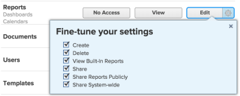

# Grant access to reports, dashboards, and calendars

As an `Adobe Workfront administrator`, you can use an access level to define a user’s access to `reports, dashboards, and calendars`, as explained in [Access levels overview](../../../administration-and-setup/add-users/access-levels-and-object-permissions/access-levels-overview.md).&nbsp;

This access also includes access to External Pages. For information about External Pages, see [Grant access to financial data](../../../administration-and-setup/add-users/configure-and-grant-access/grant-access-financial.md).

>[!IMPORTANT]
>
>If you want grant users access to reports, dashboards, and calendars, you must also give those users access to filters, views, and groupings. For instructions, see [Grant access to filters, views, and groupings](../../../administration-and-setup/add-users/configure-and-grant-access/grant-access-fvg.md).

>[!NOTE]
>
>When someone shares a report, dashboard, or calendar with another user, the recipient’s rights on it are determined by a combination of two things:
>
>* The recipient’s access level setting for reports, dashboards, and calendars
>* Any permissions that the sharer granted for the report, dashboard, or calendar
>
>For information about permissions users can grant on a report, dashboard, or calendar when sharing it, see [Share reports, dashboards, and calendars in Adobe Workfront](../../../workfront-basics/grant-and-request-access-to-objects/permissions-reports-dashboards-calendars.md).

## Access requirements

You must have the following to perform the steps in this article:

<table cellspacing="0"> 
 <col> 
 <col> 
 <tbody> 
  <tr> 
   <td role="rowheader">Adobe Workfront plan</td> 
   <td> 
Any
 </td> 
  </tr> 
  <tr> 
   <td role="rowheader">Adobe Workfront license</td> 
   <td> 
Plan 
 </td> 
  </tr> 
  <tr> 
   <td role="rowheader">Access level configurations</td> 
   <td> 
You must be a Workfront administrator. For more information, see <a href="../../../administration-and-setup/add-users/configure-and-grant-access/grant-a-user-full-administrative-access.md" class="MCXref xref" data-mc-variable-override="">Grant a user full administrative access</a>.
 
Note: If you still don't have access, ask your Workfront administrator if they set additional restrictions in your access level. For information on how a Workfront administrator can modify your access level, see <a href="../../../administration-and-setup/add-users/configure-and-grant-access/create-modify-access-levels.md" class="MCXref xref" data-mc-variable-override="">Create or modify custom access levels</a>.
 </td> 
  </tr> 
 </tbody> 
</table>

## Configure user access to reports, dashboards, and calendars using a custom access level

<ol> 
 <li value="1">Begin creating or editing the access level, as explained in <a href="../../../administration-and-setup/add-users/configure-and-grant-access/create-modify-access-levels.md" class="MCXref xref" data-mc-variable-override="">Create or modify custom access levels</a>.</li> 
 <li value="2"> 
Click the gear icon  on the View or Edit button to the right of Reports, then select the abilities you want to grant under <b>Fine-tune your settings</b>. 
 
  
 
The following options are enabled by default:
 
  <ul> 
   <li>Create </li> 
   <li>Delete </li> 
   <li>View Built-In Reports: This needs to be selected to see reports built by Workfront.</li> 
   <li>Share </li> 
   <li>Share Reports Publicly: Reports can be shared publicly, by sharing a public link to the report with anyone that does not have a Workfront account. This option must be selected to allow for this level of sharing.</li> 
   <li> 
Share System-wide: Reports can be shared with everyone in the system who has a Workfront license. This option must be selected to allow for this level of sharing.
 
For information about sharing reports, dashboards, and calendars, see <a href="../../../workfront-basics/grant-and-request-access-to-objects/permissions-reports-dashboards-calendars.md" class="MCXref xref">Share reports, dashboards, and calendars in Adobe Workfront</a>.
 </li> 
  </ul> </li> 
 <li value="3"> 
(Optional) To configure access settings for other objects and areas in the access level you are working on, continue with one of the articles listed in <a href="../../../administration-and-setup/add-users/configure-and-grant-access/configure-access.md" class="MCXref xref" data-mc-variable-override="">Configure access to Adobe Workfront</a>, such as <a href="../../../administration-and-setup/add-users/configure-and-grant-access/grant-access-tasks.md" class="MCXref xref" data-mc-variable-override="">Grant access to tasks</a> and <a href="../../../administration-and-setup/add-users/configure-and-grant-access/grant-access-financial.md" class="MCXref xref" data-mc-variable-override="">Grant access to financial data</a>.
 </li> 
 <li value="4"> 
When you are finished, click Save.
 
After the access level is created, you can assign it to a user. For more information, see <a href="../../../administration-and-setup/add-users/create-and-manage-users/edit-a-users-profile.md" class="MCXref xref" data-mc-variable-override="">Edit a user's profile</a>.
 </li> 
</ol>

## Access to reports, dashboards, and calendars by license type

For information about what users in each access level can do with issues, see the section [Reports](../../../administration-and-setup/add-users/access-levels-and-object-permissions/functionality-available-for-each-object-type.md#reports) in the article [Functionality available for each object type](../../../administration-and-setup/add-users/access-levels-and-object-permissions/functionality-available-for-each-object-type.md).

## Access to shared reports, dashboards, and calendars

As the owner or creator of a report, dashboard, or calendar, you can share it with other users by granting them permissions to it, as explained in [Share reports, dashboards, and calendars in Adobe Workfront](../../../workfront-basics/grant-and-request-access-to-objects/permissions-reports-dashboards-calendars.md).

When you share any object with another user, the recipient’s rights on it are determined by a combination of two things:

* The permissions that you grant to your recipient for the object
* The recipient’s access level settings for the object's type

