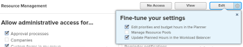

# Grant access to Resource Management

As an `Adobe Workfront administrator`, you can use an access level to define a user’s access to `Resource Management`, as explained in [Access levels overview](../../../administration-and-setup/add-users/access-levels-and-object-permissions/access-levels-overview.md).&nbsp;

## Access requirements

You must have the following to perform the steps in this article:

<table cellspacing="0"> 
 <col> 
 <col> 
 <tbody> 
  <tr> 
   <td role="rowheader">Adobe Workfront plan</td> 
   <td> 
Any
 </td> 
  </tr> 
  <tr> 
   <td role="rowheader">Adobe Workfront license</td> 
   <td> 
Plan 
 </td> 
  </tr> 
  <tr> 
   <td role="rowheader">Access level configurations</td> 
   <td> 
You must be a Workfront administrator. For more information, see <a href="../../../administration-and-setup/add-users/configure-and-grant-access/grant-a-user-full-administrative-access.md" class="MCXref xref" data-mc-variable-override="">Grant a user full administrative access</a>.
 
Note: If you still don't have access, ask your Workfront administrator if they set additional restrictions in your access level. For information on how a Workfront administrator can modify your access level, see <a href="../../../administration-and-setup/add-users/configure-and-grant-access/create-modify-access-levels.md" class="MCXref xref" data-mc-variable-override="">Create or modify custom access levels</a>.
 </td> 
  </tr> 
 </tbody> 
</table>

## Configure user access to Resource Management tools using a custom access level

<ol> 
 <li value="1">Begin creating or editing the access level, as explained in <a href="../../../administration-and-setup/add-users/configure-and-grant-access/create-modify-access-levels.md" class="MCXref xref" data-mc-variable-override="">Create or modify custom access levels</a>.</li> 
 <li value="2"> 
Click the gear icon  on the View or Edit button to the right of Resource Management, then select the abilities you want to grant under <b>Fine-tune your settings</b>.
 
  
 
  <table cellspacing="0"> 
   <col> 
   <col> 
   <tbody> 
    <tr> 
     <td role="rowheader">Edit priorities and budget hours in the Planner</td> 
     <td> 
Allows users with this license to do the following:
 
Prioritize projects in the Resource Planner.
 
Budget allocation for resources in the Resource Planning tools (the Resource Planner and the Resource Budgeting section in the Business Case of a project.)
 
This option is enabled by default.
 </td> 
    </tr> 
    <tr> 
     <td role="rowheader">Manage Resource Pools</td> 
     <td> 
Allows users with this license to create, edit, and delete Resource Pools. This option is disabled by default.
 </td> 
    </tr> Update Planned Hours in the Workload Balancer Allows users with this license to update the Planned Hours of work items when they update the user allocations in the Workload Balancer. The total number of allocated hours becomes the Planned Hours of the work items. This option is disabled by default. For more information, see Manage user allocations in the Workload Balancer. 
   </tbody> 
  </table> </li> 
 <li value="3"> 
(Optional) To configure access settings for other objects and areas in the access level you are working on, continue with one of the articles listed in <a href="../../../administration-and-setup/add-users/configure-and-grant-access/configure-access.md" class="MCXref xref" data-mc-variable-override="">Configure access to Adobe Workfront</a>, such as <a href="../../../administration-and-setup/add-users/configure-and-grant-access/grant-access-tasks.md" class="MCXref xref" data-mc-variable-override="">Grant access to tasks</a> and <a href="../../../administration-and-setup/add-users/configure-and-grant-access/grant-access-financial.md" class="MCXref xref" data-mc-variable-override="">Grant access to financial data</a>.
 </li> 
 <li value="4"> 
When you are finished, click Save.
 
After the access level is created, you can assign it to a user. For more information, see <a href="../../../administration-and-setup/add-users/create-and-manage-users/edit-a-users-profile.md" class="MCXref xref" data-mc-variable-override="">Edit a user's profile</a>.
 </li> 
</ol>

## Access to Resource Management by license type

For information about what users in each access level can do with Resource Management, see the section [Resource Management](../../../administration-and-setup/add-users/access-levels-and-object-permissions/functionality-available-for-each-object-type.md#resource) in the article [Functionality available for each object type](../../../administration-and-setup/add-users/access-levels-and-object-permissions/functionality-available-for-each-object-type.md).

## Access to shared issues

When you share an object with another user, the recipient’s rights to budget or view resource allocation on it are determined by a combination of 3 things:

* The recipient’s access level setting for Resource Management
* The user’s access to financial data, as explained in [Grant access to financial data](../../../administration-and-setup/add-users/configure-and-grant-access/grant-access-financial.md)
* Any permissions to financial data that the sharer granted for the object

For information about permissions users can grant to financial data on an object when sharing the object, see [Share financial permissions on an object in Adobe Workfront](../../../workfront-basics/grant-and-request-access-to-objects/share-financial-permissions-object.md).
