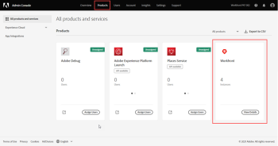
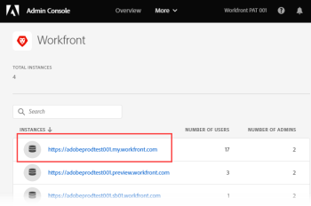
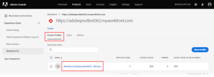
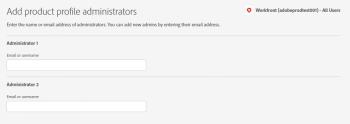

# Manage users in the Adobe Admin Console

>[!IMPORTANT]
>
>The functionality in this article is available only if your organization's instance of `Workfront` has been onboarded to the Adobe Business Platform.
>
>For a list of procedures that differ based on whether your organization has been onboarded to the Adobe Business Platform, see [Platform-based administration differences (Adobe Workfront/Adobe Business Platform)](../../../administration-and-setup/get-started-wf-administration/actions-in-admin-console.md).

As an Adobe administrator, you can create `Adobe Workfront` users and system administrators using the Adobe Admin Console. The console is a central location for managing the Adobe entitlements across your organization. For more information, see the [Admin Console Overview](https://helpx.adobe.com/enterprise/using/admin-console.html).

## Access requirements

You must have the following access to perform the steps in this article:

<table cellspacing="0"> 
 <col> 
 </col> 
 <col> 
 </col> 
 <tbody> 
  <tr> 
   <td role="rowheader">Adobe Workfront plan</td> 
   <td> 
Any
 </td> 
  </tr> 
  <tr> 
   <td role="rowheader">Adobe administrator rights</td> 
   <td> 
You must be a Product Configuration Administrator of Adobe products for your organization
 </td> 
  </tr> 
 </tbody> 
</table>

## Prerequisites

Before using the Admin Console for Workfront, you should receive a receive an email inviting you to the console.

1. If you are new to Adobe and you have received an email telling you that you now have administer rights to manage Adobe software and services for your organization, click the button in the email to create an Adobe account and open the Admin Console.

   Or

   If you already have an Adobe account, go to the [Adobe Admin Console page](https://adminconsole.adobe.com/).

## Access the user and admin area for your Production instance of Workfront

<ol> 
 <li value="1"> 
From the <a href="https://adminconsole.adobe.com/">Adobe Admin Console page</a>, select the <b>Products</b> tab in the top navigation bar, and then select the <b>Workfront</b> product tile.
 
  </img> 
 </li> 
 <li value="2"> 
In the list that displays, select the link at the top.
 
This is your Production instance where your users work. 
 
  </img> 
 
  
Tip: </b>">
   <b>Tip: </b> 
   
Your Preview instance, the second link in the list, is a testing environment that replicates your live Production environment. For more information, see <a href="../../../administration-and-setup/set-up-workfront/workfront-testing-environments/wf-preview-sandbox-environment.md" class="MCXref xref">The Adobe Workfront Preview Sandbox Environment</a>.
 
   
You might also see links to sandbox environments in the list. For more information, see <a href="../../../administration-and-setup/set-up-workfront/workfront-testing-environments/wf-preview-sandbox-environment.md" class="MCXref xref">The Adobe Workfront Preview Sandbox Environment</a>.
 
  
 </li> 
 <li value="3"> 
In the list that displays, with the Product Profiles tab selected, click the name of the Workfront Product Profile link. 
 
  
 
This list includes all users that are already assigned to your Production instance of Workfront. 
 <note type="important">
   Do not make any changes to the Product Profile itself.
  </note> </li> 
 <li value="4"> 
Continue on to one of the following sections in this article:
 
  <ul> 
   <li><a href="#create" class="MCXref xref">Create users in Workfront with the Adobe Admin Console</a> </li> 
   <li><a href="#create2" class="MCXref xref">Create system administrators in Workfront with the Adobe Admin Console</a> </li> 
  </ul> </li> 
</ol>

## Create users in `Workfront` with the Adobe Admin Console

<ol> 
 <li value="1">Go to the user and admin area in the Admin Console, as described in <a href="#access" class="MCXref xref">Access the user and admin area for your Production instance of Workfront</a> in this article.</li> 
 <li value="2"> 
With the Users tab selected above the list, select <b>Add User</b>.
 </li> 
 <li value="3"> 
In the <b>Add users to this product profile</b> box, enter the email address or name of a user you want to add, then select <b>Save</b>. 
 
The user is created in Workfront with the Requestor access level. 
 <note type="important">
   Do not make any changes to the Product Profile itself.
  </note> </li> 
 <li value="4"> 
In Workfront, change the user's access level.
 
For instructions on how a Workfront administrator can change the user's access level, see <a href="../../../administration-and-setup/add-users/create-and-manage-users/edit-a-users-profile.md" class="MCXref xref">Edit a user's profile</a>.
 </li> 
 <li value="5"> 
Repeat steps 3 and 4 to add more users.
 </li> 
</ol>

## Create system administrators in `Workfront` with the Adobe Admin Console

The System Administrator access level is granted only on the Adobe Admin Console. You cannot grant or remove admin access from within `Workfront`.

You must add a user to your Production instance of `Workfront` before you can make the user a `Workfront` system administrator. For instructions, see [Create users in Workfront with the Adobe Admin Console](#create) in this article.

<ol> 
 <li value="1">Go to the user and admin area in the Admin Console, as described in <a href="#access" class="MCXref xref">Access the user and admin area for your Production instance of Workfront</a> in this article.</li> 
 <li value="2"> 
Select the <b>Admins</b> tab above the list of users. 
 </li> 
 <li value="3"> 
Select <b>Add Admin</b>.
 </li> 
 <li value="4"> 
In the <b>Add product profile administrators</b> box, enter the email addresses or names of the administrators you want to add, then select <b>Save</b>. 
 
  
 
The system administrators are created in Workfront.
 <note type="important">
   Do not make any changes to the Product Profile itself.
  </note> </li> 
</ol>

## Additional details about the Adobe Admin Console:

<ul> 
 <li> 
Workfront System Administrators can deactivate a Workfront user from within Workfront, but this does not deactivate the user in the Admin Console.
 <!--
   For information about deactivating a user in Workfront, see
  --> </li> 
 <li> 
The user <b>Home Group</b> is determined based on the user who created them. This is currently not customizable from within the Admin Console.
 </li> 
 <li> 
The Workfront System Administrator access level can only be edited from within the Adobe Admin Console.
 </li> 
 <li> 
Editing a user who is a system admin to any other access level must be done through the Admin Console first. 
 </li> 
 <li> 
To remove System Administrator access from a user in Workfront, you need to use the Adobe Admin Console to remove the user as Product Profile Administrator. This changes the user's Workfront access level from System Administrator to Requestor.
 </li> 
 <li> <note type="important">
   Do not make any changes to the Product Profile itself.
  </note> </li> 
</ul>

<!--
You can create Adobe Workfront users and system administrators with the Adobe Admin Console. The console is a central location for managing the Adobe entitlements across your organization. For more information, see the Admin Console Overview. Before using the Admin Console for Workfront, you should receive a receive an email inviting you to the console. Click in the invitation to accept it and create an account. You can also use an existing account, if already available. Create users To create users in Workfront with the Admin Console: From the Admin Console page, select the Products tab and then select the Workfront product tile. Select the link to the Workfront instance you want to change. Select the Product profile link. This shows a list of the currently-assigned users. If the list is very long, you can also search for users in the search field above the list. Select the Add User button. In the Add users box, enter the email address or name of the user you want to add. Select Save. The administrator is created in Workfront with Requestor access level. Create system administrators To create system administrators: Make product profile assignments first. To be a Workfront System Administrator, the user must be assigned the Workfront product profile and be an admin for that product profile. From the console, select the Products tab and then select the Admins tab. Select Add Admin. In the Add product profile administrators box, enter the email address or name of the administrator you want to add. Select Save. The user is created in Workfront with Requestor access level. Additional details for the Admin Console: System Administrator access level is granted only on the Admin Console. You cannot grant or remove admin access from within Workfront. Creating and deleting users inside Workfront is only possible through the Admin Console. Workfront System Administrators can deactivate Workfront users from within Workfront, but this does not deactivate the user in the Admin Console. All new users are are assigned Requestor access level upon creation. Also, the user Home Group is determined based on the user who created them. This is currently not customizable from within the Admin Console. The Workfront System Administrator access level can only be edited from within the Adobe Admin Console. Editing a user who is a system admin to any other access level must be done through the Admin Console first. To remove Workfront system admin access, remove users as Product Profile Administrators. This action changes the user access level in Workfront from a system admin to a Requestor.
-->

