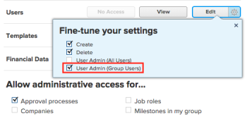

# Log in as another user {#log-in-as-another-user}

>[!IMPORTANT] {type="important"}
>
>The procedure described on this page applies only to organizations that have not yet been onboarded to the Adobe Business Platform. If your organization has been onboarded to the Adobe Business Platform, this action is not available.
>
>
>For a list of procedures that differ based on whether your organization has been onboarded to the Adobe Business Platform, see [Platform-based administration differences (Adobe Workfront/Adobe Business Platform)](actions-in-admin-console.md).

As the *`Adobe Workfront administrator`*, sometimes you might need to access *`Workfront`* on behalf of another user.

Or, as a *`group administrator`*, you might need to access *`Workfront`* on behalf of a user who is a member of a group you manage.

For example, if a task can’t progress until a user on vacation performs a certain action, you can log in as that user and perform the action instead.

>[!NOTE]
>
>Since a document integration may connect to private personal files, administrators can't access document integrations while logged in as another user.
>
>
>For more information on document integrations, see [Configure document integrations](configure-document-integrations.md)

## Access requirements {#access-requirements}

You must have the following to perform the steps in this article:

<table style="width: 100%;margin-left: 0;margin-right: auto;mc-table-style: url('../../../Resources/TableStyles/TableStyle-List-options-in-steps.css');" class="TableStyle-TableStyle-List-options-in-steps" cellspacing="0"> 
 <col class="TableStyle-TableStyle-List-options-in-steps-Column-Column1"> 
 <col class="TableStyle-TableStyle-List-options-in-steps-Column-Column2"> 
 <tbody> 
  <tr class="TableStyle-TableStyle-List-options-in-steps-Body-LightGray"> 
   <td class="TableStyle-TableStyle-List-options-in-steps-BodyE-Column1-LightGray" role="rowheader">Adobe Workfront plan</td> 
   <td class="TableStyle-TableStyle-List-options-in-steps-BodyD-Column2-LightGray"> 
Any
 </td> 
  </tr> 
  <tr class="TableStyle-TableStyle-List-options-in-steps-Body-MediumGray"> 
   <td class="TableStyle-TableStyle-List-options-in-steps-BodyE-Column1-MediumGray" role="rowheader">Adobe Workfront license</td> 
   <td class="TableStyle-TableStyle-List-options-in-steps-BodyD-Column2-MediumGray"> 
Plan 
 </td> 
  </tr> 
  <tr class="TableStyle-TableStyle-List-options-in-steps-Body-LightGray"> 
   <td class="TableStyle-TableStyle-List-options-in-steps-BodyB-Column1-LightGray" role="rowheader">Access level configurations</td> 
   <td class="TableStyle-TableStyle-List-options-in-steps-BodyA-Column2-LightGray"> 
With the System Administrator access level, you can log in as anyone. For information about this level of access, see <a href="grant-a-user-full-administrative-access.md" class="MCXref xref">Grant a user full administrative access</a>. 
 
With a Planner access level, you can log in as a user with a lower license level if the <b>Users</b> setting in the access level is configured to <b>Edit</b> access, with <b>Create</b> and at least 1 of the 2 <b>User Admin</b> options enabled under <b>Fine-tune your settings</b> . 
 
Note: Of these 2 options, if User <b>Admin (Group Users)</b> is enabled, you must be a group administrator of a group where the user is a member.
 
For more information about the <b>Users</b> setting in an access level, see <a href="grant-access-other-users.md" class="MCXref xref">Grant access to users</a>.
 </td> 
  </tr> 
 </tbody> 
</table>

## Log in and perform actions as another user {#log-in-and-perform-actions-as-another-user}

1.  Log in to *`Workfront`* as a *`Workfront administrator`* or a *`group administrator`*.

   >[!NOTE]
   >
   >
   >    
   >    
   >    *  If you are a *`group administrator`*, you can log in only as users in the groups you manage. Also, the User Admin (Group Users) permission must be enabled in your access level:
   >    
   >    
   >         >    
   >    

   >    
   >    
   >      This setting is disabled by default. For more information, see [Create or modify custom access levels](create-modify-access-levels.md).
   >    
   >    *  You cannot reset the password of a *`Workfront administrator`*.  

   >    
   >    

1. Click the `Main Menu` icon  in the upper-right corner of *`Adobe Workfront`*, then click `Setup` .  

1. In the left panel, click `Log in As`.  

1.  In the `Users` box on the `Log In As` tab, begin typing the name of the user, then click the name when it appears in the drop-down list.

   The user must have an access level defined in *`Workfront`*. You cannot log in to the *`Workfront`* system as a user who does not have rights to log in.

   >[!NOTE]
   >
   >*`Group administrators`* can log in only as the users who are members of the groups they manage. They cannot log in as a *`Workfront administrator`*.  

1.  Click `Log in.`

   When you are logged in as another user, a notification displays at the top of the screen to indicate this.

1. After you have performed the necessary actions as the user, click `Log Out.`

## Tracking and auditing activity while an administrator is logged in as another user {#tracking-and-auditing-activity-while-an-administrator-is-logged-in-as-another-user}

*`Workfront`* provides mechanisms for tracking and auditing activity that takes place while the administrator is logged in as another user.

When you log in as another user, the last login date is modified for that user to the date when the system or group administrator logs in as that user.

* [View indicators on items](#vieing-indicators-on-items) 
* [View audit information](#viewing-audit-information) 

### View indicators on items {#view-indicators-on-items}

When you log in to *`Workfront`* as another user and perform an action, *`Workfront`* clearly indicates that any action you perform is made by you on behalf of the user who you are logged in as.

For example, if you comment on an item while logged in as another user, the following icon is displayed next to your comment , along with a statement indicating that the comment was made by you on behalf of the user.

### View audit information {#view-audit-information}

1. Log in to *`Workfront`* as a *`Workfront administrator`* or *`group administrator`*.

1. Click the `Main Menu` icon  in the upper-right corner of *`Adobe Workfront`*, then click `Setup` .

1.  Click `Log in As,` then click the `Access Log` tab.

   Any time a system or *`group administrator`* logs in to *`Workfront`* as another user, the event is logged in the audit trail. In addition, any auditable actions that take place while the administrator is logged in as another user are logged in the audit trail.

1. (Optional) You can filter the results that are displayed in the audit trail in the following ways: 
    
    
    * By user who has logged in
    * By user who has been logged in as
    * By date 
    
    

