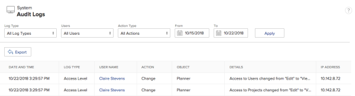

# Manage audit logs {#manage-audit-logs}

## View and filter audit logs {#view-and-filter-audit-logs}

1. Click the **Main Menu** icon  in the upper-right corner of `Workfront`, then click **Setup** ..

1.  In the left panel, click **System > Audit Logs**.  

1.   In the **Log Type** drop-down menu, select an audit log.  

   **All Log Types** is selected by default. 

1.   (Optional) Set any of the available filters.

   >[!NOTE]
   >
   >The options in the Action Type drop-down menu vary depending on the audit log selected.

1.  Click **Apply**. 
1.  (Optional) Click **Clear Filters** to reset changes made to the filters. 

## Export audit logs {#export-audit-logs}

1. <![CDATA[          ]]>Click the **Main Menu** icon  in the upper-right corner of `Workfront`, then click **Setup** ..  

1.  In the left panel, click **System > Audit Logs**.  

1.   In the **Log Type** drop-down menu, select an audit log.

   <![CDATA[ ]]>**All Log Types** is selected by default. 

1.   Set any of the available filters, then click **Apply**.

   >[!IMPORTANT] {type="important"}
   >
   >You can’t export more than 50,000 logs at one time. `Workfront` exports logs based on the filters you set, not the number of logs showing on the page. You can view the total number of filtered logs in the bottom-right corner of the page.

1.  Click **Export**.  
     

