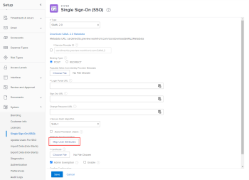
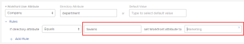

# Map user attributes and auto-provision new users {#map-user-attributes-and-auto-provision-new-users}

Using single sign-on (SSO), you can pass attributes from your identity provider’s Active Directory to your *`Adobe Workfront`* users. You can also add new users to *`Workfront`* using the Auto-Provision option (also called Just In Time Provisioning or JIT).

## Access requirements {#access-requirements}

You must have the following to perform the steps in this article:

<table style="width: 100%;margin-left: 0;margin-right: auto;mc-table-style: url('../../../Resources/TableStyles/TableStyle-List-options-in-steps.css');" class="TableStyle-TableStyle-List-options-in-steps" cellspacing="0"> 
 <col class="TableStyle-TableStyle-List-options-in-steps-Column-Column1"> 
 <col class="TableStyle-TableStyle-List-options-in-steps-Column-Column2"> 
 <tbody> 
  <tr class="TableStyle-TableStyle-List-options-in-steps-Body-LightGray"> 
   <td class="TableStyle-TableStyle-List-options-in-steps-BodyE-Column1-LightGray" role="rowheader">Adobe Workfront plan</td> 
   <td class="TableStyle-TableStyle-List-options-in-steps-BodyD-Column2-LightGray"> 
Any
 </td> 
  </tr> 
  <tr class="TableStyle-TableStyle-List-options-in-steps-Body-MediumGray"> 
   <td class="TableStyle-TableStyle-List-options-in-steps-BodyE-Column1-MediumGray" role="rowheader">Adobe Workfront license</td> 
   <td class="TableStyle-TableStyle-List-options-in-steps-BodyD-Column2-MediumGray"> 
Plan 
 </td> 
  </tr> 
  <tr class="TableStyle-TableStyle-List-options-in-steps-Body-LightGray"> 
   <td class="TableStyle-TableStyle-List-options-in-steps-BodyB-Column1-LightGray" role="rowheader">Access level configurations</td> 
   <td class="TableStyle-TableStyle-List-options-in-steps-BodyA-Column2-LightGray"> 
You must be a Workfront administrator. For more information, see <a href="grant-a-user-full-administrative-access.md" class="MCXref xref">Grant a user full administrative access</a>.
 
Note: If you still don't have access, ask your Workfront administrator if they set additional restrictions in your access level. For information on how a Workfront administrator can modify your access level, see <a href="create-modify-access-levels.md" class="MCXref xref">Create or modify custom access levels</a>.
 </td> 
  </tr> 
 </tbody> 
</table>

## Tips for mapping attributes {#tips-for-mapping-attributes}

Keep the following in mind when mapping attributes:

* Always test in a Preview sandbox or a Customer Refresh (CR) sandbox.
* Test with both administrator and non-administrator accounts to confirm that you are mapping attributes correctly.
* Attributes are mapped every time a user signs into Workfront via SSO, not just during Auto-Provisioning.

## Map user attributes and auto-provision new users {#map-user-attributes-and-auto-provision-new-users-1}

1. Click the `Main Menu` icon  in the upper-right corner of *`Adobe Workfront`*, then click `Setup` .

1. Click `System` > `Single Sign-On (SSO)`.

1. In the `Type` drop-down, click `SAML 2.0`.

1.   Click `Map User Attributes`.

   

1.  (Optional) If you want *`Workfront`* to create new users from your Active Directory automatically, click `Auto-Provision User`.

   This feature requires attribute mapping.

1.  In the row of options that appears, map the attributes you need for your *`Workfront`* users.

   You can map attributes such as Address, Manager, Job Role, Home Group, and so on.

   Attribute mappings work on a 1:1 Ratio. For example, you cannot set every group that a user belongs to; you can set only one per user.

   >[!IMPORTANT] {type="important"}
   >
   >
   >    
   >    
   >    * The following attributes are required for each user:   >    
   >        
   >        
   >        * First Name
   >        * Last Name
   >        * Email Address
   >        
   >        
   >    * We do not recommend mapping Access Levels in the Attribute Mappings. If you do, be careful when you are setting the default value to make sure that you don't remove Admin Access inadvertently.
   >    
   >    

   The following table explains the fields you can use to map attributes:

<table style="width: 100%;margin-left: 0;margin-right: auto;mc-table-style: url('../../../Resources/TableStyles/TableStyle-List-options-in-steps.css');" class="TableStyle-TableStyle-List-options-in-steps" cellspacing="0"> 
 <col class="TableStyle-TableStyle-List-options-in-steps-Column-Column1" data-mc-conditions=""> 
 <col class="TableStyle-TableStyle-List-options-in-steps-Column-Column2" data-mc-conditions=""> 
 <tbody> 
  <tr class="TableStyle-TableStyle-List-options-in-steps-Body-LightGray"> 
   <td class="TableStyle-TableStyle-List-options-in-steps-BodyE-Column1-LightGray" role="rowheader">Workfront User Attribute</td> 
   <td class="TableStyle-TableStyle-List-options-in-steps-BodyD-Column2-LightGray">Choose the name of the attribute you are mapping</td> 
  </tr> 
  <tr class="TableStyle-TableStyle-List-options-in-steps-Body-MediumGray"> 
   <td class="TableStyle-TableStyle-List-options-in-steps-BodyE-Column1-MediumGray" role="rowheader">Directory Attribute</td> 
   <td class="TableStyle-TableStyle-List-options-in-steps-BodyD-Column2-MediumGray">Type the SSO attribute label you want to use.</td> 
  </tr> 
  <tr class="TableStyle-TableStyle-List-options-in-steps-Body-LightGray"> 
   <td class="TableStyle-TableStyle-List-options-in-steps-BodyB-Column1-LightGray" role="rowheader">Default Value</td> 
   <td class="TableStyle-TableStyle-List-options-in-steps-BodyA-Column2-LightGray"> 
After you choose a Workfront User Attribute, if the value is NULL during the connection, this field fills in with the corresponding default value in the system. Type a value here only if you plan to apply attribute mapping rules (see step 7). The default value acts as an exception to those rules. 
 </td> 
  </tr> 
 </tbody> 
</table>

1.  (Optional) Click `Rules` to add a rule to the attribute.

    
    
    1. In the drop-down, choose the attribute modifier you want to use.
    1.  In the 2 fields to the right, type the directory attribute value and the value you want to replace it with.
    
    
           
    

    
    
    
   You can click `Add Rule` to add more rules to the attribute.

1. (Optional) To map more user attributes, click `Add Mapping` and repeat steps 6-7.
1. Click `Save`.

