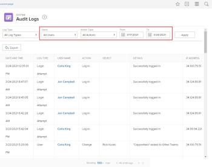

# View and export audit logs {#view-and-export-audit-logs}

You can view all audit logs in the system, or those that meet certain filtering criteria. You can also export audit logs.

For information about all the audit log types and what generates them, see [Audit logs](audit-logs.md).

## Access requirements {#access-requirements}

You must have the following to perform the steps in this article:

<table style="width: 100%;margin-left: 0;margin-right: auto;mc-table-style: url('../../../Resources/TableStyles/TableStyle-List-options-in-steps.css');" class="TableStyle-TableStyle-List-options-in-steps" cellspacing="0"> 
 <col class="TableStyle-TableStyle-List-options-in-steps-Column-Column1"> 
 <col class="TableStyle-TableStyle-List-options-in-steps-Column-Column2"> 
 <tbody> 
  <tr class="TableStyle-TableStyle-List-options-in-steps-Body-LightGray"> 
   <td class="TableStyle-TableStyle-List-options-in-steps-BodyE-Column1-LightGray" role="rowheader">Adobe Workfront plan</td> 
   <td class="TableStyle-TableStyle-List-options-in-steps-BodyD-Column2-LightGray"> 
Any
 </td> 
  </tr> 
  <tr class="TableStyle-TableStyle-List-options-in-steps-Body-MediumGray"> 
   <td class="TableStyle-TableStyle-List-options-in-steps-BodyB-Column1-MediumGray" role="rowheader">Adobe Workfront license</td> 
   <td class="TableStyle-TableStyle-List-options-in-steps-BodyA-Column2-MediumGray"> 
Plan 
 
You must be a Workfront administrator.
 </td> 
  </tr> 
 </tbody> 
</table>

## View audit logs {#view-audit-logs}

1. Click the `Main Menu` icon  in the upper-right corner of *`Adobe Workfront`*, then click `Setup` .

1.  In the left panel, click `System > Audit Logs`.
1.   In the `Log Type` drop-down menu, select the type of audit log you want to view.  

   `All Log Types` is selected by default. 

   For a list of all the audit log types you can view and the information they include, see [Audit logs](audit-logs.md).

1.   (Optional) Set any of the available filters.

   >[!NOTE]
   >
   >The options in the Action Type drop-down menu vary depending on the audit log selected.

   <![CDATA[      ]]>  

1. Click `Apply`.
1. (Optional) Click `Clear Filters` to reset changes made to the filters.

## Export audit logs {#export-audit-logs}

1. Click the `Main Menu` icon  in the upper-right corner of *`Adobe Workfront`*, then click `Setup` .  

1.  In the left panel, click `System > Audit Logs`.  

1.   In the `Log Type` drop-down menu, select an audit log.

   `All Log Types` is selected by default.

1.   Set any of the available filters, then click `Apply`.

   >[!IMPORTANT] {type="important"}
   >
   >You can’t export more than 50,000 logs at one time. *`Workfront`* exports logs based on the filters you set, not the number of logs showing on the page. You can view the total number of filtered logs in the bottom-right corner of the page.

1.  Click `Export`.

