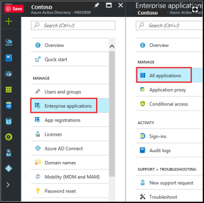
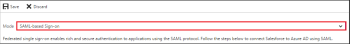
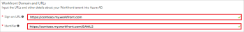
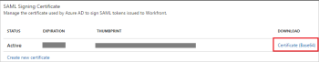
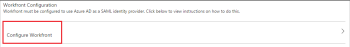

# Configure *`Adobe Workfront`* with Azure Active Directory {#configure-adobe-workfront-with-azure-active-directory}

>[!IMPORTANT] {type="important"}
>
>The procedure described on this page applies only to organizations that are not yet onboarded to the Adobe Business Platform.
>
>
>If your organization has been onboarded to the Adobe Business Platform, Single Sign-On (SSO) is handled automatically as part of that integration. You do not need to configure or enable this functionality.
>
>
>For a list of procedures that differ based on whether your organization is migrated to Adobe IMS, see [Platform-based administration differences (Adobe Workfront/Adobe Business Platform)](actions-in-admin-console.md).

*`Adobe Workfront`* single sign-on (SSO) supports the integration with Azure Active Directory. You configure *`Workfront`* SSO with Azure Active Directory using the Security Assertion Markup Language (SAML) 2.0 option in *`Workfront`*.

##  

## Access requirements {#access-requirements}

You must have the following to perform the steps in this article:

<table style="width: 100%;margin-left: 0;margin-right: auto;mc-table-style: url('../../../Resources/TableStyles/TableStyle-List-options-in-steps.css');" class="TableStyle-TableStyle-List-options-in-steps" cellspacing="0"> 
 <col class="TableStyle-TableStyle-List-options-in-steps-Column-Column1"> 
 <col class="TableStyle-TableStyle-List-options-in-steps-Column-Column2"> 
 <tbody> 
  <tr class="TableStyle-TableStyle-List-options-in-steps-Body-LightGray"> 
   <td class="TableStyle-TableStyle-List-options-in-steps-BodyE-Column1-LightGray" role="rowheader">Adobe Workfront plan</td> 
   <td class="TableStyle-TableStyle-List-options-in-steps-BodyD-Column2-LightGray"> 
Any
 </td> 
  </tr> 
  <tr class="TableStyle-TableStyle-List-options-in-steps-Body-MediumGray"> 
   <td class="TableStyle-TableStyle-List-options-in-steps-BodyE-Column1-MediumGray" role="rowheader">Adobe Workfront license</td> 
   <td class="TableStyle-TableStyle-List-options-in-steps-BodyD-Column2-MediumGray"> 
Plan 
 </td> 
  </tr> 
  <tr class="TableStyle-TableStyle-List-options-in-steps-Body-LightGray"> 
   <td class="TableStyle-TableStyle-List-options-in-steps-BodyB-Column1-LightGray" role="rowheader">Access level configurations</td> 
   <td class="TableStyle-TableStyle-List-options-in-steps-BodyA-Column2-LightGray"> 
You must be a Workfront administrator. For more information, see <a href="grant-a-user-full-administrative-access.md" class="MCXref xref">Grant a user full administrative access</a>.
 
Note: If you still don't have access, ask your Workfront administrator if they set additional restrictions in your access level. For information on how a Workfront administrator can modify your access level, see <a href="create-modify-access-levels.md" class="MCXref xref">Create or modify custom access levels</a>.
 </td> 
  </tr> 
 </tbody> 
</table>

## Prerequisites {#prerequisites}

To configure *`Workfront`* Single Sign-On with Azure Active Directory, you need the following items:

* An Azure Active Directory subscription
* A *`Workfront`* subscription enabled for using Single Sign-On integrations
* An Azure Active Directory system administrator
* A *`Workfront administrator`*

>[!NOTE]
>
>*`Workfront`* is not responsible for setting up and troubleshooting your Azure Active Directory configuration. You must have an in-house system administrator that manages that part of the integration, in addition to a *`Workfront administrator`*.

## Add *`Workfront`* from the Azure Gallery {#add-workfront-from-the-azure-gallery}

To configure the integration of *`Workfront`* SSO with Azure Active Directory, you need to add *`Workfront`* from the Azure gallery to your list of managed SaaS apps.

1. Go to the following URL to access the `Azure Portal`: [https://portal.azure.com/](https://portal.azure.com/) 

1.  In the `Azure Portal`, on the left navigation panel, click the `Azure Active Directory` icon.

   

1.  Navigate to `Enterprise applications`. Then go to `All applications`.

   

1.  To add a new application, click the `New application` button on the top of the dialog.

   

1.  In the search box, type ` *`Workfront`*`.

   

1. In the results panel, select ` *`Workfront`*`, and then click `Add` button to add the application.

## Configure Azure Active Directory single sign-on {#configure-azure-active-directory-single-sign-on}

1.  In the Azure Portal, on the ` *`Workfront`*` application integration page, click `Single sign-on`.
1.  On the `Single sign-on` dialog box, select `Mode` as `SAML-based Sign-on` to enable Single Sign-On.

   

1.  In the ` *`Workfront`* Domain and URLs` section, specify the following information:  
   - `Sign-on URL`: your *`Workfront`* URL using the following pattern: https://<companyname>.my.workfront.com  
   - `Identifier`: your *`Workfront`* SAML 2.0 URL using the following pattern: https://<companyname>.my.workfront.com/SAML2

   

1.  In the `SAML Signing Certificate` section, click `Certificate(Base64)` and then save the Certificate file on your computer.

   

1.  Click `Save`.
1.  In the ` *`Workfront`* Configuration` section, click `Configure *`Workfront`*` to open `Configure sign-on` window.
1.  Copy the `Sign-Out URL`and `SAML Single Sign-On Service URL` from the `Quick Reference`section.

   

## Configure *`Workfront`* with Azure Active Directory {#configure-workfront-with-azure-active-directory}

1. Log in to *`Workfront`* as a *`Workfront administrator`*.

1. Click the `Main Menu` icon  in the upper-right corner of *`Adobe Workfront`*, then click `Setup` .  

1. At the bottom of the left panel, click `System` > `Single Sign-On (SSO)`.

1. Click the `Type` box, then click `SAML 2.0`. 

1.  Select the check box next to `Service Provider ID`, then specify that ID ``using the following format:

   https://<companyname>.my.workfront.com/SAML2

1. Paste the `SAML Single Sign-On Service URL` into the `Login Portal URL` field.

1. Paste the `Single Sign-Out URL` into the `Sign-Out URL` field.

1. Specify the `Change Password URL`.
1. Click `Save`.

