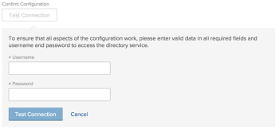

# Configure *`Adobe Workfront`* with LDAP {#configure-adobe-workfront-with-ldap}

>[!IMPORTANT] {type="important"}
>
>The procedure described on this page applies only to organizations that are not yet onboarded to the Adobe Business Platform.
>
>
>If your organization has been onboarded to the Adobe Business Platform, Single Sign-On (SSO) is handled automatically as part of that integration. You do not need to configure or enable this functionality.
>
>
>For a list of procedures that differ based on whether your organization is migrated to Adobe IMS, see [Platform-based administration differences (Adobe Workfront/Adobe Business Platform)](actions-in-admin-console.md).

>[!IMPORTANT] {type="important"}
>
>Lightweight Directory Access Protocol (LDAP) is now supported only in a limited capacity as a single sign-on (SSO) option; it will be removed from the product in 2020. We recommend moving to Security Assertion Markup Language (SAML) 2.0. For more information, see [Configure Adobe Workfront with SAML 2.0](configure-workfront-saml-2.md).

## Access requirements {#access-requirements}

You must have the following to perform the steps in this article:

<table style="width: 100%;margin-left: 0;margin-right: auto;mc-table-style: url('../../../Resources/TableStyles/TableStyle-List-options-in-steps.css');" class="TableStyle-TableStyle-List-options-in-steps" cellspacing="0"> 
 <col class="TableStyle-TableStyle-List-options-in-steps-Column-Column1"> 
 <col class="TableStyle-TableStyle-List-options-in-steps-Column-Column2"> 
 <tbody> 
  <tr class="TableStyle-TableStyle-List-options-in-steps-Body-LightGray"> 
   <td class="TableStyle-TableStyle-List-options-in-steps-BodyE-Column1-LightGray" role="rowheader">Adobe Workfront plan</td> 
   <td class="TableStyle-TableStyle-List-options-in-steps-BodyD-Column2-LightGray"> 
Any
 </td> 
  </tr> 
  <tr class="TableStyle-TableStyle-List-options-in-steps-Body-MediumGray"> 
   <td class="TableStyle-TableStyle-List-options-in-steps-BodyE-Column1-MediumGray" role="rowheader">Adobe Workfront license</td> 
   <td class="TableStyle-TableStyle-List-options-in-steps-BodyD-Column2-MediumGray"> 
Plan 
 </td> 
  </tr> 
  <tr class="TableStyle-TableStyle-List-options-in-steps-Body-LightGray"> 
   <td class="TableStyle-TableStyle-List-options-in-steps-BodyB-Column1-LightGray" role="rowheader">Access level configurations</td> 
   <td class="TableStyle-TableStyle-List-options-in-steps-BodyA-Column2-LightGray"> 
You must be a Workfront administrator. For more information, see <a href="grant-a-user-full-administrative-access.md" class="MCXref xref">Grant a user full administrative access</a>.
 
Note: If you still don't have access, ask your Workfront administrator if they set additional restrictions in your access level. For information on how a Workfront administrator can modify your access level, see <a href="create-modify-access-levels.md" class="MCXref xref">Create or modify custom access levels</a>.
 </td> 
  </tr> 
 </tbody> 
</table>

## Connect *`Adobe Workfront`* with an LDAP Directory Server {#connect-adobe-workfront-with-an-ldap-directory-server}

1. Click the `Main Menu` icon  in the upper-right corner of *`Adobe Workfront`*, then click `Setup` .

1. In the left panel, click `System` > `Single Sign-On (SSO)`.

1. In the `Type` drop-down list, click `LDAP`.

1.  Specify the following information:

<table style="width: 100%;margin-left: 0;margin-right: auto;mc-table-style: url('../../../Resources/TableStyles/TableStyle-List-options-in-steps.css');" class="TableStyle-TableStyle-List-options-in-steps" cellspacing="0"> 
 <col class="TableStyle-TableStyle-List-options-in-steps-Column-Column1"> 
 <col class="TableStyle-TableStyle-List-options-in-steps-Column-Column2"> 
 <tbody> 
  <tr class="TableStyle-TableStyle-List-options-in-steps-Body-LightGray"> 
   <td class="TableStyle-TableStyle-List-options-in-steps-BodyE-Column1-LightGray" role="rowheader">Server</td> 
   <td class="TableStyle-TableStyle-List-options-in-steps-BodyD-Column2-LightGray"> 
The URL of the LDAP server where your directory service is running.
 
For example, <a class="external" title="ldap://hostname.com" href="ldap://hostname.com">ldap://hostname.com</a>. Or, if the LDAP server requires an SSL connection, <a class="external" title="ldaps://hostname.com" href="ldaps://hostname.com">ldaps://hostname.com</a>.
 </td> 
  </tr> 
  <tr class="TableStyle-TableStyle-List-options-in-steps-Body-MediumGray"> 
   <td class="TableStyle-TableStyle-List-options-in-steps-BodyE-Column1-MediumGray" role="rowheader">Port</td> 
   <td class="TableStyle-TableStyle-List-options-in-steps-BodyD-Column2-MediumGray">The port number used for LDAP communication. The default port number for non-secure LDAP connections is 389. The default port number for secure LDAP connections (LDAPS) is 636.</td> 
  </tr> 
  <tr class="TableStyle-TableStyle-List-options-in-steps-Body-LightGray"> 
   <td class="TableStyle-TableStyle-List-options-in-steps-BodyE-Column1-LightGray" role="rowheader">Search Base</td> 
   <td class="TableStyle-TableStyle-List-options-in-steps-BodyD-Column2-LightGray">Specify where in the LDAP directory tree Workfront should find and synchronize initial user information from User objects. This is the container where Workfront begins searching for users on the LDAP server. Use the following format: ou=people,dc=example,dc=com</td> 
  </tr> 
  <tr class="TableStyle-TableStyle-List-options-in-steps-Body-MediumGray"> 
   <td class="TableStyle-TableStyle-List-options-in-steps-BodyE-Column1-MediumGray" role="rowheader">SSL/TLS</td> 
   <td class="TableStyle-TableStyle-List-options-in-steps-BodyD-Column2-MediumGray">Select this option to encrypt communication between the LDAP server and Workfront. This option is enforced for all OnDemand accounts.</td> 
  </tr> 
  <tr class="TableStyle-TableStyle-List-options-in-steps-Body-LightGray"> 
   <td class="TableStyle-TableStyle-List-options-in-steps-BodyE-Column1-LightGray" role="rowheader">Auto-Provision Users</td> 
   <td class="TableStyle-TableStyle-List-options-in-steps-BodyD-Column2-LightGray">When this option is enabled, Workfront automatically creates a user in the system when a new user with an LDAP username and password attempts to log in to Workfront for the first time. In order for users to be created in Workfront, you need to map Workfront data attributes with the LDAP data attributes.</td> 
  </tr> 
  <tr class="TableStyle-TableStyle-List-options-in-steps-Body-MediumGray"> 
   <td class="TableStyle-TableStyle-List-options-in-steps-BodyE-Column1-MediumGray" role="rowheader">Attribute Synchronization</td> 
   <td class="TableStyle-TableStyle-List-options-in-steps-BodyD-Column2-MediumGray">Click Map User Attributes, select the Workfront User Attribute that you want to map from the drop-down list, then specify the corresponding Directory Attribute in the Active Directory server. You can also specify a Default Value for the attribute if you want one to be set. Click Add Mapping to include additional attributes, then click Save when you are finished.
Important:  Workfront attempts to map these attributes every time a user with these attributes logs into the system. If you have existing users in the system, make sure you are not overwriting their current access level, or any other attributes, by applying this mapping. 

You can map the following Workfront attributes:

    <ul>
     <li>Access Level</li>
     <li>Address</li>
     <li>Address2</li>
     <li>Billing Per Hour</li>
     <li>City</li>
     <li>Company</li>
     <li>Cost Per Hour</li>
     <li>Email Address</li>
     <li>Extension</li>
     <li>First Name</li>
     <li>Home Group</li>
     <li>Home Team</li>
     <li>Job Role</li>
     <li>Last Name</li>
     <li>Layout Template</li>
     <li>Manager</li>
     <li>Mobile Phone</li>
     <li>Phone Number</li>
     <li>Postal Code</li>
     <li>Schedule</li>
     <li>State</li>
     <li>Timesheet Profile</li>
     <li>Title</li>
    </ul>
If a user attempts to log in without using SSO and was created using auto-provisioning, it will appear that the their login is not working, or that their username/password combination is wrong. The user will either need to log in using their email address and Workfront password, or obtain the correct credentials for logging in using LDAP.
</td> 
  </tr> 
  <tr class="TableStyle-TableStyle-List-options-in-steps-Body-LightGray"> 
   <td class="TableStyle-TableStyle-List-options-in-steps-BodyE-Column1-LightGray" role="rowheader">Change Password URL</td> 
   <td class="TableStyle-TableStyle-List-options-in-steps-BodyD-Column2-LightGray">Specify a URL that will take users to a site where they can reset their user name or password. This URL is used when Workfront users attempt to change their password through the Workfront interface. Because the LDAP credentials are used to access Workfront, users need to be redirected to a page where they can change their LDAP password instead of completing this activity through Workfront.</td> 
  </tr> 
  <tr class="TableStyle-TableStyle-List-options-in-steps-Body-MediumGray"> 
   <td class="TableStyle-TableStyle-List-options-in-steps-BodyE-Column1-MediumGray" role="rowheader">Certificate</td> 
   <td class="TableStyle-TableStyle-List-options-in-steps-BodyD-Column2-MediumGray">If SSL/TLS is selected, you must upload a valid SSL certificate to ensure a secure connection between the directory service and Workfront. For OnDemand accounts, a certificate is always required. You obtain this certificate from your LDAP system administrator. Detailed instructions on installing a valid certificate for LDAPS on LDAP can be found from Microsoft.</td> 
  </tr> 
  <tr class="TableStyle-TableStyle-List-options-in-steps-Body-LightGray"> 
   <td class="TableStyle-TableStyle-List-options-in-steps-BodyE-Column1-LightGray" role="rowheader">Admin Exemption</td> 
   <td class="TableStyle-TableStyle-List-options-in-steps-BodyD-Column2-LightGray">Select this option to allow system administrators to access Workfront via the native Workfront login screen with Workfront login credentials. If this option is not selected, Workfront administrators must use their LDAP user name and password.
Workfront first attempts to log in to Workfront via LDAP for users with the Workfront System Administrator access level. If the LDAP authentication fails, Workfront uses local authentication for Workfront administrators.

We recommend that you always have this option selected, to provide your Workfront administrator a way for logging into Workfront in the event that your LDAP server is temporarily unavailable.
</td> 
  </tr> 
  <tr class="TableStyle-TableStyle-List-options-in-steps-Body-MediumGray"> 
   <td class="TableStyle-TableStyle-List-options-in-steps-BodyE-Column1-MediumGray" role="rowheader">Enable</td> 
   <td class="TableStyle-TableStyle-List-options-in-steps-BodyD-Column2-MediumGray">Select this option to activate SSO on the Workfront system. Ensure that you have communicated login instructions to your users.
After you enable your SSO configuration in Workfront, you must update users for SSO to enable the Only Allow LDAP Authentication setting for all users.

For more information about updating users for SSO, see <a href="update-users-SSO.md" class="MCXref xref">Update users for single sign-on</a>.

For more information about user settings, see <a href="edit-a-users-profile.md" class="MCXref xref">Edit a user's profile</a>.
</td> 
  </tr> 
  <tr class="TableStyle-TableStyle-List-options-in-steps-Body-LightGray"> 
   <td class="TableStyle-TableStyle-List-options-in-steps-BodyB-Column1-LightGray" role="rowheader">Confirm Configuration</td> 
   <td class="TableStyle-TableStyle-List-options-in-steps-BodyA-Column2-LightGray">Verify that your Workfront account can connect to the LDAP server using the connection information and credentials provided.
Click Test Connection, then specify the Username and Password for accessing the directory service, then click Test Connection.

You should receive an on-screen notification that the connection was successful.
</td> 
  </tr> 
 </tbody> 
</table>

1. Click `Save` to save the LDAP configuration.

