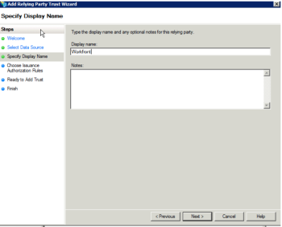
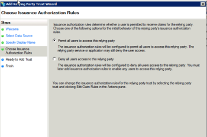
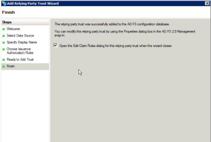
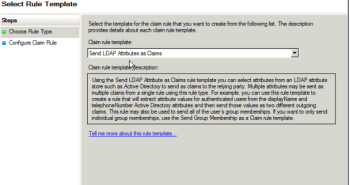
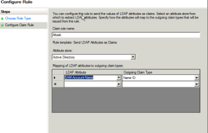
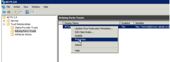
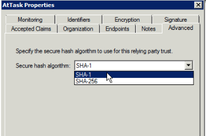
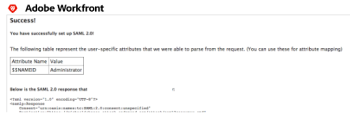

# Configure Adobe Workfront with SAML 2.0 using ADFS

>[!IMPORTANT]
>
>The procedure described on this page applies only to organizations that are not yet onboarded to the Adobe Admin Console.
>
>If your organization has been onboarded to the Adobe Admin Console, see [Platform-based administration differences (Adobe Workfront/Adobe Business Platform)](../../../administration-and-setup/get-started-wf-administration/actions-in-admin-console.md).

As an Adobe Workfront administrator, you can integrate Workfront with a Security Assertion Markup Language (SAML) 2.0 solution for single sign-on while using Active Directory Federation Services (ADFS).

This guide focuses on setting up ADFS without auto provisioning or attribute mappings. We recommend that you complete the setup and test it prior to setting up any auto provisioning.

>[!NOTE]
>
>This is not available if your organization’s Workfront instance is enabled with Adobe IMS. See your network or IT administrator if you need more information.

## Access requirements

You must have the following to perform the steps in this article:

<table cellspacing="0"> 
 <col> 
 <col> 
 <tbody> 
  <tr> 
   <td role="rowheader">Adobe Workfront plan</td> 
   <td> 
Any
 </td> 
  </tr> 
  <tr> 
   <td role="rowheader">Adobe Workfront license</td> 
   <td> 
Plan 
 </td> 
  </tr> 
  <tr> 
   <td role="rowheader">Access level configurations</td> 
   <td> 
You must be a Workfront administrator. For more information, see <a href="../../../administration-and-setup/add-users/configure-and-grant-access/grant-a-user-full-administrative-access.md" class="MCXref xref">Grant a user full administrative access</a>.
 
Note: If you still don't have access, ask your Workfront administrator if they set additional restrictions in your access level. For information on how a Workfront administrator can modify your access level, see <a href="../../../administration-and-setup/add-users/configure-and-grant-access/create-modify-access-levels.md" class="MCXref xref">Create or modify custom access levels</a>.
 </td> 
  </tr> 
 </tbody> 
</table>

## Enable authentication to Workfront with SAML 2.0

To enable authentication to the Workfront web application and the Workfront mobile application with SAML 2.0, complete the following sections:

* [Retrieve the Workfront SSO metadata file](#retrieving-workfront-metatdata) 
* [Configure Relying Party Trusts](#configuring-relying-party-trusts) 
* [Configure Claim Rules](#configuring-claim-rules) 
* [Upload the metadata file and test the connection](#uploading-metadata-file)

### Retrieve the Workfront SSO metadata file

<ol> 
 <li value="1">Click the Main Menu icon  in the upper-right corner of Adobe Workfront, then click Setup .</li> 
 <li value="2">In the left panel, click System > Single Sign-On (SSO).</li> 
 <li value="3"> 
In the Type drop-down menu, click SAML 2.0 to display additional information and options. 
 </li> 
 <li value="4">Copy the URL that displays after Metadata URL. </li> 
 <li value="5">Continue to the following section, <a href="#configuring-relying-party-trusts" class="MCXref xref">Configure Relying Party Trusts</a>.</li> 
</ol>

### Configure Relying Party Trusts

<ol> 
 <li value="1">Open the ADFS Manager using the Windows server 2008 R2 (version may vary).</li> 
 <li value="2">Go to Start.</li> 
 <li value="3">Click Administration Tools.</li> 
 <li value="4">Click ADFS 2.0 Management.</li> 
 <li value="5">Select ADFS and expand Trust Relationships.</li> 
 <li value="6"> 
Right-click Relying Party Trusts, then select Add Relying Party Trust to launch the Add Relying Party Trust Wizard.
 
  
 </li> 
 <li value="7"> 
From the Welcome Page, select Start. 
 </li> 
 <li value="8">In the Select Date Source section, paste the metadata URL from Workfront.</li> 
 <li value="9"> 
Click Next.
 </li> 
 <li value="10"> 
Click OK to acknowledge the warning message. 
 
This opens the Specify Display Name section.
 </li> 
 <li value="11"> 
Add a Display Name and Notes to distinguish the Trust, then click Next. 
 
  
 </li> 
 <li value="12"> 
Select Permit all user to access this relying party (Or None if you want to configure this later). 
 
  
 </li> 
 <li value="13"> 
Click Next. 
 
This takes you to the Ready to Add Trust section.
 </li> 
 <li value="14">Continue to the following section <a href="#configuring-claim-rules" class="MCXref xref">Configure Claim Rules</a>.</li> 
</ol>

### Configure Claim Rules

<ol> 
 
 <li> 
Click Next in the <b>Ready to Add Trust</b> section, then ensure that the Open the Edit Claim Rules dialog box option is selected.
 
This will allow you to edit Claim Rules in a future step. 
 </li> <li>Click Close.</li> <li>Click Add Rule.</li> <li> 
Select Send LDAP Attribute as Claims.
 
  
 </li> <li>Click Next to display the Configure Claim Rule step. </li> <li> 
Specify the following minimum requirements to configure the claim rule: (This will go in the Federation ID on the user setup and is used to distinguish who is logging in.)
 
   <table cellspacing="0"> 
    <col> 
    <col> 
    <tbody> 
     <tr> 
      <td role="rowheader">Claim rule name: </td> 
      <td>Specify a name for the claim rule. For example, "Workfront."</td> 
     </tr> 
     <tr> 
      <td role="rowheader">Attribute store</td> 
      <td>Select Active Directory from the drop-down menu.</td> 
     </tr> 
     <tr> 
      <td role="rowheader">LDAP Attribute</td> 
      <td>This can be any type of attribute. We recommend using SAM-Account-Name for this attribute.</td> 
     </tr> 
     <tr> 
      <td role="rowheader">Outgoing Claim Type</td> 
      <td>You must select Name ID as the outgoing claim type</td> 
     </tr> 
    </tbody> 
   </table> </li> <li> 
 (Optional) In order to establish auto provisioning, add the following additional claims in both the LDAP Attribute and Outgoing Claim Type:
 
   <ul> 
    <li style="font-weight: normal;"> Given Name</li> 
    <li style="font-weight: normal;">Surname </li> 
    <li style="font-weight: normal;">E-Mail Address </li> 
   </ul> </li> <li>Click Finish, then click OK on the next screen.</li> <li> 
Right-click the new Relying Party Trust, then select Properties.
 
  
 </li> <li>Select the Advanced Tab. And under Secure Hash Algorithm select SHA-1 or SHA-256.</li> 
 
</ol>

>[!NOTE]
>
>What you select under Secure Hash Algorithm here must match the Secure Hash Algorithm field in Workfront under Setup > System > Single Sign-ON (SSO).

11. Continue to the following section [Upload the metadata file and test the connection](#uploading-metadata-file).

### Upload the metadata file and test the connection

<ol> 
 <li value="1"> 
Open a browser and navigate to https://<i><yourserver></i>/FederationMetadata/2007-06/FederationMetadata.xml.  
 
This should download a Metadata file FederationMetadata.xml file.
 </li> 
 <li value="2">Click Choose File under Populate fields from Identity Provider Metadata, and select the FederationMetadata.xml file.</li> 
 <li value="3">(Optional) If the certificate information did not populate with the metadata file, you can upload a file separately. Select Choose File in the Certificate section.</li> 
 <li value="4"> 
Click Test Connection. If set up correctly, you should see a page similar to the one shown below: 
 
  
 <note type="note">
   If you want to set up attribute mapping, ensure that you copy the attributes from the Test Connection into the Directory Attribute. For more information, see Mapping User Attributes.
    
  </note> </li> 
 <li value="5"> 
Select Admin Exemption to allow Workfront administrators to log in using Workfront credentials with the bypass url. 
 
Bookmarks pointing to <i><yourdomain></i>.my.workfront.com/login bypass the redirect.
 </li> 
 <li value="6">Select the Enable box to enable the configuration.</li> 
 <li value="7">Click Save.</li> 
</ol>

## About updating users for SSO

Following this guide, the `SSO Username` will be their `Active Directory Username`.

As a Workfront administrator, you can bulk update users for SSO. For more information about updating users for SSO, see [Update users for single sign-on](../../../administration-and-setup/add-users/single-sign-on/update-users-sso.md).

As a Workfront administrator, you can also manually assign a Federation ID editing the user's profile and completing the Federation ID field. For more information about editing a user, see [Edit a user's profile](../../../administration-and-setup/add-users/create-and-manage-users/edit-a-users-profile.md).

>[!NOTE]
>
>When editing users' profiles to include a Federation ID, selecting `Only Allow SAML 2.0 Authentication` removes the ability to log in to Workfront using the bypass url (*<yourdomain>*.my.workfront.com/login).

