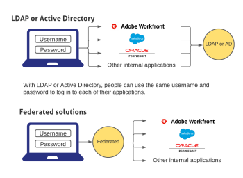

# Overview of single sign-on in `Adobe Workfront`

>[!IMPORTANT]
>
>The functionality described on this page applies only to organizations that are not yet onboarded to the Adobe Business Platform.
>
>If your organization has been onboarded to the Adobe Business Platform, Single Sign-On (SSO) is handled automatically as part of that integration. You do not need to configure or enable this functionality.
>
>For a list of procedures that differ based on whether your organization is migrated to Adobe IMS, see [Platform-based administration differences (Adobe Workfront/Adobe Business Platform)](../../../administration-and-setup/get-started-wf-administration/actions-in-admin-console.md).

`Workfront` provides a centrally managed single sign-on (SSO) configuration that easily integrates `Workfront` with your existing corporate SSO solution. This configuration is easy to set up and manage, and is available for both OnDemand and OnPremise Enterprise customers.

In order to use the SSO functionality in `Workfront`, your organization needs to setup an SSO application, such as LDAP or Active Directory. You can then configure `Workfront` so that it can communicate with your SSO solution.

Federated solutions allow users to log in to all their applications by entering their username and password in a centralized login portal.

>[!NOTE]
>
>This is not available if your organization’s `Workfront` instance is enabled with Adobe IMS. See your network or IT administrator if you need more information.

>[!NOTE]
>
>Although `Adobe Workfront` supports integration with an SSO system, it is outside of the scope of `Workfront` Support and the `Workfront Customer Support` team to assist in the configuration of your internal authentication system.

## Configure your firewall

When using Active Directory and LDAP, `Workfront` initiates a connection to your server on the specified port.

If you subscribe to `Workfront` on-demand, and if you have configured your firewall or mail server to allow access only to specific vendors, you need to add certain `Workfront` IP addresses to your firewall allowlist. For more information, see [Configure your firewall's allowlist](../../../administration-and-setup/get-started-wf-administration/configure-your-firewall.md).

## Configure Single Sign-On

`Workfront` integrates with the following SSO solutions:

* LDAP

  For information about integrating `Workfront` with LDAP, see [Configure Adobe Workfront with LDAP](../../../administration-and-setup/add-users/single-sign-on/configure-workfront-ldap.md).

* Active Directory

  For information about integrating `Workfront` with Active Directory, see [Configure Adobe Workfront with Active Directory](../../../administration-and-setup/add-users/single-sign-on/configure-workfront-ad.md).

* Other federated solutions that support SAML 1.1

  For information about integrating `Workfront` with SAML 1.1, see [Configure Adobe Workfront with SAML 1.1](../../../administration-and-setup/add-users/single-sign-on/configure-workfront-saml-1.1.md).

* Other federated solutions that support SAML 2.0

  For information about integrating `Workfront` with SAML 2.0, see [Configure Adobe Workfront with SAML 2.0](../../../administration-and-setup/add-users/single-sign-on/configure-workfront-saml-2.md).

* Other federated solutions that support SAML 2.0 using ADFS

  For information about integrating `Workfront` with SAML 2.0 using ADFS, see [Configure Adobe Workfront with SAML 2.0 using ADFS](../../../administration-and-setup/add-users/single-sign-on/configure-workfront-saml-2-adfs.md).

