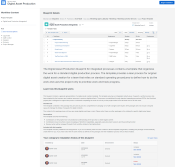

# Blueprints overview

The highlighted information on this page refers to functionality not yet generally available. It is available only in the Preview Sandbox environment.

Blueprints provide basic building blocks to help you create a work management system that grows with you. System administrators can browse the blueprints catalog and install ready-to-use project templates.

Each template is targeted to a department and specific maturity level to help you implement proven best practices in your system faster. The maturity levels detailed below are indicated in the blueprint catalog card and details.

| `Managed`  |Managed project templates help support the adoption of a new business process before activities and deliverables are fully accepted as a standard procedure. They contain tasks to ensure each step of the new process is being followed. |
|---|---|
| `Integrated`  |Integrated project templates assume that business functions are supported through a standard operating procedure. Contributors to the process know the steps and tasks they need to complete to follow the process. The project templates to support this process contain fewer tasks to track only milestones and other key deliverables necessary for reporting purposes. |

## Find the right blueprint

You can browse blueprints by use case, maturity level, installation status, and type with the filters on the right side of the catalog. Once you've found a blueprint that interests you, you can view details on the details page.

### View details

Each blueprint contains a details page. From this page, you can:

* View a summary of the workflow content
* Read a brief summary of the blueprint
* View installation history ` (click `View Details` to see the full list of objects installed with the blueprint)`
* See role, team, company, and group descriptions
* See a visual example of the project template (you can preview the full image in the browser or download it)

### Blueprint types

The blueprint type shows what's included in the blueprint. The type is listed on the bottom of the blueprint card in the catalog.

The following types of blueprints are available:

* Project templates: Includes standard objects associated with a project template (tasks, issues, roles, and teams), and some preferences related to those objects. For more information, see [Configure a blueprint](../../administration-and-setup/blueprints/configure-template-package.md).
* Organizational structures: Includes objects associated with the structure of an organization (companies, groups, roles, and teams). For more information, see [Configure a blueprint](../../administration-and-setup/blueprints/configure-template-package.md).

## Install a blueprint

You can install directly in your production environment or in sandbox environments. To learn more, see [Install a blueprint](../../administration-and-setup/blueprints/blueprints-install.md) or [Configure a blueprint](../../administration-and-setup/blueprints/configure-template-package.md).

After installation, you might be unsure about the best next actions to take. For information, see [Actions to take after installing a blueprint](../../administration-and-setup/blueprints/best-next-actions-after-install.md).

## Additional notes on blueprints and templates

Blueprints do not replace the project templates functionality in `Adobe Workfront`. Blueprints are a way for you to create new templates faster to organize more of your work in `Workfront`.

You cannot copy or edit a blueprint. However, once you have installed the solution from a blueprint, you can modify the project template, job roles, or teams that are created from the blueprint the same way you normally update those records in the `Workfront` interface. Also, when you install a blueprint, the template is stored in the Templates area of `Workfront` and the original blueprint stays in the Blueprints area. You do not need to make a copy of the template before you begin tailoring it to your needs.

Blueprints do not remove or replace anything configured in your environment. If you intend to replace an existing template by installing a blueprint that creates a new template, we recommend that you deactivate the previous version to avoid confusion among your planners who build projects from templates.
