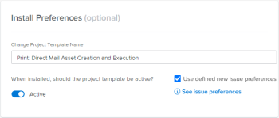
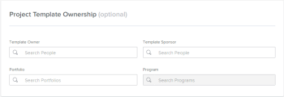

# Configure a blueprint {#configure-a-blueprint}

The highlighted information on this page refers to functionality not yet generally available. It is available only in the Preview Sandbox environment.

You can configure details of the project template `or organizational structure` before you install the blueprint.

## Access requirements {#access-requirements}

You must have the following access to perform the steps in this article:

<table style="width: 100%;margin-left: 0;margin-right: auto;mc-table-style: url('../../Resources/TableStyles/TableStyle-List-options-in-steps.css');" class="TableStyle-TableStyle-List-options-in-steps" cellspacing="0"> 
 <col class="TableStyle-TableStyle-List-options-in-steps-Column-Column1"> 
 <col class="TableStyle-TableStyle-List-options-in-steps-Column-Column2"> 
 <tbody> 
  <tr class="TableStyle-TableStyle-List-options-in-steps-Body-LightGray"> 
   <td class="TableStyle-TableStyle-List-options-in-steps-BodyE-Column1-LightGray" role="rowheader">Adobe Workfront plan</td> 
   <td class="TableStyle-TableStyle-List-options-in-steps-BodyD-Column2-LightGray"> 
Any
 </td> 
  </tr> 
  <tr class="TableStyle-TableStyle-List-options-in-steps-Body-MediumGray"> 
   <td class="TableStyle-TableStyle-List-options-in-steps-BodyE-Column1-MediumGray" role="rowheader">Adobe Workfront license</td> 
   <td class="TableStyle-TableStyle-List-options-in-steps-BodyD-Column2-MediumGray"> 
Plan 
 </td> 
  </tr> 
  <tr class="TableStyle-TableStyle-List-options-in-steps-Body-LightGray"> 
   <td class="TableStyle-TableStyle-List-options-in-steps-BodyB-Column1-LightGray" role="rowheader">Access level configurations</td> 
   <td class="TableStyle-TableStyle-List-options-in-steps-BodyA-Column2-LightGray"> 
System administrator
 </td> 
  </tr> 
 </tbody> 
</table>

## Configure a project template blueprint {#configure-a-project-template-blueprint}

1.  Find the blueprint you want to use.
1.  Click `Install`, then choose an environment:  

1. Continue with the following sections:
1.  `<li><a href="#install" class="MCXref xref">Install preferences</a> </li>` `<li><a href="#template" class="MCXref xref">Template ownership</a> </li>` `<li><a href="#role" class="MCXref xref">Role mapping</a> </li>` `<li><a href="#team" class="MCXref xref">Team mapping</a> </li>` `<li><a href="#company" class="MCXref xref">Company mapping</a> </li>` `<li><a href="#group" class="MCXref xref">Group mapping</a> </li>` 

## Install preferences {#install-preferences}

`In the Preview environment, the Install Preferences and Template Ownership sections are combined in "Template Preferences."` 

Choose how you want to install the template.

1.  In the `Install Preferences section`, specify a new template name.
1.  Select whether the template is installed as active or inactive.
1.  Select whether you want to use defined new issue preferences, if preferences are available.

   Click `See issue preferences` to review the specific preferences that will install with the blueprint. Projects created from the imported template use these preferences for new issues added in the Issues section.

<table style="width: 100%;mc-table-style: url('../../Resources/TableStyles/TableStyle-List-options-in-steps.css');margin-left: 0;margin-right: auto;" class="TableStyle-TableStyle-List-options-in-steps" cellspacing="0"> 
 <col class="TableStyle-TableStyle-List-options-in-steps-Column-Column1" style="width: 127px;"> 
 <col class="TableStyle-TableStyle-List-options-in-steps-Column-Column2"> 
 <tbody> 
  <tr class="TableStyle-TableStyle-List-options-in-steps-Body-LightGray"> 
   <td class="TableStyle-TableStyle-List-options-in-steps-BodyE-Column1-LightGray" role="rowheader">Queue topic groups</td> 
   <td class="TableStyle-TableStyle-List-options-in-steps-BodyD-Column2-LightGray"> 
Queue topic groups define the highest level of categories for the issues or requests. Users view topic groups as menu options when selecting where to submit requests. A topic group can contain multiple queue topics. For more information, see <a href="create-topic-groups.md" class="MCXref xref">Create Topic Groups</a>. 
 </td> 
  </tr> 
  <tr class="TableStyle-TableStyle-List-options-in-steps-Body-MediumGray"> 
   <td class="TableStyle-TableStyle-List-options-in-steps-BodyE-Column1-MediumGray" role="rowheader">Queue topics </td> 
   <td class="TableStyle-TableStyle-List-options-in-steps-BodyD-Column2-MediumGray"> 
Queue topics work in conjunction with routing rules to assign issues or requests. They are the menu options that users select when entering an issue or request, after selecting a topic group. For more information, see <a href="create-queue-topics.md" class="MCXref xref">Create Queue Topics</a>. 
 </td> 
  </tr> 
  <tr class="TableStyle-TableStyle-List-options-in-steps-Body-LightGray"> 
   <td class="TableStyle-TableStyle-List-options-in-steps-BodyB-Column1-LightGray" role="rowheader">Routing rules </td> 
   <td class="TableStyle-TableStyle-List-options-in-steps-BodyA-Column2-LightGray">Routing rules send issues or requests to specific job roles , users, or teams. They can also send the requests to specific projects, other than the one associated with the request queue. For more information, see <a href="create-routing-rules.md" class="MCXref xref">Create Routing Rules</a>. </td> 
  </tr> 
 </tbody> 
</table>

   ` `**Example: **`` The new issue preferences in this blueprint provide four queue topics. The user selects one of these topics when creating an issue. (Because only one topic group exists, it is automatically applied and the user does not have to select it.) When the user completes and submits the issue, routing rules determine which job role or team it is assigned to.

   

   

   

   ` `**Tips: **`` 
    
    
    * Using the issue preferences helps create consistency in the way that new issues or requests are captured on your projects.
    * Setting these preferences does not automatically make the projects created from the template into request queues. For information about setting up a request queue, see [Create a Request Queue](create-request-queue.md).
    * Not all blueprints contain new issue preferences.
    
    

1.  Continue to the [Template ownership](#template) section below.

## Template ownership {#template-ownership}

You can designate template ownership before you install the blueprint. You can make changes to these fields after the template is installed. For more information, see [Edit project templates](edit-templates.md).

1.  Specify the following:  

1. Continue to the [Role mapping](#role) section below.

## Role mapping {#role-mapping}

>[!NOTE]
>
>This section may not appear in some blueprints.

Some templates include prescribed job roles. Job roles help you assign the right people when the template is converted to a project. You can customize how roles are mapped before you install the blueprint. Click `See role descriptions` to learn more about the roles available in the blueprint.

The blueprint searches by the role name to see if any existing roles match. The search is case sensitive, so names must be an exact match. If no existing roles match, you can have the blueprint create them for you.

1.  If a role exists, you can choose one of the following options:

    
    
    1.  `Create a new role with a different name`, then type the name in the text box.
    1.  `Use existing role`, then select a role in the selection box.
    1. `Do not use mapped role`. This option is not recommended because some tasks will not have roles assigned.
    
    

1.  If a role does not exist, you can choose one of the following options:

    
    
    1.  `Create a new role`. This option creates the role the blueprint recommends.
    1.  `Create a new role with a different name`, then type the name in the text box.
    1.  `Use existing role`, then select a role in the selection box.
    1. `Do not use mapped role`. This option is not recommended because some tasks will not have roles assigned.
    
    

>[!NOTE]
>
>The installation process does not apply roles to specific people. You should verify the people in those roles after installing the blueprint solution and assign people if necessary. For information, see [Actions to take after installing a blueprint](best-next-actions-after-install.md).

For more information about job roles in *`Workfront`*, see [Create and manage job roles](create-manage-job-roles.md).

## Team mapping {#team-mapping}

>[!NOTE]
>
>This section may not appear in some blueprints.

Some templates include prescribed teams. Work assigned to a team can be completed by any member of the team. You can customize how teams are mapped before you install the blueprint. Click `See team descriptions` to learn more about the teams available in the blueprint.

The blueprint searches by the team name to see if any existing teams match. The search is case sensitive, so names must be an exact match. If no existing teams match, you can have the blueprint create them for you.

   

1.  If a team exists, you can choose one of the following options:

    
    
    1.  `Create a new team with a different name`, then type the name in the text box.
    1.  `Use existing team`, then select a team in the selection box.
    1. `Do not use mapped team`. This option is not recommended because some tasks will not have teams assigned.
    
    

1.  If a team does not exist, you can choose one of the following options:

    
    
    1.  `Create a new team`. This option creates the team the blueprint recommends.
    1.  `Create a new team with a different name`, then type the name in the text box.
    1.  `Use existing team`, then select a team in the selection box.
    1. `Do not use mapped team`. This option is not recommended because some tasks will not have teams assigned.
    
    

>[!NOTE]
>
>The installation process does not add people to the teams. You should verify the people on the teams after installing the blueprint solution and assign people if necessary. For information, see [Actions to take after installing a blueprint](best-next-actions-after-install.md).

For more information about how teams function in *`Workfront`*, see [Create and manage teams](_create-and-mange-teams.md).

## Company mapping {#company-mapping}

>[!NOTE]
>
>This section may not appear in some blueprints.

Some blueprints include prescribed companies. A company is an organizational unit that can represent your organization, a department within the organization, or a client you work with. You can customize how companies are mapped before you install the blueprint. Click `See company descriptions` to learn more about the companies available in the blueprint.

The blueprint searches by the company name to see if any existing companies match. The search is case sensitive, so names must be an exact match. If no existing companies match, you can have the blueprint create them for you. The primary company in the blueprint is mapped to the primary company in your environment, even if they do not have the same name.

1.  If a company exists, you can choose one of the following options:

    
    
    1.  `Create a new company with a different name`, then type the name in the text box.
    1.  `Use existing company`, then select a company in the selection box.  
       The primary company in the blueprint is mapped to the primary company in your environment, even if they do not have the same name.
    1. `Do not use mapped company`. This option is not recommended, because the company references in other objects will be empty.
    
    

1.  If a company does not exist, you can choose one of the following options:

    
    
    1.  `Create a new company`. This option creates the company the blueprint recommends.
    1.  `Create a new company with a different name`, then type the name in the text box.
    1.  `Use existing company`, then select a company in the selection box.
    1.  `Do not use mapped company`. This option is not recommended, because the company references in other objects will be empty.
    
    

>[!NOTE]
>
>To configure the companies after installing the blueprint, see [Actions to take after installing a blueprint](best-next-actions-after-install.md).

For information about associating a template with a company, see [Associate projects and templates with companies](associate-projects-templates-with-companies.md).

For information about how companies function in *`Workfront`*, see [Create and edit companies](create-and-edit-companies.md).

## Group mapping {#group-mapping}

>[!NOTE]
>
>This section may not appear in some blueprints.

Some blueprints include prescribed groups. A group is a group of users that coincides with your departmental structure. Groups are similar to but distinct from teams and companies in *`Workfront`*. You can customize how groups are mapped before you install the blueprint. Click `See group descriptions` to learn more about the groups available in the blueprint.

The blueprint searches by the group name to see if any existing groups match. The search is case sensitive, so names must be an exact match. If no existing groups match, you can have the blueprint create them for you.

1.  If a group exists, you can select `Remap Group` and choose one of the following options:

    
    
    1.  `Create a new group with a different name`, then type the name to assign to this group. References to the group in the blueprint definition will be associated to this new group instead.
    1.  `Replace with an existing group`, then search for and select a group in the selection box.
    
    
       >[!NOTE]
       >
       >You cannot rename an existing group.
    
    
    
    
    

1.  If a group does not exist, you can:

    
    
    1.  Change the suggested group name by typing it in the text box.
    1.  Select `Remap Group` and choose `Replace with an existing group`, then search for and select a group in the selection box.
    1.  Select `Remap Group` and choose `Insert under an existing group`, then search for and select a group in the selection box. This option creates a new subgroup under the existing group.
    
    

>[!NOTE]
>
>To configure the groups after installing the blueprint, see [Actions to take after installing a blueprint](best-next-actions-after-install.md).

For information about using groups in Workfront, see [Groups overview](groups.md).
