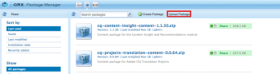
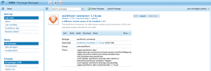
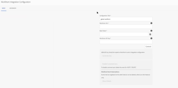
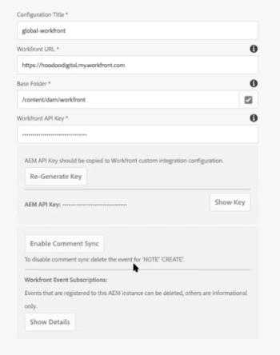
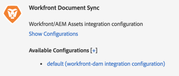
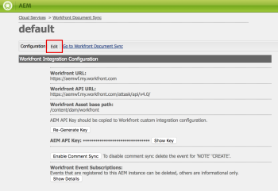
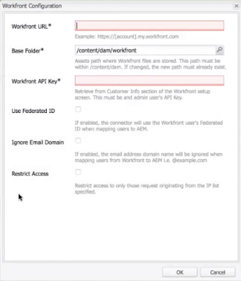
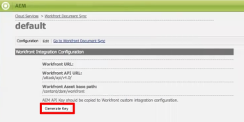
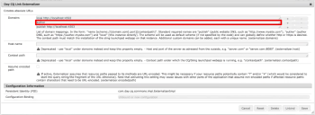
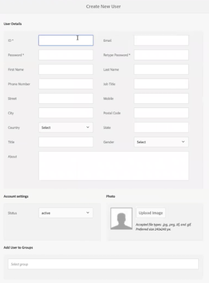

# Configure *Workfront* with Adobe Experience Manager

As an *Adobe Workfront administrator*, you can integrate *Workfront* with Adobe Experience Manager (AEM)&nbsp;Assets and provide your organization with a comprehensive content management solution for the creation,&nbsp;sharing, and maintenance of assets within your workflow.&nbsp;&nbsp;

## Access requirements

You must have the following access to perform the steps in this article:

<table cellspacing="0"> 
 <col> 
 <col> 
 <tbody> 
  <tr> 
   <td role="rowheader"><em>Adobe Workfront</em> plan*</td> 
   <td> 
Any
 </td> 
  </tr> 
  <tr> 
   <td role="rowheader"><em>Adobe Workfront</em> license*</td> 
   <td> 
Plan
 </td> 
  </tr> 
  <tr> 
   <td role="rowheader">Access level configurations*</td> 
   <td> 
You must be a <em>Workfront administrator</em>. For information on <em>Workfront administrators</em>, see <a href="../../administration-and-setup/add-users/configure-and-grant-access/grant-a-user-full-administrative-access.md" class="MCXref xref">Grant a user full administrative access</a>.
 </td> 
  </tr> 
 </tbody> 
</table>

&#42;To find out what plan, license type, or access you have, contact your *Workfront administrator*.

## *Workfront* for AEM Assets

The *Workfront* for AEM Assets connector allows your organization to do the following:

* Collaborate and manage creative content by linking AEM assets and folders to projects, tasks, issues, and requests in *Workfront*.

  For more information about configuring documentation integrations with third-party applications, see&nbsp; [Configure document integrations](../../administration-and-setup/configure-integrations/configure-document-integrations.md).

* Integrate with the AEM Digital Asset Management (DAM) repository, allowing you to use *Workfront* to manage and share digital assets stored in the DAM.

  For more information about linking documents and asset folders, see &nbsp; [Link documents from external applications](../../documents/adding-documents-to-workfront/link-documents-from-external-apps.md).

* Combine and apply metadata from both applications to an asset.
* View an all-inclusive communication stream for an asset.&nbsp;Updates and comments made to an asset either in *Workfront* or AEM Assets are synchronized to the&nbsp;other application, establishing a comprehensive history of communications made to the&nbsp;asset.

  For more information about making comments in *Workfront*, see [Add an update to a document](../../documents/managing-documents/add-update-documents.md).

## Prerequisites for installing the AEM Assets connector

Before you can install the *Workfront* connector for AEM Assets, ensure that the following prerequisites are met:

* AEM Assets installed and configured, version 6.0 or later

  For information about installing AEM Assets, see the [Adobe Experience Manager documentation](https://docs.adobe.com/docs/en/aem/6-2/deploy.html).

* AEM Touch-Optimized&nbsp;User Interface activated

## Install the *Workfront* for AEM Assets connector package

To install the *Workfront* for AEM Assets connector, you must import the connector into AEM&nbsp;as a package using the CRX Package Manager.

<ol> 
 <li value="1"> 
On a workstation where you have already installed AEM, download the <em>Workfront</em> for AEM Assets Connector installation file.
 
You can get&nbsp;the <em>Workfront</em> for AEM Assets connector from your <em>Workfront</em> representative.
 </li> 
 <li value="2">Log in to AEM using an administrator account.</li> 
 <li value="3"> 
Click Tools > Deployment > Packages.
 
The CRX Package Manager opens.
 </li> 
 <li value="4"> 
Click Upload Package.
 
 
 </li> 
 <li value="5">In the Upload Package dialog box, browse for and select the <em>Workfront</em> Connector package, then click OK. The package displays in the CRX Package Manager.</li> 
 <li value="6"> 
Click Install.
 
  
 </li> 
 <li value="7">On the Package dialog box, ignore the advanced settings and click Install.</li> 
 <li value="8">(Optional) To confirm the connector successfully installed, ensure the following statement displays in the Activity Log: <pre>Package installed in <time></pre></li> 
 <li value="9"> 
Close the CRX Package Manager.
 
The connector is installed and you can now configure AEM Assets to integrate with <em>Workfront</em>.
 </li> 
 <li value="10">Continue with <a href="#configur" class="MCXref xref">Configure AEM Assets to integrate with Workfront</a>.</li> 
</ol>

## Configure AEM Assets to integrate with *Workfront*

After you install the connector, import the connector package to AEM and configure AEM to link with documents in *Workfront*.

For information on installing the connector, see&nbsp; [Install the Workfront for AEM Assets connector package](#installi).

* [Install the connector package on AEM assets version 6.4 (Touch UI)](#installi2) 
* [Install the connector package on AEM Assets versions 6.3 or older (classic UI)](#installi3) 
* [Configure the AEM Externalizer](#configur3)

### Install the connector package on AEM assets version 6.4 (Touch UI)

<ol> 
 <li value="1">Log in to AEM Assets as a <em>Workfront administrator</em>.</li> 
 <li value="2">Click Tools > Cloud Services&nbsp;> <em>Workfront</em> Integration Configuration > Global-<em>Workfront</em>. </li> 
 <li value="3">(Conditional) If you have not yet done so, create a <em>Workfront</em> cloud configuration file. 
  <ol> 
   <li value="1">
Click&nbsp;&nbsp;Create in the upper-right corner of the Global-<em>Workfront</em> page.

</li> 
   <li value="2">
In the <em>Workfront</em> URL box, specify the URL for your <em>Workfront</em> instance. 

For example, https://<em><account></em>.my.workfront.com,&nbsp;where <em><account></em> is the account you use for integrations with AEM.&nbsp;
</li> 
   <li value="3">Click the&nbsp;Base Folder box, then in the drop-down menu select the path where documents that are linked to <em>Workfront</em> objects are stored.</li> 
   <li value="4">
Click Select in the upper-right corner.

You can link to any folder beneath the root /content/dam/.
<note type="note">
      The /content/dam/ root folder is automatically created and configured when you install the 
     <em>Workfront</em> for AEM Assets connector.
    </note></li> 
   <li value="5">
In the <em>Workfront</em> API Key box, specify your <em>Workfront</em> API Key.

For information on API keys, see .

To retrieve your <em>Workfront</em> API key: 
 
    <ol> 
     <li value="1">Open a browser tab, and log into your <em>Workfront</em> account as a <em>Workfront administrator</em>.</li> <draft-comment>
      <li value="2" data-mc-conditions="QuicksilverOrClassic.Quicksilver">Click the Main Menu icon  in the upper-right corner of <em>Adobe Workfront</em>, then click Setup .</li>
     </draft-comment>
     <li value="2" data-mc-conditions="QuicksilverOrClassic.Quicksilver">Click the Main Menu icon  in the upper-right corner of <em>Adobe Workfront</em>, then click Setup .</li> 
     <li value="3">
Click System > Customer Info.

If you have already generated an API key, your <em>Workfront</em> API Key displays under the Your User's API Key label.
</li> 
     <li value="4">(Conditional) If you have not yet generated an API key, you need to generate one: 
      <ol> 
       <li value="1">
In the API Key Settings section, ensure that the After Creation, API keys expire in option is set to None.

If you select an expiration period, the connector will stop working after the API Key expires. You will then to need to re-generate an API Key and update your <em>Workfront</em> configuration.
</li> 
       <li value="2">
Under the Your User's API Key label, click Generate API Key.

An API Key for <em>Workfront</em> generates and displays.
</li> 
      </ol></li> 
     <li value="5">Copy the API Key to your clipboard.</li> 
     <li value="6">Open the browser tab for AEM Connector and in the <em>Workfront</em> API Key box, paste the API Key you copied.</li> 
    </ol></li> 
   <li value="6">
(Conditional) Click the Advanced tab in the upper-left corner of the <em>Workfront</em> Integration Configuration page, and select the following options if applicable:

Allow Collection Browsing:&nbsp;Select this option if your organization allows <em>Workfront</em> users to link AEM Assets collections to <em>Workfront</em> objects.

User Federated ID: Select this option if your organization is using Federated IDs or Single Sign-On (SSO) when logging into <em>Workfront</em>.

Ignore Email Domain: Select this option if your AEM users do not use the domain name in their user ID.&nbsp;

Restrict Access: Select this option to specify the appropriate <em>Workfront</em> IP addresses that need to be added to the allowlist. For more information about the allowlist, see <a href="../../administration-and-setup/get-started-wf-administration/configure-your-firewall.md" class="MCXref xref">Configure your firewall's allowlist</a>.
</li> 
   <li value="7">Click the Basic tab in the upper-left corner of the <em>Workfront</em> Integration Configuration page, and then click Connect.</li> 
  </ol></li> 
 <li value="4"> (Conditional) If you already created a <em>Workfront</em> cloud configuration file, select&nbsp;Global-<em>Workfront</em>, and then in the upper-left corner, click Properties.</li> 
 <li value="5"> 
Generate the AEM API Key by clicking Generate Key, then copy the AEM API key to your clipboard.
 
You will need the AEM API Key later when you configure <em>Workfront</em> to integrate with AEM Assets. For more information, see <a href="#configur2" class="MCXref xref">Configure Workfront to integrate with AEM assets</a>.
 </li> 
 <li value="6"> 
In the upper-right corner, click Save.
 
The&nbsp;Global-<em>Workfront</em> window displays.
 
  
 </li> 
 <li value="7"> 
(Optional) Synchronize&nbsp;bi-directional communication between AEM and <em>Workfront</em>. 
 
  <ol> 
   <li value="1">Click Global-<em>Workfront</em>.</li> 
   <li value="2"> 
In the upper-left corner of the window, click Properties.
 
The <em>Workfront</em> Integration Configuration page displays.
 
  
 </li> 
   <li value="3">(Optional) To enable the synchronization of comments between AEM Assets and <em>Workfront</em>, click Enable Comment Sync.</li> 
   <li value="4"> 
(Optional) To turn off comment synchronization, click Disable Comment Sync.
 
Or
 
Delete the&nbsp;NOTE CREATE event subscription registered to your AEM instance.
 
For information on event subscriptions, see <a href="../../wf-api/general/event-subs-api.md" class="MCXref xref">Event Subscription API</a>.
 </li> 
  </ol> </li> 
 <li value="8">Continue with <a href="#configur3" class="MCXref xref">Configure the AEM Externalizer</a>. </li> 
</ol>

### Install the connector package on AEM Assets versions 6.3 or older (classic UI)&nbsp;

<ol> 
 <li value="1">Log in to AEM Assets as a <em>Workfront administrator</em>.</li> 
 <li value="2">Click Tools > Deployment >&nbsp;Cloud Services.</li> 
 <li value="3">Locate the <em>Workfront</em> Document Sync service, then click Show Configurations.</li> 
 <li value="4"> 
In the Available Configurations section, click default (workfront-dam integration configuration).
 
  
 
The AEM Default page displays. You need to first configure the <em>Workfront</em> Configuration settings.
 </li> 
 <li value="5"> 
Click Edit.
 
  
 
The <em>Workfront</em> Configuration page displays.  
 </li> 
 <li value="6"> 
In the <em>Workfront</em> URL box, specify the URL for your <em>Workfront</em> instance. 
 
For example, https://<em><account></em>.my.workfront.com,&nbsp;where <em><account></em> is the account you use for integrations with AEM Assets. This is a required field.
 </li> 
 <li value="7"> 
In the&nbsp;Base Folder box,&nbsp;specify the path where documents that are linked to <em>Workfront</em> objects are stored.&nbsp;You can link to any folder beneath the root /content/dam/.
 <note type="note">
    The /content/dam/ root folder is automatically created and configured when you install the 
   <em>Workfront</em> for AEM Assets connector.
  </note> 
This is a required field.
 </li> 
 <li value="8"> 
In the <em>Workfront</em> API Key box, specify your <em>Workfront</em> API Key.
 
For information on API keys, see .
 
 To retrieve your <em>Workfront</em> API key: 
 
  <ol> 
   <li value="1">Open a browser tab, and log into your <em>Workfront</em> account as a <em>Workfront administrator</em>.</li> <draft-comment>
    <li value="2" data-mc-conditions="QuicksilverOrClassic.Quicksilver">Click the Main Menu icon  in the upper-right corner of <em>Adobe Workfront</em>, then click Setup .</li>
   </draft-comment>
   <li value="2" data-mc-conditions="QuicksilverOrClassic.Quicksilver">Click the Main Menu icon  in the upper-right corner of <em>Adobe Workfront</em>, then click Setup .</li> 
   <li value="3">Click System > Customer Info. If you have already generated an API key, your <em>Workfront</em> API Key displays under the Your User's API Key label.</li> 
   <li value="4"> 
(Conditional) If you have not yet generated an API key, you need to generate one: 
 
    <ol> 
     <li value="1"> 
In the API Key Settings section, ensure that the After Creation, API keys expire in option is set to None.
 
If you select an expiration period, the connector will stop working after the API Key expires. You will then to need to re-generate an API Key and update your <em>Workfront</em> configuration.
 </li> 
     <li value="2"> 
Under the Your User's API Key label, click Generate API Key.
 
An API Key for <em>Workfront</em> generates and displays.
 </li> 
    </ol> </li> 
   <li value="5">Copy the API Key to your clipboard.</li> 
   <li value="6">Open the browser tab for AEM and in the <em>Workfront</em> API Key box, paste the API Key you copied.</li> 
  </ol> </li> 
 <li value="9"> 
(Conditional) Select the following options, if applicable for your configuration: User Federated ID: Select this option if your organization is using Federated IDs or Single Sign-On (SSO) when logging into <em>Workfront</em>.
 
Ignore Email Domain: Select this option if your AEM users do not use the domain name in their user ID.&nbsp;
 
Restrict Access: Select this option to specify the appropriate <em>Workfront</em> IP addresses that need to be added to your allowlist. For more information about the allowlist, see the <a href="../../administration-and-setup/get-started-wf-administration/configure-your-firewall.md" class="MCXref xref">Configure your firewall's allowlist</a> section in the article <a href="../../administration-and-setup/get-started-wf-administration/configure-your-firewall.md" class="MCXref xref">Configure your firewall's allowlist</a>.
 </li> 
 <li value="10"> 
Click OK.
 
The <em>Workfront</em> Configuration page closes.
 </li> 
 <li value="11"> 
(Conditional) If no AEM API Key displays, click Generate Key to generate an API Key.
 
  
 </li> 
 <li value="12"> 
Copy the AEM API key to your clipboard.
 
You will need the AEM API Key later when you configure <em>Workfront</em> to integrate with AEM Assets. For more information, see <a href="#configur2" class="MCXref xref">Configure Workfront to integrate with AEM assets</a>.
 </li> 
 <li value="13">(Optional) To enable the synchronization of comments between AEM Assets and <em>Workfront</em>, click Enable Comment Sync.</li> 
 <li value="14"> 
(Optional) To turn off comment synchronization, click Disable Comment Sync.
 
Or
 
 Delete the&nbsp;NOTE CREATE event subscription registered to your AEM instance. For information on event subscriptions, see the <a href="../../wf-api/general/event-subs-api.md" class="MCXref xref">Event Subscription API</a> section in the article <a href="../../wf-api/general/event-subs-api.md" class="MCXref xref">Event Subscription API</a>.
 </li> 
 <li value="15">Continue with <a href="#configur3" class="MCXref xref">Configure the AEM Externalizer</a>.</li> 
</ol>

### Configure the AEM Externalizer

The AEM Externalizer allows AEM to pass URLs in a format that can be used in *Workfront*. If not properly configured, *Workfront* cannot make calls to the AEM API, and the URLs linking AEM documents in *Workfront* will not work.

<ol> 
 <li value="1"> In AEM, click Tools > Operations > Web Console. </li> 
 <li value="2"> Click OSGI, then click Configuration in the drop-down menu. </li> 
 <li value="3"> 
In the configuration list, select Day&nbsp;CQ Link Externalizer.
 
The Externalizer page displays.
 </li> 
 <li value="4"> 
 In the Domains section, ensure the domain listed in the Author field is the domain name externally accessible to AEM users.
 
 The domain name in the author field should match the domain listed in the URL line of your AEM instance. 
 
  
 </li> 
 <li value="5"> (Conditional) If necessary, update the domain in the Author field. </li> 
 <li value="6"> 
 Click Save.
 
AEM Assets is now configured to link documents with <em>Workfront</em>
 </li> 
 <li value="7">Continue with <a href="#configur2" class="MCXref xref">Configure Workfront to integrate with AEM assets</a>.</li> 
</ol>

## Configure *Workfront* to integrate with AEM assets

After you install the *Workfront* for AEM Assets Connector (as described in [Install the Workfront for AEM Assets connector package](#installi))&nbsp;and configure AEM Assets (as described in [Configure AEM Assets to integrate with Workfront](#configur)), you need to configure *Workfront* to link documents between&nbsp;*Workfront* and AEM Assets.

<ol> 
 <li value="1"> 
Log in to <em>Workfront</em> as a <em>Workfront administrator</em>. 
 <note type="tip">
   <em>Workfront</em> recommends creating a 
   <em>Workfront administrator</em> dedicated solely to your AEM integration. For more information about assigning the 
   <em>Workfront administrator</em> access level to a user, see 
   <a href="../../administration-and-setup/add-users/configure-and-grant-access/grant-users-admin-access-certain-areas.md" class="MCXref xref">Grant users administrative access to certain areas</a>.
  </note> </li> <draft-comment>
  <li value="2" data-mc-conditions="QuicksilverOrClassic.Quicksilver">Click the Main Menu icon  in the upper-right corner of <em>Adobe Workfront</em>, then click Setup .</li>
 </draft-comment>
 <li value="2" data-mc-conditions="QuicksilverOrClassic.Quicksilver">Click the Main Menu icon  in the upper-right corner of <em>Adobe Workfront</em>, then click Setup .</li> 
 <li value="3">Click&nbsp;Documents&nbsp;>&nbsp;Custom Integration.</li> 
 <li value="4">Click Add Custom Integration.</li> 
 <li value="5"> 
In the&nbsp;Name box, specify the name of the custom integration.
 
This is the name users see when using the integration within <em>Workfront</em>; for example, you could enter <em>"AEM Assets"</em> for the name.&nbsp;
 </li> 
 <li value="6"> 
In the&nbsp;Base API URL box, specify the URL for your AEM instance.
 
The base API URL consists of the URL for your AEM instance followed by the path: /bin/webhooks/api/
 
  
 </li> 
 <li value="7">In the&nbsp;Authentication Type drop-down menu,&nbsp;select ApiKey.</li> 
 <li value="8">In the API Key box, paste the AEM API Key you copied when you configured AEM Assets.</li> 
 <li value="9">Click Save.</li> 
 <li value="10"> 
(Optional) Ensure the integration is marked Active. 
 
<em>Workfront</em> is now configured to work with AEM Assets.
 
In order to access assets in AEM, each <em>Workfront</em> user who needs to use the connector must be set up as a user in AEM. For information on creating users, see&nbsp;<a href="#setting" class="MCXref xref">Set up users to use the connector</a>.
 </li> 
</ol>

## Set up users to use the connector

In order for users to access the connector, they must have a user profile in AEM and belong to a *Workfront* group that has Access levels that include the Create and Delete permissions.

For more information about *Workfront* permissions, see [Create or modify custom access levels](../../administration-and-setup/add-users/configure-and-grant-access/create-modify-access-levels.md).

* [Set up users in AEM assets version 6.4](#setting2) 
* [Set up users in AEM assets versions 6.3 or older](#setting3)

### Set up users in AEM assets version 6.4

<ol> 
 <li value="1">Log in to AEM Assets as a <em>Workfront administrator</em>.</li> 
 <li value="2"> Click&nbsp;Tools >&nbsp;Security > Users.</li> 
 <li value="3">(Conditional) If the user does not have a user profile in AEM, create an AEM user profile. 
  <ol> 
   <li value="1">Click Create User.</li> 
   <li value="2">
Enter the user's personal information.

The only required field is the ID field.&nbsp;The user's AEM ID must match their <em>Workfront</em> ID, which is the user's <em>Workfront</em> email address. 

If you selected the&nbsp;Ignore Email Domain option when you configured AEM to integrate with <em>Workfront</em>, then the AEM ID will not match the <em>Workfront</em> email address.&nbsp;
</li> 
  </ol></li> 
 <li value="4"> (Conditional) If the user has an AEM profile, open the user's AEM profile. 
  <ol> 
   <li value="1">
Click&nbsp;User.

The User Management page displays.
</li> 
   <li value="2">
Click the user you want to add, then click Properties.

The user's settings page displays.
</li> 
  </ol></li> 
 <li value="5"> 
 Click the Groups tab. 
 
 <![CDATA[      ]]>
 </li> 
 <li value="6"> 
Ensure the user belongs to at least one <em>Workfront</em> group that has Access levels that include the Create and Delete permissions.
 
  <ol> 
   <li value="1"> 
To add the user to an existing group, begin typing the group name in the Type Group Name box, then select the group when it appears in the drop-down menu.
 
Or
 
To select a group to which the user is a member, select a group in the Groups that this user is a member of section. 
 </li> 
  </ol> </li> 
 <li value="7">Click Save.</li> 
</ol>

### Set up users in AEM assets versions 6.3 or older&nbsp;

<ol> 
 <li value="1">Log in to AEM Assets as a <em>Workfront administrator</em>.</li> 
 <li value="2"> Click Tools > Security > Users.</li> 
 <li value="3">(Conditional) If the user does not have a user profile in AEM, create an AEM user profile. 
  <ol> 
   <li value="1">Click Create User in the upper-right corner of the User Management page.</li> 
   <li value="2">
Enter the user's personal information, then continue with Step 5.

The only required fields are the ID, Password, and Retype&nbsp;Password fields.&nbsp;The user's AEM ID must match their <em>Workfront</em> ID, which is the user's <em>Workfront</em> email address. 

If you selected the&nbsp;Ignore Email Domain option when you configured AEM to integrate with <em>Workfront</em>, then the AEM ID will not match the <em>Workfront</em> email address.&nbsp;
</li> 
  </ol></li> 
 <li value="4"> 
(Conditional) If the user has an AEM profile, open the user's AEM profile.
 
The Edit Users Settings page displays.
 </li> 
 <li value="5"> 
 (Conditional) If the user is not a member of a <em>Workfront</em> group, in the Add User to Groups section, begin typing the name of a <em>Workfront</em> group to which the user belongs, then select the group when it displays in the drop-down menu.
 
The user must belong to at least one <em>Workfront</em> group that has Access levels that include the Create and Delete permissions. For information about <em>Workfront</em> groups, see <a href="../../administration-and-setup/manage-groups/groups-overview/groups.md" class="MCXref xref">Groups overview</a>. 
 </li> 
 <li value="6"> Click Save in the upper-right corner. </li> 
</ol>

