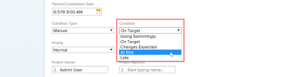

# Create or edit a custom condition

As an *Adobe Workfront administrator*, you can create or edit a custom condition for projects, tasks, and issues to match the needs of your organization.

## Access requirements

You must have the following to perform the steps in this article:

<table cellspacing="0"> 
 <col> 
 <col> 
 <tbody> 
  <tr> 
   <td role="rowheader"><em>Adobe Workfront</em> plan</td> 
   <td> 
Any
 </td> 
  </tr> 
  <tr> 
   <td role="rowheader"><em>Adobe Workfront</em> license</td> 
   <td> 
<em>Plan</em> 
 </td> 
  </tr> 
  <tr> 
   <td role="rowheader">Access level configurations</td> 
   <td> 
You must be a <em>Workfront administrator</em>. For more information, see <a href="../../../administration-and-setup/add-users/configure-and-grant-access/grant-a-user-full-administrative-access.md" class="MCXref xref">Grant a user full administrative access</a>.
 
Note: If you still don't have access, ask your <em>Workfront administrator</em> if they set additional restrictions in your access level. For information on how a <em>Workfront administrator</em> can modify your access level, see <a href="../../../administration-and-setup/add-users/configure-and-grant-access/create-modify-access-levels.md" class="MCXref xref">Create or modify custom access levels</a>.
 </td> 
  </tr> 
 </tbody> 
</table>

## Create or edit a custom condition

<ol> 
 <li value="1">Click the Main Menu icon  in the upper-right corner of <em>Adobe Workfront</em>, then click Setup .</li> 
 <li value="2">Click Project Preferences > Conditions. </li> 
 <li value="3">Click the tab of the object type (Project, Task, or Issue) that you want to associate with the condition.</li> 
 <li value="4"> 
To create a new condition, click Add a New Condition.
 
Or
 
To edit an existing condition, hover over the condition you want to edit, then click the Edit icon that appears to the far right. 
 <draft-comment>
   
  

  </draft-comment>
  
 </li> 
 <li value="5"> 
Configure your custom condition using the following options:
 
  <table cellspacing="0"> 
   <col> 
   <col> 
   <tbody> 
    <tr> 
     <td role="rowheader">Condition Name</td> 
     <td>(Required) Type a descriptive name for the condition.</td> 
    </tr> 
    <tr> 
     <td role="rowheader">Description</td> 
     <td>(Optional) Type a description of the condition's purpose for those who will use it.</td> 
    </tr> 
    <tr> 
     <td role="rowheader">Color</td> 
     <td>(Optional) Click the color icon, then choose the color you want for the condition when it displays in projects, task, or issues. You can also type a hex number.</td> 
    </tr> 
    <tr> 
     <td role="rowheader">Equates With </td> 
     <td>(Required, for projects only) Click the option in the drop-down list that best describes the function of your new condition. For example, for a condition named Tracking Well, you would click On Target. This determines how your default conditions work. Every condition you create must equate with one of the options in the drop-down menu.
 For information about default conditions, see <a href="../../../administration-and-setup/customize-workfront/create-manage-custom-conditions/set-custom-condition-default-projects.md" class="MCXref xref">Set a custom condition as the default for projects</a> and <a href="../../../administration-and-setup/customize-workfront/create-manage-custom-conditions/set-custom-condition-default-tasks-issues.md" class="MCXref xref">Set a custom condition as the default for tasks and issues</a>.

This option cannot be modified after you finish creating the condition.
</td> 
    </tr> 
    <tr> 
     <td role="rowheader">Key</td> 
     <td>(Required) For a project condition, type an alphanumeric abbreviation that users will be able to recognize. For a task or issue condition, type a two-digit numeric code from 01 to 99. 
This key, which is used in the API and can be used for reporting purposes, must&nbsp;be unique for each object.

You cannot change the key for a condition after you save the condition. 
</td> 
    </tr> 
    <tr> 
     <td role="rowheader">Hide Condition</td> 
     <td>(Optional) This option is available for custom conditions that you no longer want people to use, but want to keep for historical reasons. 
If you hide a custom condition that has been used on work items, it continues to appear on those work items after you hide it. 
</td> 
    </tr> 
   </tbody> 
  </table> <note type="tip">
   You can standardize condition terminology and colors across all three object types. To do this, copy the condition Name and the Color hex code from one tab (Project, Task, Issue) to the corresponding condition on the other two tabs. 
  </note> </li> 
 <li value="6"> 
(Optional) Drag  any condition to a new position to re-order the list.
 
This changes the order in which conditions display in projects, tasks and issues:
 
  <ul> 
   <li> 
When a user is editing a project
 
  
 </li> 
   <li> 
When a user is changing the condition for a task or issue on the Updates tab:
 
  
 </li> 
   <li> 
When a user is changing the condition for a task or issue in a list view:
 
  
 </li> 
  </ul> </li> 
 <li value="7">Click Save.</li> 
</ol>

You can set your custom condition as a default condition for projects or for tasks and issues. For more information, see [Set a custom condition as the default for projects](../../../administration-and-setup/customize-workfront/create-manage-custom-conditions/set-custom-condition-default-projects.md) and [Set a custom condition as the default for tasks and issues](../../../administration-and-setup/customize-workfront/create-manage-custom-conditions/set-custom-condition-default-tasks-issues.md).

For more information about custom conditions, see [Custom conditions](../../../administration-and-setup/customize-workfront/create-manage-custom-conditions/custom-conditions.md).
