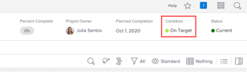

# Set a custom condition as the default for projects

If the Condition Type of a project is set to Progress Status instead of Manual, *Adobe Workfront* automatically displays one of three built-in default conditions on the project (On Target, At Risk, or In Trouble) as it progresses, as explained in [Overview of Project Condition and Condition Type](../../../manage-work/projects/manage-projects/project-condition-and-condition-type.md).

<!--

  

-->

You can set your custom conditions as default conditions instead of using these three built-in default conditions. For example, you could change the On Target default condition to display as Tracking Well in all projects.

## Access requirements

You must have the following to perform the steps in this article:

<table cellspacing="0"> 
 <col> 
 <col> 
 <tbody> 
  <tr> 
   <td role="rowheader"><em>Adobe Workfront</em> plan</td> 
   <td> 
Any
 </td> 
  </tr> 
  <tr> 
   <td role="rowheader"><em>Adobe Workfront</em> license</td> 
   <td> 
<em>Plan</em> 
 </td> 
  </tr> 
  <tr> 
   <td role="rowheader">Access level configurations</td> 
   <td> 
You must be a <em>Workfront administrator</em>. For more information, see <a href="../../../administration-and-setup/add-users/configure-and-grant-access/grant-a-user-full-administrative-access.md" class="MCXref xref">Grant a user full administrative access</a>.
 
Note: If you still don't have access, ask your <em>Workfront administrator</em> if they set additional restrictions in your access level. For information on how a <em>Workfront administrator</em> can modify your access level, see <a href="../../../administration-and-setup/add-users/configure-and-grant-access/create-modify-access-levels.md" class="MCXref xref">Create or modify custom access levels</a>.
 </td> 
  </tr> 
 </tbody> 
</table>

## Set a custom condition as a default condition for all projects:

<ol> 
 <li value="1">Click the Main Menu icon  in the upper-right corner of <em>Adobe Workfront</em>, then click Setup .</li> 
 <li value="2">Click Project Preferences > Conditions. </li> 
 <li value="3">Click the Project tab. </li> 
 <li value="4">Click Set Default Conditions. </li> 
 <li value="5">In the drop-down menu next to the default condition you want to change, click the custom condition you want to use instead. </li> 
 <li value="6">Repeat the previous step for any other default condition you want to change.</li> 
 <li value="7">Click Save.</li> 
</ol>

For information about setting a custom condition as a default condition for tasks and issues, see [Set a custom condition as the default for tasks and issues](../../../administration-and-setup/customize-workfront/create-manage-custom-conditions/set-custom-condition-default-tasks-issues.md).

For information about setting up a project so that users can update it's condition manually, see [Update Condition for tasks and issues](../../../manage-work/projects/updating-work-in-a-project/update-condition-for-tasks-and-issues.md).

For information about custom conditions, see [Custom conditions](../../../administration-and-setup/customize-workfront/create-manage-custom-conditions/custom-conditions.md).
