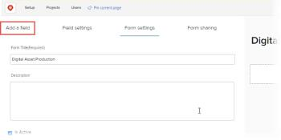
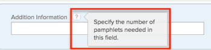

# Add a custom field to a custom form

You can add a field that has already been created for your organization. You can also create a new field and add it to a custom form. Both of these tasks are explained in this article.

## Access requirements

You must have the following to perform the steps in this article:

<table cellspacing="0"> 
 <col> 
 <col> 
 <tbody> Adobe Workfront plan* Any 
  <tr> 
   <td role="rowheader">Adobe Workfront license*</td> 
   <td> 
Plan 
 </td> 
  </tr> Access level configurations* Administrative access to custom forms For information about how Workfront administrators grants this access, see Grant users administrative access to certain areas.  
 </tbody> 
</table>

&#42;To find out what plan, license type, or access level configurations you have, contact your Workfront administrator.

## Reuse an existing field

<!--
[may need to say "existing field or widget" throughout this section; asking gevorg]
-->

1. Begin creating or editing a custom form, as described in [Create or edit a custom form](../../../administration-and-setup/customize-workfront/create-manage-custom-forms/create-or-edit-a-custom-form.md).
1. Click `Field Library`, then select the field in the list that appears.

   You cannot use an existing field more than once on a form.

   >[!IMPORTANT]
   >
   >When you modify an existing field, any changes you make impact that field on all forms where it is used.

1. Click `Apply`.
1. (Optional) Repeat the two previous steps to add any other existing fields.

   >[!NOTE]
   >
   >You can add up to 500 fields on a single custom form. However, performance degradation can occur when more than 100 fields exist on a form, depending on the complexity of the form. Examples of complex forms include forms with cascading parameters, calculated custom data fields, and multiple value options in a single field.

1. (Optional) Create and add any new fields you need that have not yet been created for your organization, as explained in [Add a custom field](#create) in this article.
1. (Optional) To position fields on the same row, drag them next to each other until a line appears between them.

   When you drop the field where you want it, a gray outline box appears around the two fields, indicating that they share a row. If you drag a field until the blue line appears above or below another field, the fields do not share a row.

   >[!NOTE]
   >
   >
   >  
   >  
   >  * You can use the `Preview` button in the lower-right corner to get an idea of how the fields will display in the form.
   >  * Fields may not display exactly the same way in the form, depending on how much screen space is available when a user is viewing it. For example, the third field in a row of fields may wrap to the next row of fields if horizontal space is limited.
   >  
   >

1. If you want to add a new custom field to the form, continue on to [Add a custom field](#create) in this article.

   Or

   If you want to continue building your custom form in other ways, continue on to one of the following articles:

  * [Add calculated data to a custom form](../../../administration-and-setup/customize-workfront/create-manage-custom-forms/add-calculated-data-to-custom-form.md) 
  * [Using an existing calculated custom field on a new custom form](../../../administration-and-setup/customize-workfront/create-manage-custom-forms/use-existing-calc-field-new-custom-form.md) 
  * [Position fields in a custom form](../../../administration-and-setup/customize-workfront/create-manage-custom-forms/position-fields-in-a-custom-form.md) 
  * [Display logic and skip logic on a custom form](../../../administration-and-setup/customize-workfront/create-manage-custom-forms/display-or-skip-logic-custom-form.md) 
  * [Preview and complete a custom form](../../../administration-and-setup/customize-workfront/create-manage-custom-forms/preview-and-complete-a-custom-form.md)

## Add a custom field

1. Begin creating or editing a custom form, as described in [Create or edit a custom form](../../../administration-and-setup/customize-workfront/create-manage-custom-forms/create-or-edit-a-custom-form.md).
1. Click **Add a field**.

   

1. With `New Field` selected, select one of the field types listed below:

   <table cellspacing="0"> 
    <col> 
    </col> 
    <col> 
    </col> 
    <tbody> 
     <tr> 
      <td role="rowheader">Single Line Text Field</td> 
      <td>Allows users to type a single line of text in the field.</td> 
     </tr> 
     <tr> 
      <td role="rowheader">Paragraph Text Field</td> 
      <td>Allows users to type multiple lines of text in the field.</td> 
     </tr> Text Field with Formatting Allows users to type multiple lines of text in the field and format the text with bold, italics, underline, bullets, numbering, hyperlinks, and block quotes. This is available in Home, the Updates area, lists, and the Details area for Workfront objects. A character limit of 15,000 allows for plenty of text and formatting. For information about accessing this field through the API, see Rich text field storage in the API. Note: Text fields with formatting are not available for Workfront mobile apps (available in coming releases). 
     <tr> 
      <td role="rowheader">Dropdown</td> 
      <td>Provides a list of drop-down choices.</td> 
     </tr> 
     <tr> 
      <td role="rowheader">Typeahead </td> 
      <td> 
Allows users to type the name of an object that exists in Workfront. A list of suggestions appears when the user starts typing. 
 </td> 
     </tr> 
     <tr> 
      <td role="rowheader">Calculated</td> 
      <td>Allows you to define an expression and display the result on the custom form. For more information, see <a href="../../../administration-and-setup/customize-workfront/create-manage-custom-forms/add-calculated-data-to-custom-form.md" class="MCXref xref">Add calculated data to a custom form</a>.</td> 
     </tr> 
     <tr> 
      <td role="rowheader">Date</td> 
      <td>Displays a calendar where users can select a date and time.</td> 
     </tr> 
     <tr> 
      <td role="rowheader">Checkboxes</td> 
      <td>Allows users to select multiple choices.</td> 
     </tr> 
     <tr> 
      <td role="rowheader">Radio Buttons</td> 
      <td>Requires users to select only one choice.</td> 
     </tr> 
     <tr> 
      <td role="rowheader">Descriptive Text</td> 
      <td>Allows you to include instructions and link to pages outside Workfront.</td> 
     </tr> 
     <tr> 
      <td role="rowheader">Section Break</td> 
      <td> 
Allows you to break up the information on the form in separate sections. You can nest additional custom fields under one section.
 
When you add a section, it can’t be saved in the custom form unless you add at least one field to it. 
 
Sections you add to custom forms are saved for re-use. To list them, click Setup &gt; Custom Forms, then click the Sections tab.
 </td> 
     </tr> 
    </tbody> 
   </table>

1. On the `Field Settings` tab, change any of the following options available for the type of field you are adding:

   (Required) Type a descriptive label for the custom field. It displays above the custom field when users view the field on a custom form added to an object.

   You can change the label at any time.

   >[!IMPORTANT]
   >
   >Avoid using special characters in this label. They don't display correctly in reports.

   <table cellspacing="0"> 
    <col> 
    </col> 
    <col> 
    </col> 
    <tbody> 
     <tr> 
      <td role="rowheader">Label</td> 
      <td> 
(Required) Type a descriptive label for the custom field. It displays above the custom field when users view the field on a custom form added to an object.
 
You can change the label at any time.
 
Important: Avoid using special characters in this label. They don't display correctly in reports.
 </td> 
     </tr> 
     <tr> 
      <td role="rowheader">Name</td> 
      <td> 
(Required) This name is how the system identifies the custom field when you add it to various areas throughout Workfront, such as reports, Home, and API interactions.
 
When you are configuring the custom field for the first time and you type the label, the Name field populates automatically to match it. But the Label and Name fields are not synchronized—this gives you the freedom to change the label that your users see without having to change the name that the system sees.
 
Important:   
        <ul> 
         <li> 
Though it's possible to do so, we recommend that you do not change this name after you or other users start using the custom form in Workfront. If you do, the system will no longer recognize the custom field where it might now be referenced in other areas of Workfront. 
 
For example, if you add the custom field to a report and later change the custom field's name, Workfront doesn't recognize the custom field in the report and custom field will stop functioning correctly there unless you re-add it to the report using the new name. 
 </li>  
        </ul> 
 
Each custom field name must be unique in your organization's Workfront instance. This way, you can reuse a custom field already created for another custom form. For more information, see <a href="#add" class="MCXref xref" data-mc-variable-override="">Reuse an existing field</a> in this article.<!--
         [may need to say "existing field or widget" throughout that section; asked gevorg and he says they're still figuring this out]
        -->
 </td> 
     </tr> 
     <tr> 
      <td role="rowheader">Instructions</td> 
      <td> 
Type any additional information about the custom field. When users fill out the custom form, they can hover over the question mark icon to view a tool tip containing the information you type here.
 
  </img> 
 </td> 
     </tr> 
     <tr> 
      <td role="rowheader">Format</td> 
      <td> 
Select the type of data that will be captured in the field
 
Note:   
        <ul> 
         <li>This field cannot be edited after the form is saved. If you intend to use your field in mathematical calculations, ensure that you select a Number or Currency format. </li> 
         <li>When you select Number or Currency, the system automatically truncates numbers that start with 0.</li> 
        </ul> 
 </td> 
     </tr> 
     <tr> 
      <td role="rowheader">Size</td> 
      <td>(Text fields only) Select a width for the field.</td> 
     </tr> 
     <tr> 
      <td role="rowheader">Display Time of Day</td> 
      <td>(Date fields only) Select this option if you want to show the time of day along with the date in the field.</td> 
     </tr> 
     <tr> 
      <td role="rowheader">Referenced Object Type</td> 
      <td> 
(Typeahead fields only) Select the object type that you want to associate with the field.
 
Once you have clicked Apply or Save+Close, you cannot change the object type for the field.
 
Note:   
        <ul> 
         <li>If your Workfront administrator customized the name for Portfolios, Programs, or Projects in the Workfront user interface, the default Workfront name for the object appears in this drop-down list, not the customized name. See your Workfront administrator if you need help with this. </li> 
         <li>The following object types are supported in the iOS and Android Workfront Mobile Apps: User, Company, Group, Job Role, Portfolio, Program, Project, and Template.</li> 
        </ul> 
 </td> 
     </tr> Add Filter (Typeahead fields only) Add a filter for an object type to limit the objects users can choose when they are using the field. For example, you could limit a field so that user names can be selected only if they meet the following criteria: They belong to a group or groups that you specify They are associated with a role or job title you specify They belong to the same group as the person using the field You must define the filter for the object type you selected using Text Mode syntax. For instructions on creating a filter, see Add a custom field in the article Add a custom field to a custom form. For information about creating a filter using Text Mode, see the section Edit text mode in a filter in the article Text Mode overview. Note: If you are editing an existing custom form, adding a filter to a Typeahead field does not remove any objects (outside the scope of the filter) that users have already added using the field. This filter is not available on mobile devices. If you use the filter for a Typeahead field, the field will appear on users' mobile devices unaffected by the filter. 
     <tr> 
      <td role="rowheader">Descriptive Text</td> 
      <td>(Descriptive Text fields only) Type the text that you want to display to provide instructions or a link on the custom form. </td> 
     </tr> 
     <tr> 
      <td role="rowheader">Hyperlink</td> 
      <td>(Descriptive Text fields only) If you want to apply a hyperlink to the Descriptive Text you have typed, add it here.</td> 
     </tr> 
     <tr> 
      <td role="rowheader">Make a required field</td> 
      <td>Select this option if you want the field to be required in order for the user to complete the custom form. </td> 
     </tr> 
     <tr> 
      <td role="rowheader">Display field changes in update feeds</td> 
      <td> 
Select this option if you want the Updates area for objects where this custom form is attached to record changes that users make to information (values) in the field.
 
Note:   
This option is not available for the following:
 
        <ul> 
         <li>Custom forms associated with the following object types: Expense, Company, Iteration, Billing Record, and Group.</li> 
         <li>The following field types: Calculated , Descriptive Text , and Section Break</li> 
        </ul> 
 <!--
        If this option is already enabled for at least one object type, and the custom form you're working on is associated with multiple object types, you can indicate other object types where you want to automatically track the field's value changes. SCREENSHOT Selecting or deselecting an object type here affects all custom forms that are associated with the selected object type and that contain this field. For example, if you deselect an object type here and save the custom form, the field's value changes are no longer tracked for that object type in both of the following places: The custom form you're working on All other custom forms that are associated with the deselected object type and that contain this field Note: After you select an object type here and save the custom form, the field that you're working on displays on the Custom Fields tab in the Update Feeds area in Setup. Conversely, if this field is deleted on that page, the object type is deselected for this setting on all custom forms that are associated with the object type and that contain this field. For more information, see the section Add fields you want Workfront to track in the article Configure system updates.
       --> </td> 
     </tr> 
     <tr> 
      <td role="rowheader">Add Logic</td> 
      <td>Specify which fields should appear on the form, based on selections users make in existing fields. For more information, see <a href="../../../administration-and-setup/customize-workfront/create-manage-custom-forms/display-or-skip-logic-custom-form.md" class="MCXref xref">Display logic and skip logic on a custom form</a>.</td> 
     </tr> 
     <tr> 
      <td role="rowheader">Options</td> 
      <td> 
(Dropdown, Checkboxes, or Radio Buttons only; optional) Select any option to do the following:
 
       <ul> 
        <li>Sort Choices A-Z: Sort the choices you add alphabetically in the field.</li> 
        <li>Click Show Values: Show the values of each choice in the field. The label of each choice shows by default.</li> 
       </ul> </td> 
     </tr> 
     <tr> 
      <td role="rowheader">Choices </td> 
      <td>(Dropdown, Checkboxes, or Radio Buttons only; optional) For each choice you add for the user, select one of the following options: 
       <ul> 
        <li>Select by Default: Select the choice by default in the field.</li> 
        <li>
Hide Choice: Hide the choice in the field.

 Hidden choices remain accessible in reports.
</li> 
        <li>
Remove Choice: Remove the choice from the field.

Warning: </b>"><b>Warning: </b> If you have current objects using this choice, do not remove it from the field. Removing it will cause historic data to be lost. Instead, select the option to hide it, which prevents users from selecting it in the future.
</li> 
       </ul></td> 
     </tr> 
     <tr> 
      <td role="rowheader">In order to VIEW this section, people must have permission to</td> 
      <td> 
 (Section Break only) Select the permissions users need on the object associated with the form in order to view this section:
 
       <ul> 
        <li>View: The user needs View permissions to the object to be able to view this section.</li> 
        <li>Manage: The user needs Manage permissions to the object to be able to view this section.</li> 
        <li>Admin only: Only the Workfront administrator can see this section.</li> 
       </ul> 
Note: Users who don't have the permissions you specify here cannot see the values of the fields in the section. This is also true if you display the values in reports or use them in calculated fields in text mode reporting.
 </td> 
     </tr> 
     <tr> 
      <td role="rowheader">In order to EDIT this section, people must have permission to</td> 
      <td> 
(Section Break only) Select the permissions users need on the object associated with the form in order to edit information in this section:
 
       <ul> 
        <li>Manage: The user needs Manage permissions to the object to be able to edit this section.</li> 
        <li> 
Admin only: Only Workfront administrators can edit this section.
 </li> 
       </ul> 
Note:   
        <ul> 
         <li>The access you are setting here is related to the permissions the user has to the object associated with the custom form. It's not related to the permissions the user has to the custom form itself.</li> 
         <li>Users who don't have the permissions you specify here cannot edit the values of the fields in the section. This is also true if you display the values in reports or use them in calculated fields in text mode reporting.</li> 
        </ul> 
 </td> 
     </tr> 
    </tbody> 
   </table>

1. (Conditional) To change the display type of a field on the custom form, click the `Display Type` drop-down menu, then click the type you want.

   You can switch between the following field display types:

  * `Selection-type fields`: Checkboxes, Dropdown, Radio Buttons.
  * `Text-type fields`: Single Line Text Field, Paragraph Text Field. (You can’t switch a Text Field with Formatting to a different display type. However, you can remove it and add another type of field.)

   For example, if you have created a Checkboxes field, you can change it to a Dropdown field or a Radio Buttons field. Or, if you have created a Single Line Text Field, you can change it to a Paragraph Text field.

   >[!NOTE]
   >
   >Consider the following when you want to change a field's display type from a checkbox field or a multi-select dropdown field (a dropdown allowing more than one option to be selected) to a single-select field type:
   >
   >  
   >  
   >  * If you change to Radio Buttons, Workfront retains any multi-select values that a user may have entered in the field until the user changes and saves data in any part of the form. At this point, any values that were selected using the multi-select-type field are replaced by the selected Radio Button value.
   >  * If you change to a single-select Dropdown, Workfront retains any multi-select values that a user may have entered in the field until the user changes and saves the values in the field. At this point, any values that were selected using the multi-select-type field are replaced by the selected Dropdown value.
   >  
   >

1. (Optional) Repeat steps 2-6 to add other custom fields.

   Or

   Add fields that have already been created for your organization, as explained in [Reuse an existing field](#add).

   >[!NOTE]
   >
   >You can add up to 500 fields on a single custom form. However, performance degradation can occur when more than 100 fields exist on a form, depending on the complexity of the form. Examples of complex forms include forms with cascading parameters, calculated custom data fields, and multiple value options in a single field.

1. If you want to add a custom field already existing in your system, continue on to [Reuse an existing field](#add) in this article.

   Or

   If you want to continue building your custom form in other ways, continue on to one of the following articles:

  * [Add calculated data to a custom form](../../../administration-and-setup/customize-workfront/create-manage-custom-forms/add-calculated-data-to-custom-form.md) 
  * [Position fields in a custom form](../../../administration-and-setup/customize-workfront/create-manage-custom-forms/position-fields-in-a-custom-form.md) 
  * [Using an existing calculated custom field on a new custom form](../../../administration-and-setup/customize-workfront/create-manage-custom-forms/use-existing-calc-field-new-custom-form.md) 
  * [Display logic and skip logic on a custom form](../../../administration-and-setup/customize-workfront/create-manage-custom-forms/display-or-skip-logic-custom-form.md) 
  * [Preview and complete a custom form](../../../administration-and-setup/customize-workfront/create-manage-custom-forms/preview-and-complete-a-custom-form.md)

