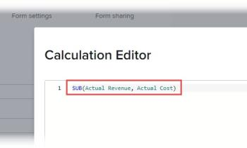
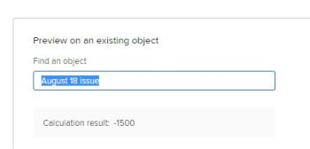

# Add calculated data to a custom form {#add-calculated-data-to-a-custom-form}

The highlighted information on this page refers to functionality not yet generally available. It is available only in the Preview Sandbox environment.


In a custom form, you can build a calculated custom field that generates calculations. To do this, you create a statement that uses data expressions and the names of existing fields (custom fields, calculated custom data fields, and built-in *`Workfront`* fields). This statement calculates the data you enter and displays the result in the new calculated custom field.

` `**Example: **`` If you need *`Workfront`* to calculate the profit generated by work items that your organization carries out, you could create a calculated custom field called Profit containing a mathematical expression that subtracts Cost from Revenue.


To do this, you could use the mathematical express “SUB” and the built-in *`Workfront`* fields Actual Cost and Actual Revenue for this.


In the steps below, you can see how this example can be carried out.
For information about creating custom forms for your organization and understanding the type of fields you can associate with them, see [Create or edit a custom form](create-or-edit-a-custom-form.md).


## Access requirements {#access-requirements}

You must have the following to perform the steps in this article:

<table class="TableStyle-TableStyle-List-options-in-steps" style="margin-left: 0;margin-right: auto;mc-table-style: url('../../../Resources/TableStyles/TableStyle-List-options-in-steps.css');" cellspacing="0"> 
 <col class="TableStyle-TableStyle-List-options-in-steps-Column-Column1"> 
 <col class="TableStyle-TableStyle-List-options-in-steps-Column-Column2"> 
 <tbody> 
  <tr class="TableStyle-TableStyle-List-options-in-steps-Body-LightGray" data-mc-conditions=""> 
   <td class="TableStyle-TableStyle-List-options-in-steps-BodyE-Column1-LightGray" role="rowheader"> <p><span class="mc-variable WFVariables.FullProdNameWF variable varname">Adobe Workfront</span> plan*</p> </td> 
   <td class="TableStyle-TableStyle-List-options-in-steps-BodyD-Column2-LightGray">Any</td> 
  </tr> 
  <tr class="TableStyle-TableStyle-List-options-in-steps-Body-MediumGray"> 
   <td class="TableStyle-TableStyle-List-options-in-steps-BodyE-Column1-MediumGray" role="rowheader"><span class="mc-variable WFVariables.FullProdNameWF variable varname">Adobe Workfront</span> license*</td> 
   <td class="TableStyle-TableStyle-List-options-in-steps-BodyD-Column2-MediumGray"> <p><span class="mc-variable WFVariables.WFLicense-Plan variable varname">Plan</span> </p> </td> 
  </tr> 
  <tr class="TableStyle-TableStyle-List-options-in-steps-Body-LightGray" data-mc-conditions=""> 
   <td class="TableStyle-TableStyle-List-options-in-steps-BodyE-Column1-LightGray" role="rowheader">Access level configurations*</td> 
   <td class="TableStyle-TableStyle-List-options-in-steps-BodyD-Column2-LightGray"> <p>Administrative access to custom forms</p> <p>For information about how <span class="mc-variable WFVariables.AdminWF-plur variable varname">Workfront administrators</span> grants this access, see <a href="grant-users-admin-access-certain-areas.md" class="MCXref xref">Grant users administrative access to certain areas</a>.</p> </td> 
  </tr> 
  <tr class="TableStyle-TableStyle-List-options-in-steps-Body-MediumGray" data-mc-conditions="SnippetConditions.HIDE"> 
   <td class="TableStyle-TableStyle-List-options-in-steps-BodyB-Column1-MediumGray" role="rowheader">Object permissions</td> 
   <td class="TableStyle-TableStyle-List-options-in-steps-BodyA-Column2-MediumGray"> <p>Manage access to the <span class="mc-variable snippet-variables-custom-forms.custom-form-or-field variable varname">custom form</span></p> <p>For information on requesting additional access, see <a href="request-access.md" class="MCXref xref">Request access to objects in Adobe Workfront</a>.</p> </td> 
  </tr> 
 </tbody> 
</table>

&#42;To find out what plan, license type, or access level configurations you have, contact your *`Workfront administrator`*.


## Add a calculated field to a custom form {#add-a-calculated-field-to-a-custom-form}


>[!IMPORTANT] {type="important"}
>
>Before you create a new calculated custom field, identify the existing fields that you want to include in the statement so that you are sure that the data necessary for the calculation is present in *`Workfront`*.


1. Click the `Main Menu` icon  in the upper-right corner of *`Adobe Workfront`*, then click `Setup` .

1. In the left panel, click `Custom Forms`.
1.  Select an existing custom form where you want to create calculated custom data, then click `Edit`.


   Or


   Create a new custom form, as described in [Create or edit a custom form](create-or-edit-a-custom-form.md).  


1. On the `Add a Field` tab, click `Calculated`.

1.  Specify the following information for the calculated field:

<table style="width: 100%;margin-left: 0;margin-right: auto;mc-table-style: url('../../../Resources/TableStyles/TableStyle-List-options-in-steps.css');" class="TableStyle-TableStyle-List-options-in-steps" cellspacing="0"> 
 <col class="TableStyle-TableStyle-List-options-in-steps-Column-Column1"> 
 </col> 
 <col class="TableStyle-TableStyle-List-options-in-steps-Column-Column2"> 
 </col> 
 <tbody> 
  <tr class="TableStyle-TableStyle-List-options-in-steps-Body-LightGray"> 
   <td class="TableStyle-TableStyle-List-options-in-steps-BodyE-Column1-LightGray" role="rowheader">Label</td> 
   <td class="TableStyle-TableStyle-List-options-in-steps-BodyD-Column2-LightGray">Type a label for the field. This is what users will see when they use the custom form. The field <b>Name</b>, which fills in automatically, is referenced by <span class="mc-variable WFVariables.ProdNameWF variable varname">Workfront</span> in reports.</td> 
  </tr> 
  <tr class="TableStyle-TableStyle-List-options-in-steps-Body-MediumGray"> 
   <td class="TableStyle-TableStyle-List-options-in-steps-BodyE-Column1-MediumGray" role="rowheader"><a name="Instructions"></a>Instructions</td> 
   <td class="TableStyle-TableStyle-List-options-in-steps-BodyD-Column2-MediumGray"> <p>By default, the formula you create for the field is stored here. You can add text to provide additional information about the field and the formula in it. This can be useful in 2 ways:</p> 
    <ul> 
     <li> <p>You can use it as a reminder of what the formula is and how it works. This can be especially helpful if you plan to use this calculated custom field on multiple forms.</p> </li> 
     <li> <p>When users fill out the custom form, they can hover over the field to display the text stored here in a tooltip. You add any text here that you want them to see in the tooltip. </p> <p>Tip: <span class="preview">If you don't want them to see the formula in the tooltip, which might be confusing for them, you can hide it. For instructions, see the table row "Display formula in instructions in this article."</span> </p> </li> 
    </ul> <p>For information about using the same calculated custom field on a new form, see <a href="use-existing-calc-field-new-custom-form.md#using-an-existing-calculated-custom-field-on-a-new-form" class="MCXref xref">Using an existing calculated custom field on a new custom form</a>.</p> </td> 
  </tr> 
  <tr class="TableStyle-TableStyle-List-options-in-steps-Body-LightGray"> 
   <td class="TableStyle-TableStyle-List-options-in-steps-BodyB-Column1-LightGray" role="rowheader">Format</td> 
   <td class="TableStyle-TableStyle-List-options-in-steps-BodyA-Column2-LightGray"> <p>The format in which you want the results of the field are stored and displayed.</p> <p>If the field will be used in mathematical calculations, always use a <span class="bold">Number</span> or a <span class="bold">Currency</span> format. When you select Number or Currency, the system automatically truncates numbers that start with 0.</p> <p>Important: Before you choose a format, consider the correct format for the new field. The format field cannot be edited after the custom form is saved. And selecting the wrong format could impact future calculations and aggregate values in report and list groupings.</p> </td> 
  </tr> 
 </tbody> 
</table>


1.  Continue on to [Build the calculation for your calculated custom field](#build) in this article.


## Build the calculation for your calculated custom field {#build-the-calculation-for-your-calculated-custom-field}


1. Start creating the calculated custom field, as explained in the section [Add a calculated field to a custom form](#creating-calculated-custom-fields) in this article.
1.  Click **Maximize** to open the **Calculation Editor** and build your calculation, then click **Minimize** to close it when you are finished.


   A calculation must start with an expression followed by parentheses containing the fields you want to reference. For example, in a project-type custom form, you could create a Profit custom field with a calculation that displays the difference between Actual Revenue and Actual Cost: 

   ```
   SUB(Actual Revenue, Actual Cost)
   ```


   For information about the expressions that are available, see [Calculated data expressions](calculated-data-expressions.md).


   You can do the following in the Calculation Editor:

    
    
    * Drag or single-click expressions and fields to add them to your calculation.
    * Hover over an expression `in your calculation to see a description of the expression, an example showing how it can be used, and a link to more information in the article [Calculated data expressions](calculated-data-expressions.md).`
    *  Use the color coding to identify the components you have added.
    
    
      Expressions display in blue and fields display in green:
    
    
          
    

    
    * Reference expressions in a long calculation using the line numbers that display on the left.
    * Start typing an expression or field to display a list of available items, then click the one you need. Each item displays with an "F" for field or an "E" for expression.
    * Type an opening parenthesis and the closing parenthesis is added automatically.
    *  In the area below your calculation, review the results on an existing *`Workfront`* object
    
    
          
    

    
    
    

1.  (Optional) Use any of the following options to configure your calculated custom field:

<table style="width: 100%;margin-left: 0;margin-right: auto;mc-table-style: url('../../../Resources/TableStyles/TableStyle-List-options-in-steps.css');" class="TableStyle-TableStyle-List-options-in-steps" cellspacing="0"> 
 <col class="TableStyle-TableStyle-List-options-in-steps-Column-Column1"> 
 <col class="TableStyle-TableStyle-List-options-in-steps-Column-Column2"> 
 <tbody> 
  <tr class="TableStyle-TableStyle-List-options-in-steps-Body-LightGray"> 
   <td class="TableStyle-TableStyle-List-options-in-steps-BodyE-Column1-LightGray" role="rowheader">Add Logic</td> 
   <td class="TableStyle-TableStyle-List-options-in-steps-BodyD-Column2-LightGray"> <p>You can decide which sections of a custom form should be displayed or skipped based on the choices that a user makes when filling it out, as explained in <a href="display-or-skip-logic-custom-form.md" class="MCXref xref">Display logic and skip logic on a custom form</a>.</p> <p>This is available only when a checkbox, radio button, or a drop-down field precedes the calculated custom field. </p> </td> 
  </tr> 
  <tr class="TableStyle-TableStyle-List-options-in-steps-Body-MediumGray"> 
   <td class="TableStyle-TableStyle-List-options-in-steps-BodyE-Column1-MediumGray" role="rowheader">Update previous calculations</td> 
   <td class="TableStyle-TableStyle-List-options-in-steps-BodyD-Column2-MediumGray">When you are editing an existing calculated custom field, you can select this option to trigger an update in the calculation when you save the custom form. This happens only once when you save the custom form. The option returns to its disabled state after you do so.</td> 
  </tr> 
  <tr class="TableStyle-TableStyle-List-options-in-steps-Body-LightGray" data-mc-conditions="QuicksilverOrClassic.Quicksilver"> 
   <td class="TableStyle-TableStyle-List-options-in-steps-BodyB-Column1-LightGray" role="rowheader"><span class="preview"><a name="Display_formula_in_instructions"></a>Display formula in instructions</span> </td> 
   <td class="TableStyle-TableStyle-List-options-in-steps-BodyA-Column2-LightGray">Leave this option enabled if you want the users who fill out the custom form to see the field's formula when they hover over the field. Or disable it if you don't want them to see it. For more information, see <a href="#instructions" class="MCXref xref">Instructions</a> earlier in this table.</td> 
  </tr> 
 </tbody> 
</table>


1. Click `Done`when all changes are complete on the calculated custom field.
1. (Optional) Click `Apply`to apply your changes to the form so far if you want to continue adding custom fields to the form.
1. Click `Save + Close`when all changes are complete on the custom form.
1.  To verify that your calculated custom field works correctly, attach the custom form to an object, then review the result in the calculated custom field.


   For instructions on attaching a custom form, see [Add a custom form to an object](add-a-custom-form-to-an-object.md).


## Considerations for building calculated custom fields {#considerations-for-building-calculated-custom-fields}

Consider the following when building a calculated custom field in a custom form, particularly if you are typing information instead of selecting it:


*  Field names are case-sensitive and must appear in the calculation exactly how they appear in the *`Workfront`* system.
* You can use both built-in *`Workfront`* fields and custom fields that you already created.
*   You can refer to objects that are related to other objects in a calculation. For information about how objects connect to one another, see the section [Interdependency and hierarchy of objects](understand-objects.md#understanding-interdependency-and-hierarchy-of-objects) in the article [Understand objects in Adobe Workfront](understand-objects.md).
*  When you reference a related object in a calculated custom field, you must separate the object names and attributes with periods.


  For example, in a task-type custom form, to display the name of the Portfolio Owner in a calculated custom field, you would type 

  ```
  Project.Portfolio.Owner
  ```

  .


  This would determine the following: From the object of the custom form (a task), you can access the next object related to the task (a project). From there, you can access the next related object to the project (a portfolio), then the next related object to the portfolio (the owner). 

*  When you reference another custom field in a calculated custom field, the name of the field appears as it displays in the *`Workfront`* user interface. For example, when referencing a Typeahead-type custom field, you would use the following calculation to reference the name of the object selected in a field labeled "Developer name:" 

  ```
  UPPER({DE:Developer name:name})
  ```


  >[!NOTE]
  >
  >If you manually enter the name of a custom field by the same name as a *`Workfront`* native field, you must precede it in the calculation by "DE:" and surround it by curly brackets to indicate that you are referencing another custom field.
  >
  >
  >For example, a calculated field containing the calculation below would display the data in a custom field named "Additional description" in all caps:   >
  >
  >```  >
  >UPPER({DE:Additional description)}
  >```  >
  >


*  If you enter data in a calculation incorrectly, a warning messages alerts you. You cannot save the form unless you edit your calculation to contain valid fields and a valid calculated expression.


## Automatic updates of calculated custom fields {#automatic-updates-of-calculated-custom-fields}

Calculated custom fields on an object recalculate automatically when the following things happen:


* Something on the object changes, such as a daily timeline calculation.
* Someone edits another field that is referenced by a calculated custom field on the object.


* The calculated expression in at least one of the fields contains 

  ```
  $TODAY or $NOW
  ```

* The calculated expression is empty and the field contains a value—this sets the value to null.


