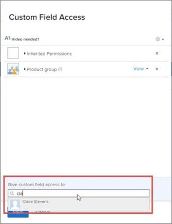
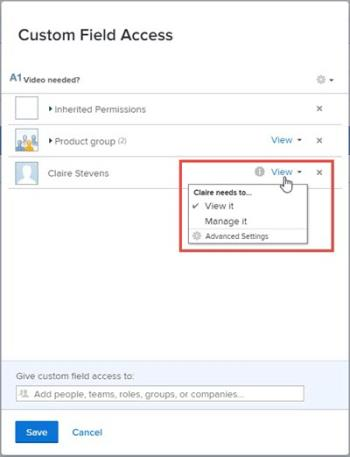

# Configure sharing for a custom field

By default, when you create a new custom field in a custom form, anyone in the system with access to custom forms can edit the field. You can change this and control exactly how and with whom the field can be shared.

## Access requirements

You must have the following to perform the steps in this article:

<table cellspacing="0"> 
 <col> 
 <col> 
 <tbody> Adobe Workfront plan* Any 
  <tr> 
   <td role="rowheader">Adobe Workfront license*</td> 
   <td> 
Plan 
 </td> 
  </tr> Access level configurations* Administrative access to custom forms For information about how Workfront administrators grants this access, see Grant users administrative access to certain areas. 
 </tbody> 
</table>

&#42;To find out what plan, license type, or access level configurations you have, contact your Workfront administrator.

## Configure sharing for a custom field

<ol> 
 <li value="1">Click the Main Menu icon  in the upper-right corner of Adobe Workfront, then click Setup .</li> 
 <li value="2">In the left panel, click Custom Forms.</li> 
 <li value="3"> 
 If you are configuring sharing for a custom field in your organization's list of fields, do the following:
 
  <ol> 
   <li value="1">Click the Fields tab.</li> 
   <li value="2">Select the custom field or fields for which you want to configure sharing, then click Share.</li> 
  </ol> 
Or, if you are configuring sharing for a custom field in an existing custom form, do the following:
 
  <ol> 
   <li value="1"> 
Select the custom form, then click Edit.
 </li> 
   <li value="2"> 
In the form editing area on the right, select the custom field you want to configure sharing options for.
 </li> 
   <li value="3"> 
In the left panel, click Share field.
 </li> 
  </ol> </li> 
 <li value="4"> 
In the Custom Field Access box that displays, specify who you want to share the field with and how you want to share it:
 
  <ol style="list-style-type: lower-alpha;"> 
   <li value="1"> 
Near the lower-left corner of the Custom Field Access box, under Give custom field access to, start typing the name of a user, team, job role, group, or company with whom you want to share the field, then click the name when it appears.
 
  
 </li> 
   <li value="2"> 
If you want to be more specific about how you want to share the field with a user, team, job role, group, or company you added in the previous step, click the drop-down list to the right of the name, then use any of the following options:
 
  
 
    <table cellspacing="0"> 
     <col> 
     <col> 
     <tbody> 
      <tr> 
       <td role="rowheader">View it</td> 
       <td> 
You can click Advanced Settings to specify whether you want the user or users to be able to use their access to add the custom field to a Custom Form or share it with other users.
 </td> 
      </tr> 
      <tr> 
       <td role="rowheader">Manage it</td> 
       <td> 
Allows access to edit the custom field and to see it in the Field Library and on the page where you build Custom Forms.
 
You can click Advanced Settings to specify whether you want the user or users to be able to use their access to delete the custom field from the system or share it with other users.
 </td> 
      </tr> 
     </tbody> 
    </table> </li> 
  </ol> </li> 
 <li value="5">(Optional) Repeat the previous step to add other names to the list and configure their options.</li> 
 <li value="6"> 
(Optional) Click the gear icon  in the top-right corner if you want to choose a system-wide sharing option for the field.
 
Not all of the following options display in this drop-down menu at the same time. For example, the second one displays only when one of the other two are selected.
 
  <ul> 
   <li> 
Make this editable system-wide so that everyone in Workfront can edit it (the default option)
 
When you create a custom field and you don’t limit sharing for it, it can be viewed and edited by everyone in the system who has access to custom forms.
 </li> 
   <li> 
Remove system-wide edit access 
 
Limits access to only those whom you added to the list. 
 </li> 
   <li>Make this visible system-wide so that everyone in Workfront can see it </li> 
  </ul> </li> 
 <li value="7">Click Save or <b>Save + Close</b>.</li> 
</ol>

## Inherited access to custom fields when a custom form is shared

When someone shares a custom form with a group, job role, team, or company, the recipients inherit View access to any custom fields that are on the form. This level of access to the fields on the form is always retained so that the form can function for the recipients as intended by the person who created it. This is true even for recipients who have Edit access to the form.

You can find out who has inherited access to a field and you can remove access to a shared field.

>[!NOTE]
>
>If a recipient has Manage access to a custom field on the shared custom form, that access is retained for the recipient.

* [Find out who has access to a field because it was on a form that was shared](#find) 
* [Remove access to a field in a custom form that was shared](#remove)

### Find out who has access to a field because it was on a form that was shared

<ol> 
 <li value="1">Click the Main Menu icon  in the upper-right corner of Adobe Workfront, then click Setup .</li> 
 <li value="2">In the left panel, click Custom Forms.</li> 
 <li value="3">Click the Fields tab, then select the custom field.</li> 
 <li value="4"> 
In the Custom Field Access box that displays, click Inherited Permissions and view the names that display.
 </li> 
 <li value="5">Click Cancel.</li> 
</ol>

### Remove access to a field in a custom form that was shared

If you need to remove access to a field in a custom form that was shared, you need to unshare the form. For instructions, see in the section [Remove access to a custom form](../../../administration-and-setup/customize-workfront/create-manage-custom-forms/share-access-to-a-custom-form.md#unshare) in the article [Share a custom form](../../../administration-and-setup/customize-workfront/create-manage-custom-forms/share-access-to-a-custom-form.md).
