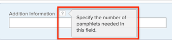

# Create or edit a custom form {#create-or-edit-a-custom-form}

You can create a new custom form or copy a custom form to create a new one that is based on the original. You can also edit an existing custom form.

## Access requirements {#access-requirements}

You must have the following to perform the steps in this article:

<table class="TableStyle-TableStyle-List-options-in-steps" style="margin-left: 0;margin-right: auto;mc-table-style: url('../../../Resources/TableStyles/TableStyle-List-options-in-steps.css');" cellspacing="0"> 
 <col class="TableStyle-TableStyle-List-options-in-steps-Column-Column1"> 
 <col class="TableStyle-TableStyle-List-options-in-steps-Column-Column2"> 
 <tbody> 
  <tr class="TableStyle-TableStyle-List-options-in-steps-Body-LightGray" data-mc-conditions=""> 
   <td class="TableStyle-TableStyle-List-options-in-steps-BodyE-Column1-LightGray" role="rowheader"> 
Adobe Workfront plan*
 </td> 
   <td class="TableStyle-TableStyle-List-options-in-steps-BodyD-Column2-LightGray">Any</td> 
  </tr> 
  <tr class="TableStyle-TableStyle-List-options-in-steps-Body-MediumGray"> 
   <td class="TableStyle-TableStyle-List-options-in-steps-BodyE-Column1-MediumGray" role="rowheader">Adobe Workfront license*</td> 
   <td class="TableStyle-TableStyle-List-options-in-steps-BodyD-Column2-MediumGray"> 
Plan 
 </td> 
  </tr> 
  <tr class="TableStyle-TableStyle-List-options-in-steps-Body-LightGray" data-mc-conditions=""> 
   <td class="TableStyle-TableStyle-List-options-in-steps-BodyE-Column1-LightGray" role="rowheader">Access level configurations*</td> 
   <td class="TableStyle-TableStyle-List-options-in-steps-BodyD-Column2-LightGray"> 
Administrative access to custom forms
 
For information about how Workfront administrators grants this access, see <a href="grant-users-admin-access-certain-areas.md" class="MCXref xref">Grant users administrative access to certain areas</a>.
 </td> 
  </tr> 
  <tr class="TableStyle-TableStyle-List-options-in-steps-Body-MediumGray" data-mc-conditions="SnippetConditions.HIDE"> 
   <td class="TableStyle-TableStyle-List-options-in-steps-BodyB-Column1-MediumGray" role="rowheader">Object permissions</td> 
   <td class="TableStyle-TableStyle-List-options-in-steps-BodyA-Column2-MediumGray"> 
Manage access to the custom form
 
For information on requesting additional access, see <a href="request-access.md" class="MCXref xref">Request access to objects in Adobe Workfront</a>.
 </td> 
  </tr> 
 </tbody> 
</table>

&#42;To find out what plan, license type, or access level configurations you have, contact your *`Workfront administrator`*.

## Start creating a custom form {#start-creating-a-custom-form}

1. Click the `Main Menu` icon  in the upper-right corner of *`Adobe Workfront`*, then click `Setup` .

1.  Click `Custom Forms` in the left panel.

   In the view that appears, you can review all custom forms and custom fields that have been created for your organization. You can also see who created each form and the fields that are associated with it.

1.  Click `New Custom Form`, then click the object type in the drop-down list that you want to associate with the custom form.

   The object type that you select is the only type that you can associate with the form.

1. On the `Form Settings` tab that opens, type a `Form Title` and (optional) a `Description` for the custom form.  

1.  Click `Done`.

   >[!TIP] {type="tip"}
   >
   >You can click `Apply` at any point while you are creating a custom form to save your changes and keep the form open.

1. Continue on to [Add a field to a custom form](#add2).

## Start editing a custom form {#start-editing-a-custom-form}

You can edit a custom form any time after it has been created. 

` `**Warning: **`` For information about removing fields from a custom form without losing data that users have entered in those fields, see the section [Remove fields without losing data](delete-a-custom-field.md#remove) in the article [Delete a custom field](delete-a-custom-field.md).

In general, we recommend minimizing the number of times you edit a custom form that is already in use. There is no notification system to alert people who use the custom form about your changes.

1. Click the `Main Menu` icon  in the upper-right corner of *`Adobe Workfront`*, then click `Setup` .

1.  Click `Custom Forms` in the left panel.

   In the view that appears, you can review all custom forms that have been created for your organization. You can also see who created each form, which object type it works with, and whether it is active.  

1.  Select the custom form you want to edit, then click `Edit`.
1. (Optional) To change the title and description of the custom form, click the `Form Settings` tab, then type a `Form Title` and `Description`.  

1.  Click `Done`.

   >[!TIP] {type="tip"}
   >
   >You can click `Apply` at any point while you are creating a custom form to save your changes and keep the form open.

1. Click the `Add a field` tab, then continue on to [Add a field to a custom form](#add2).

## Add a field to a custom form {#add-a-field-to-a-custom-form}

You can add a field that has already been created for your organization. You can also create a new field and add it to a custom form.

>[!NOTE]
>
>You can add up to 500 fields on a single custom form. However, performance degradation can occur when more than 100 fields exist on a form, depending on the complexity of the form. Examples of complex forms include forms with cascading parameters, calculated custom data fields, and multiple value options in a single field. 

* [Reuse an existing field](#add) 
* [Add a custom field](#create) 

### Reuse an existing field {#reuse-an-existing-field}

1. Begin creating a custom form, as described in [Start creating a custom form](#start) in this article.
1.  Click `Field Library`, then select the field in the list that appears.

   You cannot use an existing field more than once on a form.

   >[!IMPORTANT] {type="important"}
   >
   >When you modify an existing field, any changes you make impact that field on all forms where it is used.

1. Click `Apply`.
1. (Optional) Repeat the two previous steps to add any other existing fields.
1. (Optional) Create and add any new fields you need that have not yet been created for your organization, as explained in [Add a custom field](#create) in this article.
1.  (Optional) To position fields on the same row, drag them next to each other until a line appears between them.

   When you drop the field where you want it, a gray outline box appears around the two fields, indicating that they share a row. If you drag a field until the blue line appears above or below another field, the fields do not share a row.

   >[!NOTE]
   >
   >
   >    
   >    
   >    * You can use the `Preview` button in the lower-right corner to get an idea of how the fields will display in the form.
   >    * Fields may not display exactly the same way in the form, depending on how much screen space is available when a user is viewing it. For example, the third field in a row of fields may wrap to the next row of fields if horizontal space is limited.
   >    
   >    

1. If you want to create a new field for your custom form, continue on to [Add a custom field](#create).

### Add a custom field {#add-a-custom-field}

1. Begin creating a custom form, as described in [Start creating a custom form](#start) in this article.
1.  With `New Field` selected, select one of the field types listed below:

<table style="width: 100%;margin-left: 0;margin-right: auto;mc-table-style: url('../../../Resources/TableStyles/TableStyle-List-options-in-steps.css');" class="TableStyle-TableStyle-List-options-in-steps" cellspacing="0"> 
 <col class="TableStyle-TableStyle-List-options-in-steps-Column-Column1"> 
 <col class="TableStyle-TableStyle-List-options-in-steps-Column-Column2"> 
 <tbody> 
  <tr class="TableStyle-TableStyle-List-options-in-steps-Body-LightGray"> 
   <td class="TableStyle-TableStyle-List-options-in-steps-BodyE-Column1-LightGray" role="rowheader">Single Line Text Field</td> 
   <td class="TableStyle-TableStyle-List-options-in-steps-BodyD-Column2-LightGray">Allows users to type a single line of text in the field.</td> 
  </tr> 
  <tr class="TableStyle-TableStyle-List-options-in-steps-Body-MediumGray"> 
   <td class="TableStyle-TableStyle-List-options-in-steps-BodyE-Column1-MediumGray" role="rowheader">Paragraph Text Field</td> 
   <td class="TableStyle-TableStyle-List-options-in-steps-BodyD-Column2-MediumGray">Allows users to type multiple lines of text in the field.</td> 
  </tr> 
  <tr class="TableStyle-TableStyle-List-options-in-steps-Body-LightGray" data-mc-conditions=""> 
   <td class="TableStyle-TableStyle-List-options-in-steps-BodyE-Column1-LightGray" role="rowheader">Text Field with Formatting</td> 
   <td class="TableStyle-TableStyle-List-options-in-steps-BodyD-Column2-LightGray"> 
Allows users to type multiple lines of text in the field and format the text with bold, italics, underline, bullets, numbering, hyperlinks, and block quotes. This is available in Home, the Updates area, lists, and the Details area for Workfront objects. A character limit of 15,000 allows for plenty of text and formatting.
 
For information about accessing this field through the API, see <a href="rich-text-field-storage-in-the-api.md" class="MCXref xref">Rich text field storage in the API</a>.
 
Note: Text fields with formatting are not available for Workfront mobile apps (available in coming releases).
 </td> 
  </tr> 
  <tr class="TableStyle-TableStyle-List-options-in-steps-Body-MediumGray"> 
   <td class="TableStyle-TableStyle-List-options-in-steps-BodyE-Column1-MediumGray" role="rowheader">Dropdown</td> 
   <td class="TableStyle-TableStyle-List-options-in-steps-BodyD-Column2-MediumGray">Provides a list of drop-down choices.</td> 
  </tr> 
  <tr class="TableStyle-TableStyle-List-options-in-steps-Body-LightGray"> 
   <td class="TableStyle-TableStyle-List-options-in-steps-BodyE-Column1-LightGray" role="rowheader">Typeahead </td> 
   <td class="TableStyle-TableStyle-List-options-in-steps-BodyD-Column2-LightGray"> 
Allows users to type the name of an object that exists in Workfront. A list of suggestions appears when the user starts typing. 
 </td> 
  </tr> 
  <tr class="TableStyle-TableStyle-List-options-in-steps-Body-MediumGray"> 
   <td class="TableStyle-TableStyle-List-options-in-steps-BodyE-Column1-MediumGray" role="rowheader">Calculated</td> 
   <td class="TableStyle-TableStyle-List-options-in-steps-BodyD-Column2-MediumGray">Allows you to define an expression and display the result on the custom form. For more information, see <a href="add-calculated-data-to-custom-form.md" class="MCXref xref">Add calculated data to a custom form</a>.</td> 
  </tr> 
  <tr class="TableStyle-TableStyle-List-options-in-steps-Body-LightGray"> 
   <td class="TableStyle-TableStyle-List-options-in-steps-BodyE-Column1-LightGray" role="rowheader">Date</td> 
   <td class="TableStyle-TableStyle-List-options-in-steps-BodyD-Column2-LightGray">Displays a calendar where users can select a date and time.</td> 
  </tr> 
  <tr class="TableStyle-TableStyle-List-options-in-steps-Body-MediumGray"> 
   <td class="TableStyle-TableStyle-List-options-in-steps-BodyE-Column1-MediumGray" role="rowheader">Checkboxes</td> 
   <td class="TableStyle-TableStyle-List-options-in-steps-BodyD-Column2-MediumGray">Allows users to select multiple choices.</td> 
  </tr> 
  <tr class="TableStyle-TableStyle-List-options-in-steps-Body-LightGray"> 
   <td class="TableStyle-TableStyle-List-options-in-steps-BodyE-Column1-LightGray" role="rowheader">Radio Buttons</td> 
   <td class="TableStyle-TableStyle-List-options-in-steps-BodyD-Column2-LightGray">Requires users to select only one choice.</td> 
  </tr> 
  <tr class="TableStyle-TableStyle-List-options-in-steps-Body-MediumGray"> 
   <td class="TableStyle-TableStyle-List-options-in-steps-BodyE-Column1-MediumGray" role="rowheader">Descriptive Text</td> 
   <td class="TableStyle-TableStyle-List-options-in-steps-BodyD-Column2-MediumGray">Allows you to include instructions and link to pages outside Workfront.</td> 
  </tr> 
  <tr class="TableStyle-TableStyle-List-options-in-steps-Body-LightGray"> 
   <td class="TableStyle-TableStyle-List-options-in-steps-BodyB-Column1-LightGray" role="rowheader">Section Break</td> 
   <td class="TableStyle-TableStyle-List-options-in-steps-BodyA-Column2-LightGray"> 
Allows you to break up the information on the form in separate sections. You can nest additional custom fields under one section.
 
When you add a section, it can’t be saved in the custom form unless you add at least one field to it. 
 
Sections you add to custom forms are saved for re-use. To list them, click Setup &gt;&nbsp;Custom Forms, then click the Sections tab.
 </td> 
  </tr> 
 </tbody> 
</table>

1.  On the `Field Settings` tab, change any of the following options available for the type of field you are adding:

<table style="width: 100%;margin-left: 0;margin-right: auto;mc-table-style: url('../../../Resources/TableStyles/TableStyle-List-options-in-steps.css');" class="TableStyle-TableStyle-List-options-in-steps" cellspacing="0"> 
 <col class="TableStyle-TableStyle-List-options-in-steps-Column-Column1"> 
 <col class="TableStyle-TableStyle-List-options-in-steps-Column-Column2"> 
 <tbody> 
  <tr class="TableStyle-TableStyle-List-options-in-steps-Body-LightGray"> 
   <td class="TableStyle-TableStyle-List-options-in-steps-BodyE-Column1-LightGray" role="rowheader">Label</td> 
   <td class="TableStyle-TableStyle-List-options-in-steps-BodyD-Column2-LightGray"> 
(Required) Type a descriptive Label for the custom field. The Label is what displays above the field when users view the field on a custom form added to an object.
 
You can change a field's Label at any time.
 
Important:  Avoid using special characters in this label. They don't display correctly in reports.
 </td> 
  </tr> 
  <tr class="TableStyle-TableStyle-List-options-in-steps-Body-MediumGray"> 
   <td class="TableStyle-TableStyle-List-options-in-steps-BodyE-Column1-MediumGray" role="rowheader">Name</td> 
   <td class="TableStyle-TableStyle-List-options-in-steps-BodyD-Column2-MediumGray"> 
(Required) This name is how the system identifies the field when you add it to various areas throughout Workfront, such as reports, Home, Storyboard customizations, and API interactions.
 
When you are configuring the field for the first time and you type the Label, the Name populates automatically to match it. But the Label and Name are not synchronized—this gives you the freedom to change the Label that your users see without changing the Name that the system sees.
 
Important:  
     <ul> 
      <li> 
Though it's possible to do so, we recommend that you do not change a field's Name after you or other users start using the field in Workfront. If you do, the system will no longer recognize the field where it is being used. 
 
For example, if you add the field to a report and later change the field's Name, Workfront won't recognize the field in the report and it will stop functioning correctly there unless you re-add the field to the report using the new Name. 
 </li> 
      <li> 
We recommend that you do not give custom fields names that are used for built-in Workfront fields. 
 </li> 
     </ul> 
 
Each field name must be unique in your organization's Workfront instance. This way, you can reuse a field already created for another custom form. For more information, see <a href="#add" class="MCXref xref">Reuse an existing field</a> in this article.
 </td> 
  </tr> 
  <tr class="TableStyle-TableStyle-List-options-in-steps-Body-LightGray"> 
   <td class="TableStyle-TableStyle-List-options-in-steps-BodyE-Column1-LightGray" role="rowheader">Instructions</td> 
   <td class="TableStyle-TableStyle-List-options-in-steps-BodyD-Column2-LightGray"> 
Type any additional information about the field. When users fill out the custom form, they can hover over the question mark icon to view the information you type here in a tool tip:
 
  
 </td> 
  </tr> 
  <tr class="TableStyle-TableStyle-List-options-in-steps-Body-MediumGray"> 
   <td class="TableStyle-TableStyle-List-options-in-steps-BodyE-Column1-MediumGray" role="rowheader">Format</td> 
   <td class="TableStyle-TableStyle-List-options-in-steps-BodyD-Column2-MediumGray"> 
Select the type of data that will be captured in the field
 
Note:  
     <ul> 
      <li>This field cannot be edited after the form is saved. If you intend to use your field in mathematical calculations, ensure that you select a Number or Currency format. </li> 
      <li>When you select Number or Currency, the system automatically truncates numbers that start with 0.</li> 
     </ul> 
 </td> 
  </tr> 
  <tr class="TableStyle-TableStyle-List-options-in-steps-Body-LightGray"> 
   <td class="TableStyle-TableStyle-List-options-in-steps-BodyE-Column1-LightGray" role="rowheader">Size</td> 
   <td class="TableStyle-TableStyle-List-options-in-steps-BodyD-Column2-LightGray">(Text fields only) Select a width for the field.</td> 
  </tr> 
  <tr class="TableStyle-TableStyle-List-options-in-steps-Body-MediumGray"> 
   <td class="TableStyle-TableStyle-List-options-in-steps-BodyE-Column1-MediumGray" role="rowheader">Display Time of Day</td> 
   <td class="TableStyle-TableStyle-List-options-in-steps-BodyD-Column2-MediumGray">(Date fields only) Select this option if you want to show the time of day along with the date in the field.</td> 
  </tr> 
  <tr class="TableStyle-TableStyle-List-options-in-steps-Body-LightGray"> 
   <td class="TableStyle-TableStyle-List-options-in-steps-BodyE-Column1-LightGray" role="rowheader">Referenced Object Type</td> 
   <td class="TableStyle-TableStyle-List-options-in-steps-BodyD-Column2-LightGray"> 
(Typeahead fields only) Select the object type that you want to associate with the field.
 
Once you have clicked Apply or Save+Close, you cannot change the object type for the field.
 
Note:  
     <ul> 
      <li>If your Workfront administrator customized the name for Portfolios, Programs, or Projects in the Workfront user interface, the default Workfront name for the object appears in this drop-down list, not the customized name. See your Workfront administrator if you need help with this. </li> 
      <li>The following object types are supported in the iOS and Android Workfront Mobile Apps: User, Company, Group, Job Role, Portfolio, Program, Project, and Template.</li> 
     </ul> 
 </td> 
  </tr> 
  <tr class="TableStyle-TableStyle-List-options-in-steps-Body-MediumGray" data-mc-conditions=""> 
   <td class="TableStyle-TableStyle-List-options-in-steps-BodyE-Column1-MediumGray" role="rowheader">Add Filter</td> 
   <td class="TableStyle-TableStyle-List-options-in-steps-BodyD-Column2-MediumGray"> 
(Typeahead fields only) Add a filter for an object type to limit the objects users can choose when they are using the field. 
 
For example, you could limit a field so that user names can be selected only if they meet the following criteria:
 
    <ul> 
     <li>They belong to a group or groups that you specify</li> 
     <li>They are associated with a role or job title you specify</li> 
     <li>They belong to the same group as the person using the field</li> 
    </ul> 
You must define the filter for the object type you selected using Text Mode syntax. For instructions on creating a filter, see <a href="#create" class="MCXref xref">Add a custom field</a> in the article <a href="#" class="MCXref xref" xrefformat="{para}">Create or edit a custom form</a>. For information about creating a filter using Text Mode, see the section <a href="understand-text-mode.md#editing2" class="MCXref xref">Text Mode overview</a> in the article <a href="understand-text-mode.md" class="MCXref xref">Text Mode overview</a>. 
 
Note:  
     <ul> 
      <li>If you are editing an existing custom form, adding a filter to a Typeahead field does not remove any objects (outside the scope of the filter) that users have already added using the field.</li> 
      <li>This filter is not available on mobile devices. If you use the filter for a Typeahead field, the field will appear on users' mobile devices unaffected by the filter.</li> 
     </ul> 
 </td> 
  </tr> 
  <tr class="TableStyle-TableStyle-List-options-in-steps-Body-LightGray"> 
   <td class="TableStyle-TableStyle-List-options-in-steps-BodyE-Column1-LightGray" role="rowheader">Descriptive Text</td> 
   <td class="TableStyle-TableStyle-List-options-in-steps-BodyD-Column2-LightGray">(Descriptive Text fields only) Type the text that you want to display to provide instructions or a link on the custom form. </td> 
  </tr> 
  <tr class="TableStyle-TableStyle-List-options-in-steps-Body-MediumGray"> 
   <td class="TableStyle-TableStyle-List-options-in-steps-BodyE-Column1-MediumGray" role="rowheader">Hyperlink</td> 
   <td class="TableStyle-TableStyle-List-options-in-steps-BodyD-Column2-MediumGray">(Descriptive Text fields only) If you want to apply a hyperlink to the Descriptive Text you have typed, add it here.</td> 
  </tr> 
  <tr class="TableStyle-TableStyle-List-options-in-steps-Body-LightGray"> 
   <td class="TableStyle-TableStyle-List-options-in-steps-BodyE-Column1-LightGray" role="rowheader">Make a required field</td> 
   <td class="TableStyle-TableStyle-List-options-in-steps-BodyD-Column2-LightGray">Select this option if you want the field to be required in order for the user to complete the custom form. </td> 
  </tr> 
  <tr class="TableStyle-TableStyle-List-options-in-steps-Body-MediumGray"> 
   <td class="TableStyle-TableStyle-List-options-in-steps-BodyE-Column1-MediumGray" role="rowheader">Display field changes in update feeds</td> 
   <td class="TableStyle-TableStyle-List-options-in-steps-BodyD-Column2-MediumGray"> 
Select this option if you want the Updates area for objects with this field to record changes that users make to the field values. 
 
This option is not available for Calculated fields or Descriptive Text fields.
 </td> 
  </tr> 
  <tr class="TableStyle-TableStyle-List-options-in-steps-Body-LightGray"> 
   <td class="TableStyle-TableStyle-List-options-in-steps-BodyE-Column1-LightGray" role="rowheader">Add Logic</td> 
   <td class="TableStyle-TableStyle-List-options-in-steps-BodyD-Column2-LightGray">Specify which fields should appear on the form, based on selections users make in existing fields. For more information, see <a href="display-or-skip-logic-custom-form.md" class="MCXref xref">Display logic and skip logic on a custom form</a>.</td> 
  </tr> 
  <tr class="TableStyle-TableStyle-List-options-in-steps-Body-MediumGray"> 
   <td class="TableStyle-TableStyle-List-options-in-steps-BodyE-Column1-MediumGray" role="rowheader">Options</td> 
   <td class="TableStyle-TableStyle-List-options-in-steps-BodyD-Column2-MediumGray"> 
(Dropdown, Checkboxes, or Radio Buttons only; optional) Select any option to do the following:
 
    <ul> 
     <li>Sort Choices A-Z: Sort the choices you add alphabetically in the field.</li> 
     <li>Click Show Values: Show the values of each choice in the field. The label of each choice shows by default.</li> 
    </ul> </td> 
  </tr> 
  <tr class="TableStyle-TableStyle-List-options-in-steps-Body-LightGray"> 
   <td class="TableStyle-TableStyle-List-options-in-steps-BodyE-Column1-LightGray" role="rowheader">Choices </td> 
   <td class="TableStyle-TableStyle-List-options-in-steps-BodyD-Column2-LightGray">(Dropdown, Checkboxes, or Radio Buttons only; optional) For each choice you add for the user, select one of the following options:
    <ul>
     <li>Select by Default: Select the choice by default in the field.</li>
     <li>
Hide Choice: Hide the choice in the field.

 Hidden choices remain accessible in reports.
</li>
     <li>
Remove Choice: Remove the choice from the field.

Warning: </b>"><b>Warning: </b> If you have current objects using this choice, do not remove it from the field. Removing it will cause historic data to be lost. Instead, select the option to hide it, which prevents users from selecting it in the future.
</li>
    </ul></td> 
  </tr> 
  <tr class="TableStyle-TableStyle-List-options-in-steps-Body-MediumGray"> 
   <td class="TableStyle-TableStyle-List-options-in-steps-BodyE-Column1-MediumGray" role="rowheader">In order to VIEW this section, people must have permission to</td> 
   <td class="TableStyle-TableStyle-List-options-in-steps-BodyD-Column2-MediumGray"> 
 (Section Break only) Select the permissions users need on the object associated with the form in order to view this section:
 
    <ul> 
     <li>View: The user needs View permissions to the object to be able to view this section.</li> 
     <li>Manage: The user needs Manage permissions to the object to be able to view this section.</li> 
     <li>Admin only: Only the Workfront administrator can see this section.</li> 
    </ul> 
Note: Users who don't have the permissions you specify here cannot see the values of the fields in the section. This is also true if you display the values in reports or use them in calculated fields in text mode reporting.
 </td> 
  </tr> 
  <tr class="TableStyle-TableStyle-List-options-in-steps-Body-LightGray"> 
   <td class="TableStyle-TableStyle-List-options-in-steps-BodyB-Column1-LightGray" role="rowheader">In order to EDIT this section, people must have permission to</td> 
   <td class="TableStyle-TableStyle-List-options-in-steps-BodyA-Column2-LightGray"> 
(Section Break only) Select the permissions users need on the object associated with the form in order to edit information in this section:
 
    <ul> 
     <li>Manage: The user needs Manage permissions to the object to be able to edit this section.</li> 
     <li> 
Admin only: Only Workfront administrators can edit this section.
 </li> 
    </ul> 
Note:  
     <ul> 
      <li>The access you are setting here is related to the permissions the user has to the object associated with the custom form. It's not related to the permissions the user has to the custom form itself.</li> 
      <li>Users who don't have the permissions you specify here cannot edit the values of the fields in the section. This is also true if you display the values in reports or use them in calculated fields in text mode reporting.</li> 
     </ul> 
 </td> 
  </tr> 
 </tbody> 
</table>

1.  (Conditional) To change the display type of a field on the custom form, click the `Display Type` drop-down menu, then click the type you want.

   You can switch between the following field display types:

    
    
    *  `Selection-type fields`: Checkboxes, Dropdown, Radio Buttons.
    *  `Text-type fields`: Single Line Text Field, Paragraph Text Field. (You can’t switch a Text Field with Formatting to a different display type. However, you can remove it and add another type of field.)
    
    
   For example, if you have created a Checkboxes field, you can change it to a Dropdown field or a Radio Buttons field. Or, if you have created a Single Line Text Field, you can change it to a Paragraph Text field.

   >[!NOTE]
   >
   >Consider the following when you want to change a field's display type from a checkbox field or a multi-select dropdown field (a dropdown allowing more than one option to be selected) to a single-select field type:
   >
   >    
   >    
   >    * If you change to Radio Buttons, *`Workfront`* retains any multi-select values that a user may have entered in the field until the user changes and saves data in any part of the form. At this point, any values that were selected using the multi-select-type field are replaced by the selected Radio Button value.
   >    * If you change to a single-select Dropdown, *`Workfront`* retains any multi-select values that a user may have entered in the field until the user changes and saves the values in the field. At this point, any values that were selected using the multi-select-type field are replaced by the selected Dropdown value.
   >    
   >    

1. (Optional) Add fields that have already been created for your organization, as explained in [Reuse an existing field](#add).
1. Continue on to [Position fields in a custom form](#configur).

## Position fields in a custom form {#position-fields-in-a-custom-form}

1. Begin creating a custom form and add fields, as described in the sections [Start creating a custom form](#start) and [Add a field to a custom form](#add2) in this article.

1.  (Optional) To position fields on the same row, drag one field next to the other until a line appears between them.

   When you drop the field, a gray box displays around the two fields to indicate that they share a row on the custom form.

   You can use the `Preview` button in the lower-right corner to see the fields as they will appear in the form.

1. (Optional)To position a field above or below another field, drag it above or below the field until a horizontal blue line appears between the fields.
1. Continue to [Configure user access to a custom form](#configur2).

## Configure user access to a custom form {#configure-user-access-to-a-custom-form}

1.  Follow the instructions in the section [Share a custom form](share-access-to-a-custom-form.md#share) in the article [Share a custom form](share-access-to-a-custom-form.md).
1. Continue with [Complete a custom form](#complete).

## Complete a custom form {#complete-a-custom-form}

1. Begin creating and configuring a custom form, as described in the sections above.
1. (Optional) Click `Preview`to see how the form will look when being used, then click `End Preview` to return to editing the form.  

1.  Click `Save+Close` to save your changes.  

   Or  

   If you don't want to keep your changes on the form, click `Cancel`, then click `Go Ahead and Close`.  

1.  Add the form to the *`Workfront`* object where you want to use it, as described in [Add a custom form to an object](add-a-custom-form-to-an-object.md).

   After you add the custom form to an object, users with permissions to manage the object and edit the custom form can edit the information in the custom fields.

