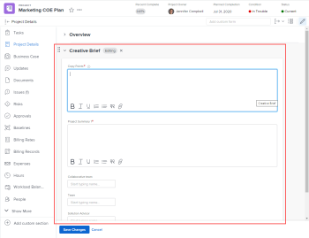

# Custom forms overview

The highlighted information on this page refers to functionality available only in the new Workfront experience beta.

**Video**:

See this video overview of custom forms.

 [Custom Forms in the new Workfront experience](https://one.workfront.com/s/learningpath2/custom-forms-in-the-new-workfront-experience-final-MCC2AF4MH6NRHKHJJBXO6T65DHUU)

You can build custom forms that users can attach to a `Workfront` objects and fill out to supply information about those objects.

For example, users can attach a custom form like the one pictured below to projects where they need to supply creative brief information:

The custom fields in a custom form are in addition to the fields that `Workfront` provides for each object type. You can customize them to fit your environment and work flow.

For instructions on creating a custom form, see [Create or edit a custom form](../../../administration-and-setup/customize-workfront/create-manage-custom-forms/create-or-edit-a-custom-form.md).

## Adding custom forms to objects

A custom form can be associated with any of the following object types:

* Project (including Business Cases)
* Task
* Issue
* Company
* Document
* User
* Program
* Portfolio
* Expense
* Group

For information about associating a custom form with an 

<!--
one or more
-->

object type

<!--
s
-->

, see [Create or edit a custom form](../../../administration-and-setup/customize-workfront/create-manage-custom-forms/create-or-edit-a-custom-form.md).

For information about attaching a custom form to an object, see [Add a custom form to an object](../../../workfront-basics/work-with-custom-forms/add-a-custom-form-to-an-object.md).

## Fields in a custom form

Custom fields are the building blocks of a custom form. You can use them to prompt collaborators working on a `Workfront` object for the information needed on that object.

You can add the following types of custom fields to a custom form in `Workfront`:

* Single line text field
* Paragraph text field
* Text field with formatting 
* Dropdown
* Calculated
* Date
* Checkboxes
* Radio buttons
* Descriptive text
* Section break

For more information, see [Add a custom field to a custom form](../../../administration-and-setup/customize-workfront/create-manage-custom-forms/add-a-custom-field-to-a-custom-form.md).

<!--
Image widgets in custom forms You can add an image widget that displays in your custom form when users fill it out. This might be useful, for example, if you want to -----------------------------. Screenshot For more information, see Add an image or edit its properties in a custom form.
-->

