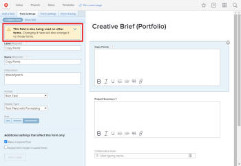

# View all custom forms that use a particular custom field

You can find out which custom forms are using a custom field that you want to change. It’s important to assess whether those custom forms will need adjustments in order to keep working properly after you make any changes to the field or delete the field.

##  

## Access requirements

You must have the following to perform the steps in this article:

<table cellspacing="0"> 
 <col> 
 <col> 
 <tbody> Adobe Workfront plan* Any 
  <tr> 
   <td role="rowheader">Adobe Workfront license*</td> 
   <td> 
Plan 
 </td> 
  </tr> Access level configurations* Administrative access to custom forms For information about how Workfront administrators grants this access, see Grant users administrative access to certain areas. 
 </tbody> 
</table>

&#42;To find out what plan, license type, or access level configurations you have, contact your Workfront administrator.

## Find out which custom forms use a particular custom field

1. Click the `Main Menu` icon  in the upper-right corner of Adobe Workfront, then click `Setup` .

1. In the left panel, click `Custom Forms`.
1. Open the custom form containing the field you want to modify, then click the field on the right side of the screen.

   A warning message displays if the field is used on another custom form.

   

1. Click the blue arrow in the warning message to see which custom forms are using the field.

