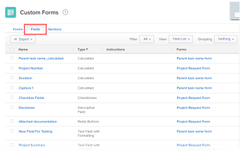

# View all reports that use a particular custom field

You can add a custom view in the Custom Forms area that shows which reports are using a particular custom field. This is useful when you need to edit or delete a custom field that might already be implemented in one or more reports. It’s important to assess whether those reports will need adjustments in order to keep working properly.

## Access requirements

You must have the following to perform the steps in this article:

<table cellspacing="0"> 
 <col> 
 <col> 
 <tbody> Adobe Workfront plan* Any 
  <tr> 
   <td role="rowheader">Adobe Workfront license*</td> 
   <td> 
Plan 
 </td> 
  </tr> Access level configurations* Administrative access to custom forms For information about how Workfront administrators grants this access, see Grant users administrative access to certain areas. 
 </tbody> 
</table>

&#42;To find out what plan, license type, or access level configurations you have, contact your Workfront administrator.

## List the reports that use a particular custom field

<ol> 
 <li value="1">Click the Main Menu icon  in the upper-right corner of Adobe Workfront, then click Setup .</li> 
 <li value="2"> 
In the left panel, click Custom Forms.
 </li> 
 <li value="3"> 
Click the Fields tab to display a report listing all of your custom fields.
 
  
 </li> 
 <li value="4"> 
Click the View drop down menu in the header at the top of the list, then check for any custom views in the list that include the Reports column (which is not a default column on this tab).
 
The Reports column is where you can see which reports are using each custom field. It’s possible that someone has already created a view that includes the Reports column.
 </li> 
 <li value="5">If you don’t see a view that includes the Reports column, you need to create a new view that includes it:
  <ol>
   <li value="1">Click the View drop-down menu, then click New View.</li>
   <li value="2">On the New View page that appears, in the text box near the upper-left corner, replace New Parameter View with a descriptive name for the view, such as “Custom fields and the reports using them.”</li>
   <li value="3">Click Add Column near the lower-right corner.</li>
   <li value="4">In the Show in this column box that displays near the upper-left corner, start typing “report,” then select Reports when it appears in the list below the box.</li>
   <li value="5">(Conditional) If you want to move the Reports column you just added to a different horizontal position, drag its header in the Column Preview area at the bottom of the page.</li>
   <li value="6">Click Done, then click Save View.</li>
  </ol></li> 
 <li value="6"> Click the View drop down menu, then click the name of the custom view you just created.</li> 
 <li value="7"> 
In the Name column, find the custom field you plan to edit or delete, then look at the Reports column on that row to see which reports use the custom field, if any.
 
To find the information for this column, Workfront searches for the custom field in all report filters, views, groupings.
 
If you see a plus sign, you can click that line of text to display a box listing all additional reports that use the custom field.
 <note type="note">
   The initial load time for this tool can take anywhere from 10 seconds to 2.5 minutes, depending on the amount of data in your system.
  </note> 
  
Tips: </b>">
   <b>Tips: </b> 
   <ul> 
    <li>If you don’t have time to investigate the reports that are using the custom field, you can click Export to create a file that lists them. You could share this file with anyone who owns a report that’s using the custom field and discuss the change that needs to happen, the impact it might have on the report, and what needs to be done to make sure that the report continue to work correctly.</li> 
    <li>This view is also available in a Parameter report:
     <ol>
      <li value="1">In the Main Menu, click Reports.</li>
      <li value="2">Near the upper-left corner, click New Report, then click Parameter in the list that displays.</li>
      <li value="3">Click Add Column near the lower-right corner.</li>
      <li value="4">In the Show in this column box that displays near the upper-left corner, start typing “report,” then select Reports when it appears in the list below the box.</li>
      <li value="5">(Conditional) If you want to move the Reports column you just added to a different horizontal position, drag its header in the Column Preview area at the bottom of the page.</li>
      <li value="6">Click Done, then click Save+Close.</li>
      <li value="7">Type a descriptive name for the report, such as “Custom fields and the reports using them.”</li>
     </ol></li> 
   </ul> 
  
 </li> 
</ol>

