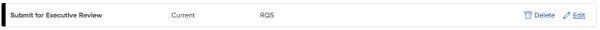
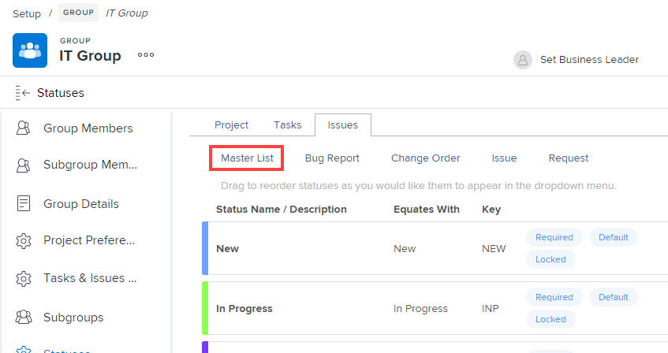
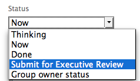
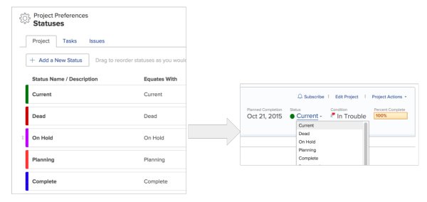

# Create and customize system wide statuses {#create-and-customize-system-wide-statuses}

As a `Workfront administrator`, you can create custom statuses in `Workfront` to more closely match the needs of your organization, or to more closely match the needs of individual groups within your organization.

You can create custom statuses for projects, tasks, and issues. Consider the following options as you create custom statuses and make them available to users:

*  You can make the custom statuses that you create available to the entire `Workfront` site or only to specific groups.  

*   You can enable Group Administrators &nbsp;to edit the custom statuses, or you can lock the statuses so they cannot be edited.  
  For more information about Group Administrators, see [Group Administrators](group-administrators.md).

  `Group Administrators` can also create their own group statuses, for use only by their groups. For more information, see [Create and customize group statuses](create-customize-group-statuses.md).

## Create a system-wide custom status {#create-a-system-wide-custom-status}

You can add a custom project status to match the needs in your organization. You can configure it so that all groups in the system use it and cannot edit it. Or you can configure it so that `Group Administrators` can modify it for their groups, as explained in [Create and customize group statuses](create-customize-group-statuses.md).

1. Click the **Main Menu** icon  in the upper-right corner of `Workfront`, then click **Setup** ..

1.  Click **Project Preferences** > **Statuses**.
1. Select the tab of the object type (**Project**, **Tasks**, or **Issues**) that you want to associate with the status.

1. Ensure that**System Statuses** is selected in the box in the upper-right corner of the Statuses page.
1.  Click **Add a New Status**.

   

   Or

   To edit an existing status, hover over the status you want to edit, click the **Edit** icon that displays to the far-right, then type a new name for the status or click anywhere outside the drop-down list that displays to keep the current name.  
   

1.  Specify the following information:

<table style="width: 100%;mc-table-style: url('../../../Resources/TableStyles/TableStyle-List-options-in-steps.css');" class="TableStyle-TableStyle-List-options-in-steps" cellspacing="0"> 
 <col style="width: 150px;" class="TableStyle-TableStyle-List-options-in-steps-Column-Column1"> 
 <col style="width: 50%;" class="TableStyle-TableStyle-List-options-in-steps-Column-Column2"> 
 <tbody> 
  <tr class="TableStyle-TableStyle-List-options-in-steps-Body-LightGray"> 
   <td class="TableStyle-TableStyle-List-options-in-steps-BodyE-Column1-LightGray"><b>Status Name </b> </td> 
   <td class="TableStyle-TableStyle-List-options-in-steps-BodyD-Column2-LightGray">Give the new status a name. This is a required field.</td> 
  </tr> 
  <tr class="TableStyle-TableStyle-List-options-in-steps-Body-MediumGray"> 
   <td class="TableStyle-TableStyle-List-options-in-steps-BodyE-Column1-MediumGray"><b>Description</b> </td> 
   <td class="TableStyle-TableStyle-List-options-in-steps-BodyD-Column2-MediumGray"> (Optional) Provide a description of the status. This communicates to those using the status of its purpose and use. </td> 
  </tr> 
  <tr class="TableStyle-TableStyle-List-options-in-steps-Body-LightGray"> 
   <td class="TableStyle-TableStyle-List-options-in-steps-BodyE-Column1-LightGray"><b>Color</b> </td> 
   <td class="TableStyle-TableStyle-List-options-in-steps-BodyD-Column2-LightGray">Customize the color of the status by clicking the color field and selecting a color from the swatch panel. You can also enter a hex number in the field. </td> 
  </tr> 
  <tr class="TableStyle-TableStyle-List-options-in-steps-Body-MediumGray"> 
   <td class="TableStyle-TableStyle-List-options-in-steps-BodyE-Column1-MediumGray"><b>Equates With</b> </td> 
   <td class="TableStyle-TableStyle-List-options-in-steps-BodyD-Column2-MediumGray"> Select one of the options from the list that best describes the function of your new status. For example, if the new status name is 'Done,' then the option it equates with would&nbsp;be 'Complete.' Every status you create must equate with one of the options in the drop-down menu. This determines how the new status functions. This option cannot be modified after the status is created. </td> 
  </tr> 
  <tr class="TableStyle-TableStyle-List-options-in-steps-Body-LightGray"> 
   <td class="TableStyle-TableStyle-List-options-in-steps-BodyE-Column1-LightGray"><b>Key</b> </td> 
   <td class="TableStyle-TableStyle-List-options-in-steps-BodyD-Column2-LightGray">Enter a code or abbreviation of your new status that is recognizable to your organization. This key must&nbsp;be unique for each object and can be used for reporting purposes. You cannot change the key code for Planning, Current, and Complete statuses. This is important if you are building a report in text mode. This option cannot be modified after the status is created. </td> 
  </tr> 
  <tr class="TableStyle-TableStyle-List-options-in-steps-Body-MediumGray"> 
   <td class="TableStyle-TableStyle-List-options-in-steps-BodyE-Column1-MediumGray"><b>Hide Status</b> </td> 
   <td class="TableStyle-TableStyle-List-options-in-steps-BodyD-Column2-MediumGray"> 
(Applies only to Project and Task statuses) When creating a system-wide status that cannot be customized by individual groups, leave this option unselected. When this option is unselected, the status is enabled for all groups in the system by default. If this option is selected, the custom status is disabled for all groups by default and the 
 </td> 
  </tr> 
  <tr class="TableStyle-TableStyle-List-options-in-steps-Body-LightGray"> 
   <td class="TableStyle-TableStyle-List-options-in-steps-BodyB-Column1-LightGray"><b>Issue Type</b> </td> 
   <td class="TableStyle-TableStyle-List-options-in-steps-BodyA-Column2-LightGray"> 
(Applies only to Issue statuses) Select the issue type where you want this status to apply. You can choose any of the following issue types:
 
    <ul> 
     <li value="1">Bug Report</li> 
     <li value="2">Change Order</li> 
     <li value="3">Issue</li> 
     <li value="4">Request</li> 
    </ul> </td> 
  </tr> 
 </tbody> 
</table>

1. Ensure that the **Lock for all groups** option is selected.  
   This makes the status visible system-wide. If you leave this option selected, the status is visible system-wide and `Group Administrators` cannot customize it for their individual groups.

1. Click **Save**.  
   The status is now available for all groups throughout the `Workfront` site.

1. (Optional) To configure the custom status so that `Group Administrators` can edit it for their groups:
    
    
    1. Hover over the new status, then click **Edit**.
    1. Disable the **Lock for all groups** option.
    
    
       When this option is disabled, `Group Administrators` can customize the status for their individual groups.
    
    1. Click **Save**.
    
    
       >[!IMPORTANT] {type="important"}
       >
       >If you attempt to lock the custom status at a later time, a warning displays, indicating that other groups might have customized it to fit their needs. Re-locking a status after it is customized by a group means that the group's customizations are reverted to the system-wide status settings, and `Group Administrators` can no longer edit or change the status.
    
    
    
    
    

`<li value="8">(Optional) You can make the status that you just created or modified a default status. For more information, see <a href="#using-custom-statuses-as-default-statuses" class="MCXref xref">Use custom statuses as default statuses</a>.</li>` 

## Create a status for a group {#create-a-status-for-a-group}

You can create custom statuses for a single individual group or for multiple groups. For instructions, see [Create and customize system wide statuses](#).

### Create a custom status for a single group {#create-a-custom-status-for-a-single-group}

You can customize statuses and apply them to a group. This enables you to create&nbsp;custom&nbsp;statuses for&nbsp;groups, and provide control&nbsp;to the Group Administrator.

>[!NOTE]
>
>Custom&nbsp;group statuses&nbsp;cannot be displayed on a project when viewing the project in an agile view. Only default and custom system statuses are visible when viewing a project in an agile view. (For more information about customizing an agile view for a project, see [Create and customize Views](create-customize-views.md) in [Create and customize Views](create-customize-views.md).)

To create a custom status for a single group:

1. Click the **Main Menu** icon  in the upper-right corner of `Workfront`, then click **Setup** ..

1. Click **Project Preferences** > **Statuses**. 

1. Select the tab of the object type (**Project**, **Tasks**, or **Issues**) you want to associate with the status.

1.  (Conditional) If the status is an issue status, select the&nbsp;issue type where the status was created. 

   For more information about issue types, see [Customize default issue types](customize-default-issue-types.md)

   

1. In the box in the upper-right corner of the Statuses page, begin typing the name of the group for which you want to create a new status.  
1.  Click **Add a New Status**.
1.  Specify the following information:

<table style="width: 100%;mc-table-style: url('../../../Resources/TableStyles/TableStyle-List-options-in-steps.css');" class="TableStyle-TableStyle-List-options-in-steps" cellspacing="0"> 
 <col style="width: 150px;" class="TableStyle-TableStyle-List-options-in-steps-Column-Column1"> 
 <col style="width: 50%;" class="TableStyle-TableStyle-List-options-in-steps-Column-Column2"> 
 <tbody> 
  <tr class="TableStyle-TableStyle-List-options-in-steps-Body-LightGray"> 
   <td class="TableStyle-TableStyle-List-options-in-steps-BodyE-Column1-LightGray"><b>Status Name </b> </td> 
   <td class="TableStyle-TableStyle-List-options-in-steps-BodyD-Column2-LightGray">Give the new status a name. This is a required field.</td> 
  </tr> 
  <tr class="TableStyle-TableStyle-List-options-in-steps-Body-MediumGray"> 
   <td class="TableStyle-TableStyle-List-options-in-steps-BodyE-Column1-MediumGray"><b>Description</b> </td> 
   <td class="TableStyle-TableStyle-List-options-in-steps-BodyD-Column2-MediumGray"> (Optional) Provide a description of the status. This communicates to those&nbsp;using the status of its purpose and use. </td> 
  </tr> 
  <tr class="TableStyle-TableStyle-List-options-in-steps-Body-LightGray"> 
   <td class="TableStyle-TableStyle-List-options-in-steps-BodyE-Column1-LightGray"><b>Color</b> </td> 
   <td class="TableStyle-TableStyle-List-options-in-steps-BodyD-Column2-LightGray">&nbsp;Customize&nbsp;the color of the status by clicking the color field and selecting a color from the swatch panel. You can also enter a hex number in the field. </td> 
  </tr> 
  <tr class="TableStyle-TableStyle-List-options-in-steps-Body-MediumGray"> 
   <td class="TableStyle-TableStyle-List-options-in-steps-BodyE-Column1-MediumGray"><b>Equates With</b> </td> 
   <td class="TableStyle-TableStyle-List-options-in-steps-BodyD-Column2-MediumGray"> Select one of the options from the list that best describes the function of your new status. For example, if the new status name is 'Done,' then the option it equates with would&nbsp;be 'Complete.' Every status you create must equate with one of the options in the drop-down menu. This determines how the new status functions. This option cannot be modified after the status is created. </td> 
  </tr> 
  <tr class="TableStyle-TableStyle-List-options-in-steps-Body-LightGray"> 
   <td class="TableStyle-TableStyle-List-options-in-steps-BodyE-Column1-LightGray"><b>Key</b> </td> 
   <td class="TableStyle-TableStyle-List-options-in-steps-BodyD-Column2-LightGray">&nbsp;Enter a code or abbreviation of your new status that is recognizable to your organization. This key must&nbsp;be unique for each object and can be used for reporting purposes. You cannot change the key code for Planning, Current, and Complete statuses. This&nbsp;is important if you are building a report in text mode. This option cannot be modified after the status is created. </td> 
  </tr> 
  <tr class="TableStyle-TableStyle-List-options-in-steps-Body-MediumGray"> 
   <td class="TableStyle-TableStyle-List-options-in-steps-BodyE-Column1-MediumGray"><b>Hide Status</b> </td> 
   <td class="TableStyle-TableStyle-List-options-in-steps-BodyD-Column2-MediumGray">(Applies only to Project and Task statuses) When creating a system-wide status that cannot be customized by individual groups, leave this option unselected. When this option is unselected, the status is enabled for all groups in the system by default. If this option is selected, the custom status is disabled for all groups by default.</td> 
  </tr> 
  <tr class="TableStyle-TableStyle-List-options-in-steps-Body-LightGray"> 
   <td class="TableStyle-TableStyle-List-options-in-steps-BodyB-Column1-LightGray"><b>Issue Type</b> </td> 
   <td class="TableStyle-TableStyle-List-options-in-steps-BodyA-Column2-LightGray"> 
&nbsp;(Applies only to Issue statuses) Select the issue type where you want this status to apply. You can choose any of the following issue types:
 
    <ul> 
     <li value="1">Bug Report</li> 
     <li value="2">Change Order</li> 
     <li value="3">Issue</li> 
     <li value="4">Request</li> 
    </ul> </td> 
  </tr> 
 </tbody> 
</table>

1. Click **Save**.

`<li value="9">The status is now available for all members of the group. The status is available only on projects associated with that group.</li>` `<li value="10">(Optional) You can set the status that you just created or modified to be a default status. For more information, see <a href="#using-custom-statuses-as-default-statuses" class="MCXref xref">Use custom statuses as default statuses</a>.</li>` 

## Use custom statuses as default statuses {#use-custom-statuses-as-default-statuses}

* [How custom default statuses function in Workfront](#understanding-how-custom-default-statuses-function-in-workfront) 
* [Set a Custom Status as a Default Status](#setting-a-custom-status-as-a-default-status) 

### How custom default statuses function in `Workfront` {#how-custom-default-statuses-function-in-workfront}

When a custom status is set as a default status, the new default status is used throughout the system in various ways. The ways in which the new default status is used depends on whether the status is&nbsp;set as a default system status, or a default group status.

* [Custom default system statuses](#understanding-custom-default-system-statuses) 
* [Custom default group statuses](#understanding-custom-default-group-statuses) 

#### **Custom default system statuses**  {#custom-default-system-statuses}

A custom status that you set&nbsp;as a default system status is used in the following circumstances:

* **New groups inherit any existing default system statuses:**&nbsp;When you set a custom status as a default system status, any new groups you create inherit the new custom default status that you&nbsp;set.   
  Groups that already existed when you set the new default system status do not automatically inherit the new custom status as a default status.  
  For example, suppose there are 2 groups already created in your `Workfront` environment (Marketing and Sales). You create a new custom status that equates with Current, and call the status "In Process." You now create a new group called "Engineering." In this scenario, the Engineering group inherits the new default status; the Marketing and Sales groups do not. 

#### **Custom default group statuses**  {#custom-default-group-statuses}

A custom status that you set&nbsp;as a default group status is used in the following circumstances:

* **When the `Workfront` system chooses a status automatically, the default group status is used:** The custom status that you set as the default group status is used when the `Workfront` system automatically assigns a status to an object.  
  For example, a task can be configured to automatically change to Complete status when the percent complete reaches 100%. If you create a custom status that equates with Complete and you set that custom status as a default status, `Workfront` changes the status of the task to the new default status.  
  Custom statuses are used in this way only with group statuses that are associated with a task or issue. Custom statuses cannot be used in this way for statuses associated with a project.

* **The status of a project is determined by the group associated with the project:**&nbsp;If the group associated with a given project changes, the status of the project changes depending on the default statuses defined for the group. (A group can be associated with a project via the **Groups** field when editing the project.)   
  If that group changes, the status of the project changes if the new group has a different default status defined that equates with the current status of the project.  
  For example, a project can be associated with the Marketing group, and the status of the project is set to Planning. The project is edited so that it is now associated with the Sales group. The Sales group has a custom default group status called Thinking (and this status equates with Planning). Because the Group on the project was changed, the status of the project changes now to Thinking. 

### Set a Custom Status as a Default Status {#set-a-custom-status-as-a-default-status}

To set a custom status as the default status: 

1. Click the **Main Menu** icon  in the upper-right corner of `Workfront`, then click **Setup** ..

1. Click **Project Preferences** > **Statuses**.

1. (Conditional) To set a default status for a group, begin typing the name of the group in the menu in the upper-right corner.
1. Click the **Set Default Statuses** drop-down menu.
1. In the drop-down menu next to the status where you want to set the default status, select the default status you want to set.
1. Click **Save**.

## Apply statuses to work that is assigned to a group {#apply-statuses-to-work-that-is-assigned-to-a-group}

A user with Manage permissions to a project, issue, or task assigned to a group can apply a custom status to that object if the group has the custom status available.

1.  Go to a project, or create a new project, as described in [Create a project](create-project.md).
1. , Click the **More** icon , then click **Edit**.

1. In the **Edit Project** box that displays, near the bottom of the **Overview** section, select the group in the **Group** drop-down menu.

1.  In the **Status** drop-down menu, select the custom status.

   >[!NOTE]
   >
   >If you select a different group in the **Group** drop-down menu, the custom statuses in the **Status** menu change automatically to correlate with the group.
   >
   >
   >   >
   >

1. Select the status of the project. The custom statuses you created and applied to that group appear.  

## Delete a custom system status {#delete-a-custom-system-status}

You can delete a custom system status if it is no longer useful to your organization.

>[!NOTE]
>
>You cannot delete the following built-in statuses: Planning, Current, and Complete. You can update the names, edit the colors, and lock or unlock these built-in statuses, but you cannot delete them.

Whether the status is locked or unlocked determines if the status is deleted for all groups in the system:

* When you delete a system status that is currently locked, the status is removed for all groups in the system, regardless of whether the group has&nbsp;renamed it.
* When you delete a system status that is currently unlocked, the status remains for all groups in the system.

For information about deleting a status only for a specific group, see [Delete a status](create-customize-group-statuses.md#deleting-a-status) in [Create and customize group statuses](create-customize-group-statuses.md).

To delete a custom system status:

1. To delete the status across the entire system (including for individual groups), mouse&nbsp;over the status, click **Edit**, then&nbsp;ensure that **Lock for all groups** is selected. Click **Save**.  
   Or  
   To delete the system status but retain it for individual groups, mouse over the status, click **Edit**, then ensure that **Lock for all groups** is unselected. Click **Save**.

1. Hover over the status you want to delete, then click **Delete**.
1. In the message that appears, click **Delete Status**.
1.  In the **Delete Status** box that displays, select a status in the field labeled **Set all projects currently with this status to**.

   Projects that were using the status that you are deleting are set to the status you select.  
   Statuses are available in the drop-down list only if they equate with the same status as the status you are deleting.  
   For example, if you are deleting a status that equates with Current, only statuses that also equate with Current are available to select.

1. Click **Delete Status**.

## Display order of default system statuses {#display-order-of-default-system-statuses}

By default, the order of system statuses that users see when they are viewing an object is the same as the order you can see in the Project Preferences area in Setup.

You can change this order for users in a particular group, not on the system level.  

. Statuses for projects, tasks, and issues can be modified according to the group they are associated with. You can also modify issue statuses according to issue types.

### Status order for tasks and projects {#status-order-for-tasks-and-projects}

The order in which statuses display at the object level is identical for projects and tasks.

You can customize the order in which statuses display for tasks and projects&nbsp;for individual groups. When working with tasks and projects associated with a Group, the statuses will show in the same order you establish at the system level.&nbsp;

By default, task statuses display in the following order:

* New
* In Progress
* Complete

By default, project statuses display in the following order:

* Current
* Dead
*  On Hold 
*  Planning 
*  Complete 
*  Requested 
*  Approved 
*  Rejected 
*  Idea 

>[!NOTE]
>
>If you customize the order of statuses&nbsp;only for System Statuses, this order will not appear on project and tasks that are associated with groups. The order of the statuses for all other groups will be the default order, before it was customized for the System Statuses.

To customize the order in which statuses display for tasks and projects:

1. Go to the **Statuses** area in **Project Preferences**.

1. Select the **Projects** or **Tasks** tab.

1. (Optional) Select a group from the upper-right menu of the statuses list.&nbsp;
1.  Drag and drop the statuses in the order desired.

   The new status order is saved automatically.

1. To ensure that the status order has been preserved, go to a task or project, expand the **Status** menu, and make sure the statuses are in the same order that you established at the system level.

### Status order for issues {#status-order-for-issues}

You can customize the order in which statuses display for issues&nbsp;for individual groups, as well as for individual issue&nbsp;types.&nbsp;

>[!NOTE]
>
>Not all issue statuses from the Master List apply to all issue types.&nbsp;

By default, issue statuses display in the following order:

* New
* In Progress
* Reopened
* Awaiting Feedback
* On Hold
* Cannot Duplicate
* Closed
* Resolved
* Verified Complete
* Won't Resolve

>[!NOTE]
>
>If you customize the order of statuses only for System Statuses, this order will not appear on issues that are associated with groups. The order of the statuses for all other groups will be the default order, before it was customized for the System Statuses.  
>You must customize the order of statuses for each issue&nbsp;type, to make it appear the same for all issue&nbsp;types. You cannot customize the order of statuses for the Master List. &nbsp;For more information about issue types, see [Configure Request Types](configure-request-types.md).  

To customize the order in which statuses display for tasks and projects:

1. Go to the **Statuses** area in **Project Preferences**.

1. Click the **Issues** tab.
1. (Optional) Select a group from the upper-right menu of the statuses list.&nbsp;
1.  (Optional) Select an issue type from the following options: 
    
    
    * Bug Report
    * Change Order
    * Issue
    * Request
    
    
1.  Drag and drop the statuses in the order desired.

   The new status order is saved automatically.

1. To ensure that the status order has been preserved, go to an issue, expand the **Status** menu, and make sure the statuses are in the same order that you established at the system level.

