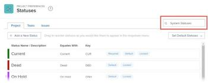
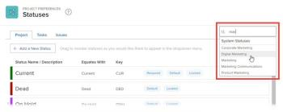
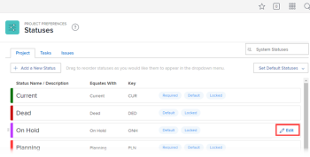
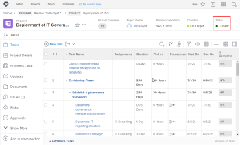

# Create or edit a status {#create-or-edit-a-status}

As an *`Adobe Workfront administrator`*, you can create custom statuses for projects, tasks, and issues. These can be for users throughout the entire *`Workfront`* system or for specific groups or subgroups. For more information about statuses, see [Statuses overview](statuses-overview.md).

>[!NOTE]
>
>*`Group administrators`* can also create their own group statuses, for use only by their groups. For more information, see [Create or edit a group status](create-or-edit-a-group-status.md).

## Access requirements {#access-requirements}

You must have the following to perform the steps in this article:

<table style="width: 100%;margin-left: 0;margin-right: auto;mc-table-style: url('../../../Resources/TableStyles/TableStyle-List-options-in-steps.css');" class="TableStyle-TableStyle-List-options-in-steps" cellspacing="0"> 
 <col class="TableStyle-TableStyle-List-options-in-steps-Column-Column1"> 
 <col class="TableStyle-TableStyle-List-options-in-steps-Column-Column2"> 
 <tbody> 
  <tr class="TableStyle-TableStyle-List-options-in-steps-Body-LightGray"> 
   <td class="TableStyle-TableStyle-List-options-in-steps-BodyE-Column1-LightGray" role="rowheader">Adobe Workfront plan</td> 
   <td class="TableStyle-TableStyle-List-options-in-steps-BodyD-Column2-LightGray"> 
Any
 </td> 
  </tr> 
  <tr class="TableStyle-TableStyle-List-options-in-steps-Body-MediumGray"> 
   <td class="TableStyle-TableStyle-List-options-in-steps-BodyE-Column1-MediumGray" role="rowheader">Adobe Workfront license</td> 
   <td class="TableStyle-TableStyle-List-options-in-steps-BodyD-Column2-MediumGray"> 
Plan 
 </td> 
  </tr> 
  <tr class="TableStyle-TableStyle-List-options-in-steps-Body-LightGray"> 
   <td class="TableStyle-TableStyle-List-options-in-steps-BodyB-Column1-LightGray" role="rowheader">Access level configurations</td> 
   <td class="TableStyle-TableStyle-List-options-in-steps-BodyA-Column2-LightGray"> 
You must be a Workfront administrator. For more information, see <a href="grant-a-user-full-administrative-access.md" class="MCXref xref">Grant a user full administrative access</a>.
 
Note: If you still don't have access, ask your Workfront administrator if they set additional restrictions in your access level. For information on how a Workfront administrator can modify your access level, see <a href="create-modify-access-levels.md" class="MCXref xref">Create or modify custom access levels</a>.
 </td> 
  </tr> 
 </tbody> 
</table>

## Create a custom status {#create-a-custom-status}

You can add a custom status for use by your entire organization or by a single group.

When you create a custom status for the entire organization, you can configure it so that all groups in the system can use it without editing it. Or you can configure it so that *`group administrators`* can modify it for their groups, as explained in [Create or edit a group status](create-or-edit-a-group-status.md).

1. Click the `Main Menu` icon  in the upper-right corner of *`Adobe Workfront`*, then click `Setup` .

1. In the left panel, click `Project Preferences` > `Statuses`.

1.  (Conditional) If you are creating a status for use system wide, ensure that `System Statuses` is selected in the box in the upper-right corner.

   

   Or

   If you are creating a status for a group or subgroup, start typing the name of the group in the box in the upper-right corner, then select it when it appears.

   

1. Select the tab of the object type ( `Project`, `Tasks`, or `Issues`) that you want to associate with the status.

1.  If you are creating a new status, click `Add a New Status`.

   Or

   If you are editing an existing status, hover over it, then click the `Edit` icon that displays to the far-right.

   

1.  Configure the status using the following options:

<table style="width: 100%;mc-table-style: url('../../../Resources/TableStyles/TableStyle-List-options-in-steps.css');" class="TableStyle-TableStyle-List-options-in-steps" cellspacing="0"> 
 <col class="TableStyle-TableStyle-List-options-in-steps-Column-Column1"> 
 <col class="TableStyle-TableStyle-List-options-in-steps-Column-Column2"> 
 <tbody> 
  <tr class="TableStyle-TableStyle-List-options-in-steps-Body-LightGray"> 
   <td class="TableStyle-TableStyle-List-options-in-steps-BodyE-Column1-LightGray" role="rowheader">Status Name</td> 
   <td class="TableStyle-TableStyle-List-options-in-steps-BodyD-Column2-LightGray"> 
Type a name for the status. This is a required field.
 
When you create a status name, be aware that others in the system can create a status with the same name. We recommend using a unique name to avoid confusion when selecting statuses in Workfront.
 </td> 
  </tr> 
  <tr class="TableStyle-TableStyle-List-options-in-steps-Body-MediumGray"> 
   <td class="TableStyle-TableStyle-List-options-in-steps-BodyE-Column1-MediumGray" role="rowheader">Description</td> 
   <td class="TableStyle-TableStyle-List-options-in-steps-BodyD-Column2-MediumGray">(Optional) Type a description of the status. This communicates its purpose to those who use it.</td> 
  </tr> 
  <tr class="TableStyle-TableStyle-List-options-in-steps-Body-LightGray"> 
   <td class="TableStyle-TableStyle-List-options-in-steps-BodyE-Column1-LightGray" role="rowheader">Color</td> 
   <td class="TableStyle-TableStyle-List-options-in-steps-BodyD-Column2-LightGray"> 
Customize the color of the status by clicking the color field and selecting a color from the swatch panel. You can also enter a hex number in the field.
 
The status color displays in the upper-right corner of Workfront when a user views the object.
 
  
 </td> 
  </tr> 
  <tr class="TableStyle-TableStyle-List-options-in-steps-Body-MediumGray"> 
   <td class="TableStyle-TableStyle-List-options-in-steps-BodyE-Column1-MediumGray" role="rowheader">Equates With</td> 
   <td class="TableStyle-TableStyle-List-options-in-steps-BodyD-Column2-MediumGray"> 
Select one of the options from the list that best describes the function of the status. For example, if the status name is Done, the option it equates with should be Complete.
 
Every status must equate with one of these options because this determines how the status functions.
 
This option cannot be modified after the status is created.
 </td> 
  </tr> 
  <tr class="TableStyle-TableStyle-List-options-in-steps-Body-LightGray"> 
   <td class="TableStyle-TableStyle-List-options-in-steps-BodyE-Column1-LightGray" role="rowheader">Key</td> 
   <td class="TableStyle-TableStyle-List-options-in-steps-BodyD-Column2-LightGray"> 
If you are creating a new status, type a code or abbreviation for the status or use the one generated for you. This key must be unique in Workfront because it can be used for reporting purposes. If you attempt to specify a key that is already in use in the system, the field turns red.
 
It might be useful to use an abbreviation that is recognizable to those who will use it.
 
This option cannot be modified after the status is created.
 
You cannot change the key code for Planning, Current, and Complete statuses. This is important if you are building a report in text mode. 
 </td> 
  </tr> 
  <tr class="TableStyle-TableStyle-List-options-in-steps-Body-MediumGray"> 
   <td class="TableStyle-TableStyle-List-options-in-steps-BodyE-Column1-MediumGray" role="rowheader">Hide Status</td> 
   <td class="TableStyle-TableStyle-List-options-in-steps-BodyD-Column2-MediumGray"> 
(Project and Task statuses only)
 
Enable this option if you want the status hidden from users. When it is disabled (the default setting), all <MadCap:conditionalText data-mc-conditions="SnippetConditions-wf-groups.system-level">
      users in the system
     </MadCap:conditionalText> can use the status.
 
Tip: You can hide an Issue status by disabling all 4 issue types (Bug Report, Change Order, Issue, Request).
 </td> 
  </tr> 
  <tr class="TableStyle-TableStyle-List-options-in-steps-Body-LightGray"> 
   <td class="TableStyle-TableStyle-List-options-in-steps-BodyB-Column1-LightGray" role="rowheader">Lock for all groups</td> 
   <td class="TableStyle-TableStyle-List-options-in-steps-BodyA-Column2-LightGray"> 
If you leave this enabled, users throughout the system can see and use the status and group administrators cannot customize it for their groups.
 
When this option is disabled, group administrators can customize the status for their individual groups.
 
For more information about locking statuses, see <a href="lock-or-unlock-a-custom-system-level-status.md" class="MCXref xref">Locking or unlocking a custom system-level status</a>.
 </td> 
  </tr> 
 </tbody> 
</table>

1.  Click `Save`.

`<li>For instructions on making this status a default status, see <a href="use-custom-statuses-as-default-statuses.md" class="MCXref xref">Use custom statuses as default statuses</a>.</li>`  