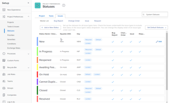

# Issue statuses {#issue-statuses}

You can use the status of an issue to show users in the system in what stage of development an issue is at a given time.

## Access requirements {#access-requirements}

You must have the following to perform the steps in this article:

<table style="width: 100%;margin-left: 0;margin-right: auto;mc-table-style: url('../../../Resources/TableStyles/TableStyle-List-options-in-steps.css');" class="TableStyle-TableStyle-List-options-in-steps" cellspacing="0"> 
 <col class="TableStyle-TableStyle-List-options-in-steps-Column-Column1"> 
 <col class="TableStyle-TableStyle-List-options-in-steps-Column-Column2"> 
 <tbody> 
  <tr class="TableStyle-TableStyle-List-options-in-steps-Body-LightGray"> 
   <td class="TableStyle-TableStyle-List-options-in-steps-BodyE-Column1-LightGray" role="rowheader">Adobe Workfront plan</td> 
   <td class="TableStyle-TableStyle-List-options-in-steps-BodyD-Column2-LightGray"> 
Any
 </td> 
  </tr> 
  <tr class="TableStyle-TableStyle-List-options-in-steps-Body-MediumGray"> 
   <td class="TableStyle-TableStyle-List-options-in-steps-BodyE-Column1-MediumGray" role="rowheader">Adobe Workfront license</td> 
   <td class="TableStyle-TableStyle-List-options-in-steps-BodyD-Column2-MediumGray"> 
Plan 
 </td> 
  </tr> 
  <tr class="TableStyle-TableStyle-List-options-in-steps-Body-LightGray"> 
   <td class="TableStyle-TableStyle-List-options-in-steps-BodyB-Column1-LightGray" role="rowheader">Access level configurations</td> 
   <td class="TableStyle-TableStyle-List-options-in-steps-BodyA-Column2-LightGray"> 
You must be a Workfront administrator. For more information, see <a href="grant-a-user-full-administrative-access.md" class="MCXref xref">Grant a user full administrative access</a>.
 
Note: If you still don't have access, ask your Workfront administrator if they set additional restrictions in your access level. For information on how a Workfront administrator can modify your access level, see <a href="create-modify-access-levels.md" class="MCXref xref">Create or modify custom access levels</a>.
 </td> 
  </tr> 
 </tbody> 
</table>

## Access issue statuses {#access-issue-statuses}

You can access and modify system-level issue&nbsp;statuses. You can edit some information about the default system statuses or you can create new custom statuses. For more information about creating custom statuses or editing system statuses,&nbsp;see [Create or edit a status](create-or-edit-a-status.md).

To access system-level issue statuses:

1. Click the `Main Menu` icon  in the upper-right corner of *`Adobe Workfront`*, then click `Setup` .

1. Click `Project Preferences` > `Statuses`.

1.  Click the `Issues` tab to see the issue statuses available in *`Workfront`*.

   

## System issue statuses {#system-issue-statuses}

*`Workfront`* comes with 10 original issue statuses. The first 4 in the table below are required, which means that you can unlock, rename, and reorder them, but you cannot hide or delete them.

You can add custom issue statuses to match the needs in your organization. For more information, see [Create or edit a status](create-or-edit-a-status.md).

For users, changing the status of an issue is typically a manual process. However, there are situations, outlined in the following list, when the status of an issue changes automatically, depending on other factors that are happening in the system.

The following issue statuses are provided with your *`Workfront`* instance:

<table style="mc-table-style: url('../../../Resources/TableStyles/TableStyle-HeaderRow.css');" class="TableStyle-TableStyle-HeaderRow" cellspacing="15"> 
 <col class="TableStyle-TableStyle-HeaderRow-Column-Column1"> 
 <col class="TableStyle-TableStyle-HeaderRow-Column-Column1"> 
 <col class="TableStyle-TableStyle-HeaderRow-Column-Column1"> 
 <thead> 
  <tr class="TableStyle-TableStyle-HeaderRow-Head-Header1"> 
   <th class="TableStyle-TableStyle-HeaderRow-HeadE-Column1-Header1">System issue status</th> 
   <th class="TableStyle-TableStyle-HeaderRow-HeadE-Column1-Header1">This issue status occurs when</th> 
   <th class="TableStyle-TableStyle-HeaderRow-HeadD-Column1-Header1">What happens in this status</th> 
  </tr> 
 </thead> 
 <tbody> 
  <tr class="TableStyle-TableStyle-HeaderRow-Body-LightGray"> 
   <td class="TableStyle-TableStyle-HeaderRow-BodyE-Column1-LightGray">New (required status)</td> 
   <td class="TableStyle-TableStyle-HeaderRow-BodyE-Column1-LightGray">This is the default status for every newly created issue.</td> 
   <td class="TableStyle-TableStyle-HeaderRow-BodyD-Column1-LightGray">If the issue is on a project in a status of Current, the issue displays in the Work Requests tab of the users who are assigned to the issue. Users can now start working on the issue.</td> 
  </tr> 
  <tr class="TableStyle-TableStyle-HeaderRow-Body-MediumGray"> 
   <td class="TableStyle-TableStyle-HeaderRow-BodyE-Column1-MediumGray">In Progress (required status)</td> 
   <td class="TableStyle-TableStyle-HeaderRow-BodyE-Column1-MediumGray"> 
You may place an issue in this status to indicate that work on that issue has started.
 
If the resolution of the issue is connected to another object (a task, project, or another issue), the issue status is changed to In Progress automatically, when you change the status of the resolving object to In Progress.&nbsp;
 
For more information about resolving objects, see <a href="resolving-and-resolvable-objects.md" class="MCXref xref">Overview of Resolving and Resolvable Objects </a>.
 </td> 
   <td class="TableStyle-TableStyle-HeaderRow-BodyD-Column1-MediumGray"> 
If the issue is on a project in a status of Current, the issue displays in the Working On tab of the users who are assigned to the issue.
 
When an issue is In Progress, the issue shows a value for the Actual Start Date.
 
&nbsp;
 </td> 
  </tr> 
  <tr class="TableStyle-TableStyle-HeaderRow-Body-LightGray"> 
   <td class="TableStyle-TableStyle-HeaderRow-BodyE-Column1-LightGray">Closed (required status)</td> 
   <td class="TableStyle-TableStyle-HeaderRow-BodyE-Column1-LightGray"> 
You can manually mark an issue as Closed&nbsp;when the work on it is completed.&nbsp;
 
If the resolution of the issue is connected&nbsp;to another object&nbsp;(a task, project, or another issue), the issue status is changed to Closed&nbsp;automatically, when you change the status of the resolving object to Closed.
 
For more information about resolving objects, see&nbsp;<a href="resolving-and-resolvable-objects.md" class="MCXref xref">Overview of Resolving and Resolvable Objects </a>.
 </td> 
   <td class="TableStyle-TableStyle-HeaderRow-BodyD-Column1-LightGray"> 
When an issue is Closed, the issue is&nbsp;removed from the assignee's Working On list. In this case, the issue shows a value for the&nbsp;Actual Completion&nbsp;Date.&nbsp;
 
When all the tasks are completed and issues are closed on a project, the project can be completed.
 </td> 
  </tr> 
  <tr class="TableStyle-TableStyle-HeaderRow-Body-MediumGray"> 
   <td class="TableStyle-TableStyle-HeaderRow-BodyE-Column1-MediumGray">On Hold (required status)</td> 
   <td class="TableStyle-TableStyle-HeaderRow-BodyE-Column1-MediumGray"> 
You can manually mark an issue as On Hold, to indicate that there has been a delay in completing the issue.&nbsp;
 </td> 
   <td class="TableStyle-TableStyle-HeaderRow-BodyD-Column1-MediumGray"> 
If the issue&nbsp;is on a project in a status of Current, the issue&nbsp;displays in the Working On tab of the users who are assigned to the issue.&nbsp;
 
When all the tasks are completed on a project, but there is at least one On Hold issue on the project, the project cannot be completed.&nbsp;
 </td> 
  </tr> 
  <tr class="TableStyle-TableStyle-HeaderRow-Body-LightGray"> 
   <td class="TableStyle-TableStyle-HeaderRow-BodyE-Column1-LightGray">Reopened (Equates with In Progress)</td> 
   <td class="TableStyle-TableStyle-HeaderRow-BodyE-Column1-LightGray"> 
You may place an issue in this status to indicate that work on that issue was not quite completed when the issue was previously closed, and it needed to be reopened to complete the work.
 </td> 
   <td class="TableStyle-TableStyle-HeaderRow-BodyD-Column1-LightGray"> 
If the issue&nbsp;is on a project in a status of Current, the issue&nbsp;displays in the Work Requests tab of the users who are assigned to the issue. Users can now start working on the issue.
 
This status is important in reporting, to differentiate between issues that are open for the first time (usually in the New status), and issues that are opened after having been closed before (usually in the Reopened status).&nbsp;
 </td> 
  </tr> 
  <tr class="TableStyle-TableStyle-HeaderRow-Body-MediumGray"> 
   <td class="TableStyle-TableStyle-HeaderRow-BodyE-Column1-MediumGray">Awaiting Feedback (Equates with On Hold)</td> 
   <td class="TableStyle-TableStyle-HeaderRow-BodyE-Column1-MediumGray">You may place an issue in this status to indicate that you are waiting on feedback (typically from the Primary Contact) before you can continue working on the issue.&nbsp;</td> 
   <td class="TableStyle-TableStyle-HeaderRow-BodyD-Column1-MediumGray"> 
If the issue&nbsp;is on a project in a status of Current, the issue&nbsp;displays in the Working On tab of the users who are assigned to the issue.
 
If an issue is Awaiting Feedback, a project cannot be completed.
 
This status is important in reporting, to differentiate between issues that are currently open but being worked on (usually in the&nbsp;In Progress&nbsp;status) and issues that are currently open but not being worked on because more feedback is needed to complete them (usually in the Awaiting Feedback status).
 </td> 
  </tr> 
  <tr class="TableStyle-TableStyle-HeaderRow-Body-LightGray"> 
   <td class="TableStyle-TableStyle-HeaderRow-BodyE-Column1-LightGray">Cannot Duplicate (Equates with Closed)</td> 
   <td class="TableStyle-TableStyle-HeaderRow-BodyE-Column1-LightGray">You may place an issue in this status to indicate that you are closing the issue, but you could not see the problem that triggered opening the issue. The problem might still exist, but it cannot be replicated at a given time.&nbsp;</td> 
   <td class="TableStyle-TableStyle-HeaderRow-BodyD-Column1-LightGray"> 
This status is important in reporting, to differentiate between issues that are completed and whose problem has been addressed (usually in the Closed status) and issues whose problem is not visible at a given time (usually in the Cannot Duplicate status).
 
When an issue is marked as Cannot Duplicate, the issue is removed from the assignee's Working On list. In this case, the issue shows a value for the&nbsp;Actual CompletionDate.
 
If all the tasks on a project are completed, and some issues are in a Cannot Duplicate status, the project can be completed.
 </td> 
  </tr> 
  <tr class="TableStyle-TableStyle-HeaderRow-Body-MediumGray"> 
   <td class="TableStyle-TableStyle-HeaderRow-BodyE-Column1-MediumGray">Resolved (Equates with Closed)</td> 
   <td class="TableStyle-TableStyle-HeaderRow-BodyE-Column1-MediumGray">You may place an issue in this status to indicate that you are closing the issue and the problem that created it has actually been resolved.</td> 
   <td class="TableStyle-TableStyle-HeaderRow-BodyD-Column1-MediumGray"> 
This status is important in reporting, to differentiate between issues that are closed with or without a resolution (usually in the Closed status) and issues that are closed with an actual resolution (usually in the status of Resolved).
 
When an issue is&nbsp;marked as Resolved, the issue is removed from the assignee's Working On list. In this case, the issue shows a value for the Actual Completion&nbsp;Date.&nbsp;
 
If all the tasks on a project are completed, and at least one issue is in a Resolved status, the project can be completed.&nbsp;
 </td> 
  </tr> 
  <tr class="TableStyle-TableStyle-HeaderRow-Body-LightGray"> 
   <td class="TableStyle-TableStyle-HeaderRow-BodyE-Column1-LightGray">Verified Complete (Equates with Closed)</td> 
   <td class="TableStyle-TableStyle-HeaderRow-BodyE-Column1-LightGray">You may place an issue in this status to indicate that you are closing the issue and that you have verified that the problem that generated the issue has been resolved.</td> 
   <td class="TableStyle-TableStyle-HeaderRow-BodyD-Column1-LightGray"> 
When an issue is&nbsp;marked as Verified Complete, the issue is removed from the assignee's Working On list. In this case, the issue shows a value for the&nbsp;Actual Completion Date.
 
If all the tasks on a project are completed, and some issues are in a Verified Complete&nbsp;status, the project can be completed.
 </td> 
  </tr> 
  <tr class="TableStyle-TableStyle-HeaderRow-Body-MediumGray"> 
   <td class="TableStyle-TableStyle-HeaderRow-BodyB-Column1-MediumGray">Won't Resolve (Equates with Closed)</td> 
   <td class="TableStyle-TableStyle-HeaderRow-BodyB-Column1-MediumGray">You may place an issue in this status to indicate that you are closing the issue, but the problem that has generated it cannot be resolved.</td> 
   <td class="TableStyle-TableStyle-HeaderRow-BodyA-Column1-MediumGray"> 
This status is important in reporting, to differentiate between issues that are closed with or without a resolution (usually in the Closed status) and issues that are closed without an actual resolution (usually in the status of Won't Resolve).
 
When an issue is&nbsp;marked as Won't Resolve, the issue is removed from the assignee's Working On list. In this case,&nbsp;the issue shows a value for the Actual Completion Date.
 
If all the tasks on a project are completed, and at least one issue is in a Won't Resolve status, the project can be completed.
 </td> 
  </tr> 
 </tbody> 
</table>

## Customizing issue statuses {#customizing-issue-statuses}

A *`Workfront administrator`* can add system-level and group-level issue statuses to *`Workfront`* and change the order in which users see them. For more information, see [Create or edit a status](create-or-edit-a-status.md).

A *`group administrator`* can add a custom status specific to one group. For more information, see [Create or edit a group status](create-or-edit-a-group-status.md).
