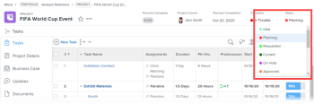
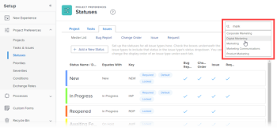

# Reorder system-level and group statuses

s mAs a *Workfront administrator*, you can change the order of project, task, and issue statuses for 

<!--
<MadCap:conditionalText data-mc-conditions="SnippetConditions-wf-groups.system-level">
everyone in the system or for a single group
</MadCap:conditionalText>
-->

`<MadCap:conditionalText data-mc-conditions="SnippetConditions-wf-groups.system-level"> everyone in the system or for a single group</MadCap:conditionalText>`.

<!--

  

-->

>[!NOTE]
>
>* >
>  <!-->
>  <MadCap:conditionalText data-mc-conditions="SnippetConditions-wf-groups.system-level">>
>  Reordering>
>  </MadCap:conditionalText>>
>  -->
>  `<MadCap:conditionalText data-mc-conditions="SnippetConditions-wf-groups.system-level"> Reordering</MadCap:conditionalText>` the statuses at the system level does not affect the order of statuses within groups. 
>
>  However, the statuses within a newly created top-level group inherit the order of the system-level statuses. (A new subgroup inherits the order of the statuses in the group one level up.)
>
>* You can reorder locked statuses. For information about locked statuses, see >
>  <!-->
>  <a href="../../../administration-and-setup/customize-workfront/creating-custom-status-and-priority-labels/create-or-edit-a-status.md" class="MCXref xref" data-mc-conditions="SnippetConditions-wf-groups.system-level">Create or edit a status</a>>
>  -->
>  [Create or edit a status](../../../administration-and-setup/customize-workfront/creating-custom-status-and-priority-labels/create-or-edit-a-status.md).
>
>  <!-->
>  <li data-mc-conditions="SnippetConditions-wf-groups.system-level"><em>Group administrators</em> can also reorder statuses used in their groups. For more information, see <a href="../../../administration-and-setup/manage-groups/manage-group-statuses/reorder-group-statuses-from-groups-area.md" class="MCXref xref">Reorder group statuses</a>.</li>>
>  -->
>* *Group administrators* can also reorder statuses used in their groups. For more information, see [Reorder group statuses](../../../administration-and-setup/manage-groups/manage-group-statuses/reorder-group-statuses-from-groups-area.md).
>

## Access requirements

You must have the following to perform the steps in this article:

<table cellspacing="0"> 
 <col> 
 <col> 
 <tbody> 
  <tr> 
   <td role="rowheader"><a href="https://www.workfront.com/plans" target="_blank"><em>Adobe Workfront</em> plan</a>* </td> 
   <td> 
Any
 </td> 
  </tr> <draft-comment>
   <tr data-mc-conditions="SnippetConditions-wf-groups.system-level"> 
    <td role="rowheader"><a href="https://one.workfront.com/s/document-item?bundleId=the-new-workfront-experience&amp;topicId=Content%2FAdministration_and_Setup%2FAdd_users%2FAccess_levels_and_object_permissions%2Fwf-licenses.html&amp;_LANG=en" target="_blank"><em>Adobe Workfront</em> license</a>*</td> 
    <td> 
<em>Plan</em> 
 
You must be a <em>Workfront administrator</em>. For information on <em>Workfront administrators</em>, see <a href="../../../administration-and-setup/add-users/configure-and-grant-access/grant-a-user-full-administrative-access.md" class="MCXref xref">Grant a user full administrative access</a>.
 </td> 
   </tr>
  </draft-comment>
  <tr data-mc-conditions="SnippetConditions-wf-groups.system-level"> 
   <td role="rowheader"><a href="https://one.workfront.com/s/document-item?bundleId=the-new-workfront-experience&amp;topicId=Content%2FAdministration_and_Setup%2FAdd_users%2FAccess_levels_and_object_permissions%2Fwf-licenses.html&amp;_LANG=en" target="_blank"><em>Adobe Workfront</em> license</a>*</td> 
   <td> 
<em>Plan</em> 
 
You must be a <em>Workfront administrator</em>. For information on <em>Workfront administrators</em>, see <a href="../../../administration-and-setup/add-users/configure-and-grant-access/grant-a-user-full-administrative-access.md" class="MCXref xref">Grant a user full administrative access</a>.
 </td> 
  </tr> 
 </tbody> 
</table>

&#42;If you need to find out what plan or license type you have, contact your *Workfront administrator*.

## Default order of statuses

By default, statuses display in the following order:

<table cellspacing="15"> 
 <col> 
 <col> 
 <col> 
 <thead> 
  <tr> 
   <th width="33.33%">Project</th> 
   <th width="33.33%">Task</th> 
   <th width="33.33%">Issue</th> 
  </tr> 
 </thead> 
 <tbody> 
  <tr> 
   <td> 
    <ul> 
     <li>Current</li> 
     <li>Dead</li> 
     <li> On Hold </li> 
     <li> Planning </li> 
     <li> Complete </li> 
     <li> Requested </li> 
     <li> Approved </li> 
     <li> Rejected </li> 
     <li> Idea </li> 
    </ul> </td> 
   <td> 
    <ul> 
     <li>New</li> 
     <li>In Progress</li> 
     <li>Complete</li> 
    </ul> </td> 
   <td> 
    <ul> 
     <li>New</li> 
     <li>In Progress</li> 
     <li>Reopened</li> 
     <li>Awaiting Feedback</li> 
     <li>On Hold</li> 
     <li>Cannot Duplicate</li> 
     <li>Closed</li> 
     <li>Resolved</li> 
     <li>Verified Complete</li> 
     <li>Won't Resolve</li> 
    </ul> </td> 
  </tr> 
 </tbody> 
</table>

<!--

<h2>Reorder statuses for tasks and projects<draft-comment>
<MadCap:conditionalText data-mc-conditions="SnippetConditions-wf-groups.system-level">
system wide or for a group
</MadCap:conditionalText>
</draft-comment><MadCap:conditionalText data-mc-conditions="SnippetConditions-wf-groups.system-level">
system wide or for a group
</MadCap:conditionalText></h2>
<ol>
<li value="1">Click the Main Menu icon  in the upper-right corner of <em>Adobe Workfront</em>, then click Setup .</li> <draft-comment>
<li value="2" data-mc-conditions="SnippetConditions-wf-groups.system-level">In the left panel, click Project Preferences > Statuses.</li>
</draft-comment>
<li value="2" data-mc-conditions="SnippetConditions-wf-groups.system-level">In the left panel, click Project Preferences > Statuses.</li> <draft-comment>
<li value="3" data-mc-conditions="SnippetConditions-wf-groups.system-level"> 
(Conditional) If you are reordering statuses for a group, start typing the name of the group in the box in the upper-right corner, then click the name when it appears.
 
  
 </li>
</draft-comment>
<li value="3" data-mc-conditions="SnippetConditions-wf-groups.system-level"> 
(Conditional) If you are reordering statuses for a group, start typing the name of the group in the box in the upper-right corner, then click the name when it appears.
 
  
 </li>
<li value="4">Above the Statuses list that displays, click the Projects or Tasks tab.</li>
<li value="5"> 
Drag and drop the statuses in the order you want.
 
The new status order is saved automatically.
 </li>
<li value="6">To test the new status order, go to a task or project, click the status in the upper-right corner, and make sure the statuses that display are in the order that you configured.</li>
</ol>

-->

## Reorder statuses for tasks and projects`<MadCap:conditionalText data-mc-conditions="SnippetConditions-wf-groups.system-level">  system wide or for a group</MadCap:conditionalText>`

<ol> 
 <li value="1">Click the Main Menu icon  in the upper-right corner of <em>Adobe Workfront</em>, then click Setup .</li> 
 <li value="2" data-mc-conditions="SnippetConditions-wf-groups.system-level">In the left panel, click Project Preferences > Statuses.</li> 
 <li value="3" data-mc-conditions="SnippetConditions-wf-groups.system-level"> 
(Conditional) If you are reordering statuses for a group, start typing the name of the group in the box in the upper-right corner, then click the name when it appears.
 
  
 </li> 
 <li value="4">Above the Statuses list that displays, click the Projects or Tasks tab.</li> 
 <li value="5"> 
Drag and drop the statuses in the order you want.
 
The new status order is saved automatically.
 </li> 
 <li value="6">To test the new status order, go to a task or project, click the status in the upper-right corner, and make sure the statuses that display are in the order that you configured.</li> 
</ol>

<!--

<h2>Reorder statuses for issues</h2>
<ol>
<li value="1">Click the Main Menu icon  in the upper-right corner of <em>Adobe Workfront</em>, then click Setup .</li> <draft-comment>
<li value="2" data-mc-conditions="SnippetConditions-wf-groups.system-level">Click Project Preferences > Statuses.</li>
</draft-comment>
<li value="2" data-mc-conditions="SnippetConditions-wf-groups.system-level">Click Project Preferences > Statuses.</li> <draft-comment>
<li value="3" data-mc-conditions="SnippetConditions-wf-groups.system-level"> 
(Conditional) If you are reordering statuses for a group, start typing the name of the group in the box in the upper-right corner, then click the name when it appears.
 
  
 </li>
</draft-comment>
<li value="3" data-mc-conditions="SnippetConditions-wf-groups.system-level"> 
(Conditional) If you are reordering statuses for a group, start typing the name of the group in the box in the upper-right corner, then click the name when it appears.
 
  
 </li>
<li value="4">Click the Issues tab.</li>
<li value="5"> 
 (Optional) Select an issue type (Bug Report, Change Order, Issue, or Request).
 <note type="note">
<ul>
<li> You cannot customize the order of statuses for the Master List.</li>
<li>We recommend that you order of statuses for each issue type the same way. For more information about issue types, see <a href="../../../administration-and-setup/set-up-workfront/configure-system-defaults/configure-request-types.md" class="MCXref xref">Configure request types</a>.</li>
</ul>
</note> </li>
<li value="6"> 
Drag and drop the statuses in the order you want.
 
The new status order is saved automatically.
 </li>
<li value="7">To test the new status order, go to an issue, click the status in the upper-right corner, and make sure the statuses that display are in the order that you configured.</li>
</ol>

-->

## Reorder statuses for issues

<ol> 
 <li value="1">Click the Main Menu icon  in the upper-right corner of <em>Adobe Workfront</em>, then click Setup .</li> 
 <li value="2" data-mc-conditions="SnippetConditions-wf-groups.system-level">Click Project Preferences > Statuses.</li> 
 <li value="3" data-mc-conditions="SnippetConditions-wf-groups.system-level"> 
(Conditional) If you are reordering statuses for a group, start typing the name of the group in the box in the upper-right corner, then click the name when it appears.
 
  
 </li> 
 <li value="4">Click the Issues tab.</li> 
 <li value="5"> 
 (Optional) Select an issue type (Bug Report, Change Order, Issue, or Request).
 <note type="note"> 
   <ul> 
    <li> You cannot customize the order of statuses for the Master List.</li> 
    <li>We recommend that you order of statuses for each issue type the same way. For more information about issue types, see <a href="../../../administration-and-setup/set-up-workfront/configure-system-defaults/configure-request-types.md" class="MCXref xref">Configure request types</a>.</li> 
   </ul> 
  </note> </li> 
 <li value="6"> 
Drag and drop the statuses in the order you want.
 
The new status order is saved automatically.
 </li> 
 <li value="7">To test the new status order, go to an issue, click the status in the upper-right corner, and make sure the statuses that display are in the order that you configured.</li> 
</ol>

