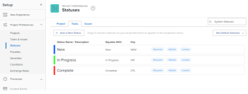

# Access the list of system task statuses {#access-the-list-of-system-task-statuses}

You can use the status of a task to show users what stage of development a task is in at a given time.

## Access requirements {#access-requirements}

You must have the following to perform the steps in this article:

<table style="width: 100%;margin-left: 0;margin-right: auto;mc-table-style: url('../../../Resources/TableStyles/TableStyle-List-options-in-steps.css');" class="TableStyle-TableStyle-List-options-in-steps" cellspacing="0"> 
 <col class="TableStyle-TableStyle-List-options-in-steps-Column-Column1"> 
 <col class="TableStyle-TableStyle-List-options-in-steps-Column-Column2"> 
 <tbody> 
  <tr class="TableStyle-TableStyle-List-options-in-steps-Body-LightGray"> 
   <td class="TableStyle-TableStyle-List-options-in-steps-BodyE-Column1-LightGray" role="rowheader">Adobe Workfront plan</td> 
   <td class="TableStyle-TableStyle-List-options-in-steps-BodyD-Column2-LightGray"> 
Any
 </td> 
  </tr> 
  <tr class="TableStyle-TableStyle-List-options-in-steps-Body-MediumGray"> 
   <td class="TableStyle-TableStyle-List-options-in-steps-BodyE-Column1-MediumGray" role="rowheader">Adobe Workfront license</td> 
   <td class="TableStyle-TableStyle-List-options-in-steps-BodyD-Column2-MediumGray"> 
Plan 
 </td> 
  </tr> 
  <tr class="TableStyle-TableStyle-List-options-in-steps-Body-LightGray"> 
   <td class="TableStyle-TableStyle-List-options-in-steps-BodyB-Column1-LightGray" role="rowheader">Access level configurations</td> 
   <td class="TableStyle-TableStyle-List-options-in-steps-BodyA-Column2-LightGray"> 
You must be a Workfront administrator. For more information, see <a href="grant-a-user-full-administrative-access.md" class="MCXref xref">Grant a user full administrative access</a>.
 
Note: If you still don't have access, ask your Workfront administrator if they set additional restrictions in your access level. For information on how a Workfront administrator can modify your access level, see <a href="create-modify-access-levels.md" class="MCXref xref">Create or modify custom access levels</a>.
 </td> 
  </tr> 
 </tbody> 
</table>

## Access task statuses {#access-task-statuses}

For information about editing the system statuses or creating new custom statuses, see [Create or edit a status](create-or-edit-a-status.md).

1. Click the `Main Menu` icon  in the upper-right corner of *`Adobe Workfront`*, then click `Setup` .

1. Click `Project Preferences` > `Statuses`.

1.  Click the `Tasks`tab.

   The tasks statuses available in *`Workfront`* are listed on this tab.

   

   For details about each of the built-in system task statuses, see [System task statuses](system-task-statuses.md).

## About creating custom task statuses {#about-creating-custom-task-statuses}

As a *`Workfront administrator`* you can add custom system task statuses to *`Workfront`*.

As a group owner, you can add custom task statuses for your group.

When you create a custom task status, you must always equate the new status with an existing system status. You must understand the behavior of the system statuses to know which status is appropriate to equate your custom status with. After you have selected your equal status, this selection cannot be changed.

For more information about creating custom statuses, editing system ones, or selecting new default statuses for your tasks, see [Create or edit a status](create-or-edit-a-status.md).
