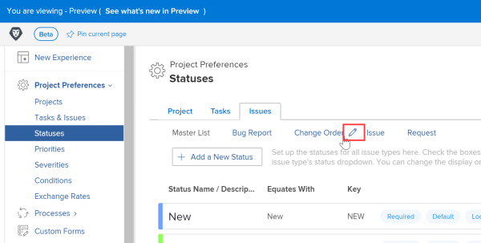
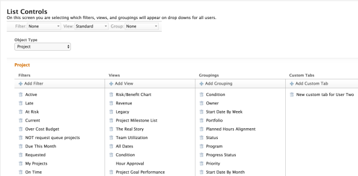

# Edit list controls {#edit-list-controls}

Any list of items in `Workfront` is displayed using a combination of three reporting elements:

* Views
* Filters
* Groupings

These reporting elements are visible at the top of every list in `Workfront`, including in reports. For more information about reporting elements, see [Reporting elements: Filters, Views, and Groupings](reporting-elements-filters-views-groupings.md).

By using list controls, you can create a uniform look of your lists in your `Workfront` web application&nbsp;by determining which filters, views, and groupings display in the corresponding drop-down menus&nbsp;at the top of each list.

As the `Workfront administrator`, list controls allow you to do the following:

* Share&nbsp;filters, views, and groupings that other users in the system have created with everyone in the system.
* Remove default filters, views, and groupings that are not pertinent to your organization, to avoid confusion.
*  Share custom tabs with everyone in the organization that they can then add to their own interface. For more information about custom tabs, see [Create custom tabs or sections](create-custom-tabs.md).&nbsp;

>[!IMPORTANT] {type="important"}
>
>Only custom tabs built before 2012 (prior to the Anaconda release) can be shared with all the users in the system using list controls. Any custom tabs built after that release need to be shared with users using the layout template functionality. For more information about layout templates, see [Create and manage Layout Templates](create-and-manage-layout-templates.md).  

>
>
>Only the following object types allow for custom tabs to be added to list controls:
>
>
>
>* Project
>* Task
>* Issue  
>
>

## Add filters, views, and groupings to list controls {#add-filters-views-and-groupings-to-list-controls}

When you add filters, views, and groupings, you are making them available system-wide, to all users. The users can now see them as options in their drop-down menus, for their lists of objects and they are not able to remove them.&nbsp;

To add filters, views, and groupings to list controls:

1. Click the **Main Menu** icon  in the upper-right corner of `Workfront`, then click **Setup** .

1. In the left panel, click **Interface** > **List Controls**.  

1. Click **Edit List Controls**.
1.  In the **Object Type** drop-down menu, click your object type.

   Four columns display, containing the following:

<table style="width: 100%;margin-left: 0;margin-right: auto;mc-table-style: url('../../Resources/TableStyles/TableStyle-List-options-in-steps.css');" class="TableStyle-TableStyleSheet-List-options-in-procedures TableStyle-TableStyle-List-options-in-steps" cellspacing="0"> 
 <col class="TableStyle-TableStyle-List-options-in-steps-Column-Column1"> 
 <col class="TableStyle-TableStyle-List-options-in-steps-Column-Column2"> 
 <tbody> 
  <tr class="TableStyle-TableStyle-List-options-in-steps-Body-LightGray"> 
   <td class="TableStyle-TableStyle-List-options-in-steps-BodyE-Column1-LightGray">Filters</td> 
   <td class="TableStyle-TableStyle-List-options-in-steps-BodyD-Column2-LightGray">A list of filters associated with the object type you selected. If the filter is displayed in the list, it shows for every user in the system, when they are viewing a list of objects of the type you selected.</td> 
  </tr> 
  <tr class="TableStyle-TableStyle-List-options-in-steps-Body-MediumGray"> 
   <td class="TableStyle-TableStyle-List-options-in-steps-BodyE-Column1-MediumGray">Views</td> 
   <td class="TableStyle-TableStyle-List-options-in-steps-BodyD-Column2-MediumGray">A list of views&nbsp;associated with the object type you selected. If the view&nbsp;is displayed in the list, it shows for every user in the system, when they are viewing a list of objects of the type you selected.</td> 
  </tr> 
  <tr class="TableStyle-TableStyle-List-options-in-steps-Body-LightGray"> 
   <td class="TableStyle-TableStyle-List-options-in-steps-BodyE-Column1-LightGray">Groupings</td> 
   <td class="TableStyle-TableStyle-List-options-in-steps-BodyD-Column2-LightGray">list of groupings&nbsp;associated with the object type you selected. If the grouping&nbsp;is displayed in the list, it shows for every user in the system, when they are viewing a list of objects of the type you selected.</td> 
  </tr> 
  <tr class="TableStyle-TableStyle-List-options-in-steps-Body-MediumGray"> 
   <td class="TableStyle-TableStyle-List-options-in-steps-BodyB-Column1-MediumGray">Custom Tabs</td> 
   <td class="TableStyle-TableStyle-List-options-in-steps-BodyA-Column2-MediumGray"> 
The tabs you see listed in this column can be found by&nbsp;all users in the system&nbsp;and they can add them to their own interface.&nbsp;
 
Important:  
Only custom tabs built before 2012 (prior to the Anaconda release) can be shared with all the users in the system using list controls. Any custom tabs built after that release need to be shared with users using the layout template functionality. For more information about layout templates, see <a href="create-and-manage-layout-templates.md" class="MCXref xref">Create and manage Layout Templates</a>. 
 
Only the following object types allow for custom tabs to be added to list controls:
 
     <ul> 
      <li value="1">Project</li> 
      <li value="2">Task</li> 
      <li value="3">Issue</li> 
     </ul> 
 </td> 
  </tr> 
 </tbody> 
</table>

1.  Click **Add Filter**,** Add View**, or** Grouping**.

   If you have custom tabs built before 2012 and the object is a project, a task or an issue, you can also click **Add Custom Tab** to add custom tabs to the list controls.&nbsp;

1.  In the box that displays, start typing the name of a filter, view, grouping, or custom tab, then&nbsp;click **Search**.

   You can also leave the **Name** box blank and simply click **Search**, to find a filter, view, grouping, or custom tab.&nbsp;

   You must have at least one custom tab built before 2012 in the system before you can see any results when searching for custom tabs.  

   

1. Click the plus sign to the left of the name of a filter, view, grouping, or custom tab that you would like to add in your list controls.
1.  Click **Save**.  

   All the users in the system can find the filters, views, and groupings in their drop-down menus at the top of lists that display the selected object. In the case of custom tabs, they can now add the custom tabs in their interface, for the object specified.&nbsp;

## Remove filters, views, and groupings from list controls {#remove-filters-views-and-groupings-from-list-controls}

Using list controls, you can remove filters, views, and groupings, including default ones from the list of options available to users in those respective drop-down menus, at the top of their lists of objects. You can also remove custom tabs from being available to everyone in the system.&nbsp;

To remove filters, views, groupings, and custom tabs from list controls:

1. Click the **Main Menu** icon  in the upper-right corner of `Workfront`, then click **Setup** .

1. In the left panel, click **Interface** > **List Controls**.  

1. Click **Edit List Controls**.
1.  In the **Object Type** drop-down menu, click your object type.

   Four columns display, containing the following:

<table style="width: 100%;margin-left: 0;margin-right: auto;mc-table-style: url('../../Resources/TableStyles/TableStyle-List-options-in-steps.css');" class="TableStyle-TableStyleSheet-List-options-in-procedures TableStyle-TableStyle-List-options-in-steps" cellspacing="0"> 
 <col class="TableStyle-TableStyle-List-options-in-steps-Column-Column1"> 
 <col class="TableStyle-TableStyle-List-options-in-steps-Column-Column2"> 
 <tbody> 
  <tr class="TableStyle-TableStyle-List-options-in-steps-Body-LightGray"> 
   <td class="TableStyle-TableStyle-List-options-in-steps-BodyE-Column1-LightGray">Filters</td> 
   <td class="TableStyle-TableStyle-List-options-in-steps-BodyD-Column2-LightGray">A list of filters associated with the object type you selected. If the filter is displayed in the list, it shows for every user in the system, when they are viewing a list of objects of the type you selected.</td> 
  </tr> 
  <tr class="TableStyle-TableStyle-List-options-in-steps-Body-MediumGray"> 
   <td class="TableStyle-TableStyle-List-options-in-steps-BodyE-Column1-MediumGray">Views</td> 
   <td class="TableStyle-TableStyle-List-options-in-steps-BodyD-Column2-MediumGray">A list of views&nbsp;associated with the object type you selected. If the view&nbsp;is displayed in the list, it shows for every user in the system, when they are viewing a list of objects of the type you selected.</td> 
  </tr> 
  <tr class="TableStyle-TableStyle-List-options-in-steps-Body-LightGray"> 
   <td class="TableStyle-TableStyle-List-options-in-steps-BodyE-Column1-LightGray">Groupings</td> 
   <td class="TableStyle-TableStyle-List-options-in-steps-BodyD-Column2-LightGray">list of groupings&nbsp;associated with the object type you selected. If the grouping&nbsp;is displayed in the list, it shows for every user in the system, when they are viewing a list of objects of the type you selected.</td> 
  </tr> 
  <tr class="TableStyle-TableStyle-List-options-in-steps-Body-MediumGray"> 
   <td class="TableStyle-TableStyle-List-options-in-steps-BodyB-Column1-MediumGray">Custom Tabs</td> 
   <td class="TableStyle-TableStyle-List-options-in-steps-BodyA-Column2-MediumGray"> 
The tabs you see listed in this column can be found by&nbsp;all users in the system&nbsp;and they can add them to their own interface.&nbsp;
 
Important:  
Only custom tabs built before 2012 (prior to the Anaconda release) can be shared with all the users in the system using list controls. Any custom tabs built after that release need to be shared with users using the layout template functionality. For more information about layout templates, see <a href="create-and-manage-layout-templates.md" class="MCXref xref">Create and manage Layout Templates</a>. 
 
Only the following object types allow for custom tabs to be added to list controls:
 
     <ul> 
      <li value="1">Project</li> 
      <li value="2">Task</li> 
      <li value="3">Issue</li> 
     </ul> 
 </td> 
  </tr> 
 </tbody> 
</table>

1.  Click the trash can button to the left of a the name of a filter, view, grouping, or custom tab.

   

1.  Click **Save** to remove&nbsp;the filter, view, grouping, or custom tab from&nbsp;the list controls for the selected object.

