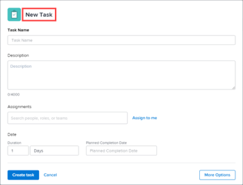
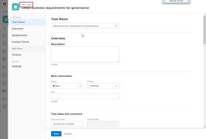
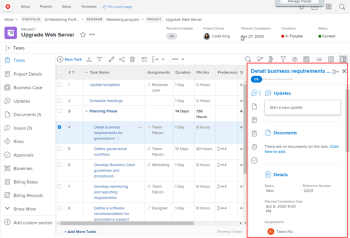

# Customize the Details view using a layout template

The highlighted information on this page refers to functionality not yet generally available. It is available only in the Preview Sandbox environment.

As an Adobe Workfront administrator, you can use a layout template to determine what information appears when a user clicks the Details icon  in the left panel while viewing a task, issue, document, program, or portfolio

<!--
, or billing record
-->

.

You can also change the order of the information in which this information appears. For example, for all tasks that your users see, you can move Custom Forms information to the top of the Details view for all tasks that your users see.

The changes you make to the Details view for an object also determine the availability and order of fields that users see in the following areas:

<ul> 
 <li> 
New <object> boxes, such as New Task and New Issue
 
  
 </li> 
 <li> 
Edit <object> screens, such as Edit Task and Edit Issue
 
  
 </li> 
 <li> 
Summary  panel for lists of tasks and issues
 
  
 <note type="note">
   Changes to the layout templates affect the order and availability of fields in the Summary panel only for the tasks and issues that are assigned to the logged-in user. 
  </note> </li> 
</ul>

For information about layout templates for groups, see [Create and modify a group’s layout templates](../../../administration-and-setup/manage-groups/work-with-group-objects/create-and-modify-a-groups-layout-templates.md).

## Access requirements

You must have the following to perform the steps in this article:

<table cellspacing="0"> 
 <col> 
 <col> 
 <tbody> 
  <tr> 
   <td role="rowheader">Adobe Workfront plan</td> 
   <td> 
Any
 </td> 
  </tr> 
  <tr> 
   <td role="rowheader">Adobe Workfront license</td> 
   <td> 
Plan 
 </td> 
  </tr> 
  <tr> 
   <td role="rowheader">Access level configurations</td> 
   <td> 
You must be a Workfront administrator. For more information, see <a href="../../../administration-and-setup/add-users/configure-and-grant-access/grant-a-user-full-administrative-access.md" class="MCXref xref">Grant a user full administrative access</a>.
 
Note: If you still don't have access, ask your Workfront administrator if they set additional restrictions in your access level. For information on how a Workfront administrator can modify your access level, see <a href="../../../administration-and-setup/add-users/configure-and-grant-access/create-modify-access-levels.md" class="MCXref xref">Create or modify custom access levels</a>.
 </td> 
  </tr> 
 </tbody> 
</table>

## Customize what users see in the Details view

<ol> 
 <li value="1">Begin working on a layout template, as described in <a href="../../../administration-and-setup/customize-workfront/use-layout-templates/create-and-manage-layout-templates.md" class="MCXref xref">Create and manage layout templates</a>.</li> 
 <li value="2">Click the down arrow  under Customize what users see, then click Project, Task, Issue, <!--
   Document,
  -->Program, or Portfolio<!--
   , or Billing Record
  -->.</li> 
 <li value="3">In the Details section, do any of the following to customize what users see in the Details view:
  <ul>
   <li>Drag any section headers  to change their order.</li>
   <li>
Enable or disable options under Overview and Custom Forms to show or hide them. 

If you hide all fields in one of these sections, the entire section is hidden.

All of the fields are enabled by default.
</li>
  </ul></li> 
 <li value="4"> 
Continue customizing the layout template.
 
Or
 
If you are finished customizing, click Save.
 <note type="tip">
   You can 
   Save your progress at any time, then continue to modify the template later.
  </note> </li> 
</ol>

