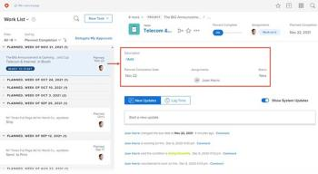
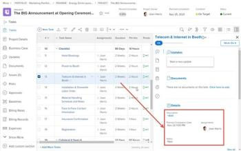
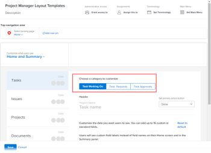
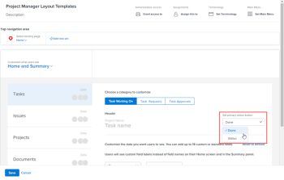
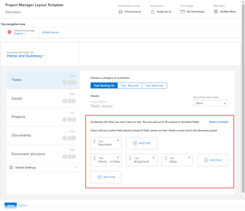

# Customize Home and Summary using a layout template

You can use a Layout Template to configure what users see when they click a task or issue in Home and in the Summary. Each configuration you make using the steps below affects the Home area and the Summary panel in the same way. These customizations don't apply to the Document Summary panel.

You can configure:

* What fields display for a task or issue in the Details area, and in what order
* Whether updates, logged time, attached documents, and timestamps display for a selected task or issue

You can also customize the fields that users see in the Home area when users click a project approval, document approval, or document version approval that is assigned to them.

For information about the Home area, see [Use the Home area](../../../workfront-basics/using-home/using-the-home-area/use-the-home-area.md).For information about the Summary panel, see Summary overview in the new Adobe Workfront experience.

For information about layout templates for groups, see [Create and modify a group’s layout templates](../../../administration-and-setup/manage-groups/work-with-group-objects/create-and-modify-a-groups-layout-templates.md).

## Access requirements

You must have the following to perform the steps in this article:

<table cellspacing="0"> 
 <col> 
 <col> 
 <tbody> 
  <tr> 
   <td role="rowheader">Adobe Workfront plan</td> 
   <td> 
Any
 </td> 
  </tr> 
  <tr> 
   <td role="rowheader">Adobe Workfront license</td> 
   <td> 
Plan 
 </td> 
  </tr> 
  <tr> 
   <td role="rowheader">Access level configurations</td> 
   <td> 
You must be a Workfront administrator. For more information, see <a href="../../../administration-and-setup/add-users/configure-and-grant-access/grant-a-user-full-administrative-access.md" class="MCXref xref">Grant a user full administrative access</a>.
 
Note: If you still don't have access, ask your Workfront administrator if they set additional restrictions in your access level. For information on how a Workfront administrator can modify your access level, see <a href="../../../administration-and-setup/add-users/configure-and-grant-access/create-modify-access-levels.md" class="MCXref xref">Create or modify custom access levels</a>.
 </td> 
  </tr> 
 </tbody> 
</table>

## Customize Home and Summary using a layout template

<ol> 
 <li value="1">Begin working on a layout template, as described in <a href="../../../administration-and-setup/customize-workfront/use-layout-templates/create-and-manage-layout-templates.md" class="MCXref xref">Create and manage layout templates</a>.</li> 
 <li value="2">Click the down arrow  under Customize what users see, then click Home and Summary.</li> 
 <li value="3"> 
In the list that appears on the left, click the object type (Tasks, Issues,Projects, Documents, or Document Versions) that you want to customize in Home and Summary.
 
  <table cellspacing="0"> 
   <col> 
   <col> 
   <tbody> 
    <tr> 
     <td role="rowheader">Tasks</td> 
     <td> 
In Home, your configuration for this setting affects the area to the right of a task when a user clicks the task. And, in a list of tasks, it affects the Summary panel that displays on the right side of the page when a user selects a task, then clicks the Open Summary icon .
 
For example, you can determine which fields users see in the Details area when users select tasks in Home:
 
  
 
And when they select tasks in the Summary:
 
  
 </td> 
    </tr> 
    <tr> 
     <td role="rowheader">Issues</td> 
     <td> 
In Home, your configuration for this setting affects the area to the right of an issue when a user clicks the issue.
 
In a list of issues, this setting affects the Summary panel that displays on the right side of the page when a user selects an issue, then clicks the Open Summary icon .
 </td> 
    </tr> 
    <tr> 
     <td role="rowheader">Projects</td> 
     <td>In Home, when a user clicks a project approval assigned to them, your configuration for this setting affects the area to the right of the approval.</td> 
    </tr> 
    <tr> 
     <td role="rowheader">Documents</td> 
     <td>In Home, when a user clicks a document approval assigned to them, your configuration for this setting affects the area to the right of the approval.</td> 
    </tr> 
    <tr> 
     <td role="rowheader">Document Versions</td> 
     <td>In Home, when a user clicks an approval assigned to them for a particular version of a document, your configuration for this setting affects the area to the right of the approval.</td> 
    </tr> 
   </tbody> 
  </table> <note type="important">
   If a task is unassigned, the user assigned to the layout template will not see the field customizations in the Summary.
  </note> </li> 
 <li value="4"> 
(Conditional) If you clicked Tasks or Issues in the previous step, click the category of task or issue that you want to customize.
 
  
 </li> 
 <li value="5"> 
(Conditional) If the Set primary action button drop-down menu appears (if you select Tasks or Issues in the list on the left), click the primary action (Done or Status) that you want available for users in the Home area and in the Summary panel when they view a task or an issue.
 
  
 </li> 
 <li value="6"> 
Add  or hide  fields for the selected object type.
 
  
 </li> 
 <li value="7">Repeat steps 3-6 to customize Home area and the Summary panel for any other object types.</li> 
 <li value="8"> 
Click Global settings, near the lower left corner, then enable or disable any of the following options related to Adobe Workfront objects in Home and Summary:
 
  <table cellspacing="0"> 
   <col> 
   <col> 
   <tbody> 
    <tr> 
     <td role="rowheader">Show updates for work</td> 
     <td>Displays any updates made on a selected task or issue in Home or Summary. This includes both system updates and updates made by a user. Users can still filter out system updates, as described in <a href="../../../workfront-basics/updating-work-items-and-viewing-updates/update-work.md#enable" class="MCXref xref">Enable or disable system updates</a> in <a href="../../../workfront-basics/updating-work-items-and-viewing-updates/update-work.md" class="MCXref xref">Update work</a>.</td> 
    </tr> 
    <tr> 
     <td role="rowheader">Log time against work</td> 
     <td>Displays the Log time against work option when a task or issue is selected, allowing users to log time on work items directly from the Home and Summary areas.</td> 
    </tr> 
    <tr> 
     <td role="rowheader">View documents associated with work</td> 
     <td>Displays a Documents area in Home and Summary when a task or issue is selected, listing any documents attached to the task or issue. Users can click documents to view them in a preview window.</td> 
    </tr> 
    <tr> 
     <td role="rowheader">Hide timestamp</td> 
     <td>Hides timestamps for the following date fields in Home and Summary:
      <ul>
       <li>Planned Completion Date</li>
       <li>Commit Date</li>
       <li>
Submitted Date
</li>
      </ul><note type="note">
        When this option is enabled, work items that become past due are moved to the Late grouping in the Home Work List based on date only, not time.
      </note></td> 
    </tr> 
   </tbody> 
  </table> </li> 
 <li value="9"> 
Continue customizing the layout template.
 
Or
 
If you are finished customizing, click Save.
 </li> 
</ol>

For more information about layout templates, see [Create and manage layout templates](../../../administration-and-setup/customize-workfront/use-layout-templates/create-and-manage-layout-templates.md).
