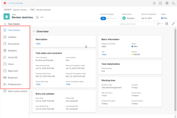

# Customize the left panel using a layout template {#customize-the-left-panel-using-a-layout-template}

In a layout template, you can customize what users see in the left panel area throughout *`Adobe Workfront`*. 

For example, you can determine which of the following items users see in the left panel when viewing a task:

>[!IMPORTANT] {type="important"}
>
>Changes made to order and visibility are reflected in the mobile app.

For information about layout templates for groups, see [Create and modify a group’s layout templates](create-and-modify-a-groups-layout-templates.md).

## Access requirements {#access-requirements}

You must have the following to perform the steps in this article:

<table style="width: 100%;margin-left: 0;margin-right: auto;mc-table-style: url('../../../Resources/TableStyles/TableStyle-List-options-in-steps.css');" class="TableStyle-TableStyle-List-options-in-steps" cellspacing="0"> 
 <col class="TableStyle-TableStyle-List-options-in-steps-Column-Column1"> 
 <col class="TableStyle-TableStyle-List-options-in-steps-Column-Column2"> 
 <tbody> 
  <tr class="TableStyle-TableStyle-List-options-in-steps-Body-LightGray"> 
   <td class="TableStyle-TableStyle-List-options-in-steps-BodyE-Column1-LightGray" role="rowheader">Adobe Workfront plan</td> 
   <td class="TableStyle-TableStyle-List-options-in-steps-BodyD-Column2-LightGray"> 
Any
 </td> 
  </tr> 
  <tr class="TableStyle-TableStyle-List-options-in-steps-Body-MediumGray"> 
   <td class="TableStyle-TableStyle-List-options-in-steps-BodyE-Column1-MediumGray" role="rowheader">Adobe Workfront license</td> 
   <td class="TableStyle-TableStyle-List-options-in-steps-BodyD-Column2-MediumGray"> 
Plan 
 </td> 
  </tr> 
  <tr class="TableStyle-TableStyle-List-options-in-steps-Body-LightGray"> 
   <td class="TableStyle-TableStyle-List-options-in-steps-BodyB-Column1-LightGray" role="rowheader">Access level configurations</td> 
   <td class="TableStyle-TableStyle-List-options-in-steps-BodyA-Column2-LightGray"> 
You must be a Workfront administrator. For more information, see <a href="grant-a-user-full-administrative-access.md" class="MCXref xref">Grant a user full administrative access</a>.
 
Note: If you still don't have access, ask your Workfront administrator if they set additional restrictions in your access level. For information on how a Workfront administrator can modify your access level, see <a href="create-modify-access-levels.md" class="MCXref xref">Create or modify custom access levels</a>.
 </td> 
  </tr> 
 </tbody> 
</table>

## Customize the left panel for an area in *`Workfront`*: {#customize-the-left-panel-for-an-area-in-workfront}

1. Begin working on a layout template, as described in [Create and manage layout templates](create-and-manage-layout-templates.md).
1.  Click the down arrow  under `Customize what users see`, then click the left panel you want to customize.

   >[!NOTE]
   >
   >For information about the Home option in this drop-down list, see [Customize Home and Summary using a layout template](customize-home-summary-layout-template.md). For information about the Lists option, see [Customize Filters, Views, and Groupings using a layout template](customize-fvg-list-controls-layout-template.md).

1.  In the `Left panel` list, do any of the following to determine what will users see in the left panel for the option ( *`Workfront`* area or object type) you have selected:

    
    
    * Show  or hide  items. Any item without  or  cannot be hidden.
    
    * Drag items  to change their order on the left panel.
    
    

<table style="width: 100%;margin-left: 0;margin-right: auto;mc-table-style: url('../../../Resources/TableStyles/TableStyle-HeaderRow.css');" class="TableStyle-TableStyle-HeaderRow" cellspacing="15"> 
 <col class="TableStyle-TableStyle-HeaderRow-Column-Column1"> 
 <col style="width: 251px;" class="TableStyle-TableStyle-HeaderRow-Column-Column1" data-mc-conditions=""> 
 <col class="TableStyle-TableStyle-HeaderRow-Column-Column1"> 
 <thead> 
  <tr class="TableStyle-TableStyle-HeaderRow-Head-Header1"> 
   <th class="TableStyle-TableStyle-HeaderRow-HeadE-Column1-Header1">Option</th> 
   <th class="TableStyle-TableStyle-HeaderRow-HeadE-Column1-Header1">When users click the following...</th> 
   <th class="TableStyle-TableStyle-HeaderRow-HeadD-Column1-Header1">They see the left panel items you choose from the following:</th> 
  </tr> 
 </thead> 
 <tbody> 
  <tr class="TableStyle-TableStyle-HeaderRow-Body-LightGray"> 
   <td class="TableStyle-TableStyle-HeaderRow-BodyE-Column1-LightGray">Project</td> 
   <td class="TableStyle-TableStyle-HeaderRow-BodyE-Column1-LightGray">The name of a project</td> 
   <td class="TableStyle-TableStyle-HeaderRow-BodyD-Column1-LightGray">Tasks, Project Details, Business Case, Updates, Documents, Issues, Risks, Approvals, Baselines, Billing Rates, Billing Records, Expenses, Hours, Scheduling, People, Utilization, Queue Details, Routing Rules, Queue Topic, Topic Group, Metrics</td> 
  </tr> 
  <tr class="TableStyle-TableStyle-HeaderRow-Body-MediumGray"> 
   <td class="TableStyle-TableStyle-HeaderRow-BodyE-Column1-MediumGray">Task</td> 
   <td class="TableStyle-TableStyle-HeaderRow-BodyE-Column1-MediumGray">The name of a task</td> 
   <td class="TableStyle-TableStyle-HeaderRow-BodyD-Column1-MediumGray"> Updates, Documents, Task Details, Subtask, Issues, Hours, Approvals, Expenses, Predecessors</td> 
  </tr> 
  <tr class="TableStyle-TableStyle-HeaderRow-Body-LightGray"> 
   <td class="TableStyle-TableStyle-HeaderRow-BodyE-Column1-LightGray">Issue</td> 
   <td class="TableStyle-TableStyle-HeaderRow-BodyE-Column1-LightGray">The name of an issue</td> 
   <td class="TableStyle-TableStyle-HeaderRow-BodyD-Column1-LightGray"> Updates, Documents, Issue Details, Hours, Approvals</td> 
  </tr> 
  <tr class="TableStyle-TableStyle-HeaderRow-Body-MediumGray"> 
   <td class="TableStyle-TableStyle-HeaderRow-BodyE-Column1-MediumGray">Portfolio</td> 
   <td class="TableStyle-TableStyle-HeaderRow-BodyE-Column1-MediumGray">The name of a portfolio</td> 
   <td class="TableStyle-TableStyle-HeaderRow-BodyD-Column1-MediumGray">Projects, Programs, Portfolio Details, Portfolio Optimization, Documents, Updates</td> 
  </tr> 
  <tr class="TableStyle-TableStyle-HeaderRow-Body-LightGray"> 
   <td class="TableStyle-TableStyle-HeaderRow-BodyE-Column1-LightGray">Program</td> 
   <td class="TableStyle-TableStyle-HeaderRow-BodyE-Column1-LightGray">The name of a program</td> 
   <td class="TableStyle-TableStyle-HeaderRow-BodyD-Column1-LightGray">Projects, Program Details, Updates, Documents</td> 
  </tr> 
  <tr class="TableStyle-TableStyle-HeaderRow-Body-MediumGray" data-mc-conditions=""> 
   <td class="TableStyle-TableStyle-HeaderRow-BodyE-Column1-MediumGray">Template</td> 
   <td class="TableStyle-TableStyle-HeaderRow-BodyE-Column1-MediumGray">The name of a project template</td> 
   <td class="TableStyle-TableStyle-HeaderRow-BodyD-Column1-MediumGray">Template Tasks, Template Details, Updates, Documents, Risks, Expenses, People, Approvals, Billing Rates, Queue Details, Routing Rules, Queue Topic, Topic Group</td> 
  </tr> 
  <tr class="TableStyle-TableStyle-HeaderRow-Body-LightGray" data-mc-conditions=""> 
   <td class="TableStyle-TableStyle-HeaderRow-BodyE-Column1-LightGray">Template Task</td> 
   <td class="TableStyle-TableStyle-HeaderRow-BodyE-Column1-LightGray">The name of a template task</td> 
   <td class="TableStyle-TableStyle-HeaderRow-BodyD-Column1-LightGray">Updates, Documents, Template Task Details, Subtasks, Expenses, Approvals, Predecessors</td> 
  </tr> 
  <tr class="TableStyle-TableStyle-HeaderRow-Body-MediumGray" data-mc-conditions=""> 
   <td class="TableStyle-TableStyle-HeaderRow-BodyE-Column1-MediumGray"> Billing Record</td> 
   <td class="TableStyle-TableStyle-HeaderRow-BodyE-Column1-MediumGray">The name of a billing record for a project</td> 
   <td class="TableStyle-TableStyle-HeaderRow-BodyD-Column1-MediumGray">Billing Record Details, Billable Hours, Billable Expenses, Fixed Revenues</td> 
  </tr> 
  <tr class="TableStyle-TableStyle-HeaderRow-Body-LightGray" data-mc-conditions=""> 
   <td class="TableStyle-TableStyle-HeaderRow-BodyE-Column1-LightGray">Projects</td> 
   <td class="TableStyle-TableStyle-HeaderRow-BodyE-Column1-LightGray">Projects  in the Main menu </td> 
   <td class="TableStyle-TableStyle-HeaderRow-BodyD-Column1-LightGray"> 
Projects
 </td> 
  </tr> 
  <tr class="TableStyle-TableStyle-HeaderRow-Body-MediumGray" data-mc-conditions=""> 
   <td class="TableStyle-TableStyle-HeaderRow-BodyE-Column1-MediumGray">Requests</td> 
   <td class="TableStyle-TableStyle-HeaderRow-BodyE-Column1-MediumGray">The name of a request</td> 
   <td class="TableStyle-TableStyle-HeaderRow-BodyD-Column1-MediumGray">New Request, Submitted requests, All Requests, Drafts</td> 
  </tr> 
  <tr class="TableStyle-TableStyle-HeaderRow-Body-LightGray" data-mc-conditions=""> 
   <td class="TableStyle-TableStyle-HeaderRow-BodyE-Column1-LightGray">Dashboards</td> 
   <td class="TableStyle-TableStyle-HeaderRow-BodyE-Column1-LightGray"> 
The name of a dashboard
 </td> 
   <td class="TableStyle-TableStyle-HeaderRow-BodyD-Column1-LightGray"> 
My Dashboards, Shared Dashboards, All Dashboards
 
Note: If you created custom tabs for the Reports area using a layout template in Adobe Workfront Classic, they display at the bottom of this list. For users, they display at the bottom of the left panel in the Dashboards area.
 </td> 
  </tr> 
  <tr class="TableStyle-TableStyle-HeaderRow-Body-MediumGray" data-mc-conditions=""> 
   <td class="TableStyle-TableStyle-HeaderRow-BodyE-Column1-MediumGray">Scrum Team</td> 
   <td class="TableStyle-TableStyle-HeaderRow-BodyE-Column1-MediumGray">The name of a Scrum team</td> 
   <td class="TableStyle-TableStyle-HeaderRow-BodyD-Column1-MediumGray">Iterations, Current iteration, Backlog, Schedule, Updates, Team Settings </td> 
  </tr> 
  <tr class="TableStyle-TableStyle-HeaderRow-Body-LightGray" data-mc-conditions=""> 
   <td class="TableStyle-TableStyle-HeaderRow-BodyE-Column1-LightGray">Kanban Team</td> 
   <td class="TableStyle-TableStyle-HeaderRow-BodyE-Column1-LightGray">The name of a Kanban team</td> 
   <td class="TableStyle-TableStyle-HeaderRow-BodyD-Column1-LightGray">Schedule, Kanban board, Backlog, Updates, Team Settings</td> 
  </tr> 
  <tr class="TableStyle-TableStyle-HeaderRow-Body-MediumGray" data-mc-conditions=""> 
   <td class="TableStyle-TableStyle-HeaderRow-BodyE-Column1-MediumGray">Waterfall Team</td> 
   <td class="TableStyle-TableStyle-HeaderRow-BodyE-Column1-MediumGray">The name of a Waterfall team</td> 
   <td class="TableStyle-TableStyle-HeaderRow-BodyD-Column1-MediumGray">Schedule, Updates, Team Requests, Team Settings</td> 
  </tr> 
  <tr class="TableStyle-TableStyle-HeaderRow-Body-LightGray" data-mc-conditions=""> 
   <td class="TableStyle-TableStyle-HeaderRow-BodyB-Column1-LightGray">Iteration</td> 
   <td class="TableStyle-TableStyle-HeaderRow-BodyB-Column1-LightGray">The name of an iteration</td> 
   <td class="TableStyle-TableStyle-HeaderRow-BodyA-Column1-LightGray">Stories, Issues, Story Board, Overview, Custom Forms, Updates </td> 
  </tr> 
 </tbody> 
</table>

   >[!NOTE]
   >
   >The last 3 items in the `Customize what users see` drop-down list (Lists, Home and Summary, and Branding) are for configuring areas other than the left panel. For information about them, see these articles:
   >
   >    
   >    
   >    * [Customize Filters, Views, and Groupings using a layout template](customize-fvg-list-controls-layout-template.md) 
   >    * [Customize Home and Summary using a layout template](customize-home-summary-layout-template.md) 
   >    * [Brand Adobe Workfront using a layout template](brand-wf-using-a-layout-template.md) 
   >    
   >    

1.  (Optional) If you want to add a left panel item that links to one of your organization's dashboards, click `Add custom section`, type a `Custom section title` for the item, then add the dashboard.

   Dashboard items appear at the bottom of the left panel. Users see the Custom section title you type next to the dashboard item when they hover over the left panel.

   >[!NOTE]
   >
   >Users can add custom dashboard items to their own left panel. When you add custom dashboard items in a layout template, your items merge with theirs, without overwriting or resetting them. This is also true if you assign users to a new layout template with custom dashboard items. For information about how users can customize the left panel, see [Create custom tabs or sections](create-custom-tabs.md).

   For information about dashboards, see [Dashboards](_dashboards-overview.md).

1.  Continue customizing the layout template.

   Or

   If you are finished customizing, click `Save`.

   >[!TIP] {type="tip"}
   >
   >You can `Save` your progress at any time, then continue to modify the template later.

