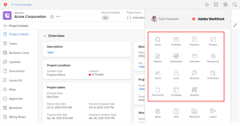

# Customize the Main Menu using a layout template

As an Adobe Workfront administrator or a group administrator, you can use a layout template to configure the options users see when they open the Main Menu in Workfront:

>[!NOTE]
>
>The Main Menu options that users see depend on their license type and what settings are configured in their access level. Some users who will use this layout template may not see all the options you choose here. For more information see [How access levels and permissions work together](../../../administration-and-setup/add-users/access-levels-and-object-permissions/how-access-levels-permissions-work-together.md) and [Configurable access to functionality for each object type](../../../administration-and-setup/add-users/access-levels-and-object-permissions/configurable-functionality-in-each-access-level-by-object-type.md).

For information about layout templates for groups, see [Create and modify a group’s layout templates](../../../administration-and-setup/manage-groups/work-with-group-objects/create-and-modify-a-groups-layout-templates.md).

## Access requirements

You must have the following to perform the steps in this article:

<table cellspacing="0"> 
 <col> 
 <col> 
 <tbody> 
  <tr> 
   <td role="rowheader">Adobe Workfront plan</td> 
   <td> 
Any
 </td> 
  </tr> 
  <tr> 
   <td role="rowheader">Adobe Workfront license</td> 
   <td> 
Plan 
 </td> 
  </tr> 
  <tr> 
   <td role="rowheader">Access level configurations</td> 
   <td> 
You must be a Workfront administrator. For more information, see <a href="../../../administration-and-setup/add-users/configure-and-grant-access/grant-a-user-full-administrative-access.md" class="MCXref xref">Grant a user full administrative access</a>.
 
Note: If you still don't have access, ask your Workfront administrator if they set additional restrictions in your access level. For information on how a Workfront administrator can modify your access level, see <a href="../../../administration-and-setup/add-users/configure-and-grant-access/create-modify-access-levels.md" class="MCXref xref">Create or modify custom access levels</a>.
 </td> 
  </tr> 
 </tbody> 
</table>

## Customize the Main Menu

<ol> 
 <li value="1">Begin working on a layout template, as described in <a href="../../../administration-and-setup/customize-workfront/use-layout-templates/create-and-manage-layout-templates.md" class="MCXref xref">Create and manage layout templates</a>.</li> 
 <li value="2"> 
Click Set Main Menu near the upper-right corner.
 
In the Main Menu box that appears, you can see the items that are currently active in the Main Menu for the template, as well as the items that are available to add. The following are all the possible items that can be added:
 
  <ul> 
   <li> 
Home
 <note type="tip">
     By default, Home displays as My Updates  for Review-license users unless they have a layout template associated with their profile that includes the My&nbsp;Updates area in the Main Menu. 
    </note> </li> 
   <li>Portfolios</li> 
   <li>Programs</li> 
   <li>Projects</li> 
   <li>Reports</li> 
   <li>Dashboards</li> 
   <li>Calendars</li> 
   <li>Resourcing</li> 
   <li> 
Scenarios
 <note type="note"> 
     
This is available only in the new Adobe Workfront experience and requires an additional license. For information about the Workfront Scenario Planner, see <a href="../../../scenario-planner/scenario-planner-overview.md" class="MCXref xref">The Adobe Workfront Scenario Planner overview</a>. 
 
    </note> </li> 
   <li>Teams</li> 
   <li> 
Users
 <note type="note">
     Only users with a Plan license can see Users 
      in the Main Menu. 
    </note> </li> 
   <li>Requests</li> 
   <li>Timesheets</li> 
   <li>Documents</li> 
   <li>Templates</li> 
   <li>Analytics</li> 
   <li>Proofing</li> 
   <li> 
Goals
 <note type="note"> 
     
This requires an additional license. For information about Workfront Goals, see <a href="../../../workfront-goals/goal-management/wf-goals-overview.md" class="MCXref xref">Adobe Workfront Goals overview</a>. 
 
    </note> </li> 
   <li> 
My&nbsp;Updates
 </li> 
  </ul> </li> 
 <li value="3">Do any of the following:
  <ul>
   <li>Hide  Active items that you don't want to display and show  Available items that you do want to display on the Main Menu.</li>
   <li>Drag  Active items to change their display order on the Main Menu.</li>
  </ul></li> 
 <li value="4"> 
Click Done.
 
You can also click Cancel at any time if you want to discard your changes.
 </li> 
 <li value="5"> 
Continue customizing the layout template.
 
Or
 
If you are finished customizing, click Save.
 <note type="tip">
   You can 
   Save your progress at any time, then continue to modify the template later.
  </note> </li> 
</ol>

For more information about layout templates, see [Create and manage layout templates](../../../administration-and-setup/customize-workfront/use-layout-templates/create-and-manage-layout-templates.md).
