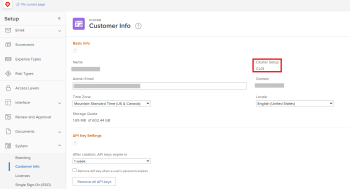
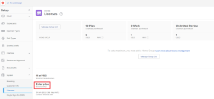

# Firewall overview {#firewall-overview}

Because *`Adobe Workfront`* communicates with your organization's network, your organization's firewall must be configured to allow that communication. Firewalls are highly effective security measures that function by separating an organization's network from the internet. They ensure that only selected data and network traffic can move into or out of the organization's network. The firewall allows or blocks data based on the site that is sending or receiving the data. As an *`Adobe Workfront administrator`*, you must ensure that data sent to or from *`Workfront`* can pass through your organization's firewall.

This is accomplished through an allowlist, which is essentially a "list" of sites that are "allowed" to send or receive data through the firewall. Sites can be identified in one of two ways:

*  **IP address**: a series of numbers such as 52.31.132.175
*  **Domain**: part of a URL, such as "thisdomain" in www.thisdomain.com

*`Workfront`* uses specific IP addresses and domains for web communication. These must be added to your organization's allowlist before you can use *`Workfront`* in your organization.

Generally, an allowlist is configured by a network administrator. Work with your organization's network administrator to ensure that your firewall allows these IP addresses. If you do not know who your network administrator is, your organization's IT department can point you in the right direction.

>[!IMPORTANT] {type="important"}
>
>As a *`Workfront administrator`*, you must ensure that these IP addresses and domains are added to your organization's allowlist. This is true even if you do not add them yourself. *`Workfront`* cannot configure your organization's allowlist.

## Collect information for configuring your firewall {#collect-information-for-configuring-your-firewall}

To configure your firewall for *`Workfront`*, your network administrator needs to know which IP addresses and domains to add. Some of this information is available only to a *`Workfront`* administrator. As the Workfront administrator, you must locate this information and provide it to your network administrator.

>[!NOTE]
>
>The best practice for security is to add only the IP addresses and domains that connect to functionality your organization is actively using. By providing this information, you can ensure that this best practice is followed.

Provide your network administrator with the following information:

<table style="width: 100%;mc-table-style: url('../../Resources/TableStyles/TableStyle-List-options-in-steps.css');" class="TableStyle-TableStyle-List-options-in-steps" cellspacing="0"> 
 <col class="TableStyle-TableStyle-List-options-in-steps-Column-Column1"> 
 <col class="TableStyle-TableStyle-List-options-in-steps-Column-Column2"> 
 <tbody> 
  <tr class="TableStyle-TableStyle-List-options-in-steps-Body-LightGray"> 
   <td class="TableStyle-TableStyle-List-options-in-steps-BodyE-Column1-LightGray" role="rowheader">Specific IP addresses and domains to allow</td> 
   <td class="TableStyle-TableStyle-List-options-in-steps-BodyD-Column2-LightGray"> 
The article <a href="configure-your-firewall.md" class="MCXref xref">Configure your firewall</a> contains the list of IP addresses and domains that your organization must add to its allowlist. 
 
Your network administrator might not have access to the "Configure your firewall" article. In that case, you must provide it to them. We do not recommend printing a hard (paper) copy. A digital copy allows your network administrator to copy and paste the addresses, which is quicker and more accurate than typing from a hard copy.
 </td> 
  </tr> 
  <tr class="TableStyle-TableStyle-List-options-in-steps-Body-MediumGray"> 
   <td class="TableStyle-TableStyle-List-options-in-steps-BodyE-Column1-MediumGray" role="rowheader">Your cluster</td> 
   <td class="TableStyle-TableStyle-List-options-in-steps-BodyD-Column2-MediumGray">To locate your organization's cluster, see <a href="#locate" class="MCXref xref">View your organization's cluster and Workfront plan</a></td> 
  </tr> 
  <tr class="TableStyle-TableStyle-List-options-in-steps-Body-LightGray"> 
   <td class="TableStyle-TableStyle-List-options-in-steps-BodyE-Column1-LightGray" role="rowheader">Your Workfront Plan</td> 
   <td class="TableStyle-TableStyle-List-options-in-steps-BodyD-Column2-LightGray"> 
Your organization's plan is one of the following:
 
    <ul> 
     <li> 
Enterprise 
 </li> 
     <li> 
Business 
 </li> 
     <li> 
Pro 
 </li> 
     <li> 
Team 
 </li> 
    </ul> 
To locate your plan, see <a href="#locate" class="MCXref xref">View your organization's cluster and Workfront plan</a>
 </td> 
  </tr> 
  <tr class="TableStyle-TableStyle-List-options-in-steps-Body-MediumGray"> 
   <td class="TableStyle-TableStyle-List-options-in-steps-BodyE-Column1-MediumGray" role="rowheader">Your domain</td> 
   <td class="TableStyle-TableStyle-List-options-in-steps-BodyD-Column2-MediumGray"> 
To locate your domain, look at the web address that you use to connect to Workfront.
 
Example: in the web address <code>greatcompany.my.workfront.com</code>, the domain is "greatcompany"
 </td> 
  </tr> 
  <tr class="TableStyle-TableStyle-List-options-in-steps-Body-LightGray"> 
   <td class="TableStyle-TableStyle-List-options-in-steps-BodyE-Column1-LightGray" role="rowheader">Other Adobe Workfront products</td> 
   <td class="TableStyle-TableStyle-List-options-in-steps-BodyD-Column2-LightGray"> 
Inform your network administrator if you have licenses for either of the following:
 
    <ul> 
     <li> 
Adobe Workfront Proof
 </li> 
     <li> 
Adobe Workfront Fusion 
 </li> 
    </ul> </td> 
  </tr> 
  <tr class="TableStyle-TableStyle-List-options-in-steps-Body-MediumGray"> 
   <td class="TableStyle-TableStyle-List-options-in-steps-BodyE-Column1-MediumGray" role="rowheader">Adobe Workfront integrations</td> 
   <td class="TableStyle-TableStyle-List-options-in-steps-BodyD-Column2-MediumGray">Inform your network administrator if you use any of the following:
    <ul>
     <li>

Workfront for Jira

</li>
     <li>
Workfront for G Suite
</li>
     <li>
Workfront for Microsoft Teams
</li>
     <li>
Workfront for Outlook
</li>
     <li>
Workfront for Salesforce
</li>
    </ul></td> 
  </tr> 
  <tr class="TableStyle-TableStyle-List-options-in-steps-Body-LightGray"> 
   <td class="TableStyle-TableStyle-List-options-in-steps-BodyB-Column1-LightGray" role="rowheader">Additional Functionality</td> 
   <td class="TableStyle-TableStyle-List-options-in-steps-BodyA-Column2-LightGray"> 
Inform your network administrator if you use either of the following:
 
    <ul> 
     <li> 
A Workfront test drive
 </li> 
     <li> 
Workfront Ascent
 </li> 
    </ul> </td> 
  </tr> 
 </tbody> 
</table>

>[!IMPORTANT] {type="important"}
>
>If you add any of these products, integrations, or functionalities at a later date, you must contact your network administrator so they can adjust the allowlist.

### View your organization's cluster and *`Workfront`* plan {#view-your-organizations-cluster-and-workfront-plan}

1. Click the `Main Menu` icon  in the upper-right corner of *`Adobe Workfront`*, then click `Setup` .

1. Click **System** in the left panel
1.  To view your cluster, Select **Customer Info**. 

   Your cluster displays near the upper-right of the **Basic Info** section.

   

1.  To view your *`Workfront`* plan, select **Licenses**.

   Your plan displays near the bottom of the page.

   

