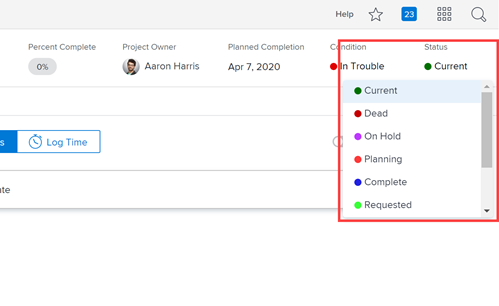

# Configure project preferences for your group {#configure-project-preferences-for-your-group}

The information on this page refers to functionality not yet generally available. It is available only in the Preview Sandbox environment.

As a `Group Administrator`, you can configure the default preferences for your group's projects. These preferences impact project, task, and issue behavior.

For more information about the `Group Administrator` role, see [Group Administrators](group-administrators.md).

## About project preferences for groups {#about-project-preferences-for-groups}

If groups in your organization need to configure a project preference differently from the way it is configured at the system level, the `Workfront administrator` can unlock the preference. After this occurs, you can configure the preference for your group and it will affect all projects associated with the group.

>[!NOTE]
>
>
>
>
>* Typically, an unlocked preference remains unlocked indefinitely. If the `Workfront administrator` relocks it, the system setting takes affect again and settings for the preference made by the `Group Administrators` are lost.
>
>* Two of the project preferences, Timeline Calculations and Custom Quarters, cannot be unlocked.
>
>

## Configure an unlocked project preference for your group {#configure-an-unlocked-project-preference-for-your-group}

1. Click the **Main Menu** icon  in the upper-right corner of `Workfront`, then click **Setup** .

1. Click **Groups** .

1.  `<MadCap:conditionalText data-mc-conditions="QuicksilverOrClassic.Quicksilver"> Click the name of</MadCap:conditionalText>` the group for which you want to manage the project preferences.
1. In the left panel, click **Project Preferences**.
1.  On the page that appears, continue with one of the 4 sections listed below to configure preferences for Project Status, Timelines, Business Cases, and Life after Death.

   If you hover over a preference and a tooltip displays to tell you that it is locked, you can ask your `Workfront administrator` to unlock it for all groups in the organization.

1. Click **Save** when you are finished configuring project preferences.

*  `<li value="1"><a href="#project" class="MCXref xref" data-mc-variable-override="">Project Status</a> </li>` `<li value="2"><a href="#timelines" class="MCXref xref" data-mc-variable-override="">Timelines</a> </li>` `<li value="3"><a href="#business-cases" class="MCXref xref" data-mc-variable-override="">Business Cases</a> </li>` `<li value="4"><a href="#life-after-death" class="MCXref xref" data-mc-variable-override="">Life After Death </a> </li>` 

### Project Status {#project-status}

Configure any of the following preferences for projects that are `associated with the group`:

<table style="width: 100%;mc-table-style: url('../../Resources/TableStyles/TableStyle-List-options-in-steps.css');" class="TableStyle-TableStyle-List-options-in-steps" cellspacing="0"> 
 <col class="TableStyle-TableStyle-List-options-in-steps-Column-Column1" style="width: 247px;"> 
 <col class="TableStyle-TableStyle-List-options-in-steps-Column-Column2"> 
 <tbody> 
  <tr class="TableStyle-TableStyle-List-options-in-steps-Body-LightGray"> 
   <td class="TableStyle-TableStyle-List-options-in-steps-BodyE-Column1-LightGray">Set new project's status to</td> 
   <td class="TableStyle-TableStyle-List-options-in-steps-BodyD-Column2-LightGray"> 
Determine the status of new projects.
 
Note:  
If you or another Workfront administrator hides or unlocks the status selected here, the default status for all new projects changes to the one at the top of the Status drop-down list until you configure this preference once again.
 
  
 
 </td> 
  </tr> 
  <tr class="TableStyle-TableStyle-List-options-in-steps-Body-MediumGray"> 
   <td class="TableStyle-TableStyle-List-options-in-steps-BodyE-Column1-MediumGray">Calculate Percent Complete based on</td> 
   <td class="TableStyle-TableStyle-List-options-in-steps-BodyD-Column2-MediumGray"> 
The percent complete of a project or parent task is based on the overall progress of the tasks. This information can be calculated based on either the Duration or the Planned Hours of the tasks on a project.
 
If you select Duration, the Duration of each task in a determines the overall percent complete for the project, and the Duration of each subtask determines the overall percent complete for its parent task.
 
If you select Duration, make sure you have specified the<b> Typical hours per work day</b> and <b>Typical work days per week</b> in the <b>Timelines</b> section. Workfront uses this information when calculating a task's percent complete based on Duration. 
 
If you select Planned Hours, ensure that all tasks on each project have the amount of Planned Hours defined, and that the amount is not zero.
 </td> 
  </tr> 
  <tr class="TableStyle-TableStyle-List-options-in-steps-Body-LightGray"> 
   <td class="TableStyle-TableStyle-List-options-in-steps-BodyE-Column1-LightGray">Automatically set the project's Condition based on the Progress Status</td> 
   <td class="TableStyle-TableStyle-List-options-in-steps-BodyD-Column2-LightGray"> 
Allows users to set the Condition of a project manually (On Target, At Risk, In Trouble) or have Workfront set the Condition (Progress Status) automatically based on the project's progression on the timeline. For more information about the Condition of projects, see&nbsp;<a href="project-condition-and-condition-type.md" class="MCXref xref" data-mc-variable-override="">Overview of Project Condition and Condition Type</a>.
 </td> 
  </tr> 
  <tr class="TableStyle-TableStyle-List-options-in-steps-Body-MediumGray"> 
   <td class="TableStyle-TableStyle-List-options-in-steps-BodyE-Column1-MediumGray" style="font-weight: normal;"> 
<b>Create baselines automatically</b> 
 </td> 
   <td class="TableStyle-TableStyle-List-options-in-steps-BodyD-Column2-MediumGray"> 
Automatically creates a baseline (snapshot) of task and project details when the status of the project changes to Current. For information about creating baselines, see <a href="create-baselines.md" class="MCXref xref" data-mc-variable-override="">Create project baselines </a>.
 </td> 
  </tr> 
  <tr class="TableStyle-TableStyle-List-options-in-steps-Body-LightGray"> 
   <td class="TableStyle-TableStyle-List-options-in-steps-BodyE-Column1-LightGray"> 
Performance Index Method 
 </td> 
   <td class="TableStyle-TableStyle-List-options-in-steps-BodyD-Column2-LightGray"> 
The Performance Index Method (PIM) for the project controls the method Workfront uses to calculate Earned Value metrics such as Cost Performance Index and Estimate At Completion. For more information, see <a href="calculate-cpi.md" class="MCXref xref" data-mc-variable-override="">Calculate Cost Performance Index (CPI) </a> and&nbsp;<a href="calculate-eac.md" class="MCXref xref" data-mc-variable-override="">Calculate Estimate At Completion (EAC)</a>
 
    <ul> 
     <li value="1"><b>Hour-based</b>: Workfront uses Planned Hours to calculate performance metrics like EAC and CPI. When the PIM is calculated based on hours, the EAC is displayed as a number of hours. Ensure that you have a value for Planned Hours, other than zero.&nbsp;</li> 
     <li value="2"> 
<b>Cost-based</b>: Workfront uses Planned Labor Cost to calculate performance metrics like EAC and CPI. Ensure that your job roles or users are associated with Cost per Hour rates. When the PIM is calculated based on Costs, the EAC is displayed as a currency value.
 
This setting can be modified at the project level, by the project manager, using the Finance sub-tab of the Project Details tab.
 </li> 
    </ul> </td> 
  </tr> 
  <tr class="TableStyle-TableStyle-List-options-in-steps-Body-MediumGray"> 
   <td class="TableStyle-TableStyle-List-options-in-steps-BodyB-Column1-MediumGray"> 
Estimate at Completion 
 </td> 
   <td class="TableStyle-TableStyle-List-options-in-steps-BodyA-Column2-MediumGray"> 
Determine which data Workfront uses to calculate the Estimate at Completion (EAC) which represents the projected total cost of a project.
 
    <ul> 
     <li value="1"><b>Calculate at project level: </b>EAC for the parent task and project are determined by entering using Actual hours or Actual Labor Cost in the EAC Formulas. This calculation includes Actual Hours or Costs and Expenses added directly to the parent task or project.</li> 
     <li value="2"> 
<b>Roll up from tasks/subtasks: </b>EAC for the parent task and project are determined by summing up the EAC for each child task. This calculation excludes Actual Hours or Actual Costs and Expenses added directly to the parent task or project.
 
This setting can be modified at the project level, by the project manager, using the Finance sub-tab of the Project Details tab.
 
For more information about editing the Finance sub-tab of a project, see <a href="manage-project-finance-area.md" class="MCXref xref" data-mc-variable-override="">Manage the project Finance area</a>.
 </li> 
    </ul> 
For more information on how the Estimate at Completion calculates, see <a href="calculate-eac.md" class="MCXref xref" data-mc-variable-override="">Calculate Estimate At Completion (EAC)</a>.
 </td> 
  </tr> 
 </tbody> 
</table>

### Timelines {#timelines}

Configure any of the following preferences:

<table style="width: 100%;mc-table-style: url('../../Resources/TableStyles/TableStyle-List-options-in-steps.css');" class="TableStyle-TableStyle-List-options-in-steps" cellspacing="0"> 
 <col class="TableStyle-TableStyle-List-options-in-steps-Column-Column1"> 
 <col class="TableStyle-TableStyle-List-options-in-steps-Column-Column2"> 
 <tbody> 
  <tr class="TableStyle-TableStyle-List-options-in-steps-Body-LightGray"> 
   <td class="TableStyle-TableStyle-List-options-in-steps-BodyE-Column1-LightGray">Schedule From</td> 
   <td class="TableStyle-TableStyle-List-options-in-steps-BodyD-Column2-LightGray"> 
Determine whether new projects are scheduled from Start Date or from Completion Date when they are created.
 
    <ul> 
     <li value="1"><b>Start Date</b>: New tasks default to the As Soon As Possible Task Constraint and project managers are prompted to provide a Planned Start Date for the project.</li> 
     <li value="2"><b>Completion Date</b>: New tasks default to the As Late As Possible Task Constraint and project managers are prompted to provide a Planned Completion Date for the project.</li> 
    </ul> </td> 
  </tr> 
  <tr class="TableStyle-TableStyle-List-options-in-steps-Body-MediumGray"> 
   <td class="TableStyle-TableStyle-List-options-in-steps-BodyE-Column1-MediumGray">User Time Off</td> 
   <td class="TableStyle-TableStyle-List-options-in-steps-BodyD-Column2-MediumGray"> 
Determine whether the time off of the Primary Assignee of a task adjusts the planned dates for that task on a project.
 
    <ul> 
     <li value="1"> 
<b>Consider user time off in task durations</b>: Any time off scheduled for a task's Primary Assignee adjusts the task's planned dates if the time off occurs during the task's duration. This is the default setting. 
 
For example, if a task with a Constraint of As Soon As Possible is scheduled to start on June 1 and complete on June 3, and the Primary Assignee has June 2 marked for Time-off, the task's planned dates adjust to June 1 through June 4.
 
Important: The Duration of the task does not change when you select this setting. Only the planned dates change, depending on the Task Constraint.
 </li> 
     <li value="2"><b>Ignore user time off in task durations</b>: The planned dates of each task on a project remain as originally planned, even if the Primary Assignee of a task has time off during its duration.</li> 
    </ul> 
Consider the following when selecting options for this setting:
 
    <ul> 
     <li value="1">When you change this setting, only the projects and templates created after the change inherit the updated setting. </li> 
     <li value="2"> 
The Task Constraint value of the task determines which planned task dates to adjust: the Planned Start Date, the Planned Completion Date, both dates, or neither date. 
 
For example, if a task has a Constraint of Fixed Dates, the dates do not adjust when the Primary Assignee has time off, even if the option Consider user time off in task duration is selected. For information about task constraints, see <a href="task-constraint-overview.md" class="MCXref xref" data-mc-variable-override="">Task Constraint overview</a>.
 </li> 
    </ul> </td> 
  </tr> 
  <tr class="TableStyle-TableStyle-List-options-in-steps-Body-LightGray"> 
   <td class="TableStyle-TableStyle-List-options-in-steps-BodyE-Column1-LightGray"> 
<b>Project timelines will be automatically re-calculated</b> 
 </td> 
   <td class="TableStyle-TableStyle-List-options-in-steps-BodyD-Column2-LightGray"> 
Determine when the timeline of a project is recalculated. For information about recalculating the project timeline, see <a href="recalculate-project-timeline.md" class="MCXref xref" data-mc-variable-override="">Recalculate project timelines </a>.
 
The following options are enabled by default. You can select one or more of the following settings:
 
    <ul> 
     <li value="1"> 
<b>Every night</b>: Select this to recalculate project timelines every night. Any changes you make to the project that might affect the timeline are not immediately visible. Workfront​​​ recalculates timelines at night only for projects where both of the following conditions are met:
 
 
       <ul> 
        <li value="1">Have a status of Current</li> 
        <li value="2">Have had an update in the past three months</li> 
       </ul> 
 </li> 
     <li value="2"> 
<b>When a project's scope changes</b>: Select this to recalculate project timelines immediately as a project scope change occurs. For information about what constitutes a project scope change, see <a href="recalculate-project-timeline.md" class="MCXref xref" data-mc-variable-override="">Recalculate project timelines </a>.
 </li> 
    </ul> </td> 
  </tr> 
  <tr class="TableStyle-TableStyle-List-options-in-steps-Body-MediumGray"> 
   <td class="TableStyle-TableStyle-List-options-in-steps-BodyE-Column1-MediumGray"> 
<b>When multiple users are assigned to a task use the schedule of the</b> 
 </td> 
   <td class="TableStyle-TableStyle-List-options-in-steps-BodyD-Column2-MediumGray"> 
If a project does not have a schedule assigned or if the users assigned to its tasks do not have a Schedule assigned to them, Workfront uses the system default schedule to calculate the timeline of the tasks.
 
If a project has a schedule assigned and the users assigned to the tasks also have a schedule assigned to them, in the case when you assign multiple users to the same task, Workfront uses the following schedules, based on this setting:
 
    <ul> 
     <li value="1"><b>Primary Assignment</b>: Workfront uses the schedule of the Primary Assignment on the task to calculate timelines.</li> 
     <li value="2"><b>Project</b>: Workfront uses the schedule of the project to calculate the timeline of each task.</li> 
    </ul> 
For more information about schedules, see <a href="create-schedules.md" class="MCXref xref" data-mc-variable-override="">Create schedules</a>.
 </td> 
  </tr> 
  <tr class="TableStyle-TableStyle-List-options-in-steps-Body-LightGray" data-mc-conditions=""> 
   <td class="TableStyle-TableStyle-List-options-in-steps-BodyE-Column1-LightGray"> 
Timeline Calculations 
 </td> 
   <td class="TableStyle-TableStyle-List-options-in-steps-BodyD-Column2-LightGray"> 
    <ul> 
     <li value="1"><b>Typical hours per work day</b>: Set the number of hours in a typical workday for the users who will be working on projects. The default is 8 hours.</li> 
    </ul> 
    <ul> 
     <li value="1"><b>Typical work days per week</b>: Set the standard work week for the users who will be working on projects. The default is 5 days.</li> 
    </ul> 
These two options convert days to hours, or weeks to days. For example, if you have a task with 8 Planned Hours and according to the Duration Type of the task, the Duration is calculated based on Planned Hours, Workfront converts those hours into days in order to show the Duration as days.
 
From the <b>Typical work days per week</b> field, Workfront calculates the Full Time Equivalent (FTE) value for your system. This is what Workfront uses when calculating allocations for users.
 
These values are used when you are planning projects timelines, budgeting for resources, or logging time against projects. 
 
They are not used when you are establishing timesheets for users in the system, as described in <a href="timesheet-and-hour-preferences.md" class="MCXref xref" data-mc-variable-override="">Timesheet and hour preferences</a>.
 
Note: Timeline Calculations preferences cannot be unlocked.
 </td> 
  </tr> 
  <tr class="TableStyle-TableStyle-List-options-in-steps-Body-MediumGray" data-mc-conditions=""> 
   <td class="TableStyle-TableStyle-List-options-in-steps-BodyB-Column1-MediumGray"> 
<b>Custom Quarters</b> 
 </td> 
   <td class="TableStyle-TableStyle-List-options-in-steps-BodyA-Column2-MediumGray"> 
Configure custom yearly quarters for the users who will be working on projects. Custom quarters are usually quarters that do not match the traditional breakdown of quarters during a calendar year. You can add multiple custom quarters. For more information, see <a href="enable-custom-quarters-projects.md" class="MCXref xref" data-mc-variable-override="">Enable custom quarters for projects</a>.
 
Note: Custom Quarters preferences cannot be unlocked.
 </td> 
  </tr> 
 </tbody> 
</table>

### Business Cases {#business-cases}

You can create a Business Case for a project to submit project requests. You can define preferences to determine which tabs are visible on the **Business Case** form. We recommend that you enable these options so that other tools, such as the Portfolio Optimizer, update properly. For more information about what each field displays, see [Define a Business Case](_define-business-case.md).

After the `Workfront administrator` enables the sections on the Business Case, a Project Owner can then create a Business Case at the project level. For information about creating a Business Case, see [Create a Business Case](create-business-case.md).

### Life After Death  {#life-after-death}

Configure any of the following preferences:

<table style="width: 100%;mc-table-style: url('../../Resources/TableStyles/TableStyle-List-options-in-steps.css');" class="TableStyle-TableStyle-List-options-in-steps" cellspacing="0"> 
 <col class="TableStyle-TableStyle-List-options-in-steps-Column-Column1"> 
 <col class="TableStyle-TableStyle-List-options-in-steps-Column-Column2"> 
 <tbody> 
  <tr class="TableStyle-TableStyle-List-options-in-steps-Body-LightGray"> 
   <td class="TableStyle-TableStyle-List-options-in-steps-BodyE-Column1-LightGray"> 
<b>After a project has been marked as Complete, people can still</b> 
 </td> 
   <td class="TableStyle-TableStyle-List-options-in-steps-BodyD-Column2-LightGray"> 
Determine the rules for your organization (or group, if you are configuring project preferences for a group) regarding whether a task or an issue can be deleted after the project status has been marked Complete.
 
    <ul> 
     <li value="1"><b>Delete Tasks</b>: Allows users to delete tasks from a&nbsp;project after the project has been marked Complete. </li> 
     <li value="2"><b>Delete Issues</b>: Allows users to delete issues from a project after the project has been marked Complete.</li> 
    </ul> </td> 
  </tr> 
  <tr class="TableStyle-TableStyle-List-options-in-steps-Body-MediumGray"> 
   <td class="TableStyle-TableStyle-List-options-in-steps-BodyB-Column1-MediumGray"> 
<b>After a Project is marked Complete, Dead, or it is Pending Approval, people can still</b> 
 </td> 
   <td class="TableStyle-TableStyle-List-options-in-steps-BodyA-Column2-MediumGray"> 
Determine the rules for your organization (or group, if you are configuring project preferences for a group) regarding what happens to tasks, issues, documents, and other objects in a project after the project status has been marked <b>Complete</b>, <b>Dead</b>, or is <b>Pending Approval</b>.
 
    <ul> 
     <li value="1"><b>Add and edit tasks:</b> Allows users to:
      <ul>
       <li value="1">Edit tasks within a project after the project has been marked Complete, Dead, or is Pending Approval. This includes adding hours and changing expense entries on a task.</li>
       <li value="2">Add tasks to a project.</li>
      </ul></li> 
     <li value="2"><b>Add and edit issues:</b> Allows users to:
      <ul>
       <li value="1">Edit issues within a project after the project has been marked Complete, Dead, or Pending Approval.</li>
       <li value="2">Add issues to a project after the project has been marked Complete or Dead. (You cannot add issues to a project that is Pending Approval.)</li>
      </ul></li> 
     <li value="3"> 
<b>Add documents to the project and to its tasks and issues:</b> Allows users to add documents to a project (or to add documents to tasks and issues within the project) after the project has been marked Complete or Dead. 
 
This option does not apply to projects that are pending approval.
 </li> 
     <li value="4"> 
<b>Attach templates:</b> Allows users to attach templates to a project after the project has been marked Complete or Dead. 
 
This option does not apply to projects that are pending approval.
 </li> 
    </ul> </td> 
  </tr> 
 </tbody> 
</table>

