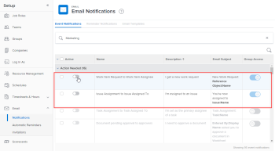

# View and configure event notifications for a group

As an *group administrator*, you can view the event notifications that are activated for a group you manage.

Also, if a *Adobe Workfront administrator* unlocks an event notification, you can configure it for a top-level group that you manage. Configuration of an event notification consists of activating or deactivating it.

<!--

A <em>Workfront administrator</em> can also do this for any group.

-->

A *Workfront administrator* can also do this for any group.

Configuring an event notification for a group affects users for whom that group, or one of its subgroups, is their Home Group. In their user profiles, these users see the event notifications that are activated for their Home Group instead of the event notifications that are activated system-wide.

For information on how a *Workfront administrator* unlocks an event notification, see [Unlock or lock configuration of event notifications for all groups](../../../administration-and-setup/manage-workfront/emails/unlock-configuration-of-event-notifications-for-groups.md).

For information about the default notification setting for an event, see [Event notifications available in Adobe Workfront](../../../administration-and-setup/manage-workfront/emails/event-notifications-available-in-wf.md).

## Access requirements

You must have the following to perform the steps in this article:

<table cellspacing="0"> 
 <col> 
 <col> 
 <tbody> 
  <tr> 
   <td role="rowheader"><a href="https://www.workfront.com/plans" target="_blank"><em>Workfront</em> plan</a>*</td> 
   <td> 
<em>Pro</em> or higher
 </td> 
  </tr> 
  <tr> 
   <td role="rowheader"><a href="https://one.workfront.com/s/document-item?bundleId=the-new-workfront-experience&amp;topicId=Content%2FAdministration_and_Setup%2FAdd_users%2FAccess_levels_and_object_permissions%2Fwf-licenses.html&amp;_LANG=en" target="_blank"><em>Adobe Workfront</em> license</a>*</td> 
   <td> 
<em>Plan</em> 
 
You must be a <em>group administrator</em> of the group or a <em>Workfront administrator</em>. For more information, see <a href="../../../administration-and-setup/manage-groups/group-roles/group-administrators.md" class="MCXref xref">Group administrators</a> and <a href="../../../administration-and-setup/add-users/configure-and-grant-access/grant-a-user-full-administrative-access.md" class="MCXref xref">Grant a user full administrative access</a>.
 </td> 
  </tr> 
 </tbody> 
</table>

&#42;If you need to find out what plan or license type you have, contact your *Workfront administrator*.

## View

<!--
<MadCap:conditionalText data-mc-conditions="QuicksilverOrClassic.Quicksilver">
and configure
</MadCap:conditionalText>
-->

`<MadCap:conditionalText data-mc-conditions="QuicksilverOrClassic.Quicksilver">  and configure</MadCap:conditionalText>` a group’s event notifications

<ol> <draft-comment>
  <li value="1" data-mc-conditions="QuicksilverOrClassic.Quicksilver">(Conditional and optional) If you are a <em>Workfront administrator</em> and you are already on the Email Notifications page (Setup > Email > Notifications), you can do the following and then skip to step 6: Delete System Event Notifications in the box above the list , start typing the group’s name in the box, then click it when it appears.</li>
 </draft-comment>
 <li value="1" data-mc-conditions="QuicksilverOrClassic.Quicksilver">(Conditional and optional) If you are a <em>Workfront administrator</em> and you are already on the Email Notifications page (Setup > Email > Notifications), you can do the following and then skip to step 6: Delete System Event Notifications in the box above the list , start typing the group’s name in the box, then click it when it appears.</li> <draft-comment>
  <li value="2" data-mc-conditions="QuicksilverOrClassic.Quicksilver">Click the Main Menu icon  in the upper-right corner of <em>Adobe Workfront</em>, then click Setup .</li>
 </draft-comment>
 <li value="2" data-mc-conditions="QuicksilverOrClassic.Quicksilver">Click the Main Menu icon  in the upper-right corner of <em>Adobe Workfront</em>, then click Setup .</li> <draft-comment>
  <li value="3" data-mc-conditions="QuicksilverOrClassic.Quicksilver">In the left panel, click Groups .</li>
 </draft-comment>
 <li value="3" data-mc-conditions="QuicksilverOrClassic.Quicksilver">In the left panel, click Groups .</li> <draft-comment>
  <li value="4" data-mc-conditions="QuicksilverOrClassic.Quicksilver">Click the name of the top-level group.</li>
 </draft-comment>
 <li value="4" data-mc-conditions="QuicksilverOrClassic.Quicksilver">Click the name of the top-level group.</li> <draft-comment>
  <li value="5" data-mc-conditions="QuicksilverOrClassic.Quicksilver"> 
In the left menu, click Event notifications.
 
In the list that displays, the Active column on the left shows which notifications are active (blue) and inactive (grey) for the group.
 </li>
 </draft-comment>
 <li value="5" data-mc-conditions="QuicksilverOrClassic.Quicksilver"> 
In the left menu, click Event notifications.
 
In the list that displays, the Active column on the left shows which notifications are active (blue) and inactive (grey) for the group.
 </li> 
 <li value="6"> 
Do any of the following:
 
  <table cellspacing="0"> 
   <col> 
   <col> 
   <tbody> 
    <tr> 
     <td role="rowheader">Activate or deactivate an unlocked event notification</td> 
     <td> 
Click the button in the Active column to activate  or deactivate  it.
 
For example, you could configure the top two Marketing group event notifications shown below that have been unlocked for groups.
 <draft-comment>
       
  

      </draft-comment>
  
 
      <ul> 
       <li>If a button in the Active column is grey and dimmed , the event notification is deactivated for all users and <em>group administrators</em> can’t activate it<draft-comment>
         <MadCap:conditionalText data-mc-conditions="QuicksilverOrClassic.Draft mode">
           or edit its email subject line
         </MadCap:conditionalText>
        </draft-comment><MadCap:conditionalText data-mc-conditions="QuicksilverOrClassic.Draft mode">
          or edit its email subject line
        </MadCap:conditionalText> for their groups.</li> 
       <li>If a button in the Active column is grey and not dimmed , the event notification is deactivated for all users and <em>group administrators</em> can activate it<draft-comment>
         <MadCap:conditionalText data-mc-conditions="QuicksilverOrClassic.Draft mode">
           or edit its email subject line
         </MadCap:conditionalText>
        </draft-comment><MadCap:conditionalText data-mc-conditions="QuicksilverOrClassic.Draft mode">
          or edit its email subject line
        </MadCap:conditionalText> for their groups.</li> 
      </ul> 
      <ul> 
       <li>If a button in the Active column is blue and dimmed , the event notification is activated for all users and <em>group administrators</em> can’t deactivate it<draft-comment>
         <MadCap:conditionalText data-mc-conditions="QuicksilverOrClassic.Draft mode">
           or edit its email subject line
         </MadCap:conditionalText>
        </draft-comment><MadCap:conditionalText data-mc-conditions="QuicksilverOrClassic.Draft mode">
          or edit its email subject line
        </MadCap:conditionalText> for their groups.</li> 
       <li>If a button in the Active column is blue and not dimmed , the event notification is activated for all users and <em>group administrators</em> can deactivate it<draft-comment>
         <MadCap:conditionalText data-mc-conditions="QuicksilverOrClassic.Draft mode">
           or edit its email subject line
         </MadCap:conditionalText>
        </draft-comment><MadCap:conditionalText data-mc-conditions="QuicksilverOrClassic.Draft mode">
          or edit its email subject line
        </MadCap:conditionalText> for their groups.</li> 
      </ul> </td> 
    </tr> <draft-comment>
     <tr data-mc-conditions="QuicksilverOrClassic.Draft mode"> 
      <td role="rowheader">Customize the email subject line of an event notification </td> 
      <td> 
       <ol class="preview"> 
        <li value="1">Click the name of the event notification.</li> 
        <li value="2"> 
In the Event Notification box that displays, in the Email Subject Line box, change the text and fields, including custom fields, then click Update to save the new subject lines for your emails.
 <note type="important">
          The names of the fields added must match the camel case syntax of our database structure. For more information about how our objects and their fields are named in the 
          <em>Workfront</em> database, see the 
          <a href="../../../wf-api/workfront-api.md" class="MCXref xref">Adobe Workfront API</a>.
         </note> 
For more information about customizing the email subject line of an event notification, see <a href="../../../administration-and-setup/manage-workfront/emails/custom-email-subjects-event-notification.md" class="MCXref xref">Customize email subjects for event notifications</a>. 
 </li> 
       </ol> </td> 
     </tr>
    </draft-comment>
    <tr data-mc-conditions="QuicksilverOrClassic.Draft mode"> 
     <td role="rowheader">Customize the email subject line of an event notification </td> 
     <td> 
      <ol class="preview"> 
       <li value="1">Click the name of the event notification.</li> 
       <li value="2"> 
In the Event Notification box that displays, in the Email Subject Line box, change the text and fields, including custom fields, then click Update to save the new subject lines for your emails.
 <note type="important">
         The names of the fields added must match the camel case syntax of our database structure. For more information about how our objects and their fields are named in the 
         <em>Workfront</em> database, see the 
         <a href="../../../wf-api/workfront-api.md" class="MCXref xref">Adobe Workfront API</a>.
        </note> 
For more information about customizing the email subject line of an event notification, see <a href="../../../administration-and-setup/manage-workfront/emails/custom-email-subjects-event-notification.md" class="MCXref xref">Customize email subjects for event notifications</a>. 
 </li> 
      </ol> </td> 
    </tr> 
   </tbody> 
  </table> </li> 
</ol>

