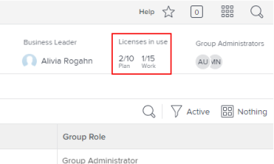
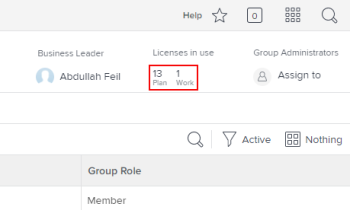
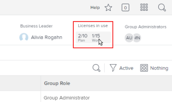
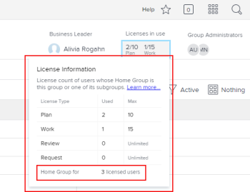

# View the number of licenses allocated and used in a group in `the new Adobe Workfront experience`

As an `Adobe Workfront administrator`, you can view counts of the individual types of licenses currently used in your group and its subgroups. This is useful when you need to assess whether to redistribute licenses.

If there are any groups above the group you manage, their administrators can also do this for your group. The same is true for `Workfront administrators` (for any group).

>[!IMPORTANT]
>
>A user’s license is counted in a particular group only if the group is the user’s Home Group.

## Access requirements

You must have the following to perform the steps in this article:

<table cellspacing="0"> 
 <col> 
 <col> 
 <tbody> 
  <tr> 
   <td role="rowheader"><a href="https://www.workfront.com/plans" target="_blank">Workfront plan</a>*</td> 
   <td> 
Team or higher
 </td> 
  </tr> 
  <tr> 
   <td role="rowheader"><a href="https://one.workfront.com/s/document-item?bundleId=the-new-workfront-experience&amp;topicId=Content%2FAdministration_and_Setup%2FAdd_users%2FAccess_levels_and_object_permissions%2Fwf-licenses.html&amp;_LANG=en" target="_blank">Adobe Workfront license</a>*</td> 
   <td> 
Plan 
 
You must be a group administrator of the group or a Workfront administrator. For more information, see <a href="../../../administration-and-setup/manage-groups/group-roles/group-administrators.md" class="MCXref xref">Group administrators</a> and <a href="../../../administration-and-setup/add-users/configure-and-grant-access/grant-a-user-full-administrative-access.md" class="MCXref xref">Grant a user full administrative access</a>.
 </td> 
  </tr> 
 </tbody> 
</table>

&#42;If you need to find out what plan or license type you have, contact your `Workfront administrator`.

## View the number of licenses used in a group

<ol data-mc-continue="false"> 
 <li value="1">Click the Main Menu icon  in the upper-right corner of Adobe Workfront, then click Setup .</li> 
 <li value="2">In the left panel, click Groups .</li> 
 <li value="3">Click the name of the group.</li> 
 <li value="4"> 
On the page that displays, in the header area near the upper-right corner, view the Licenses in use area to see the number of Plan and Work licenses currently being used.
 
If you are viewing a top-level group and the Workfront administrator defined a maximum number of each license type for the group, these numbers are also displayed. For example, in the group below, a maximum of 10 users can have a Plan license and a 15 can have a Work license:
 
  
 
For information about how a Workfront administrator defines a maximum number of allocated licenses for a group, see the section <a href="../../../administration-and-setup/get-started-wf-administration/manage-available-licenses-in-your-system.md#set" class="MCXref xref">Set the maximum license count for a Home Group</a> in the article <a href="../../../administration-and-setup/get-started-wf-administration/manage-available-licenses-in-your-system.md" class="MCXref xref">Manage available licenses in your system</a>.
 <note type="note"> 
   
If the group you are looking at is a subgroup, you can view only the numbers of licenses being used, not the maximum number of licenses allocated for the group. This is because Workfront administrators do not define a maximum license count for a subgroup.
 
   
  
 
  </note> </li> 
 <li value="5"> 
For separate counts of each type of license currently used in the group (including Review and Request), click the text area directly below Licenses in use:
 
  
 
The box that displays provides the same information for all 4 Workfront license types: Plan, Work, Review, and Request. At the bottom of the box, you can see the total number of licenses being used by members of this group or one of its subgroups:
 
  
 
For Review and Request licenses, the Max column always displays Unlimited.
 </li> 
</ol>

